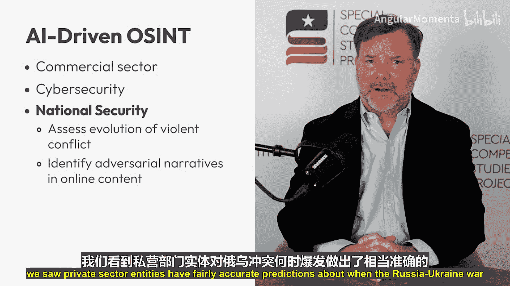

# 004：人工智能在开源情报行动中的应用

在本节课中，我们将探讨人工智能如何革新情报工作，特别是它如何改变情报机构收集和分析公开及商业可用信息的方式。这种信息在情报界被称为开源情报。

## 什么是开源情报及其重要性

上一节我们介绍了课程主题，本节中我们来看看开源情报的基础概念。当我们想到情报工作时，通常只想到秘密收集。这些数据被用于制作高度机密的书面产品，例如总统每日简报或闭门风险简报。

虽然这绝对是情报界工作的重要组成部分，但现实是，威胁环境在不断变化，这要求我们的方法和来源也必须适应。

试想一下，社交媒体如何成为获取地缘政治事件实时更新的重要来源。这就是开源情报。开源情报是收集和分析公开及商业可用数据，以支持战略决策。这可能包括来自社交媒体平台、新闻媒体、公共和商业数据库、卫星图像甚至在线论坛的数据。

尽管美国情报界拥有许多开源情报单位，但主要工作由中央情报局的开源企业和国防情报局的开源整合中心完成。开源情报在商业领域也是一个不断增长的行业。

事实上，在从中国国内微芯片生产、俄罗斯规避金融制裁的努力到恐怖分子使用加密货币等一系列日益广泛的问题上，私营部门分析师、独立的在线调查员和学术研究人员正在从事一些最前沿的工作。

## 人工智能如何革新开源情报

上一节我们了解了开源情报的定义，本节中我们来看看推动其前沿工作的关键力量：人工智能。人工智能，特别是其机器学习和自然语言处理等形式，正在显著提高曾经劳动密集型流程的效率、准确性和范围。这些流程用于识别来源、数据收集和清洗，甚至分析和报告。

人工智能还可以实时翻译和分析外语报告、社交媒体帖子以及其他文本和音频数据，打破语言障碍，加快收集可操作情报的过程。

以下是人工智能在开源情报中的几个关键应用领域：

*   **监控地缘政治事件**：国家安全机构使用人工智能驱动的开源情报平台来监控地缘政治事件、追踪极端主义活动并识别新兴威胁。
*   **分析社交媒体**：人工智能算法扫描社交媒体，寻找动荡或协调行动的迹象。
*   **检测虚假信息**：快速筛选数千份新闻报道以检测虚假信息。
*   **分析卫星图像**：快速分析大量卫星图像，以探测部队和军事装备的移动。

例如，中央情报局目前使用一个名为Osiris的平台，该平台利用大型语言模型来整理和处理大量公开可用信息。该平台还可以生成摘要，并允许分析师使用聊天机器人直接查询或探索场景。这些摘要可以比手动编写过程快得多地准备好供决策者使用。

## 人工智能驱动开源情报的广泛应用

上一节我们介绍了情报机构的应用，本节中我们来看看更广泛的影响。这仅仅是西方情报机构如何使用人工智能的起点。这一切都很重要，因为我们知道像中国这样的对手正在利用人工智能和开源情报的结合来增强其自身的军事决策和能力，特别是在了解外国军事能力和技术发展方面。

但受益于人工智能驱动开源情报的不仅仅是情报机构。在商业领域，公司正在利用人工智能收集和分析开源数据，用于各种应用，从市场研究和竞争情报到网络安全和风险管理。

对于情报界而言，紧跟商业发展至关重要，因为这提供了利用现有信息的机会，而无需重复造轮子。

以下是人工智能驱动开源情报在其他领域的具体应用：

*   **网络安全**：人工智能驱动的开源情报平台扫描漏洞，在威胁升级前识别潜在威胁。这些平台持续监控博客、论坛和技术报告等开源数据，以寻找网络攻击或新出现漏洞的迹象。
*   **国家安全与冲突预测**：在国家安全问题上，人工智能驱动的模式识别和预测分析方法利用开源情报来评估暴力冲突的演变，例如识别部队可能移动的位置以及可能发生军事行动的特定地理区域。一个重要例子是，我们看到私营部门实体对俄罗斯-乌克兰战争何时开始做出了相当准确的预测。
*   **信息环境分析**：其他公司正在使用人工智能来理解每天在线发布的海量内容，以识别竞争对手和其他企图分裂和破坏我们社会的对手所传播的对抗性叙事。

## 平衡、挑战与未来展望

需要重点强调的是，在开源情报中使用人工智能现在是，并且将永远是情报界工作的一部分。人工智能可以并且很可能将被用来支持情报界的秘密工作。

此外，必须始终牢记，情报界必须在为安全目的使用公开数据和尊重个人隐私权之间取得微妙的平衡。

但正如你所见，将人工智能用于开源情报正在改变情报工作。它使机构和公司能够保持领先地位，做出更快决策并降低风险。

在未来，我们将看到更强大的工具，能够预测新兴威胁、发现新机遇，并改变数据转化为可操作见解的方式。

## 总结

本节课中我们一起学习了人工智能如何深刻改变开源情报领域。我们了解了开源情报的定义及其重要性，探讨了人工智能如何通过自动化处理、语言翻译和模式识别来革新情报的收集与分析流程。我们还看到了人工智能驱动开源情报在国家安全、商业竞争和网络安全等多个领域的广泛应用。最后，我们认识到，在利用这项强大技术的同时，也必须谨慎权衡其与隐私保护的关系。人工智能正在使情报工作变得更高效、更敏锐，并将在未来持续塑造这一领域。