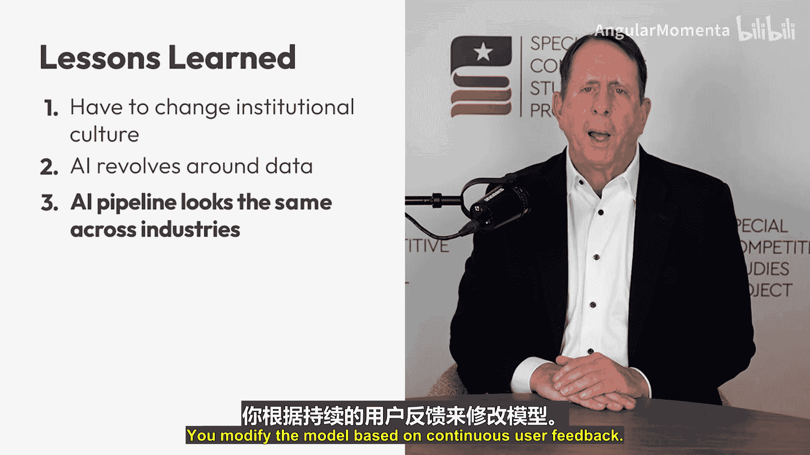
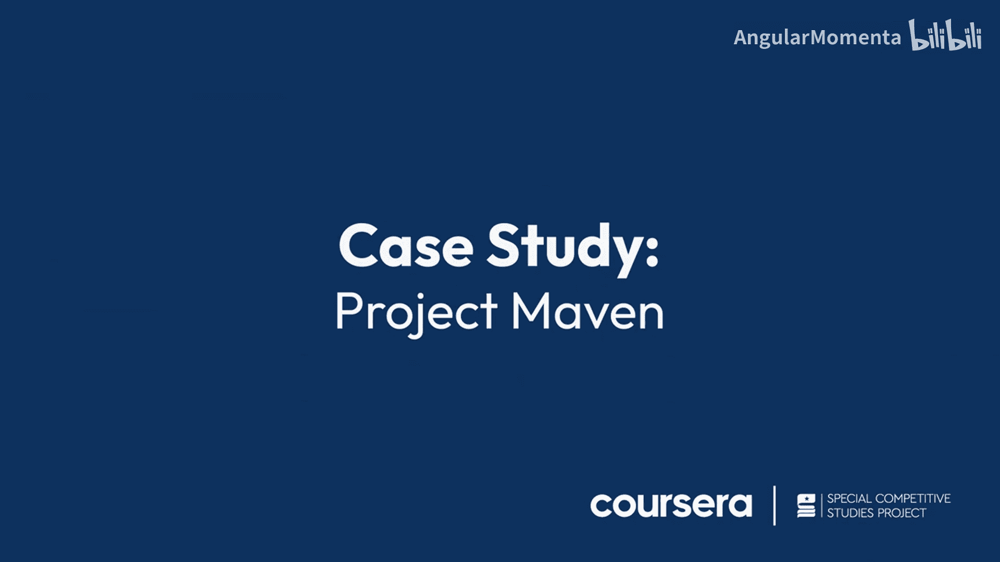

# 005：案例研究 - 项目Maven 🚀


在本节课中，我们将学习美国国防部首个致力于快速、大规模应用人工智能与机器学习的项目——**项目Maven**。我们将了解其启动背景、核心任务、关键经验教训以及它如何成为国防部人工智能领域的“大爆炸”时刻。

---

## 项目Maven的起源

上一节我们介绍了人工智能在国家安全领域的宏观背景，本节中我们来看看一个具体的开创性案例。

2016年夏，时任美国国防部负责情报的副部长办公室三星上将的我，主持了一次情报、监视与侦察（ISR）处理、利用与分发（PED）执行指导小组会议。会议为来自各军种和情报界的高级领导人提供了一个论坛，旨在讨论从全球情报平台和传感器收集到日益增长的数据所带来的挑战与机遇。

这对与会所有人而言都是一个关键时刻。大家一致认为，我们正经历一场“灾难性的成功”：情报收集的来源和数量比历史上任何时候都多，但分析师已无法处理和解析如此海量的信息。他们正淹没在数据之中。这不仅是数据量巨大的问题，还涉及数据速度、种类乃至真实性的挑战。

我们所有人都清楚，不能再依赖传统的自动化工具、更好的业务流程，或是政府惯用的“投入更多人”的解决方案。我们需要找到一种全新的、甚至是革命性的方法，来提升情报周期每个阶段的效能与效率。

会议结束后，我转向负责下级工作组的、富有创新精神的“经典颠覆者”——一位海军陆战队上校，要求他解决这个看似无解的问题。而他做到了。

---

## 项目的建立与使命

不到10个月后，即2017年4月，时任国防部副部长鲍勃·沃克正式成立了**算法战跨职能小组**，即**项目Maven**。这是美国国防部首个致力于快速、大规模实现人工智能与机器学习作战应用的项目。

我受命组建Maven团队，明确指示是加速国防部对大数据和机器学习的整合，并“将国防部可用的海量数据转化为可操作的情报和见解，并提高其速度”。

具体而言，Maven团队的使命是部署人工智能能力，以**增强、加速和自动化**对无人航空系统（无人机）全动态视频的利用与分析。我们还被指示整合现有的基于算法的技术项目，包括那些开发、部署或应用了人工智能、机器学习、深度学习和计算机视觉算法的项目。

在成立后的八个月内，我们已将首批计算机视觉模型交付给海外部署的作战部队。对国防部而言，这已是“光速”，尽管仍不够快，但这无疑是一项非凡的成就。

---

## 关键经验教训

在项目推进过程中，我们获得了宝贵的经验。以下是三个最突出的经验教训：

**首先，最重要的是改变文化，而非任何单一技术。** 如今技术在很大程度上已是商品。关键在于打破现状。我们证明了在体制官僚机构中创建初创企业文化是可能的。文化吞噬战略，忽视文化将自食其果。

**其次，人工智能围绕数据展开。** 谈论人工智能必须从数据开始。坦白说，如今大多数人工智能项目失败，是因为负责人在认识到所面临的数据挑战的规模后，热情往往会迅速消退。数据种类、位置、质量、获取方式、清洗与准备用于训练算法和模型的过程等都是问题。数据是一大障碍，但绝非不可逾越。

**第三，人工智能流程或生命周期大体相同。** 无论是在政府、商业还是学术界，流程并无深奥秘密。一旦确定了要解决的问题，就从数据开始，利用数据将算法转化为AI模型，测试模型，部署最小可行产品，根据持续的用户反馈修改模型，并不断重复此循环。

```
定义问题 -> 获取与准备数据 -> 训练算法/模型 -> 测试与验证 -> 部署MVP -> 收集反馈 -> 迭代优化
```

---

## 项目现状与未来展望

那么，Maven现状如何？最初的Maven之树现已发展出两大坚实分支。



官方项目（我们称为“记录项目”）已于去年移交至国家地理空间情报局，进展顺利，并获得了高层的大力支持。但从补充阅读材料中你会看到，Maven现在不仅被情报分析师使用，也同样被作战部队广泛使用，他们的反馈对持续改进至关重要。

一方面，我为Maven自2017年启动以来取得的成就感到振奋。另一方面，令人失望的是，它仍是政府中少数成功实现规模化并持续稳步推进的人工智能项目之一。我们需要成百上千个“Maven”，而不是一两个。

我对各位最重要的建议很简单：**立即行动**。开始一个人工智能项目，并与已经走过这条路的人交流，没有替代方案。你们应该为挑战现状、直接投身人工智能项目的机会感到兴奋，而不是畏惧。

---

## 总结

本节课中，我们一起学习了**项目Maven**这一国防部人工智能应用的先驱案例。Maven是国防部人工智能的“大爆炸”时刻，至少在如何快速部署并规模化人工智能能力方面是如此。在技术上，它或许像莱特兄弟的飞行者一号，而非阿波罗登月舱。然而，美国从基蒂霍克的首次飞行到将人类送上月球，也只用了66年。

我希望大家学完本课程后，能思考如何在未来几年加速人工智能在整个政府中的采用。这是近代史上最令人兴奋的时代之一，但我们不能再等66年才把它做好。



再次感谢学习本课程，祝你在人工智能之旅中好运。