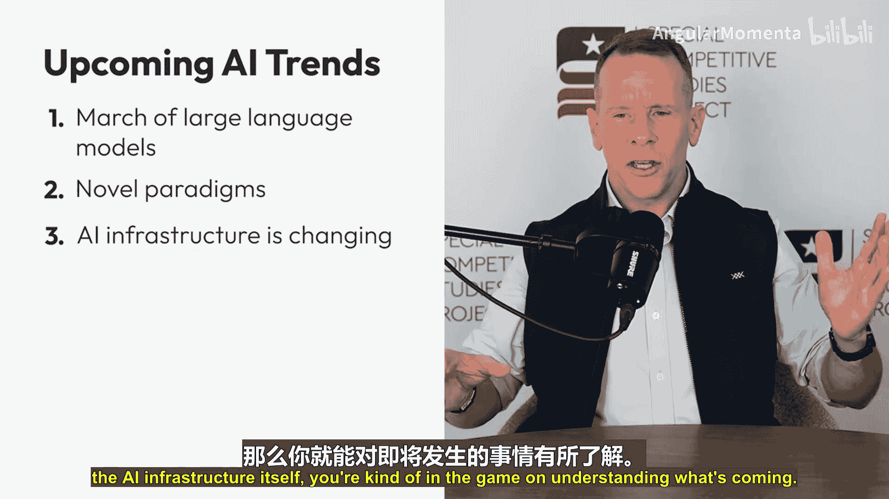
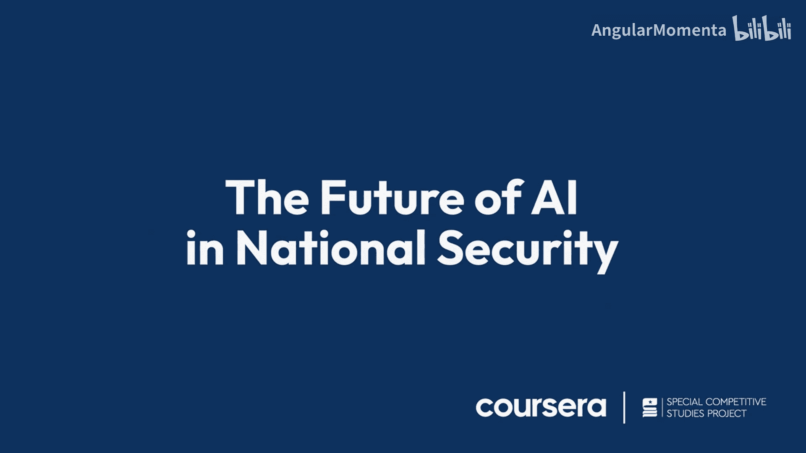

# 006：人工智能在国家安全领域的未来 🔮

在本节课中，我们将探讨人工智能的未来发展趋势，以及如何理解这些趋势以保持前瞻性。我们将从两个基本视角出发：理解人工智能作为一种通用目的技术，以及识别塑造其未来的三大关键趋势。

## 通用目的技术：理解人工智能的根本属性

上一节我们介绍了课程主题，本节中我们来看看如何理解人工智能的本质。第一种思考方式是认识到你正在应对的是一种**通用目的技术**。

通用目的技术是指像机器（机器时代）或电力（电气化时代）这样的技术。当它们出现时，往往会持续存在，并支撑起社会的大部分功能。

以下是一个展示通用目的技术稳步发展的例子：

*   **蒸汽机**：始于1780年，标志着机器时代的开端。机器至今仍与我们同在。
*   **国家点火装置**：这是劳伦斯利弗莫尔国家实验室的一台机器，它能在十亿分之一秒内创造一颗“恒星”，并释放超过一兆焦耳的净正能量。这在1780年蒸汽机发明时是难以想象的。
*   **电气化的地球**：当尼古拉·特斯拉埋头于他的实验台，试图在电池中创造交流电时，他也难以想象今天这个完全电气化的世界。交流电使得电网的创建成为可能。

核心观点是：我们都在驾驭一种通用目的技术。它如此广泛有用，以至于我们甚至无法完全理解它将带来的所有变化。我们只知道，通用目的技术一旦出现就会留存下来，并且它们倾向于**叠加**，即相互结合以创造出我们尚无法想象的新创新形式。

## 把握未来：塑造人工智能的三大趋势

理解了人工智能的通用属性后，我们来看看如何具体把握其发展方向。第二种保持前瞻性的方法是了解即将到来的趋势。主要有三大趋势值得关注。

### 趋势一：大语言模型的演进 🧠

这是指我们正在交互的模型的创建过程。它们对工作非常有用，每年都在变得更好。其“通用性”水平（即处理多项任务的能力）正在变化。这将触及所谓的**缩放定律**，即这些模型在成本效益不再合算之前能改进多久。无论是否存在瓶颈，它们都将增长到某个有用的成本点，在特定有用性上持续变得更好。

### 趋势二：新兴人工智能范式 🤖

存在一些与大型语言模型本身无关的人工智能形式，我们可称之为新兴范式。

以下是几种新兴范式的例子：

*   **智能体**：这是能够为你重复执行任务的算法处理循环，具有一定程度的自主行为，就像为你工作一样。
*   **多智能体团队**：创建多智能体团队的能力已经出现。随着时间的推移，你将能越来越轻松地为自己创建智能体。
*   **类人记忆**：这些智能体将开始拥有类似人类的记忆，能够记住与你的互动。
*   **小样本学习**：它们还将开始拥有类似人类的学习能力，只需少量重复练习就能掌握，我们称之为**小样本学习**。

上述的智能体AI、拥有类人记忆和学习能力的AI，都属于新兴范式。它们将与趋势一结合，并自主运行。只需知道这些范式会不断涌现，当你听到新概念时，就能意识到这可能是一个新范式，进而理解它可能如何影响你的工作。

### 趋势三：人工智能基础设施的变革 ⚙️

这是第三大趋势。数据、数据科学、数据中心、进行计算和高级计算（直至量子计算）的能力、网络和高级网络（如光网络）、以及能源（如聚变能源或降低其成本以使模型运行更易、更廉），所有这些都在人工智能技术栈底层进行着自身的创新。理解这一趋势本身也很重要。因此，你会不断看到人工智能技术栈的演进。

## 总结与展望

本节课中我们一起学习了如何前瞻性地思考人工智能的未来。

总而言之，没有人确切知道它将走向何方。我们只知道它对工作将非常有用，并且在不断演变。一种思考方式是，你正处在一个真正应对通用目的技术的旅程中，我们都在同行。同时，起作用的趋势不止一个。如果你能在新闻中识别它们，并对它们的走向有一个基本的把握，你将成为能够在该领域占据主导地位、并让自己在任务中越来越高效的人工智能赋能工作者。

我们正共同踏上这段旅程。希望这些思考对理解人工智能的未来方向有所帮助。我们完全同行，祝愿你在继续学习如何将人工智能融入工作的过程中一切顺利。