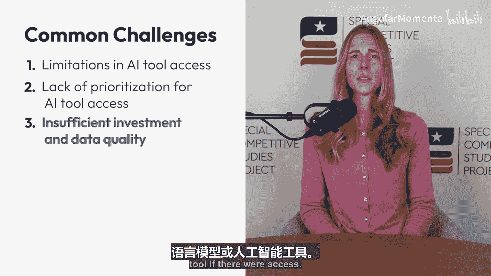
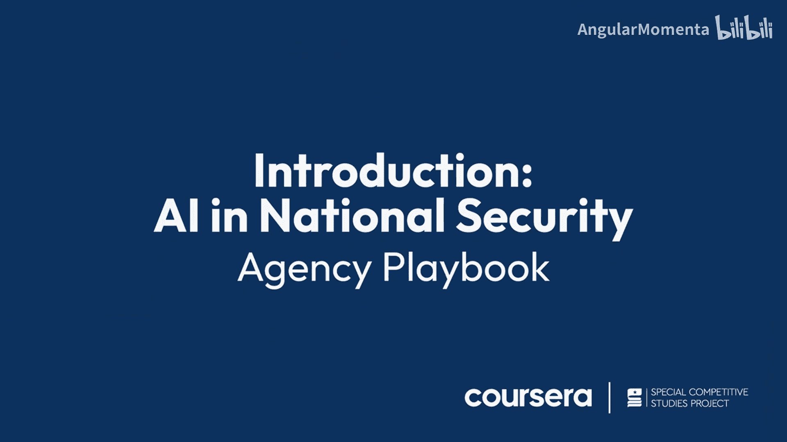

# 009：组织AI应用手册简介 🚀

在本模块中，我们将探讨为何人工智能工具尚未在组织内大规模应用，并学习如何通过设计和实施一份“AI应用手册”来成为推动组织变革的关键力量。

上一模块我们学习了如何利用AI工具提升个人生产力。本节中，我们将视角转向组织层面，看看如何利用AI工具推动组织整体目标的实现。

## 剖析问题：为何AI工具未被广泛采用？

如果你正在疑惑为何AI工具在你的组织中尚未普及，你并非孤例。以下是阻碍AI工具成为组织常态的一些常见挑战与壁垒。

以下是五个主要障碍：

1.  **组织内AI工具访问受限**：包括缺乏专有实例或无法处理敏感数据。
2.  **部门或组织层面缺乏对AI工具访问与采用的优先考虑**：或简单地说是缺乏高层领导的支持。
3.  **对数据架构或数据质量投入不足**：或两者兼有，导致即使有访问权限也无法有效使用大语言模型或其他AI工具。
4.  **AI使用政策与策略零散、不一致或不明确**：尤其是在存在多个相关职权部门或利益相关方时。
5.  **员工队伍尚未做好数据或AI准备**：也缺乏相应的激励措施。

当然，问题可能源于上述一点或几点的组合。你应该从本模块学到的是，无论你身处何职，都可以成为推动组织和使命前进的变革者。

## 本模块目标：创建你的AI行动指南

本模块将帮助你着手创建一份AI应用手册，并确定一些可作为后续步骤的、富有成效的当前行动。

---

**总结**：本节课我们一起探讨了组织内部采用AI工具时面临的常见障碍，并明确了本模块的核心目标——引导你成为变革推动者，通过制定AI应用手册来克服这些障碍，为组织引入并有效利用人工智能。