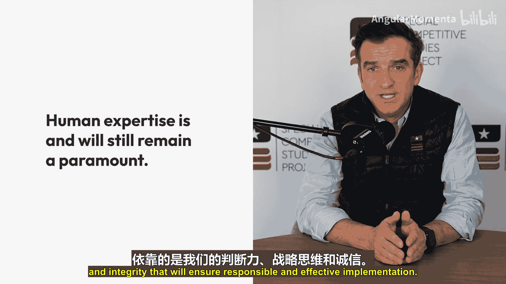
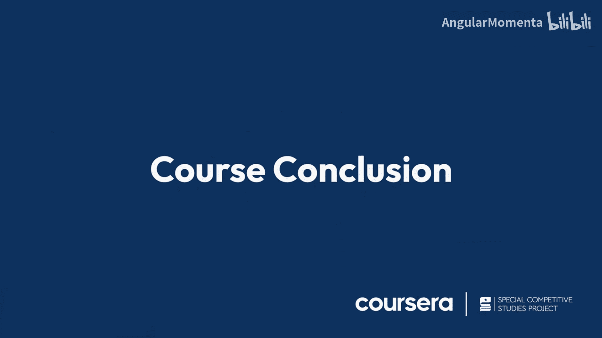

**人工智能与国家安全：课程总结**

在本课程中，我们共同探讨了人工智能如何融入公共部门任务，以提升效率、加速决策并加强协作。现在，让我们对所学内容进行回顾与总结。

我们首先了解了人工智能在国家安全领域的应用前景。通过将人工智能整合到公共任务中，可以优化流程、提高效率。

上一节我们介绍了人工智能的整合潜力，本节中我们来看看具体的应用实例。我们研究了现实案例，展示了这些强大工具如何提升行动效率，并赋能您在自身岗位上取得更大成就。

以下是人工智能带来的核心价值：
*   **流程优化**：AI可以自动化常规任务，释放人力资源。
*   **决策加速**：通过快速分析数据，AI为决策者提供关键洞察。
*   **协同增强**：AI工具促进跨部门、跨领域的信息共享与协作。

在课程结束前，需要强调一个关键要点：**人的专业知识始终至关重要**。人工智能可以放大我们的能力，但确保其负责任且有效实施的，是我们的判断力、战略思维和诚信。其关系可以概括为：
**最终成效 = 人工智能能力 × 人类决策与监督**

因此，我鼓励大家在各自的团队和组织中，继续倡导对人工智能的合理采纳与应用。将在此学到的经验教训付诸实践，在推动创新的同时，绝不妥协安全。

最后，感谢各位的专注与投入。期待看到大家将这些见解，应用于守护国家安全的使命中，并使之焕发生机。

😊 恭喜完成本课程！

本节课中，我们一起学习了人工智能在国家安全领域的整合应用、实际价值，并深刻理解了**人机协同**的核心原则。记住，技术是工具，而运用工具的智慧与责任永远掌握在人类手中。