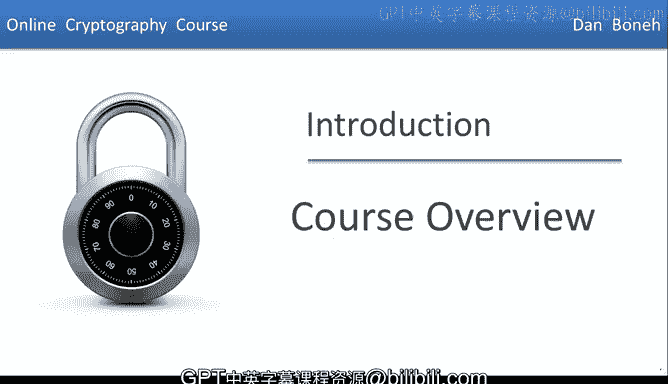
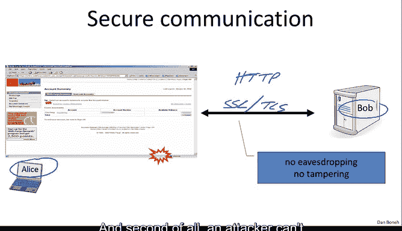
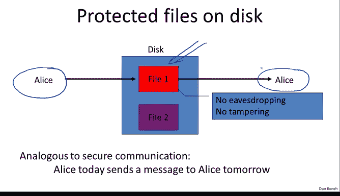
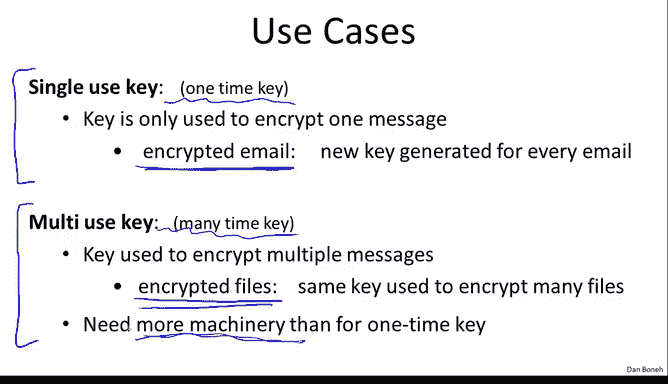

# 001：课程概述 🎯

在本节课中，我们将学习密码学课程的整体框架、核心目标以及基本概念。课程将分为两部分：对称加密系统和公钥密码学。我们将探讨如何正确使用密码学原语，并理解其安全性的基本原理。

---

## 课程目标与学习方法 🎯

我的目标是教会你密码学原语的工作原理，更重要的是，教会你如何正确使用这些原语，并能够推理你所构建系统的安全性。我们将看到密码学原语的各种抽象形式，并进行一些安全性证明。到课程结束时，你将能够推理密码学构造的安全性，并能够破解那些不安全的构造。

关于如何学习这门课程，我强烈建议你在听课时记笔记。我鼓励你用自己的话总结和记录所呈现的材料。此外，视频中的讲解速度可能比正常课堂快，因此我建议你定期暂停视频，思考正在讲解的内容，直到你完全理解后再继续。

视频中会不时暂停并弹出问题。这些问题旨在帮助你理解材料，我强烈建议你自己回答这些问题，而不是跳过它们。通常，这些问题与刚刚讲过的内容相关，因此回答起来应该不会太困难。

---

## 密码学的广泛应用 🌐

如今，密码学被广泛应用于所有计算机领域，是保护数据的常用工具。例如：
*   **网络流量**：使用HTTPS协议保护。
*   **无线流量**：例如，Wi-Fi流量使用WPA2协议（属于802.11i标准的一部分）保护。
*   **手机流量**：GSM中使用加密机制保护。
*   **蓝牙流量**：使用密码学保护。

我们将在课程中详细了解这些系统的工作原理，特别是SSL和802.11i。

密码学也用于保护存储在磁盘上的文件。通过加密文件，即使磁盘被盗，文件内容也不会泄露。它还用于内容保护，例如，你购买的DVD和蓝光光盘上的电影是加密的。具体来说，DVD使用一种称为CSS（内容扰乱系统）的系统，而蓝光使用AACS系统。我们将讨论CSS和AACS的工作原理。事实证明，CSS是一个相对容易破解的系统，我们将进行一些密码分析，并展示如何破解CSS中使用的加密。

密码学还用于用户认证以及我们将在下一节讨论的许多其他应用。

---

## 安全通信：Alice与Bob的故事 🔐

现在，让我们回到安全通信，讨论一台笔记本电脑试图与网络服务器通信的情况。这也是介绍我们的朋友Alice和Bob的好时机，他们将陪伴我们整个学期。本质上，Alice试图与Bob安全通信。在这里，Alice在笔记本电脑上，Bob在服务器上。用于实现此目的的协议称为HTTPS，实际的协议称为SSL，有时也称为TLS。这些协议的目标是确保数据在网络中传输时，攻击者既不能窃听数据，也不能在数据通过网络时修改数据。即实现**无窃听**和**无篡改**。

正如我所说，用于保护网络流量的TLS协议实际上由两部分组成。第一部分称为**握手协议**，Alice和Bob在此过程中相互通信。在握手结束时，双方之间会生成一个共享的密钥`K`。因此，Alice和Bob都知道这个密钥`K`，但观察对话的攻击者不知道密钥`K`是什么。

建立这个共享密钥、进行握手的方式是使用公钥密码学技术，这将是课程第二部分的内容。

一旦Alice和Bob拥有了共享密钥，他们就可以使用这个密钥，通过正确加密彼此之间的数据来进行安全通信。这实际上是课程的第一部分内容，即一旦双方拥有共享密钥，他们如何使用该密钥来加密和保护彼此之间传输的数据。

---

## 磁盘文件加密：与时间对话的Alice 💾

如前所述，密码学的另一个应用是保护磁盘上的文件。这里有一个被加密的文件，这样即使磁盘被盗，攻击者也无法读取文件内容。如果攻击者试图修改磁盘上的文件数据，当Alice尝试解密该文件时，这种篡改将被检测到，她将忽略文件内容。因此，存储在磁盘上的文件同时具有**机密性**和**完整性**。

我想提出一个小的哲学观点：实际上，在磁盘上存储加密文件与保护Alice和Bob之间的通信非常相似。具体来说，当你在磁盘上存储文件时，本质上是今天的Alice想要在明天读取该文件。因此，与双方（Alice和Bob）通信不同，在磁盘存储加密的情况下，是今天的Alice与明天的Alice通信。但本质上，安全通信和安全文件存储这两种场景在哲学上是相通的。

---

## 对称加密系统：共享的秘密 🔑

保护流量的基础构建块是所谓的**对称加密系统**，我们将在课程的前半部分详细讨论它。

在对称加密系统中，双方Alice和Bob共享一个攻击者不知道的密钥`K`，只有他们知道密钥`K`。他们将使用一个密码，该密码由两个算法`E`和`D`组成。`E`称为加密算法，`D`称为解密算法。

加密算法以消息`m`和密钥`K`作为输入，并产生相应的密文`c`。解密算法则相反，它以密文`c`和密钥`K`作为输入，并产生相应的消息`m`。

我想强调一个非常重要的观点，我现在只说一次，但以后不会再重复，这是一个极其重要的观点：算法`E`和`D`（实际的加密算法）是公开已知的。对手确切地知道它们是如何工作的。唯一保密的是**密钥`K`**。除此之外，其他一切都是完全公开的。认识到这一点非常重要：你应该只使用公开的算法，因为这些算法已经经过了由数百人组成的庞大社区多年的同行评审，只有在社区证明它们无法被破解后，这些算法才会开始被使用。事实上，如果有人对你说：“嘿，我有一个你可能想用的专有密码”，通常的答案应该是坚持使用标准算法，而不是使用专有密码。实际上，有许多专有密码的例子，一旦它们被逆向工程，就很容易被简单的分析破解。

---

## 一次性密钥与多次性密钥 🔄

即使在我们将要讨论的对称加密的简单情况下，实际上也有两种情况我们将依次讨论。

第一种情况是每个密钥只用于加密一条消息，我们称之为**一次性密钥**。例如，当你加密电子邮件时，通常每封电子邮件都使用不同的对称密钥加密。由于密钥只用于加密一条消息，实际上存在相当高效和简单的方法来使用这些一次性密钥加密消息，我们将在下一个模块中讨论这些方法。

然而，在许多情况下，密钥需要用于加密多条消息，我们称之为**多次性密钥**。例如，当你在文件系统中加密文件时，同一个密钥用于加密许多不同的文件。事实证明，如果密钥现在要用于加密多条消息，我们需要更多的机制来确保加密系统的安全。实际上，在讨论了一次性密钥之后，我们将转而讨论专门为多次性密钥设计的加密模式，并且我们将看到，在这些情况下，需要采取更多步骤来确保安全。

---

## 密码学的局限性与重要原则 ⚠️

最后，我想指出关于密码学需要记住的几个重要事项。

首先，密码学当然是保护计算机系统中信息的绝佳工具。然而，同样重要的是，密码学有其局限性。首先，密码学并非所有安全问题的解决方案。例如，如果你有软件漏洞，那么密码学通常无法帮助你。同样，如果你担心社会工程攻击（攻击者试图欺骗用户采取会伤害用户的行动），那么密码学通常也帮不上忙。因此，尽管它是一个极好的工具，但它并非所有安全问题的解决方案，这一点非常重要。

另一个非常重要的点是，如果密码学实现不正确，它基本上就变得毫无用处。例如，有许多系统运行良好（我们将看到这些系统的例子），实际上允许Alice和Bob通信，并且Bob能够接收和解密Alice发送的消息。然而，由于密码学实现不正确，这些系统完全不安全。实际上，我想提一个旧的加密标准，称为WEP（有线等效保密），用于加密Wi-Fi流量。WEP中包含许多错误。通常，当我想向你展示在密码学中不应该怎么做时，我会以WEP中的做法为例。所以对我来说，有一个可以指出的协议例子来说明不应该怎么做是非常幸运的。

最后，我想让你记住的一个非常重要的点是：**密码学不是你应该尝试自己发明和设计的东西**。正如我所说，密码学中有标准，有标准的密码学原语，我们将在本课程中详细讨论这些。你应该主要使用这些标准的密码学原语，而不是自己发明这些东西。这些标准已经经过了数百人多年的评审，这是临时设计无法比拟的。正如我所说，多年来有许多临时设计的例子，一旦被分析，就立即被破解。

---

## 总结 📝

本节课我们一起学习了密码学课程的整体概述。我们明确了课程的目标是理解密码学原语的工作原理并学会安全地使用它们。我们看到了密码学在安全通信（如HTTPS）、文件加密和内容保护等领域的广泛应用。我们引入了对称加密系统的基本模型，其中双方共享一个密钥`K`，并使用公开的加密`E`和解密`D`算法。我们区分了一次性密钥和多次性密钥的不同应用场景。最后，我们强调了密码学的局限性、正确实现的重要性，以及遵循经过验证的密码学标准而非自行设计的核心原则。在接下来的课程中，我们将深入探讨这些概念的具体实现和安全性分析。