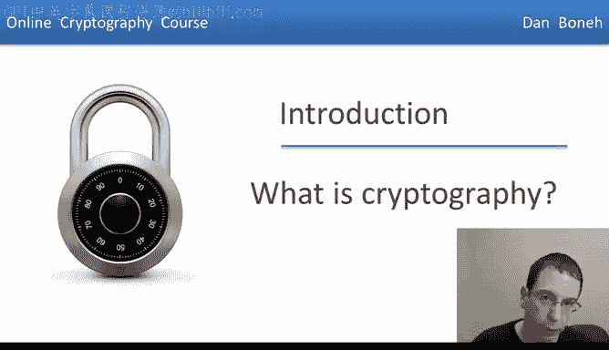
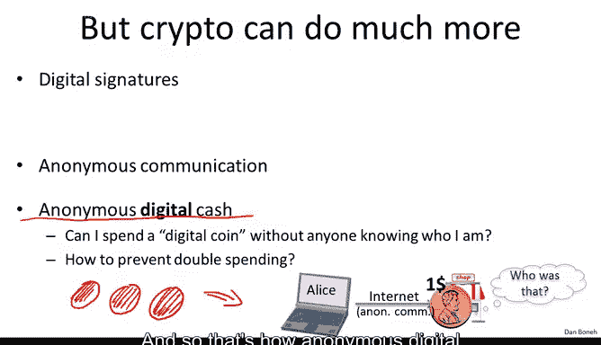
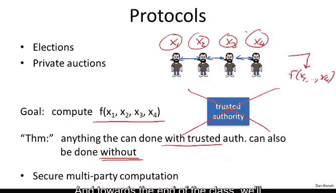
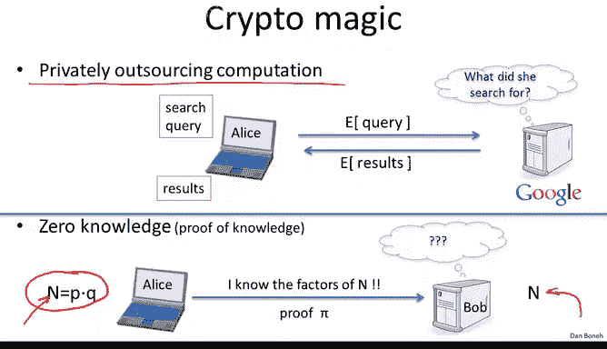
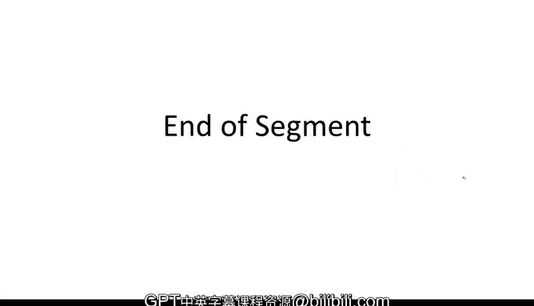

# 002：密码学概述

在本节课中，我们将要学习密码学的基本概念及其广泛的应用领域。密码学不仅仅是关于加密通信，它还涵盖了数字签名、匿名通信、安全多方计算等众多神奇而强大的技术。

## 密码学的核心：安全通信

密码学的核心是安全通信，它主要包含两个部分：**安全密钥建立**和**使用共享密钥的安全通信**。

上一节我们介绍了密码学的整体图景，本节中我们来看看其核心组成部分。

*   **安全密钥建立**：这指的是通信双方（例如Alice和Bob）通过交换信息，最终协商出一个只有他们两人知道的共享密钥 `K`。在此过程中，双方能确认彼此的身份，而窃听者则无法获知密钥内容。
*   **安全通信**：在获得共享密钥后，双方需要使用加密方案来安全地交换信息。一个完善的加密方案不仅能提供**机密性**（防止攻击者读取信息），还能提供**完整性**（防止攻击者篡改信息而不被发现）。

## 超越通信：密码学的广泛应用

然而，密码学的能力远不止于此。以下是密码学的一些关键应用领域。

### 数字签名

数字签名是物理世界签名在数字世界的对应物。其核心挑战在于：数字签名不能在所有文件上都相同，否则攻击者可以轻易复制粘贴。

为了解决这个问题，数字签名被设计为**所签署内容的一个函数**。这意味着，签名值依赖于被签名的具体数据。如果攻击者试图将一个签名复制到另一个不同的文档上，验证将会失败。我们将在课程后续学习如何构建并证明数字签名方案的安全性。

### 匿名通信与数字现金

密码学可以保护用户的隐私。

*   **匿名通信**：例如，用户Alice希望匿名地与聊天服务器Bob通信。通过像Tor（洋葱路由）这样的系统，Alice的消息可以通过一系列代理加密转发，使得Bob和代理都无法确定通信者的真实身份，同时保持双向通信能力。
*   **匿名数字现金**：这模拟了物理现金的匿名性。用户Alice拥有一个数字美元硬币，她可以匿名地在线消费它。但数字世界的难题是：Alice可以轻易复制这个硬币并进行双重消费。

这个悖论在于：**匿名性与安全性似乎冲突**。如果现金完全匿名，就无法追查双重消费的欺诈者。

解决方案的精妙之处在于：**如果Alice只花费硬币一次，她的身份保持匿名；但如果她尝试双重消费，她的身份将会完全暴露**。我们将在课程中看到如何实现这一点。

### 安全多方计算

密码学能让我们在不泄露隐私的情况下进行协同计算。以下是两个经典例子：

*   **选举系统**：选民希望统计出哪个政党获得了多数票，但又不希望自己的个人投票被泄露。通过引入一个选举中心，选民发送加密选票，选举中心可以计算出获胜者，但除了选举结果外，无法获知任何个人的投票选择。
*   **私人拍卖（维克里拍卖）**：在这种拍卖中，出价最高者获胜，但只需支付第二高的出价金额。目标是在不公开具体出价的情况下，计算出获胜者和其应付价格（即第二高价）。

以上都是**安全多方计算**的具体实例。抽象地看，多个参与者各自拥有秘密输入（如选票、出价），他们希望共同计算某个函数的结果（如多数票、第二高价），但除了函数输出外，不泄露任何关于个人输入的信息。

一种简单但不安全的方法是引入一个**可信第三方**来收集所有输入、计算结果并公布。而密码学一个惊人的核心定理指出：**任何可以通过可信第三方完成的计算，都可以在没有可信第三方的情况下完成**。参与者通过执行特定的协议相互通信，最终能共同得到计算结果，同时保证各自输入的私密性。

### “魔法”般的应用

有些密码学应用近乎魔法，它们展示了该领域的巨大潜力。

*   **隐私外包计算**：想象一下，Alice可以将她的搜索查询**加密后**发送给Google。Google能够在不解密的情况下，直接在加密数据上执行搜索算法，并将**加密的搜索结果**返回给Alice。Alice解密后得到答案，而Google全程不知道她搜索了什么。这种全同态加密技术目前虽不高效，但其理论可能性已足够惊人。
*   **零知识证明**：Alice知道一个巨大合数 `N` 的因子分解（`N = p * q`）。她可以向Bob证明自己知道这个分解，但在证明过程中，Bob**完全学不到任何关于 `p` 和 `q` 的信息**。这不仅适用于因数分解，几乎对于任何你能解答的难题，你都可以在不透露答案的前提下，向他人证明你拥有答案。

## 现代密码学的科学方法

现代密码学是一门严谨的科学。在介绍每一个密码学原语（如数字签名）时，我们都会遵循以下三个严格步骤：

1.  **精确定义**：首先，我们会精确界定**威胁模型**。即，明确攻击者的能力（能做什么）和目标（想达成什么）。例如，对于数字签名，我们需要精确定义什么是“不可伪造性”。
2.  **提出构造**：然后，我们提出一个具体的密码学方案或构造。
3.  **给出证明**：最后，我们提供安全性证明。证明的核心思路是：**如果存在攻击者能破坏我们的构造，那么我们就可以利用这个攻击者来解决一个公认的困难问题（如大整数分解）**。由于该问题被认为是困难的，因此我们的构造在定义的威胁模型下就是安全的。

## 总结

本节课中我们一起学习了密码学的广阔天地。我们从安全通信这一核心出发，探索了数字签名、匿名系统、安全多方计算等高级应用，并领略了如同隐私外包计算和零知识证明这样“魔法”般的可能性。最后，我们了解了现代密码学严谨的“定义-构造-证明”科学范式。密码学不仅关乎秘密，更关乎在数字世界中构建信任、隐私和安全的新规则。