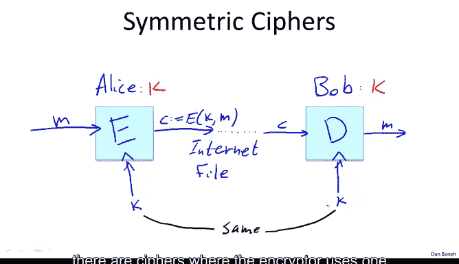
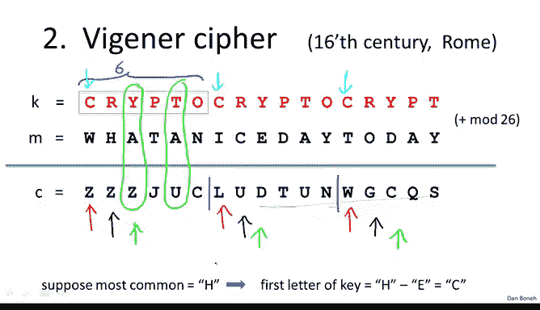
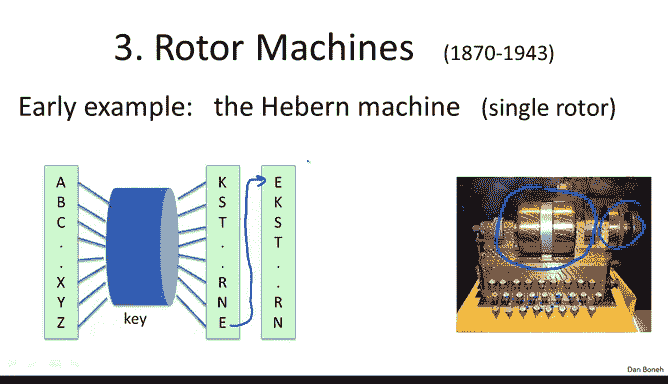
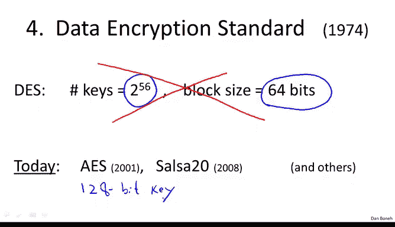

# 003：密码学历史 📜

在本节课中，我们将要学习密码学的历史，了解几种经典但已被破解的密码。通过分析这些历史上的密码，我们可以理解为什么它们不安全，并为学习现代密码学打下基础。

## 密码学基础概念

在开始介绍历史密码之前，我们首先需要理解密码学的基本模型。这个模型涉及三个角色：**爱丽丝（Alice）** 和 **鲍勃（Bob）** 希望安全通信，而一个 **攻击者（Attacker）** 试图窃听他们的对话。

为了安全通信，爱丽丝和鲍勃会共享一个秘密 **密钥（Key）**，我们用 `K` 表示。攻击者对这个密钥一无所知。

他们使用一个 **密码（Cipher）** 进行通信，它由一对算法组成：**加密算法（E）** 和 **解密算法（D）**。

这些算法的工作原理如下：
*   **加密算法 `E`** 接收消息 `M` 和密钥 `K` 作为输入，输出一个 **密文（Ciphertext）** `C`。我们可以用公式表示为：
    `C := E(K, M)`
*   密文 `C` 通过某种方式（例如互联网）传输给鲍勃。
*   **解密算法 `D`** 接收密文 `C` 和相同的密钥 `K` 作为输入，输出原始消息 `M`。公式表示为：
    `M := D(K, C)`

我们称这类密码为 **对称密码（Symmetric Cipher）**，因为加密方和解密方使用相同的密钥 `K`。在本课程后面，我们还会看到加密和解密使用不同密钥的密码。

## 历史上的密码示例

上一节我们介绍了密码学的基本模型，本节中我们来看看几种历史上著名的、但已被完全破解的密码。

### 替换密码

最简单的例子是 **替换密码（Substitution Cipher）**。它的密钥是一个替换表，规定了如何将字母表中的每个字母映射到另一个字母。

例如，一个密钥可能规定：
*   字母 `A` 映射到 `C`
*   字母 `B` 映射到 `W`
*   字母 `C` 映射到 `N`
*   ...
*   字母 `Z` 映射到 `A`

使用这个密钥加密消息时，我们逐个字母进行替换。例如，消息 `B C Z A` 会被加密为 `W N A C`。解密过程则使用相同的替换表进行反向查找。

**凯撒密码（Caesar Cipher）** 是替换密码的一个特例，但它不是一个真正的密码，因为它没有可变的密钥。它只是将字母固定地移位3位（例如，`A` 变成 `D`，`B` 变成 `E`）。由于密钥固定且公开，攻击者一旦知道加密方式，就能轻松解密。

现在，让我们回到使用随机替换表的替换密码。它的密钥空间有多大？对于26个字母，可能的替换表（即排列）数量是 `26!`（26的阶乘），大约等于 `2^88`。这意味着描述一个密钥大约需要88比特，这个密钥空间大小本身是足够的。

然而，替换密码非常不安全。以下是破解它的方法：

破解替换密码的核心是利用 **字母频率分析**。在英文文本中，字母的出现频率并不均匀。例如：
*   字母 `E` 是最常见的，出现频率约为12.7%。
*   字母 `T` 次之，约为9.1%。
*   字母 `A` 再次之，约为8.1%。

破解步骤如下：
1.  统计密文中每个字母的出现频率。
2.  频率最高的字母极有可能是 `E` 加密后的结果，由此可以恢复密钥表中的一项。
3.  频率次高的字母极有可能是 `T` 加密后的结果，恢复第二项。
4.  以此类推，可以恢复出几个高频字母的映射关系。

当高频字母分析遇到瓶颈时（因为中低频字母频率接近），我们可以转而分析 **双字母组合（Digrams）** 的频率。例如，在英文中，“TH”、“HE”、“IN”、“AN” 等组合非常常见。

通过统计密文中双字母组合的频率，并与已知的英文双字母组合频率进行匹配，可以进一步恢复密钥。如果需要，还可以分析 **三字母组合（Trigrams）**。

最终，攻击者仅凭密文（**唯密文攻击**）就能恢复出整个解密密钥和原始明文。因此，使用替换密码加密几乎没有意义。

### 维吉尼亚密码

现在我们从古罗马时代快进到文艺复兴时期，看看由16世纪的学者维吉尼亚设计的一种密码——**维吉尼亚密码（Vigenère Cipher）**。

在维吉尼亚密码中，密钥是一个单词（例如 `CRYPTO`）。加密时，将明文写在密钥下方，并重复密钥以覆盖整个明文长度。

加密过程是：将明文字母和对应位置的密钥字母进行模26加法（即 `A=0, B=1, ..., Z=25`）。例如，`Y (24) + A (0) = Z (25)`；`T (19) + A (0) = U (20)`。如果相加结果超过25，则绕回开头。解密则是进行模26减法。

破解维吉尼亚密码也相对容易，假设我们知道密钥长度（例如6）：
1.  将密文按密钥长度（6）分组。
2.  观察每组中的第1个字母。所有这些字母都是用密钥的第1个字母（例如 `C`）加密的，相当于一个移位密码。
3.  统计这些“第1个字母”的频率，最常见的那个极有可能是最常用的英文字母 `E` 加密后的结果。由此可以反推出密钥的第1个字母（`H - E = C`）。
4.  对每组中的第2个、第3个字母...重复此过程，即可恢复整个密钥。

如果不知道密钥长度，可以尝试不同的长度（1, 2, 3...）进行上述分析，直到解密的文本变得通顺有意义为止。这也是一种 **唯密文攻击**。

维吉尼亚密码的核心理念——模加法——是好的，但它的具体实现方式（短密钥重复使用）存在严重缺陷，我们将在后续课程中看到如何修正它。

### 转子机

快进到19世纪，电气时代来临，人们设计了使用电动机的密码机，即 **转子机（Rotor Machine）**。

早期的例子是 **赫本机（Heburn）**，它使用一个转子。密钥编码在一个圆盘（转子）上，实质上是一个替换表。每按一次打字机按键，转子就转动一格，从而改变当前的替换表。因此，即使连续输入相同的字母，输出的密文字母也会不同。

然而，赫本机很快也被通过字母频率、双字母组合频率等统计方法破解。

为了对抗统计攻击，转子机变得越来越复杂，最终发展到著名的 **恩尼格玛密码机（Enigma）**。恩尼格玛机使用3个、4个或5个转子（不同版本不同）。密钥是这些转子的初始位置设置。对于3转子版本，密钥空间是 `26^3`；对于4转子版本，是 `26^4 ≈ 2^18`。

以今天的标准看，`2^18` 的密钥空间很小，一台计算机可以瞬间暴力破解所有可能密钥。然而，在二战时期，英国布莱切利园的密码学家们成功地对恩尼格玛机实施了唯密文攻击，破译了德国的通信，这在战争中发挥了重要作用。

## 向现代密码学过渡

战后，机械时代结束，数字时代开启。随着计算机的普及，美国政府意识到它从工业界采购大量数字设备，因此希望工业界使用良好的密码。

于是，政府发起了 **数据加密标准（Data Encryption Standard, DES）** 的提案征集。1974年，IBM团队提出的一个密码被采纳为DES。DES使用56比特密钥，一次加密64比特（8个字节）的数据块。

DES的56比特密钥空间在今天看来太小，可以通过暴力搜索破解，因此已被认为不安全，不应在新项目中使用（尽管一些遗留系统可能还在用）。如今，我们有新的密码标准，如 **高级加密标准（Advanced Encryption Standard, AES）**，它使用128比特或更长的密钥，我们将在课程后面详细讨论。

## 总结

本节课中我们一起学习了密码学的简要历史，重点分析了三种经典密码：
1.  **替换密码**：通过字母频率分析可轻易破解。
2.  **维吉尼亚密码**：通过分组和频率分析可破解，但其模加法的思想被沿用。
3.  **转子机（如恩尼格玛）**：虽然机械结构复杂，但密钥空间有限或存在其他弱点，最终被破解。

这些历史密码的失败教训告诉我们，一个安全的密码系统不能仅依赖算法的保密性，必须能够抵抗基于统计特性等的各种分析攻击，并且需要足够大的密钥空间来对抗暴力破解。这些原则为现代密码学的设计奠定了基础。