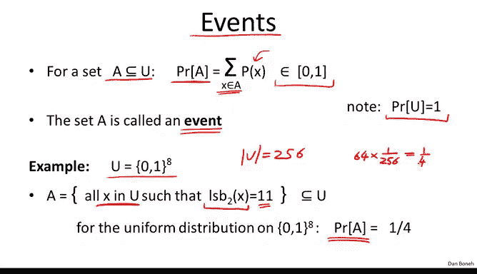
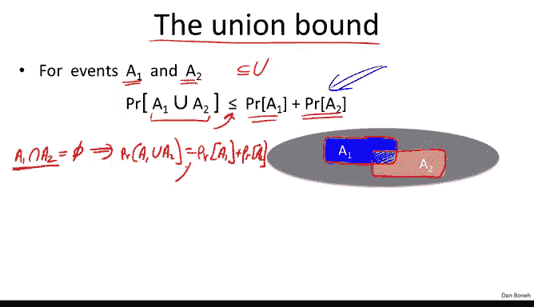
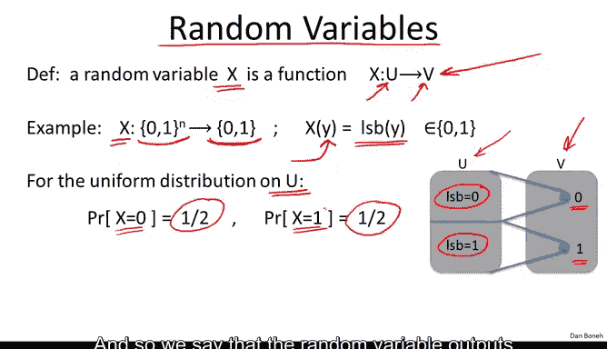
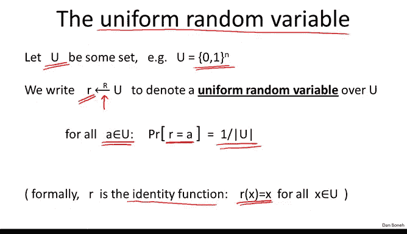
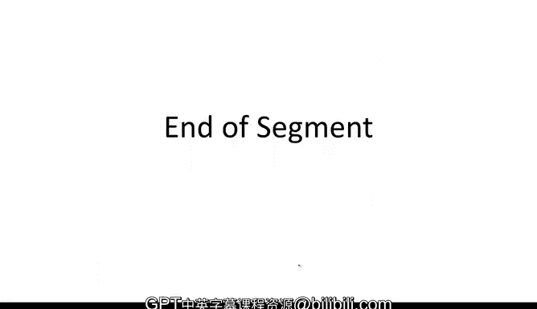

# 004：离散概率速成课程 🎲

在本节课中，我们将要学习现代密码学的基础数学语言——离散概率。我们将从基本概念开始，逐步理解概率分布、事件、随机变量和随机算法，这些都是构建安全密码系统所必需的工具。


## 概率分布

上一节我们介绍了密码学需要严谨的数学基础。本节中，我们来看看概率论的核心概念——概率分布。

概率总是定义在一个**全集** `U` 上。在我们的语境中，`U` 总是一个有限集合。最常见的情况是，全集是所有 `n` 位二进制字符串的集合，记作 `{0,1}^n`。

例如，集合 `{0,1}^2` 是所有2位字符串的集合，包含 `00`、`01`、`10`、`11` 四个元素。更一般地，集合 `{0,1}^n` 包含 `2^n` 个元素。

全集 `U` 上的一个**概率分布**是一个函数 `P`。这个函数为全集中的每一个元素 `x` 分配一个介于0和1之间的数字，称为该元素的**权重**或**概率**。

这个函数 `P` 只有一个要求：所有权重的总和必须为1。

公式表示为：
```
∑ P(x) = 1， 其中 x ∈ U
```

让我们看一个简单的例子。回到我们的2位字符串全集 `{00, 01, 10, 11}`。我们可以考虑以下概率分布：
*   为元素 `00` 分配概率 `1/2`
*   为元素 `01` 分配概率 `1/8`
*   为元素 `10` 分配概率 `1/4`
*   为元素 `11` 分配概率 `1/8`

这些数字的总和为 `1/2 + 1/8 + 1/4 + 1/8 = 1`，因此 `P` 是一个有效的概率分布。这些数字的含义是：如果我从这个分布中抽样，我以 `1/2` 的概率得到字符串 `00`，以 `1/8` 的概率得到 `01`，以此类推。

## 两种经典分布

现在我们已经理解了什么是概率分布，让我们看看两种经典的分布示例。

第一种是**均匀分布**。均匀分布为全集中的每个元素分配完全相同的权重。

我们用 `|U|` 表示全集 `U` 的大小（即元素的数量）。由于我们希望所有权重之和为1，并且所有权重相等，这意味着对于全集中的每个元素 `x`，我们分配的概率是 `1/|U|`。

具体来说，在我们2位字符串的例子中，均匀分布会为每个字符串分配 `1/4` 的权重。显然，所有权重之和为1。这意味着如果我从这个分布中随机抽样，我会均匀地抽样到所有四个2位字符串，每个字符串被抽到的可能性相同。

另一种非常常见的分布是**点分布**。点分布 `P_x0` 基本上将所有权重放在一个特定的点 `x0` 上。

公式表示为：
```
P_x0(x0) = 1
P_x0(x) = 0， 对于所有 x ≠ x0
```


回到我们的例子，一个将所有质量放在字符串 `10` 上的点分布，会为 `10` 分配概率 `1`，为所有其他字符串分配概率 `0`。如果我从这个分布中抽样，我几乎总是保证抽到字符串 `10`，永远不会抽到其他字符串。

## 事件与概率

接下来，我们定义**事件**的概念。

考虑全集 `U` 的一个子集 `A`。我们定义子集 `A` 的概率，就是集合 `A` 中所有元素的权重之和。

换句话说，我对集合 `A` 中的所有元素 `x` 的权重 `P(x)` 进行求和。

因为整个全集所有权重之和为1，这意味着：
*   整个全集 `U` 的概率是 `1`。
*   全集任意子集的概率是 `0` 到 `1` 之间的一个数。

我们称全集 `U` 的子集 `A` 为一个**事件**，集合 `A` 的概率称为该事件的**概率**。

让我们看一个简单的例子。

假设我们观察的全集 `U` 由所有8位字符串（即所有字节值）组成。这个全集的大小 `|U|` 是 `256`。

现在定义以下事件 `A`：该事件包含所有8位字符串中，最低两位（最低有效位）为 `11` 的字符串。

例如，字符串 `01011010` 不在集合 `A` 中，但字符串 `01011011` 在集合 `A` 中。

现在，考虑全集 `U` 上的均匀分布。问题是：事件 `A` 的概率是多少？即，当我们随机选择一个字节时，该字节的最低两位恰好是 `11` 的概率是多少？

答案是 `1/4`。原因是，在 `256` 个8位字符串中，恰好有 `64` 个（即四分之一）字符串的最低两位是 `11`。由于我们考虑的是均匀分布，每个字符串的概率是 `1/256`。因此，这 `64` 个元素的总概率是 `64 * (1/256) = 1/4`。

## 并集界限



事件概率的一个非常简单的界限称为**并集界限**。

假设我们有两个事件 `A1` 和 `A2`，它们都是某个全集 `U` 的子集。我们想知道事件 `A1` 发生**或**事件 `A2` 发生的概率是多少？换句话说，就是这两个事件并集 `A1 ∪ A2` 的概率。

并集界限告诉我们，`A1` 或 `A2` 发生的概率小于或等于两个概率之和。

公式表示为：
```
Pr[ A1 ∪ A2 ] ≤ Pr[A1] + Pr[A2]
```

这其实很容易理解。当我们计算两个概率之和 `Pr[A1] + Pr[A2]` 时，我们实际上是在对 `A1` 中所有元素的概率和 `A2` 中所有元素的概率进行求和。如果两个事件有交集，那么交集部分的元素概率在右边被重复计算了两次。因此，两个概率之和实际上会大于或等于并集的真实概率。

如果两个事件是**不相交**的（即它们的交集为空集），那么 `A1` 或 `A2` 发生的概率恰好等于两个概率之和。

公式表示为：
```
如果 A1 ∩ A2 = ∅，则 Pr[ A1 ∪ A2 ] = Pr[A1] + Pr[A2]
```



我们将在课程中不时使用这些事实。

让我们看一个简单的例子。

假设事件 `A1` 是所有 `n` 位字符串中以 `11` 结尾的字符串集合。事件 `A2` 是所有 `n` 位字符串中以 `11` 开头的字符串集合（`n` 可以是8或更大的数）。

现在的问题是：事件 `A1` 发生**或**事件 `A2` 发生的概率是多少？即，如果我从全集 `U` 中均匀抽样，最低有效位是 `11` **或**最高有效位是 `11` 的概率是多少？

根据我们之前的计算，每个事件的概率是 `1/4`。因此，根据并集界限，`A1` 或 `A2` 发生的概率 `≤ 1/4 + 1/4 = 1/2`。我们由此证明了，看到最高有效位是 `11` **或**最低有效位是 `11` 的概率小于等于二分之一。这是如何使用并集界限来限定两个事件之一发生概率的一个简单例子。

## 随机变量

我们需要定义的下一个概念是**随机变量**。

随机变量是相当直观的对象，但其正式定义可能有点令人困惑。我将通过一个例子来说明，希望这能足够清晰。

形式上，一个随机变量 `X` 是一个从全集 `U` 到某个集合 `V` 的函数。我们说集合 `V` 是随机变量**取值**的地方。

让我们看一个具体的例子。

假设我们有一个随机变量 `X`，它映射到集合 `{0,1}`。因此，这个随机变量的值要么是 `0`，要么是 `1`（基本上就是1比特）。

这个随机变量将我们的全集（所有 `n` 位二进制字符串的集合 `{0,1}^n`）映射到 `{0,1}`。它是如何做到的呢？给定全集中的一个特定样本（一个特定的 `n` 位字符串 `y`），随机变量 `X` 会简单地输出 `y` 的**最低有效位**。就是这样，这就是整个随机变量。

现在让我问你：假设我们观察集合 `{0,1}^n` 上的均匀分布。这个随机变量输出 `0` 的概率是多少？输出 `1` 的概率又是多少？

答案是各一半。让我们推理一下为什么是这样。

当随机变量输出 `0` 时，意味着全集中的样本其最低有效位被设置为 `0`。当随机变量输出 `1` 时，意味着样本的最低有效位被设置为 `1`。



如果我们均匀随机地选择字符串，那么选到一个最低有效位为 `0` 的字符串的概率恰好是 `1/2`。这就是为什么随机变量以恰好 `1/2` 的概率输出 `0`。同样，选到一个最低有效位为 `1` 的随机 `n` 位字符串的概率也是 `1/2`。因此我们说，随机变量输出 `1` 的概率也恰好是 `1/2`。

更一般地说，如果一个随机变量在某个集合 `V` 中取值，那么这个随机变量实际上在集合 `V` 上**诱导**了一个分布。

本质上，它的意思是，变量输出某个值 `v` 的概率，等于我们在全集中随机抽样一个元素，然后应用函数 `X`，得到的输出恰好等于 `v` 的可能性。

一个特别重要的随机变量叫做**均匀随机变量**。它的定义正如你所期望的那样。

假设 `U` 是某个有限集合（例如所有 `n` 位二进制字符串的集合）。我们用一个带小写 `R` 的奇怪箭头 `R ← U` 来表示一个随机变量 `R`，它从集合 `U` 中均匀抽样。这表示随机变量 `R` 就是一个在集合 `U` 上的均匀随机变量。

用符号表示，这意味着对于全集中的所有元素 `a`，`R` 等于 `a` 的概率就是 `1/|U|`。

为了确保这个概念清晰，让我问你一个简单的谜题。

假设我们有一个在2位字符串集合 `{00, 01, 10, 11}` 上的均匀随机变量 `R`。



现在定义一个新的随机变量 `X`，它基本上是 `R` 的第一位和第二位之和。即 `X = R1 + R2`，将这两个比特位视为整数进行相加。

例如，如果 `R` 恰好是 `00`，那么 `X` 将是 `0 + 0 = 0`。

问题是：`X` 等于 `2` 的概率是多少？

不难看出，答案恰好是 `1/4`。因为基本上 `X` 等于 `2` 的唯一方式是 `R` 恰好是 `11`。而 `R` 等于 `11` 的概率是 `1/4`，因为 `R` 在所有2位字符串集合上是均匀的。


## 随机算法

本段我要定义的最后一个概念是**随机算法**。

我相信你们都熟悉确定性算法。这些算法接受特定的输入数据 `M`，并总是产生相同的输出 `y`。如果我们用相同的输入运行算法100次，总是会得到相同的输出。你可以把确定性算法看作一个函数，给定特定的输入 `M`，总是产生完全相同的输出 `A(M)`。

随机算法则有些不同。它和以前一样，将输入数据 `M` 作为输入，但它还有一个隐式的参数 `R`。这个 `R` 在每次运行算法时都会被重新采样。具体来说，`R` 是从所有 `n` 位字符串的集合中均匀随机采样的（对于某个任意的 `n`）。

现在的情况是，每次我们在特定输入 `M` 上运行算法时，都会得到不同的输出，因为每次都会生成不同的 `R`。第一次运行算法得到一个输出，第二次运行时生成一个新的 `R` 得到不同的输出，第三次运行时又生成一个新的 `R` 得到第三个输出，依此类推。

因此，真正理解随机算法的方式是：它实际上定义了一个随机变量。给定一个特定的输入消息 `M`，它定义了一个随机变量，这个随机变量定义了该算法在给定输入 `M` 下所有可能输出的集合上的一个分布。

需要记住的一点是：随机算法的输出每次运行都会改变。实际上，该算法定义了一个在所有可能输出集合上的分布。

让我们看一个具体的例子。

假设我们有一个随机算法 `A`，它以消息 `M` 作为输入。当然，它还有一个隐式输入，即用于随机化其操作的随机字符串 `R`。

现在，算法要做的是简单地使用随机字符串作为输入来加密消息 `M`。这基本上定义了一个随机变量，该随机变量取的值是消息 `M` 的加密结果。实际上，这个随机变量是在均匀密钥下所有可能的消息 `M` 加密结果的集合上的一个分布。

需要记住的主要点是：即使随机算法的输入可能总是相同，但每次运行随机算法时，你都会得到不同的输出。

## 总结




本节课中我们一起学习了离散概率的基础知识，这是现代密码学的核心数学语言。我们定义了**概率分布**，并探讨了**均匀分布**和**点分布**两种特例。我们学习了**事件**及其概率的计算，以及用于估算复合事件概率的**并集界限**。接着，我们引入了**随机变量**的概念，它从概率空间映射到值域并诱导出一个分布。最后，我们了解了**随机算法**，其输出会随着内部随机种子的变化而改变，从而定义了输出上的一个概率分布。掌握这些概念对于理解后续密码学方案的安全性证明至关重要。