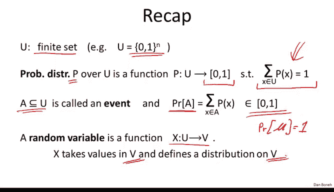
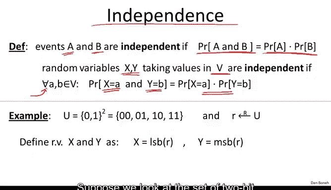
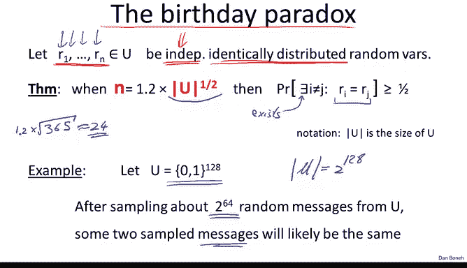
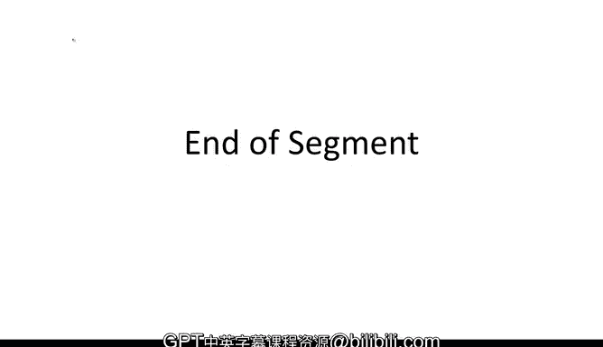

# 005：离散概率速成课程（续）🔢


在本节课中，我们将继续学习离散概率中的几个重要工具。我们将探讨独立性、异或运算的关键性质以及著名的生日悖论。这些概念是理解后续加密系统的基础。

---

## 回顾：离散概率基础

上一节我们介绍了离散概率的基本定义。本节中我们来看看几个更深入的概念。



离散概率总是定义在一个有限集合 **U** 上。对我们而言，**U** 通常是所有 **n** 位二进制字符串的集合，记作 `{0,1}^n`。

概率分布 **P** 是一个函数，它为 **U** 中的每个元素分配一个在区间 `[0,1]` 内的权重，且所有权重之和为 **1**。

**事件** 是 **U** 的一个子集，其概率是该子集中所有元素权重之和。整个全集 **U** 的概率为 **1**。

**随机变量** 是一个从全集 **U** 到另一个集合 **V** 的函数。它本质上在 **V** 上定义了一个概率分布。

---

## 独立性



接下来，我们需要理解独立性的概念。直观地说，如果知道事件 **A** 发生与否，不会影响你对事件 **B** 是否发生的判断，那么这两个事件就是独立的。

以下是独立性的正式定义：

两个事件 **A** 和 **B** 是独立的，当且仅当：
```
P(A ∩ B) = P(A) * P(B)
```
这个公式表明，两个事件同时发生的概率等于它们各自概率的乘积。

同样，对于随机变量，我们说两个随机变量 **X** 和 **Y** 是独立的，如果对于它们取值范围内的所有 **a** 和 **b**，都有：
```
P(X=a ∧ Y=b) = P(X=a) * P(Y=b)
```
这意味着，知道 **X** 的值不会透露任何关于 **Y** 值的信息。

### 一个简单的例子

假设我们从集合 `{00, 01, 10, 11}` 中均匀随机地选择一个元素 **R**。定义两个随机变量：
*   **X** = **R** 的最低有效位（最右边的位）。
*   **Y** = **R** 的最高有效位（最左边的位）。

我们可以验证 **X** 和 **Y** 是独立的。例如：
*   `P(X=0) = 1/2`
*   `P(Y=0) = 1/2`
*   `P(X=0 ∧ Y=0) = P(R=00) = 1/4`

由于 `1/4 = (1/2) * (1/2)`，独立性成立。这相当于抛两次公平的硬币，第一次的结果不影响第二次。

---

## 异或运算的关键性质

在密码学中，异或运算极其重要。首先，我们快速回顾一下异或的定义。

对于单个比特，异或是模 **2** 加法：
```
0 ⊕ 0 = 0
0 ⊕ 1 = 1
1 ⊕ 0 = 1
1 ⊕ 1 = 0
```
对于比特串，我们按位进行异或操作。

异或运算有一个关键性质，使其在密码学中非常有用：

**定理**：设 **Y** 是定义在 `{0,1}^n` 上的任意随机变量（其分布可以是任意的）。设 **X** 是定义在 `{0,1}^n` 上的均匀随机变量，且 **X** 与 **Y** 独立。定义 **Z = X ⊕ Y**。那么，**Z** 也是一个在 `{0,1}^n` 上的均匀随机变量。

换句话说，**用独立的均匀随机值对任意数据进行异或，结果总是均匀随机的**。

### 证明（以 n=1 为例）

设：
*   `P(Y=0) = p0`, `P(Y=1) = p1`，且 `p0 + p1 = 1`。
*   由于 **X** 均匀分布，`P(X=0) = P(X=1) = 1/2`。
*   由于 **X** 与 **Y** 独立，联合概率为各自概率的乘积。

计算 `P(Z=0)`。当 `Z=0` 时，有两种可能：`(X,Y) = (0,0)` 或 `(1,1)`。
```
P(Z=0) = P(X=0 ∧ Y=0) + P(X=1 ∧ Y=1)
       = (p0 * 1/2) + (p1 * 1/2)
       = (p0 + p1) / 2
       = 1 / 2
```
因此，`P(Z=1) = 1 - 1/2 = 1/2`。所以 **Z** 是均匀的。这个性质可以推广到任意长度的比特串。

---


## 生日悖论

最后，我们介绍离散概率中一个著名且实用的现象——生日悖论。

**定理**：从一个大小为 **N** 的集合 **U** 中，独立且随机地选取元素。当我们选取大约 `√N` 个元素时，有很大概率会出现两个相同的元素（即发生碰撞）。

更形式化地说，如果随机选取大约 `1.2 * √N` 个独立样本，那么至少有两个样本相同的概率将超过 **1/2**。

### 为什么叫“悖论”？

传统上，它用生日来举例：一个房间需要有多少人，才能使其中两人生日相同的概率超过50%？
*   一年有 **N = 365** 天。
*   `√365 ≈ 19.1`，`1.2 * 19.1 ≈ 23`。
*   因此，只需要大约 **23-24** 个人，这个概率就会超过一半。这个数字比人们通常直觉认为的要小得多，因此被称为“悖论”。

### 在密码学中的应用示例

假设我们的集合 **U** 是所有 **128** 位字符串的集合，其大小是巨大的 `2^128`。根据生日悖论，如果我们独立随机地采样大约 `2^64` 个消息（因为 `√(2^128) = 2^64`），那么极有可能找到两个相同的消息。这个结论对分析哈希函数等密码学原语的安全性至关重要。

下图展示了碰撞概率随采样数量增长的趋势：在达到 `√N` 附近时，概率迅速上升至接近 **1**。



我们将在后续课程中更详细地讨论生日悖论及其影响。


---

## 总结

本节课中我们一起学习了离散概率的三个核心进阶概念：
1.  **独立性**：事件或随机变量之间互不影响的性质，由概率的乘法规则 `P(A∩B)=P(A)P(B)` 定义。
2.  **异或的完美掩码性质**：`Z = X ⊕ Y`，其中 **X** 是均匀且独立的，则无论 **Y** 的分布如何，**Z** 总是均匀的。这是许多密码方案的基础。
3.  **生日悖论**：从大小为 **N** 的集合中采样约 `√N` 次，碰撞（重复）的概率就很高。这对评估密码系统的安全边界非常重要。



掌握了这些概率论工具后，在下一节中，我们将开始构建我们的第一个加密系统示例。