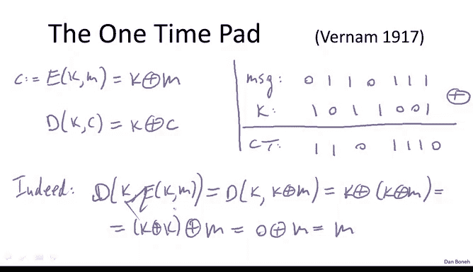
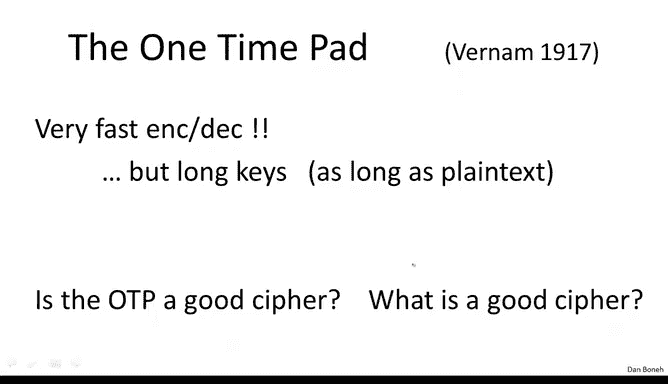
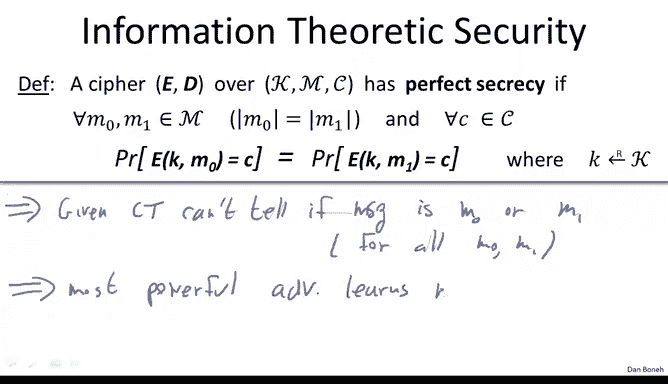
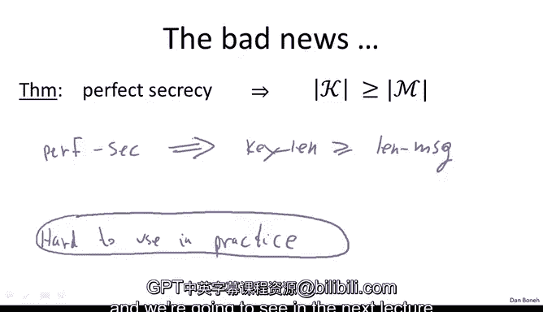

# 006：信息论安全与一次性密码本 🔐

在本节课中，我们将学习密码学中一个核心的安全概念——信息论安全，并深入探讨一个经典的、理论上绝对安全的密码方案：一次性密码本。我们将从精确的密码定义开始，逐步理解完美保密性的含义，并分析一次性密码本为何能达到这种安全级别。

## 密码的定义与构成

上一节我们回顾了几个历史上的密码，它们都已被攻破。现在，我们将转换思路，讨论设计得更好的密码。但在开始之前，我们需要更精确地定义什么是密码。

一个密码实际上由两个算法构成：加密算法和解密算法。更准确地说，一个密码定义在一个三元组之上：
*   **密钥空间** `K`：所有可能密钥的集合。
*   **明文空间** `M`：所有可能消息的集合。
*   **密文空间** `C`：所有可能密文的集合。

这个三元组在某种意义上定义了密码运行的环境。密码本身则是一对高效的算法：
*   **加密算法 `E`**：接收密钥和明文，输出密文。
*   **解密算法 `D`**：接收密钥和密文，输出明文。

这两个算法必须满足一致性要求，即对于明文空间中的任意消息 `m` 和密钥空间中的任意密钥 `k`，以下等式必须成立：
`D(k, E(k, m)) = m`
这个等式被称为一致性方程，是任何密码能够正常解密的基础。

关于“高效”一词，理论研究者通常理解为算法在输入规模上是多项式时间运行的，而实践者则理解为能在特定时间约束（例如一分钟内加密1GB数据）内完成。加密算法 `E` 通常是一个随机化算法，它在加密过程中会为自己生成随机比特。相反，解密算法 `D` 总是确定性的，给定相同的密钥和密文，其输出总是相同的。

## 一次性密码本：一个安全的例子

现在我们已经更好地理解了密码是什么，接下来我们来看第一个安全密码的例子：一次性密码本。它由维纳姆在20世纪初设计。

首先，我们用刚刚学到的术语来描述它：
*   **明文空间 `M`**：所有长度为 `n` 的二进制字符串的集合。
*   **密文空间 `C`**：所有长度为 `n` 的二进制字符串的集合。
*   **密钥空间 `K`**：所有长度为 `n` 的二进制字符串的集合。一个密钥就是一个随机的比特串，其长度与待加密的消息相同。

定义了密码的环境后，我们可以描述其工作原理，它实际上非常简单。

加密过程是，密文 `c` 就是密钥 `k` 与明文 `m` 的异或结果：
`c = E(k, m) = k ⊕ m`
这里，`⊕` 表示按位模2加法（异或运算）。

解密过程是类似的，要解密密文 `c`，只需再次用密钥 `k` 与之异或：
`D(k, c) = k ⊕ c`
我们可以验证其一致性：`D(k, E(k, m)) = k ⊕ (k ⊕ m) = (k ⊕ k) ⊕ m = 0 ⊕ m = m`。这证明了一次性密码本确实是一个合法的密码。

从性能角度看，一次性密码本非常出色，因为它只涉及快速的异或运算。然而，它在实践中很难使用，因为密钥长度必须与消息长度相等。如果通信双方需要安全地传输一个长消息，他们首先需要安全地传输一个同样长的密钥。如果已经有安全传输长密钥的渠道，那么直接用这个渠道传输消息本身可能更简单。因此，密钥过长是其主要问题。

## 完美保密性：香农的定义

既然一次性密码本是一个密码，那么它安全吗？要回答这个问题，我们首先需要定义什么是安全的密码。为了研究密码的安全性，我们需要引入一些信息论的概念。事实上，第一个严格研究密码安全性的人是信息论之父——克劳德·香农。他在1949年发表了一篇著名论文，分析了一次性密码本的安全性。

香农安全定义的核心思想是：如果攻击者只能看到密文，那么他应该对明文一无所知。换句话说，密文不应泄露关于明文的任何信息。这需要形式化地定义“信息”的含义，而这正是香农所做的。

以下是香农的完美保密性定义：
假设我们有一个定义在 `(K, M, C)` 三元组上的密码 `(E, D)`。我们说这个密码具有**完美保密性**，如果对于明文空间 `M` 中任意两个**长度相同**的消息 `m0` 和 `m1`，以及对于密文空间 `C` 中的任意密文 `c`，以下条件成立：
`Pr[ E(k, m0) = c ] = Pr[ E(k, m1) = c ]`
其中，概率来源于密钥 `k` 是从密钥空间 `K` 中**均匀随机**选取的。

这个定义意味着什么？它表明，如果攻击者截获了一个特定的密文 `c`，那么该密文由消息 `m0` 加密而来的概率，与它由消息 `m1` 加密而来的概率**完全相同**。因此，仅凭密文 `c`，攻击者无法判断它到底来自 `m0` 还是 `m1`。由于这个性质对**所有**消息对都成立，攻击者实际上无法从密文中获得关于明文的任何信息。

用一句话概括：对于具有完美保密性的密码，不存在有效的**唯密文攻击**。这意味着，无论攻击者多么强大、计算能力多强，仅通过分析密文，他学不到任何关于明文的内容。

## 一次性密码本的完美保密性证明

理解了完美保密性的含义后，一个自然的问题是：我们能构建具有完美保密性的密码吗？答案是肯定的，而且不必舍近求远——一次性密码本本身就具有完美保密性。这是香农的第一个重要结果，其证明非常简单。

根据定义，对于任意消息 `m` 和密文 `c`，概率 `Pr[ E(k, m) = c ]` 等于将 `m` 映射到 `c` 的密钥数量，除以密钥的总数。即：
`Pr[ E(k, m) = c ] = |{ k in K : E(k, m) = c }| / |K|`
如果对于**所有**消息 `m` 和密文 `c`，分子 `|{ k in K : E(k, m) = c }|` 是一个**常数**，那么对于任意两个消息 `m0` 和 `m1`，以及任意密文 `c`，上述概率将总是相等，从而满足完美保密性的定义。

现在，我们来看一次性密码本的这个数量是多少。问题是：给定一个消息 `m` 和一个密文 `c`，有多少个一次性密码本密钥 `k` 能满足 `E(k, m) = c`，即 `k ⊕ m = c`？

通过简单的代数变换 `k ⊕ m = c` ⇒ `k = m ⊕ c`，我们可以发现，满足条件的密钥 `k` **有且仅有一个**，即 `k = m ⊕ c`。这对于所有 `(m, c)` 对都成立。

因此，对于一次性密码本，`|{ k in K : E(k, m) = c }| = 1` 是一个常数。根据之前的推理，这直接证明了一次性密码本具有**完美保密性**。

这个简单的证明得出了一个强有力的结论：对于一次性密码本，**不存在唯密文攻击**。这与替换密码、维吉尼亚密码或转轮机等历史密码形成了鲜明对比，后者都可以被唯密文攻击攻破。

## 完美保密性的局限与结论

然而，故事并未结束。完美保密性并不意味着一次性密码本就是可以高枕无忧的“安全密码”。我们强调，它只保证了抵抗唯密文攻击的安全性。在实践中，还存在其他类型的攻击（如已知明文攻击、选择明文攻击等），而一次性密码本对这些攻击可能是脆弱的，我们将在后续课程中看到。

此外，一次性密码本的主要问题——密钥过长——在实践中是致命的。香农在证明了一次性密码本具有完美保密性后，还证明了另一个定理：**任何具有完美保密性的密码，其密钥空间的大小必须至少等于其明文空间的大小**。这意味着，密钥的长度至少要和消息的长度一样长。

由于一次性密码本的密钥长度恰好等于消息长度，它在这个意义上是“最优”的完美保密密码。这也意味着，完美保密性是一个要求非常高的概念，它导致了像一次性密码本这样密钥管理极其不便的密码方案。

因此，尽管完美保密性是一个有趣且重要的理论概念，并且一次性密码本的思想非常精妙，但它本身并不直接导向实用的密码系统。在下一讲中，我们将探讨如何借鉴一次性密码本的思路，构建出既安全又实用的现代密码系统。

**本节课总结**：
我们一起学习了密码的正式定义，引入了克劳德·香农提出的**完美保密性**这一核心安全概念。我们深入分析了一次性密码本的工作原理，并证明了它满足完美保密性，从而能够抵抗最强的唯密文攻击。同时，我们也认识到完美保密性要求密钥至少与消息等长，这使得一次性密码本在实践中难以使用，但它所蕴含的“异或”和“一次一密”思想为现代密码学奠定了基础。