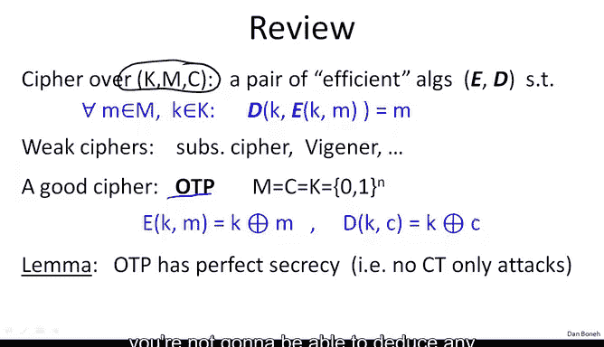
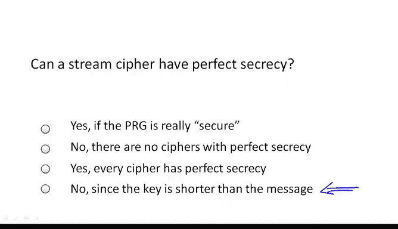
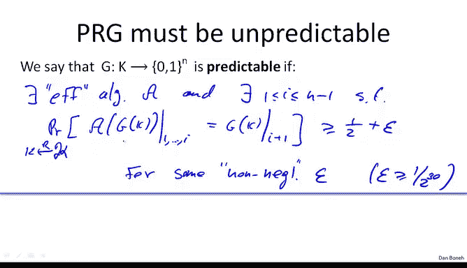
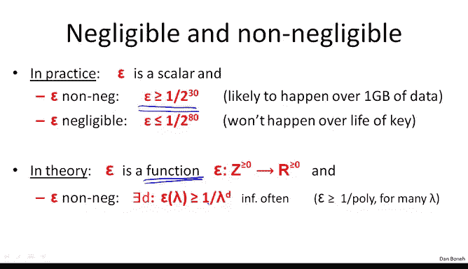
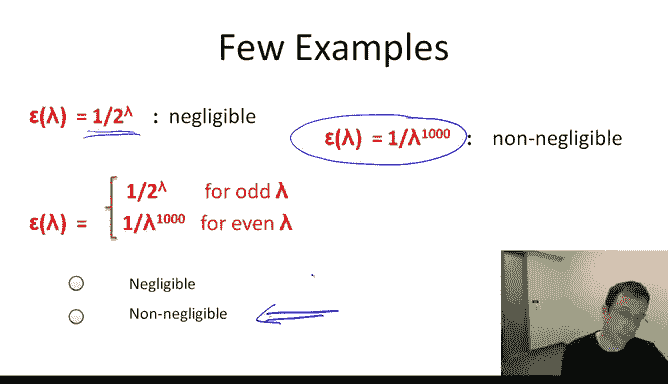

# 007：流密码与伪随机数生成器 🔐

在本节课中，我们将要学习如何将一次性密码本（One-Time Pad）这一理论完美的密码方案，转化为一个更实用的加密方案，即流密码（Stream Cipher）。其核心思想是使用一个短密钥，通过伪随机数生成器（PRG）来生成一个看似随机的长密钥流，从而模拟一次性密码本的效果。

上一节我们介绍了一次性密码本及其完美保密性，但同时也指出了其密钥必须与消息等长的致命缺陷。本节中我们来看看如何通过伪随机数生成器来克服这一缺陷，构建一个实用的流密码。

## 密码学基础回顾

首先，让我们快速回顾一下密码学的基本概念。一个密码方案由三个集合和一个算法对定义：
*   **密钥空间（K）**：所有可能密钥的集合。
*   **明文空间（M）**：所有可能消息的集合。
*   **密文空间（C）**：所有可能密文的集合。

密码方案包含一对高效的算法：
*   **加密算法（E）**：`C = E(K, M)`
*   **解密算法（D）**：`M = D(K, C)`

它们必须满足的基本属性是：解密是加密的逆运算。即对于任意密钥 `K` 和明文 `M`，都有 `D(K, E(K, M)) = M`。

我们之前看到，像替换密码和维吉尼亚密码这样的弱密码都容易被攻破，**绝对不应该**在实际中使用。而一次性密码本则是我们遇到的第一个“好”密码。

## 一次性密码本与完美保密性

一次性密码本定义如下：
*   明文、密文和密钥空间都是所有 `n` 比特字符串的集合：`{0,1}^n`。
*   加密：`C = M ⊕ K` （`⊕` 表示按位异或 XOR 操作）。
*   解密：`M = C ⊕ K`。

一次性密码本具有**完美保密性**：攻击者仅凭单个密文，无法获得关于明文的任何信息。然而，香农证明了一个“坏消息”引理：任何具有完美保密性的密码，其密钥长度必须至少与消息长度相等。这使得一次性密码本在实际中难以应用，因为如果双方能安全交换与消息等长的密钥，他们或许可以直接交换消息本身。

## 流密码的核心思想

为了构建一个实用的方案，我们引入**流密码**。其核心思路是：不再使用一个完全随机的长密钥，而是使用一个短的**种子（Seed）**作为密钥，并通过一个**伪随机数生成器（PRG）** 将其扩展成一个长的、看似随机的比特序列（即密钥流）。

一个伪随机数生成器 `G` 是一个确定性函数：
`G: {0,1}^s → {0,1}^n`
其中 `s` 是种子长度，`n` 是输出长度，且 `n >> s`（`n` 远大于 `s`）。例如，它可以输入一个128比特的种子，输出一个千兆字节长的序列。该函数必须是高效可计算的。

以下是流密码的构建步骤：
1.  **密钥**：一个短的随机种子 `K`（例如128比特）。
2.  **生成密钥流**：使用 PRG 扩展密钥：`G(K)`。
3.  **加密**：像一次性密码本一样，将密钥流与明文进行异或：`C = M ⊕ G(K)`。
4.  **解密**：接收方使用相同的密钥 `K` 生成相同的密钥流，并与密文异或即可恢复明文：`M = C ⊕ G(K)`。

## 流密码的安全性

一个自然的问题是：流密码安全吗？它显然**不具备完美保密性**，因为其密钥长度远小于消息长度。因此，我们需要一个**新的、更实用的安全定义**来评估流密码的安全性（这将在下一讲详细讨论）。流密码的安全性完全依赖于所使用的伪随机数生成器 `G` 的质量。

### 伪随机数生成器的核心属性：不可预测性

对于用于密码学的 PRG，一个最基本的安全属性是**不可预测性**。我们首先看看如果 PRG 是可预测的会有什么后果。

**什么是可预测的 PRG？**
如果一个 PRG 是可预测的，意味着存在一个高效算法 `A` 和某个位置 `i`，使得在给定输出序列的前 `i` 个比特 `G(K)[1...i]` 后，算法 `A` 能够以显著高于 1/2 的概率成功预测出第 `i+1` 个比特 `G(K)[i+1]`。

**为什么可预测性是致命的？**
假设攻击者知道（或能猜到）密文所对应明文的前缀（例如，在电子邮件中，开头通常是“From: ”）。攻击者可以进行以下操作：
1.  截获密文 `C`。
2.  将已知的明文前缀 `M[1...i]` 与密文前缀 `C[1...i]` 异或，得到密钥流的前缀 `G(K)[1...i]`。
3.  利用 PRG 的可预测性，根据密钥流前缀 `G(K)[1...i]` 计算出后续的整个密钥流 `G(K)[i+1...n]`。
4.  使用计算出的完整密钥流解密整个密文，从而获得全部明文。

因此，一个用于流密码的 PRG **必须是不可预测的**。形式化地说，对于所有位置 `i` 和所有高效算法 `A`，给定 `G(K)[1...i]`，算法 `A` 正确预测出 `G(K)[i+1]` 的概率与 1/2 的差值必须是一个**可忽略的量**。

## 切勿使用的弱伪随机数生成器

以下是两个**绝对不应该**用于密码学的 PRG 例子，它们都很容易被预测：

**1. 线性同余生成器（Linear Congruential Generator）**
其状态更新公式为：`R[i] = (A * R[i-1] + B) mod P`
其中 `A, B, P` 是参数，`R[0]` 是种子。每次迭代输出 `R[i]` 的若干低位。尽管它可能具有良好的统计特性，但因其线性结构，给定少量输出就足以预测整个序列。

**2. Glibc 的 `random()` 函数**
这是许多编程语言标准库中实现的随机数生成器，其本质与线性同余生成器类似。它**不是**密码学安全的随机数生成器。历史上，Kerberos 版本4曾因使用 `random()` 函数而遭受攻击。

**重要教训**：永远不要使用标准库中的非加密随机数函数（如 C 语言的 `random()`，Python 的 `random` 模块）来生成加密密钥或密钥流。

## 可忽略与不可忽略函数

在密码学的安全性定义中，我们经常用到“可忽略（Negligible）”和“不可忽略（Non-negligible）”这两个概念来量化攻击成功的概率。

*   **直观理解（实践角度）**：
    *   **不可忽略**：概率大于某个阈值（例如 `1/2^30`，约十亿分之一）。对于处理大量数据（如千兆字节）的加密系统，这个概率的事件很可能发生。
    *   **可忽略**：概率小于某个极小的阈值（例如 `1/2^80`）。在密钥的生命周期内，这种事件几乎不可能发生。

*   **理论定义（更严谨）**：
    我们将概率视为安全参数 `λ` 的函数 `f(λ)`。
    *   **可忽略函数**：对于**任意**多项式 `poly(λ)`（如 `λ^d`），当 `λ` 足够大时，`f(λ) < 1/poly(λ)`。也就是说，`f(λ)` 的衰减速度比任何多项式的倒数都要快。典型的例子是指数衰减函数：`f(λ) = 1/2^λ`。
    *   **不可忽略函数**：存在某个多项式 `poly(λ)`，使得对于无穷多个 `λ`，有 `f(λ) ≥ 1/poly(λ)`。例如，`f(λ) = 1/λ^1000` 虽然衰减很慢，但仍是不可忽略的。

理论定义避免了实践中固定阈值可能带来的问题，为安全性证明提供了更坚实的基础。在本课程中，我们通常将“可忽略”理解为“小于任何多项式倒数”（特别是像指数衰减那样快），将“不可忽略”理解为“大于某个多项式倒数”。

## 总结

本节课中我们一起学习了如何从一次性密码本出发，构建一个更实用的流密码。我们了解到，流密码通过一个短密钥和伪随机数生成器来模拟长随机密钥的效果。其安全性的核心在于 PRG 必须是**不可预测的**。我们看到了两个弱 PRG 的例子，并强调了切勿在密码学中使用它们。最后，我们介绍了用于严格分析安全性的“可忽略”与“不可忽略”函数的概念。

下一讲，我们将引入一个新的安全定义——**选择明文攻击下的不可区分性（IND-CPA）**，来形式化地论证基于一个“好”的 PRG（即下一讲将定义的**伪随机生成器**）构建的流密码是安全的。