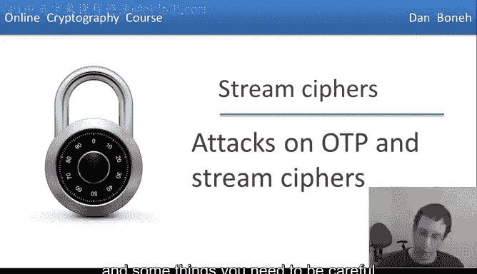
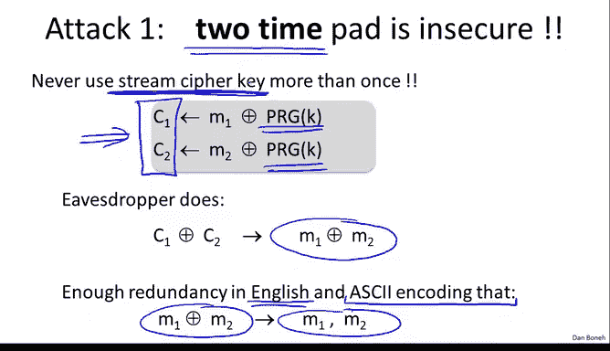
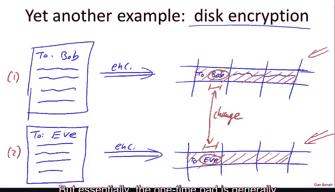
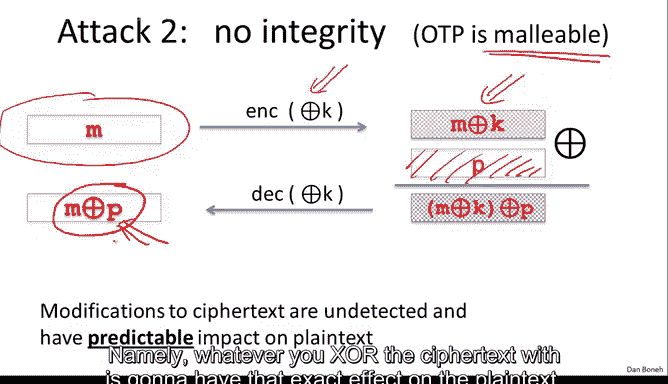
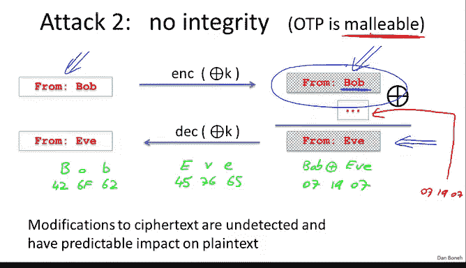

# 008：对流密码和一次性密码本的攻击 🔐

在本节中，我们将探讨对一次性密码本的攻击，以及在使用流密码时需要注意的一些事项。

在开始之前，我们先快速回顾一下之前的内容。

## 回顾：一次性密码本与流密码

回想一下，一次性密码本通过将消息与一个秘密密钥进行异或运算来加密消息，其中秘密密钥的长度与消息相同。解密过程类似，将密文与相同的秘密密钥进行异或运算。当密钥是均匀随机时，我们证明了这种方案具有香农所说的**完美保密性**。

当然，一个问题是密钥长度与消息长度相同，这使得一次性密码本在实际使用中非常困难。

为了使一次性密码本变得实用，我们讨论了使用**伪随机数生成器**的方法，它将一个短种子扩展成一个长得多的消息。流密码的工作原理本质上与一次性密码本相同，但我们不是使用真正的随机密钥流，而是使用由输入到生成器的短密钥扩展而成的、与消息等长的伪随机密钥流。

**公式：** `密文 C = 消息 M ⊕ 伪随机密钥流 G(K)`

我们提到，安全性不再依赖于完美保密性，因为流密码无法实现完美保密。相反，安全性依赖于伪随机数生成器的特性。我们说过，伪随机数生成器本质上需要是**不可预测的**。但实际上，这个定义有点难以处理，我们将在后续章节中看到一个更好的伪随机数生成器安全性定义。

## 攻击一：两次密码本攻击

在本节中，我们将讨论对一次性密码本的攻击。第一个要讨论的攻击叫做**两次密码本攻击**。

请记住，一次性密码本之所以叫“一次性”，是因为密钥流只能用于加密**一条**消息。我们将展示，如果相同的密钥流被用于加密多条消息，那么安全性将荡然无存，窃听者基本上可以完全解密加密的消息。

让我们看一个例子。假设有两条消息 M1 和 M2 使用相同的密钥流 K 进行加密。

**公式：**
`C1 = M1 ⊕ K`
`C2 = M2 ⊕ K`

假设窃听者截获了 C1 和 C2。他自然会计算 C1 和 C2 的异或值。当他计算这个异或值时，会得到什么？

**公式：** `C1 ⊕ C2 = (M1 ⊕ K) ⊕ (M2 ⊕ K) = M1 ⊕ M2`

可以看到，密钥流 K 被抵消了，剩下的就是两条明文消息的异或值。事实证明，英语（以及ASCII编码）具有足够的冗余度，以至于给定两条ASCII编码消息的异或值，你实际上可以完全恢复出这两条原始消息。

因此，这里的教训是：如果你曾经使用相同的密钥流加密多条消息，那么截获密文的攻击者基本上可以不费吹灰之力恢复原始明文。所以，流密码的密钥或一次性密码本的密钥**绝对、永远、永远不要使用超过一次**。

### 实践中的例子

在实践中，重复使用流密码密钥或一次性密码本密钥是一个非常常见的错误。让我们看一些例子，以便你在构建自己的系统时避免这些错误。

以下是几个历史案例：

*   **历史案例：维农纳计划**：在20世纪40年代初，俄罗斯人使用一次性密码本加密各种消息。不幸的是，他们使用的密钥流是由人掷骰子生成的。由于生成这些密钥流很费力，他们觉得只用一次很浪费，于是最终用同一个密钥流加密了多条消息。美国情报机构能够截获这些“两次密码本”密文，并在几年内解密了大约3000条明文。这个项目被称为“维农纳计划”，这是一个因两次密码本不安全而导致的密码分析的精彩故事。
*   **网络协议案例：点对点隧道协议**：在Windows的一个名为点对点隧道协议的协议中，客户端和服务器共享一个密钥K。问题在于，从客户端到服务器的所有消息被视为一个长流，并使用密钥K加密；同样，从服务器到客户端的消息也被视为一个长流，但不幸的是，也使用了**相同的**伪随机种子（即相同的流密码密钥）。这实际上导致了两次密码本攻击。这里的教训是：**永远不要使用同一个密钥来加密双向流量**。实际上，你需要一个密钥用于客户端到服务器的交互，另一个不同的密钥用于服务器到客户端的交互。
*   **Wi-Fi通信案例：WEP协议**：原始的802.11b加密层称为WEP，它是一个设计非常糟糕的协议。在WEP中，客户端和接入点共享一个长期密钥K。为了加密一个帧（包含明文M），客户端首先计算一个校验和，然后使用流密码加密，其密钥是IV（一个24位字符串）与K的拼接。IV随每个数据包递增，并以明文形式与密文一起发送。这里的问题是IV只有24位长，这意味着在传输了1600万个帧后，IV必然会循环。一旦IV重复，相同的密钥（IV拼接K）就会被用来加密两个不同的帧，攻击者就可以恢复两个帧的明文。更糟糕的是，许多802.11卡在重启后IV会重置为零，导致每次重启后都会多次使用“零拼接K”这个密钥。此外，WEP使用的伪随机数生成器RC4，在面对这种紧密相关的密钥（所有密钥都有104位相同的后缀）时并不安全。攻击表明，监听大约4万个帧就足以恢复秘密密钥K。因此，WEP几乎不提供任何安全性。

那么，WEP的设计者应该怎么做呢？一种方法是**将整个交互视为一个长流**，使用伪随机数生成器生成一个长密钥流，然后分段用于加密每个帧。或者，如果他们坚持为每个帧使用不同的密钥，更好的方法是使用一个PRG：用长期密钥K通过PRG生成一个长的随机比特流，然后将其分段作为每个帧的加密密钥。这样，每个帧的密钥看起来都是随机的，彼此之间没有关联。

### 磁盘加密中的两次密码本

另一个例子出现在磁盘加密中。假设一个文件被分成块，每个块使用流密码加密后存储在磁盘上。如果用户后来编辑了文件（例如，将“致Bob”改为“致Eve”）并重新保存，那么只有被修改的块会发生变化。攻击者对比编辑前后的磁盘快照，即使不知道内容，也能**精确定位到发生更改的位置**。这泄露了攻击者本不应知道的信息。

这本质上是另一种两次密码本攻击，因为相同的密钥流被用来加密两个非常相似但不同的消息。攻击者可以了解到更改是什么，甚至可能推断出更改的具体内容。

因此，这里的教训是：通常**不建议使用流密码进行磁盘加密**。我们需要为磁盘加密做一些不同的事情，这将在后面的章节中讨论。

### 小结两次密码本攻击

总而言之，我希望我已经让你相信，**绝对不要多次使用流密码密钥**。即使在自然场景下可能发生，你也必须小心确保不会重复使用同一个密钥。

*   对于网络流量，通常每个会话应有自己的密钥。在会话内，从客户端到服务器的消息被视为一个完整的流，使用一个密钥加密；从服务器到客户端的消息被视为另一个流，使用另一个不同的密钥加密。
*   对于磁盘加密，通常不应使用流密码，因为对文件的修改会泄露文件内容的信息。

## 攻击二：可延展性与完整性缺失

接下来要提到的攻击是：一次性密码本和流密码**根本不提供完整性**。它们只在密钥只使用一次时试图提供保密性，但完全不提供完整性。更糟糕的是，实际上很容易修改密文，并对相应的明文产生已知的影响。这个特性被称为**可延展性**。

让我解释一下这是什么意思。假设我们有一条消息M，使用流密码加密得到密文 `C = M ⊕ K`。攻击者截获了密文C。虽然他无法得知明文是什么，但他可以成为一个主动攻击者并修改密文。假设他将密文与某个扰动值P进行异或。

**公式：** `C' = C ⊕ P = (M ⊕ K) ⊕ P`

那么，当我们解密这个修改后的密文C‘时，会得到什么？

**公式：** `解密(C') = C' ⊕ K = (M ⊕ K ⊕ P) ⊕ K = M ⊕ P`

可以看到，通过与扰动值P进行异或，攻击者能够对解密后的明文产生非常具体的影响。总结一下：你可以修改密文，这些修改是**无法被检测到的**，更糟糕的是，它们对结果明文有非常具体的影响——你对密文异或了什么，就会对明文产生完全相同的效果。

### 一个危险示例

假设用户发送了一封以“From Bob”开头的电子邮件。攻击者截获了对应的密文。假设攻击者知道（或猜测）消息来自Bob，但他想修改密文，使明文看起来像是来自Eve。他需要做的就是在密文的相应位置异或一个特定的三字符序列。

具体来说，“Bob”的ASCII编码是 `42 6F 62`（十六进制），“Eve”的编码是 `45 76 65`。计算 `Bob ⊕ Eve` 得到 `07 19 07`。因此，攻击者只需将这三个字节 `07 19 07` 异或到密文“From Bob”中“Bob”对应的位置，解密后的明文就会变成“From Eve”。

这是一个例子，说明对密文产生可预测的影响实际上会导致相当多的问题。这种特性被称为可延展性。我们说一次性密码本是可延展的，因为很容易对密文进行计算，并对相应的明文做出规定的更改。

为了防止所有这些，我们将在后续课程中展示如何为加密机制添加完整性。但现在，我希望你记住，一次性密码本本身**没有完整性**，并且对于实际修改密文的攻击者来说**完全不安全**。

## 本节总结

在本节课中，我们一起学习了：

1.  **两次密码本攻击**：重复使用流密码密钥是灾难性的，会导致明文完全泄露。我们通过历史案例（维农纳计划）、网络协议（PPTP、WEP）和磁盘加密的例子，看到了这种攻击在实践中的多种表现形式。核心教训是：**永远不要重复使用流密码密钥**，并为双向通信使用不同的密钥。
2.  **可延展性与完整性缺失**：流密码和一次性密码本不提供任何完整性保护。攻击者可以修改密文，并精确控制其对解密明文的影响（例如，将“From Bob”改为“From Eve”）。这种**可延展性**是一个严重的安全缺陷。

记住，虽然流密码在提供保密性方面有其作用，但必须谨慎使用，避免密钥重用，并且通常需要与其他机制结合以提供完整性和认证。