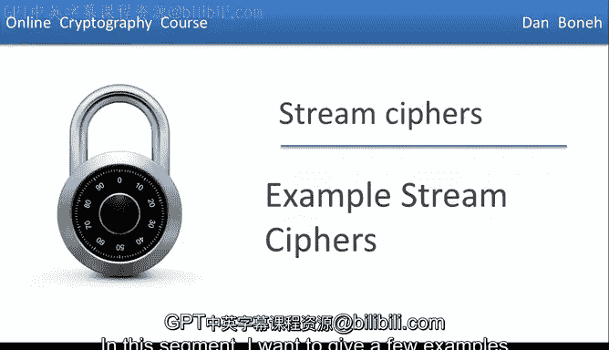
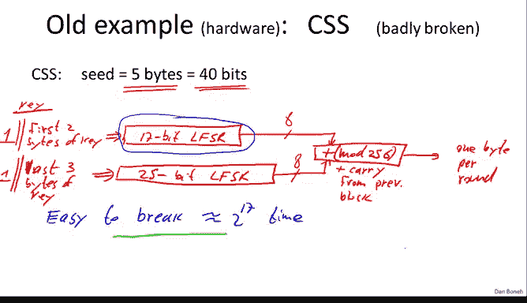

# 009：现实世界中的流密码 🔐



在本节课中，我们将学习几种实际应用中使用的流密码。我们将从两个不应在新系统中使用但仍被广泛使用的旧例子开始，分析它们的弱点。接着，我们将介绍一个更现代的、来自 eSTREAM 项目的安全流密码示例，并了解其工作原理和性能优势。

## 旧式流密码示例 🕰️

上一节我们讨论了流密码的基本概念，本节中我们来看看两个历史上重要但存在安全缺陷的流密码：RC4 和 CSS。

### RC4 流密码

RC4 设计于 1987 年，它接受一个可变长度的种子（例如 128 位）作为密钥。其工作原理是先将密钥扩展为 2048 字节的内部状态，然后通过一个简单的循环迭代，每次输出一个字节。

尽管 RC4 曾相当流行，例如在 HTTPS 协议和 WEP 中使用，但现已发现多个弱点，不推荐在新项目中使用。


以下是 RC4 的两个已知弱点：

*   **初始字节偏差**：RC4 输出的前几个字节（尤其是第二个字节）存在统计偏差。例如，第二个字节为 0 的概率是 `2/256`，而非理想的 `1/256`。因此，建议在使用时丢弃前 256 个字节的输出。
*   **长输出序列偏差**：在生成了数 GB 的数据后，输出中连续两个零字节 `(0,0)` 出现的频率略高于随机序列的预期值 `1/(256^2)`，这为攻击者提供了区分其输出与真随机序列的可能。

此外，RC4 还存在相关密钥攻击等弱点。

### CSS（内容扰乱系统）流密码

CSS 是一种用于加密 DVD 电影的流密码，它基于硬件设计者偏爱的**线性反馈移位寄存器（LFSR）**。LFSR 是一个包含多个比特单元的寄存器，通过特定“抽头”位置的比特进行异或运算，来生成新的比特并移位。

CSS 使用两个 LFSR（一个 17 位，一个 25 位），其 40 位密钥被分割用于初始化这两个寄存器。两个 LFSR 每运行 8 个周期产生 8 比特输出，通过一个模 256 加法器合并，产生最终的密钥流字节。



然而，CSS 存在严重的安全漏洞，可以在大约 `2^17` 次操作内被破解。攻击原理如下：

1.  由于 DVD 文件格式（MPEG）已知，攻击者可能知道密文前 20 字节对应的明文。
2.  将密文与已知明文异或，即可得到 CSS 生成的前 20 字节密钥流。
3.  遍历所有 `2^17` 种可能的 17 位 LFSR 初始状态。对于每一种猜测：
    *   运行该 LFSR 生成 20 字节输出。
    *   用已知的 20 字节密钥流减去（模 256）猜测的 LFSR 输出，得到候选的 25 位 LFSR 输出。
    *   检查这个候选输出序列是否可能来自一个 25 位的 LFSR。如果不是，则当前猜测错误；如果是，则找到了正确的两个 LFSR 初始状态，从而可以解密整个电影。

目前已有许多开源工具利用此方法解密 CSS 加密的 DVD。

## 现代流密码示例 🚀

现在我们已经看到了两个脆弱的例子，让我们转向更好的示例。现代伪随机数生成器的一个重要来源是 **eSTREAM 项目**（于 2008 年结束），它评选出了多个安全的流密码。

这些现代流密码的参数与我们之前熟悉的略有不同。它们不仅有一个种子（密钥 `K`），还有一个称为 **Nonce（一次性数值）** 的输入 `R`。PRG 的输出长度远大于种子和 Nonce 的长度。


引入 Nonce 的关键在于：**只要密钥 `K` 不变，Nonce `R` 必须永不重复**。这样，每一对 `(K, R)` 都是唯一的。这使得我们可以在不同会话中安全地**重用同一个密钥**，而无需每次都更换新密钥，只要确保每次加密使用的 Nonce 不同即可。

### Salsa20 流密码

我想展示的 eSTREAM 具体示例是 **Salsa20**。它设计用于软件和硬件实现，支持 128 位或 256 位密钥。这里以 128 位密钥版本为例，它还需要一个 64 位的 Nonce。

Salsa20 通过一个核心函数 `H` 来生成任意长度的密钥流。函数 `H` 接收三个输入：密钥 `K`、Nonce `R` 和一个从 0 开始递增的计数器 `i`。通过不断递增 `i` 并计算 `H(K, R, i)`，就可以得到连续的密钥流块。

函数 `H` 的具体构造如下：
1.  **状态扩展**：将 16 字节的密钥 `K`、8 字节的 Nonce `R` 和 8 字节的计数器 `i`，与一些预定义的 4 字节常量 `T0, T1, T2, T3` 按特定顺序拼接，形成一个 64 字节的块。
    ```
    状态块 = T0 || K || T1 || R || i || T2 || K || T3
    ```
2.  **核心置换**：对这个 64 字节的状态块应用一个名为 **`h`** 的可逆函数（即给定输出能算出输入）。这个函数专为高效设计，在 x86 架构上能利用 SSE2 指令集高速运行。此置换过程重复进行 **10 轮**。
3.  **最终输出**：将第 10 轮置换后的输出与最初的 64 字节状态块进行逐字（word）加法（而非异或），得到最终的 64 字节输出块，这就是函数 `H` 的结果。


通过这种方式，Salsa20 能快速产生看似随机的密钥流。目前没有已知的重大攻击能有效威胁其安全，其安全性接近 `2^128` 的强度。

在性能方面，以一台 2.2 GHz 的 x86 机器为例，RC4 的加密速度较慢，而像 Salsa20 这样的 eSTREAM 决赛算法可以达到每秒数百兆字节的加密速度，足以满足高清视频流等高性能需求。

## 总结 📝

本节课中我们一起学习了现实世界中的流密码。
*   我们首先分析了两个旧式流密码 **RC4** 和 **CSS**，了解了它们的工作原理以及导致其不安全的偏差、相关密钥攻击和基于 LFSR 的快速破解方法。
*   接着，我们引入了现代流密码设计，重点介绍了 **eSTREAM 项目** 和其中的 **Salsa20** 算法。现代流密码通过引入 **Nonce** 实现了密钥的安全重用，其设计兼顾了软件和硬件效率。
*   Salsa20 通过扩展状态、多轮可逆核心置换和最终加法的步骤，构建了一个快速且安全的伪随机数生成器。


因此，如果你需要在项目中使用流密码，应当选择像 Salsa20 这样的现代、经过严格评估的算法，并确保正确使用 Nonce 来保证安全性。