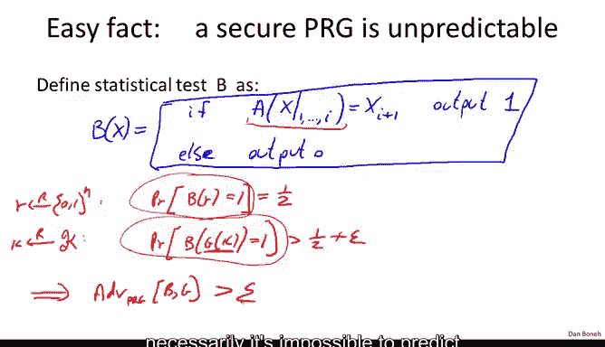
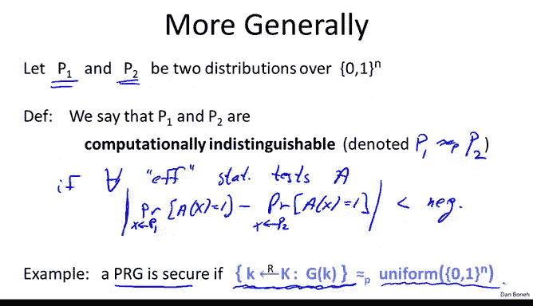

# 010：伪随机数生成器的安全定义

在本节课中，我们将学习伪随机数生成器的核心安全定义。我们将理解如何形式化地定义“一个生成器的输出看起来像随机数”，并探讨该定义的重要应用和含义。

## 统计测试的概念

为了理解如何定义“与随机数不可区分”，我们需要引入统计测试的概念。

统计测试是一个算法，它接收一个n比特的字符串作为输入，并输出0或1。我们将0解释为“输入看起来不随机”，将1解释为“输入看起来随机”。

以下是几个统计测试的例子：

*   **测试1：** 如果输入字符串中0的数量与1的数量之差小于 `10 * sqrt(n)`，则输出1（认为随机），否则输出0。
*   **测试2：** 如果输入字符串中连续“00”模式的数量与 `n/4` 的差小于 `10 * sqrt(n)`，则输出1，否则输出0。
*   **测试3：** 如果输入字符串中最长的连续0序列的长度小于 `10 * log(n)`，则输出1，否则输出0。

统计测试可以执行任何它认为合适的检查，它们不一定是完美的。过去，人们通过一组固定的统计测试来评估生成器的好坏，但这对于密码学安全来说并不是一个好的定义。

## 优势：衡量统计测试的能力

为了评估一个统计测试的好坏，我们定义“优势”的概念。

对于一个输出n比特字符串的生成器G和一个统计测试A，其优势 `Adv_PRG[A, G]` 定义如下：

`Adv_PRG[A, G] = | Pr[ A(G(k)) = 1 ] - Pr[ A(r) = 1 ] |`

其中：
*   `k` 是从密钥空间中均匀随机选取的。
*   `r` 是从 `{0,1}^n` 中均匀随机选取的。

这个优势值在区间 `[0, 1]` 内。

*   **优势接近1：** 意味着测试A在区分伪随机输出和真随机输出方面表现得非常不同，即它成功“攻破”了生成器G。
*   **优势接近0：** 意味着测试A在伪随机输入和真随机输入上的行为几乎相同，即它无法区分生成器G的输出。

让我们看两个例子：

1.  **无用的测试：** 测试A总是输出0。那么 `Pr[A(...)=1]` 总是0，因此优势为0。它无法区分任何东西。
2.  **有缺陷的生成器：** 假设生成器G有三分之二的密钥会使输出字符串的最高有效位（第一个比特）为1。我们设计测试A：如果输入字符串的第一个比特是1，则输出1（认为随机）；否则输出0。
    *   对于伪随机输入 `G(k)`，测试输出1的概率是 `2/3`。
    *   对于真随机输入 `r`，测试输出1的概率是 `1/2`。
    *   因此，优势 `|2/3 - 1/2| = 1/6`。这是一个不可忽略的优势，表明测试A成功区分了G的输出，因此G是不安全的。

## 安全PRG的定义

现在我们可以定义什么是安全的伪随机数生成器。

我们说一个生成器G是安全的，如果**所有高效的**统计测试都无法以显著的优势区分其输出与真随机数。

形式化地说：对于所有高效的统计测试A，其优势 `Adv_PRG[A, G]` 都是可忽略的（即非常接近0）。

这是一个优雅而强大的定义：安全意味着生成器能通过**所有可能**的高效统计测试的检验，而不仅仅是一组预设的测试。

**重要说明：** 将测试限制为“高效的”是必要的。如果要求所有（包括计算能力无限的）测试都无法区分，那么这个定义将无法被满足（这是一个有趣的思考题）。此外，目前我们无法在标准计算复杂性假设（如P≠NP）之外，“证明”某个具体的生成器是安全的。但我们有许多经过深入分析、被认为是安全的启发式候选方案。

## 安全性与不可预测性的关系

上一节我们介绍了生成器的不可预测性。现在我们来探讨安全PRG定义的一个重要含义：**一个安全的PRG必然是下一比特不可预测的。**

我们将通过证明其逆否命题来展示这一点：**如果一个生成器是可预测的，那么它必然是不安全的（即可区分的）。**

证明思路如下：
1.  假设存在一个高效的预测器算法A，给定生成器输出的前 `i` 个比特，它能以 `1/2 + ε` 的概率（`ε` 不可忽略）成功预测第 `i+1` 个比特。
2.  我们可以利用这个预测器A来构造一个统计测试B：
    *   输入：一个n比特字符串 `x`。
    *   操作：运行预测器A，输入 `x` 的前 `i` 个比特，得到它对第 `i+1` 个比特的预测值。
    *   输出：如果A的预测值等于 `x` 的实际第 `i+1` 个比特，则B输出1；否则输出0。
3.  分析测试B的优势：
    *   当输入是真随机字符串 `r` 时，第 `i+1` 比特与前 `i` 比特独立，因此A只能随机猜测，B输出1的概率是 `1/2`。
    *   当输入是伪随机字符串 `G(k)` 时，根据假设，A能以 `1/2 + ε` 的概率预测成功，因此B输出1的概率至少是 `1/2 + ε`。
4.  因此，测试B的优势至少是 `ε`，这是一个不可忽略的值。所以B是一个能成功区分生成器G的统计测试，故G不安全。

由此，我们证明了：安全性 ⇒ 不可预测性。

## 姚期智定理：不可预测性意味着安全性

一个非常卓越的定理（姚期智，1982）指出，上述关系的逆命题也成立：**如果一个生成器对所有位置都是下一比特不可预测的，那么它就是一个安全的PRG。**

定理更精确的表述：如果对于所有位置 `i`，给定生成器输出的前 `i` 个比特，任何高效算法都无法以显著优势预测第 `i+1` 个比特，那么这个生成器就是安全的。

这个定理的证明虽然不在此详述，但其思想非常精妙。它意味着“下一比特预测器”在区分伪随机与真随机方面具有某种“普适性”：如果你无法构建任何下一比特预测器，那么你也无法构建任何类型的区分器。

**定理的一个简单应用：**
假设有一个生成器G，根据其输出的**最后** `n/2` 个比特，可以轻松计算出其**前** `n/2` 个比特。这是否意味着G是可预测的？
根据姚定理，我们可以推理：既然存在一个算法能从后半部分推出前半部分，那么很容易构造一个统计测试来区分G的输出（例如，检查这个关系是否成立）。因此G不是安全的。根据姚定理，G不安全意味着G一定是可预测的（即存在某个位置 `i`，可以从前 `i` 比特预测第 `i+1` 比特）。尽管我们可能无法直接指出这个预测器是什么，但定理保证了它的存在。

## 推广：计算不可区分性

最后，我们将“与均匀分布不可区分”的概念推广到更一般的“两个分布之间不可区分”。

设 `P1` 和 `P2` 是两个概率分布。如果对于所有高效的统计测试A，以下优势可忽略：
`| Pr[ A(sample from P1) = 1 ] - Pr[ A(sample from P2) = 1 ] |`
那么我们就称分布 `P1` 和 `P2` 是**计算不可区分的**，记作 `P1 ≈_p P2`。

使用这个简洁的记号，安全PRG的定义可以优雅地表示为：
`{ G(k) | k ← K } ≈_p Uniform({0,1}^n)`
即，由G生成的伪随机分布与均匀分布在计算上是不可区分的。

这个记号非常有用，在下一节定义加密方案的安全性时，我们将会用到它。

## 总结

本节课我们一起学习了伪随机数生成器的核心安全定义。
1.  我们引入了**统计测试**和**优势**的概念，用于量化一个测试区分两个分布的能力。
2.  我们给出了**安全PRG的形式化定义**：所有高效的统计测试都无法以显著优势区分其输出与真随机数。
3.  我们探讨了安全性与**不可预测性**的等价关系（由姚期智定理证明）：一个PRG是安全的，当且仅当它是下一比特不可预测的。
4.  最后，我们推广了概念，引入了**计算不可区分性**的记号，为后续学习更复杂的密码学原语的安全性定义打下了基础。

理解这个定义是理解现代密码学如何形式化“安全”概念的基石。在接下来的课程中，我们将看到这个定义如何应用于构建安全的加密方案。