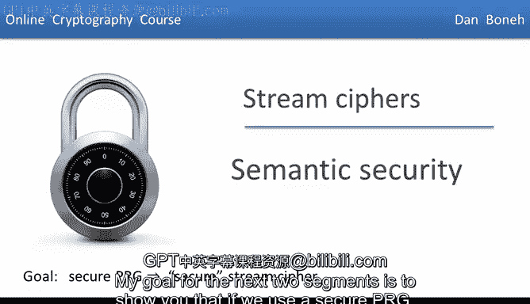
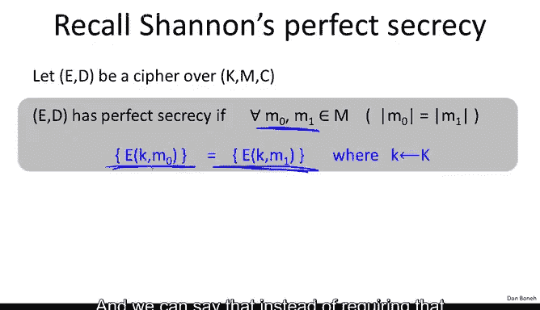
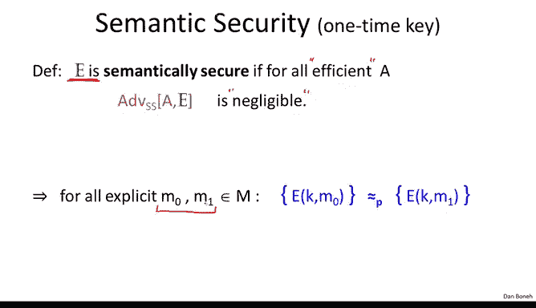

# 011：语义安全

在本节课中，我们将要学习流密码安全性的核心定义——语义安全。我们将探讨为什么简单的安全定义（如无法恢复密钥或明文）是不够的，并最终引入一个严谨且实用的安全定义。

## 定义流密码的安全性

上一节我们介绍了伪随机生成器（PRG）。本节中我们来看看如何定义流密码的安全性。每当定义安全性时，我们总是基于攻击者的能力和目标来考虑。对于流密码，它们仅与一次性密钥一起使用，因此攻击者最多只能看到一个用该密钥加密的密文。目前，我们只允许攻击者获得一个密文。

我们想定义密码安全意味着什么。首先想到的定义可能是：攻击者无法恢复密钥。但这一定义很糟糕。考虑以下“绝妙”的密码：加密算法 `E(K, M) = M`。给定密文（即明文本身），攻击者确实无法恢复密钥，但这个密码显然不安全。因此，仅以无法恢复密钥来定义安全是不行的。

接下来可以尝试定义：攻击者难以恢复整个明文。但这也不奏效。考虑以下加密方案：它处理两个消息 `M0` 和 `M1` 的拼接 `M0 || M1`。加密算法输出 `M0`（明文）拼接上 `M1` 的一次性密码本加密结果。攻击者获得一个密文后，由于 `M1` 是用一次性密码本加密的，他无法恢复 `M1`，因此无法恢复整个明文。但这个方案显然不安全，因为它泄露了一半的明文 `M0`。所以，即使无法恢复全部明文，能恢复大部分明文也是不安全的。

## 从完美保密到计算安全性

我们已知香农的解决方案：完美保密。香农的理念是，攻击者截获密文后，不应获得关于明文的任何信息，哪怕是一个比特。完美保密的定义是：对于任意两个等长的消息 `M0` 和 `M1`，用随机密钥加密 `M0` 产生的密文分布，与加密 `M1` 产生的密文分布完全相同。这意味着攻击者无法区分密文来自哪个消息。

然而，这个定义太强，要求密钥长度至少与消息一样长，这对于短密钥的流密码是无法实现的。因此，我们需要弱化这个定义。

借鉴上一节关于伪随机生成器的思路，我们可以不要求两个分布完全相同，而只要求它们在计算上不可区分。即，一个高效的攻击者无法区分来自这两个分布的样本。但这一定义仍然有点太强，无法被满足。我们需要增加一个约束：这个定义不需要对所有 `M0` 和 `M1` 都成立，只需要对攻击者能够实际给出的那对 `M0` 和 `M1` 成立即可。

## 语义安全的定义

这引导我们得出语义安全的定义（针对一次性密钥场景）。我们通过定义两个实验来阐述。

我们定义实验 `Exp(b)`，其中 `b` 可以是 0 或 1。实验过程如下：
1.  挑战者随机选择一个密钥 `K`。
2.  攻击者 `A` 输出两个等长的消息 `M0` 和 `M1`。
3.  挑战者计算密文 `C ← E(K, Mb)` 并将其发送给攻击者 `A`。
4.  攻击者 `A` 输出一个猜测比特 `b'`。

定义事件 `W_b` 为在实验 `Exp(b)` 中，攻击者输出 1（即 `b' = 1`）的事件。攻击者 `A` 对抗加密方案 `E` 的语义安全优势定义为：
`Adv_SS[A, E] = | Pr[W_0] - Pr[W_1] |`

这个优势值介于 0 和 1 之间。如果优势值接近 0，意味着攻击者无法区分实验 0 和实验 1（即无法区分 `M0` 和 `M1` 的加密）。如果优势值接近 1，则意味着攻击者能很好地区分。

最终定义：一个对称加密方案是语义安全的，如果对于所有“高效的”攻击者 `A`，其优势 `Adv_SS[A, E]` 都是可忽略的。

## 语义安全意味着什么

这个定义非常优雅。让我们通过一些例子来理解其含义。

**例子1：泄露最低有效位的方案**
假设存在一个不安全的加密方案，攻击者 `A` 总能从密文中推导出明文的最低有效位（LSB）。我们将展示这个方案不是语义安全的。

我们构造一个语义安全攻击者 `B` 来利用 `A`：
1.  `B` 输出两个消息 `M0` 和 `M1`，使得 `LSB(M0) = 0`，`LSB(M1) = 1`。
2.  收到挑战密文 `C` 后，`B` 将其转发给 `A`。
3.  `A` 分析 `C` 并输出其推断的明文 LSB 值 `b‘`。
4.  `B` 直接输出 `b‘` 作为自己的猜测。

分析优势：
*   在实验0（加密 `M0`）中，`A` 总是输出 0，因此 `B` 输出 1 的概率 `Pr[W_0] = 0`。
*   在实验1（加密 `M1`）中，`A` 总是输出 1，因此 `B` 输出 1 的概率 `Pr[W_1] = 1`。
*   优势 `Adv = |0 - 1| = 1`。

这表明攻击者 `B` 完全打破了系统的语义安全。这个论证不仅适用于 LSB，也适用于明文的任何谓词（如最高有效位、所有比特的异或值等）。因此，**如果密码是语义安全的，那么对于高效攻击者而言，明文的任何单比特信息都不会被泄露**。这实质上是“完美保密”概念在计算能力受限攻击者下的版本。

**例子2：一次性密码本**
一次性密码本（OTP）是语义安全的吗？是的，事实上它满足更强的完美保密。原因在于，对于任何 `M0` 和 `M1`，密文 `C = K ⊕ Mb`（`K` 是均匀随机密钥）的分布都是均匀随机分布，与 `Mb` 无关。因此，在两个实验中，攻击者收到的输入分布完全相同，其行为不会有差异，优势 `Adv = 0`。一次性密码本甚至对计算能力无限制的攻击者也是语义安全的。

## 总结

本节课中我们一起学习了语义安全，这是定义流密码安全性的核心概念。我们了解到：
1.  简单的安全定义（如无法恢复密钥或完整明文）存在缺陷。
2.  香农的完美保密定义太强，不适用于短密钥密码。
3.  语义安全通过一个交互实验来定义，要求没有高效攻击者能够区分任意一对自选明文的加密结果。
4.  语义安全意味着密文不会泄露明文任何比特的信息给高效攻击者。
5.  一次性密码本满足语义安全（甚至是完美保密）。

下一节，我们将证明：如果使用一个安全的伪随机生成器（PRG），那么构造出的流密码也是语义安全的。