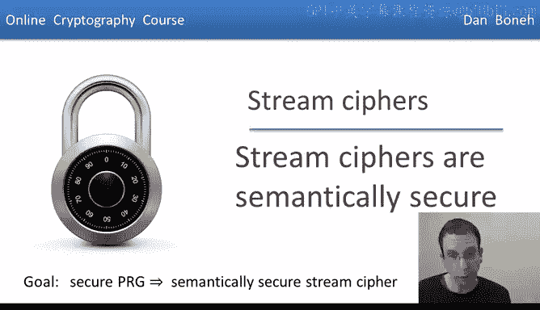
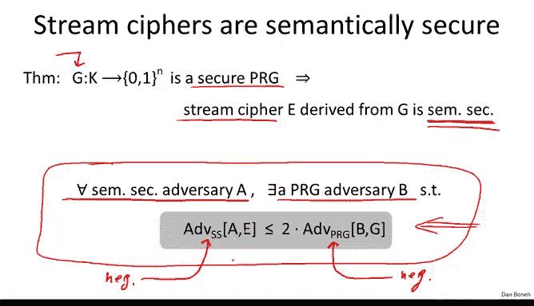
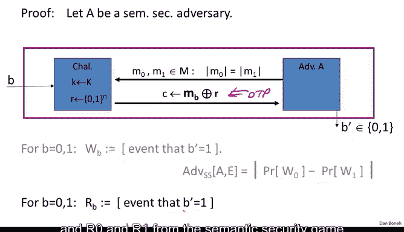
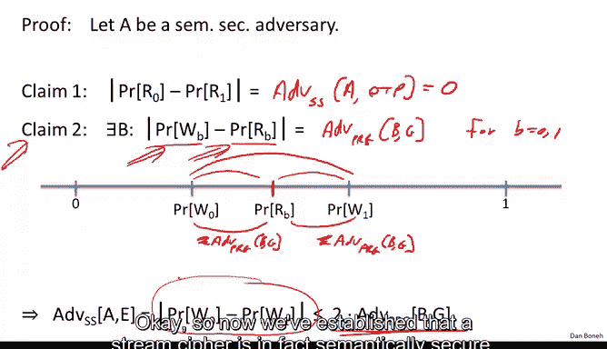

# 012：流密码的语义安全性证明 🛡️



在本节课中，我们将学习如何证明一个基于安全伪随机数生成器（PRG）的流密码是语义安全的。我们将通过构建一个严谨的证明来展示这一点，这是密码学中一个重要的概念验证。

## 概述

上一节我们介绍了安全PRG和语义安全的概念。本节中，我们将看到如何利用安全PRG来证明流密码的语义安全性。这是一个直接的证明过程，我们将逐步解析。

## 定理陈述

给定一个安全的伪随机数生成器 **G**，由该生成器派生的流密码是语义安全的。需要强调的是，我们无法针对香农的“完美保密”概念证明类似的定理，因为流密码的密钥长度小于消息长度，而完美保密要求密钥长度至少等于消息长度。因此，这个证明是语义安全概念实用性的一个重要例证。

## 证明思路

我们将通过证明其逆否命题来完成证明。具体思路如下：



假设存在一个针对流密码的语义安全攻击者 **A**。我们将基于 **A** 构建一个针对PRG **G** 的攻击者 **B**，并满足以下不等式关系：

`Advantage(A) ≤ 2 * Advantage(B)`

由于 **G** 是安全的，任何高效攻击者 **B** 的优势都是可忽略的。因此，**A** 的优势也必须是可忽略的，从而证明流密码是语义安全的。

## 证明过程

### 第一步：定义攻击者A的游戏

首先，我们有一个针对流密码 **E** 的语义安全攻击者 **A**。在标准语义安全游戏中：
1.  挑战者随机选择一个密钥 **K**。
2.  攻击者 **A** 输出两个等长的消息 **M₀** 和 **M₁**。
3.  挑战者随机选择 **b ∈ {0, 1}**，并发送密文 **C = M_b ⊕ G(K)** 给 **A**。
4.  **A** 输出一个猜测 **b'**。

### 第二步：引入“游戏”概念

为了证明，我们将玩两个“游戏”：
*   **Game 0 (真实游戏)**：使用伪随机流 **G(K)** 进行加密。
*   **Game 1 (理想游戏)**：使用真正的随机流 **R** 进行加密（即一次性密码本）。

我们定义四个事件：
*   **W_b**：在 **Game 0** 中，当密文由 **M_b** 加密时，攻击者 **A** 输出 1 的事件。
*   **R_b**：在 **Game 1** 中，当密文由 **M_b** 加密时，攻击者 **A** 输出 1 的事件。

### 第三步：分析关系



以下是事件之间的关键关系：

1.  **一次性密码本的安全性**：在 **Game 1**（一次性密码本）中，攻击者无法获得任何信息。因此：
    `Pr[R₀] = Pr[R₁]`
    这意味着攻击者在 **Game 1** 中的优势为 0。

2.  **PRG的安全性**：由于 **G** 是安全的伪随机生成器，其输出与真随机数不可区分。因此，攻击者 **A** 无法区分 **Game 0** 和 **Game 1**。这意味着 **W_b** 的概率必须非常接近 **R_b** 的概率。具体来说，存在一个针对 **G** 的攻击者 **B**，使得：
    `|Pr[W_b] - Pr[R_b]| = Advantage(B)`
    其中 **Advantage(B)** 是可忽略的。

### 第四步：构建攻击者B

现在，我们来具体构建攻击者 **B**，它是一个针对PRG **G** 的统计测试。

以下是攻击者 **B** 的算法描述：

```python
def adversary_B(input_string y):
    # 1. 运行语义安全攻击者A，让它输出两个消息 M0 和 M1
    M0, M1 = A.get_messages()

    # 2. 使用输入字符串 y 作为“密钥流”，加密 M0
    ciphertext = M0 XOR y

    # 3. 将密文交给攻击者A，并获取它的输出比特 b_prime
    b_prime = A.guess(ciphertext)

    # 4. 输出A的猜测结果
    return b_prime
```


**B** 的优势定义如下：
`Advantage(B) = | Pr[B outputs 1 | y is truly random R] - Pr[B outputs 1 | y = G(K)] |`

分析这个优势：
*   当 **y = R**（真随机）时，**B** 给 **A** 的正是 **Game 1** 中的场景（用 **R** 加密 **M₀**）。因此，`Pr[B outputs 1] = Pr[R₀]`。
*   当 **y = G(K)**（伪随机）时，**B** 给 **A** 的正是 **Game 0** 中的场景（用 **G(K)** 加密 **M₀**）。因此，`Pr[B outputs 1] = Pr[W₀]`。

因此，`Advantage(B) = |Pr[R₀] - Pr[W₀]|`。同理，我们可以构建另一个 **B'** 来证明 `|Pr[R₁] - Pr[W₁]|` 也是可忽略的。

### 第五步：完成证明

综合以上分析：
1.  `Pr[R₀] = Pr[R₁]` （一次性密码本安全性）
2.  `|Pr[W₀] - Pr[R₀]|` 是可忽略的 （PRG安全性，通过 **B**）
3.  `|Pr[W₁] - Pr[R₁]|` 是可忽略的 （PRG安全性，通过 **B'**）

根据三角不等式，攻击者 **A** 在原始流密码游戏（**Game 0**）中的优势为：
`|Pr[W₀] - Pr[W₁]| ≤ |Pr[W₀] - Pr[R₀]| + |Pr[R₁] - Pr[W₁]| ≤ 2 * Advantage(B)`

由于 **Advantage(B)** 是可忽略的，因此 **A** 的优势也是可忽略的。证毕。

## 总结




本节课中，我们一起学习了如何严谨地证明：**一个基于安全伪随机数生成器（PRG）的流密码是语义安全的**。证明的核心思想是通过构建一个“混合论证”，将流密码的安全性问题归约到其底层PRG的安全性问题。我们首先假设存在一个能破解流密码的攻击者，然后利用它来构造一个能区分PRG输出与真随机数的攻击者。由于安全PRG能抵抗这种区分攻击，因此最初的假设不成立，从而证明了流密码的安全性。这个证明是密码学归约论证的一个经典范例。