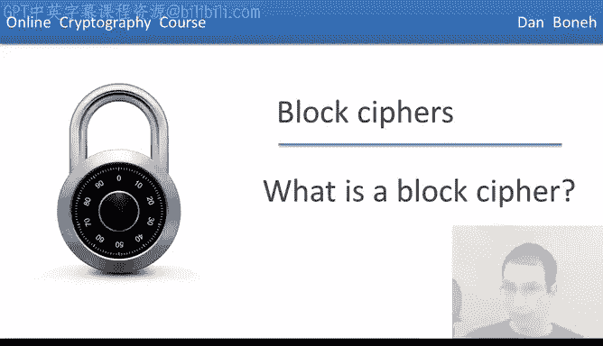
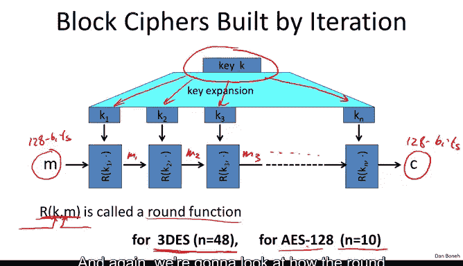
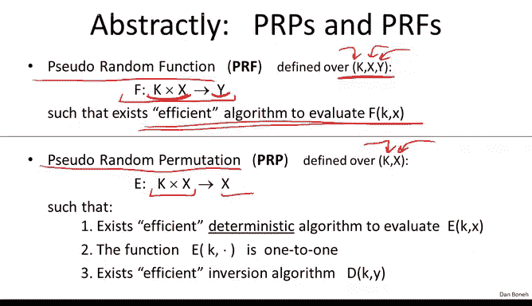
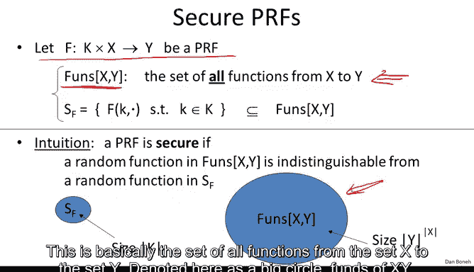
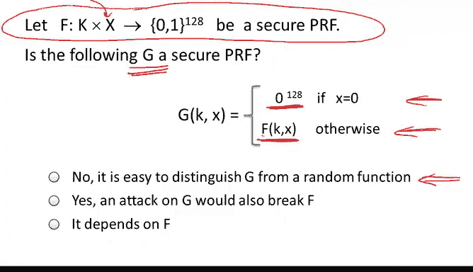

# 013：什么是分组密码 🔐



在本节课中，我们将要学习密码学中的一个核心概念——分组密码。我们将了解它的定义、工作原理、安全目标，以及它与之前学过的流密码的区别。

## 概述

上一节我们介绍了流密码，本节中我们将转向一个功能更强大的密码学原语——分组密码。分组密码是现代密码学的基石，被广泛应用于数据加密、消息认证码等多种安全协议中。


## 分组密码的定义

分组密码由两个算法构成：**加密算法 E** 和 **解密算法 D**。这两个算法都接收一个密钥 **K** 作为输入。

分组密码的核心特点是：它接收一个 **n** 比特的明文作为输入，并输出一个长度完全相同的 **n** 比特的密文。其功能是将 **n** 比特的输入映射到 **n** 比特的输出。



用公式表示，对于一个分组密码，其加密和解密过程如下：
*   **加密**：`C = E(K, P)`，其中 `P` 是 n 比特明文，`C` 是 n 比特密文。
*   **解密**：`P = D(K, C)`，其中 `D` 是 `E` 的逆运算。

## 经典分组密码示例

以下是两个经典的分组密码实例及其参数：

*   **三重DES (3DES)**：
    *   **分组大小**：64 比特。
    *   **密钥长度**：168 比特。
    *   它将 64 比特的输入块映射为 64 比特的输出块。

*   **高级加密标准 (AES)**：
    *   **分组大小**：128 比特。
    *   **密钥长度**：可以是 128、192 或 256 比特。
    *   它将 128 比特的输入块映射为 128 比特的输出块。
    *   通常，密钥越长，密码越安全，但加密速度也越慢。

## 分组密码的工作原理：迭代结构



分组密码通常采用迭代结构构建。其工作流程如下：

1.  **密钥扩展**：首先，输入的密钥 **K** 被扩展成一系列称为 **轮密钥** 的密钥：`K1, K2, ..., Kn`。
2.  **轮函数迭代**：然后，明文通过一个称为 **轮函数 R** 的组件进行多轮迭代加密。
    *   轮函数接收两个输入：当前轮的轮密钥 `Ki` 和当前轮的消息状态（初始状态为明文）。
    *   每一轮，轮函数使用对应的轮密钥对当前状态进行变换，产生新的状态。
    *   这个过程重复进行，直到完成所有轮次。最终的状态即为密文。

用伪代码描述这个过程：
```
state = plaintext_block
for i from 1 to number_of_rounds:
    state = R(round_key[i], state)
ciphertext_block = state
```

不同的分组密码有不同的轮数和不同的轮函数设计：
*   对于 **三重DES**，轮数为 48。
*   对于 **AES-128**，轮数为 10。


## 性能对比

与流密码相比，分组密码的计算开销通常更大。以下是性能对比（数值为近似值，单位：周期/字节）：
*   **流密码**：RC4 (~7)， Salsa20/12 (~4)， Sosemanuk (~4)
*   **分组密码**：3DES (~72)， AES (~10)

可以看到，分组密码的速度普遍慢于流密码。然而，分组密码能实现许多流密码难以高效完成的功能，我们将在后续课程中看到。



## 抽象概念：伪随机函数与伪随机置换

为了更清晰地讨论如何正确使用分组密码，我们引入两个重要的抽象概念。

### 伪随机函数

一个 **伪随机函数** 定义在密钥空间 **K**、输入空间 **X** 和输出空间 **Y** 上。它是一个函数 `F: K × X → Y`。
*   核心要求：给定密钥 `k ∈ K` 和输入 `x ∈ X`，存在一个高效算法可以计算出 `F(k, x)`。
*   **不要求** 函数可逆。

### 伪随机置换

一个 **伪随机置换** 更准确地描述了分组密码。它定义在密钥空间 **K** 和集合 **X** 上。它是一个函数 `E: K × X → X`，并且满足：
1.  **高效计算**：存在高效算法计算 `E(k, x)`。
2.  **一一映射**：对于固定的密钥 `k`，函数 `E(k, ·)` 是从 **X** 到 **X** 的一一映射（双射）。
3.  **高效可逆**：存在高效的反函数（解密算法）`D`，使得 `D(k, E(k, x)) = x`。

**关系**：一个伪随机置换可以看作是一个特殊的伪随机函数，其中输入空间和输出空间相同（`X = Y`），并且该函数在已知密钥时可高效求逆。

## 安全性定义

分组密码（伪随机置换）的安全目标是什么？其核心思想是：**一个安全的伪随机置换应该与一个真正的随机置换在计算上不可区分**。


### 安全性游戏

设想一个挑战者与一个攻击者进行如下游戏：
1.  挑战者秘密地抛一枚硬币。
    *   如果硬币正面朝上，挑战者选择一个 **真正的随机置换** `π`（从所有可能的 `X → X` 置换中均匀随机选取）。
    *   如果硬币反面朝上，挑战者选择一个 **随机的密钥 `k`**，并使用伪随机置换 `E(k, ·)`。
2.  攻击者可以自适应地向挑战者提交查询：输入值 `x ∈ X`。
3.  对于每次查询，挑战者返回对应的输出值 `π(x)` 或 `E(k, x)`。
4.  最后，攻击者需要猜测挑战者使用的是真正的随机置换还是伪随机置换。

**定义**：如果对于任何高效的计算攻击者，其猜对硬币结果的概率与纯粹随机猜测（即 1/2）的差距可以忽略不计，那么我们就称这个伪随机置换是 **安全的**。

伪随机函数的安全性定义与此类似，只是将“随机置换”替换为“随机函数”。



### 一个反例

假设我们有一个安全的伪随机函数 `F`，我们构造一个新函数 `G`：
```
定义 G(k, x):
    如果 x == 0:
        返回 0
    否则:
        返回 F(k, x)
```
`G` 是安全的伪随机函数吗？**不是**。攻击者只需查询 `x = 0` 即可区分：
*   对于真正的随机函数，输出为 0 的概率极低（`1/|Y|`）。
*   对于 `G`，输出总是 0。
因此，即使只有一个点的输出行为异常，也足以破坏整个构造的安全性。

## 分组密码的应用示例：构建伪随机数生成器

分组密码（伪随机函数）功能强大。以下是一个简单的应用：用伪随机函数构建一个 **伪随机数生成器**。

**构造（计数器模式）**：
*   **种子**：伪随机函数的密钥 `k`。
*   **输出**：`F(k, 0) || F(k, 1) || F(k, 2) || ... || F(k, t-1)`。
*   这将密钥 `k` 扩展成了 `n * t` 比特的输出。


**安全性直觉**：
1.  根据伪随机函数的定义，`F(k, ·)` 与一个真正的随机函数 `f(·)` 不可区分。
2.  如果我们用真正的随机函数 `f` 来构建生成器：`f(0) || f(1) || ... || f(t-1)`，那么输出显然是真正随机的（因为每个 `f(i)` 都是独立随机的）。
3.  因此，用伪随机函数 `F` 构建的生成器，其输出也与随机串不可区分。

**优势**：此生成器是 **可并行化** 的。因为计算 `F(k, i)` 彼此独立，如果有多个处理器，可以同时计算不同 `i` 的输出，从而大幅提升速度。这与我们之前看到的 RC4 等流密码（本质上是顺序的）形成对比。

## 总结

本节课中我们一起学习了分组密码的核心知识：
1.  **定义**：分组密码是对固定长度分组进行加密/解密的对称密码，由算法 `(E, D)` 和密钥 `K` 定义。
2.  **实例**：我们了解了 3DES 和 AES 这两个经典分组密码的参数。
3.  **结构**：分组密码通常采用迭代结构，通过多轮应用轮函数和轮密钥来达到混淆和扩散的效果。
4.  **抽象**：我们引入了 **伪随机函数** 和 **伪随机置换** 这两个关键抽象，后者更精确地刻画了分组密码。
5.  **安全目标**：安全的分组密码（伪随机置换）应与真正的随机置换在计算上不可区分。
6.  **应用**：我们看到了如何利用伪随机函数构建一个可并行化的伪随机数生成器，这体现了其强大功能。

在接下来的章节中，我们将深入探讨 3DES 和 AES 的具体构造细节。