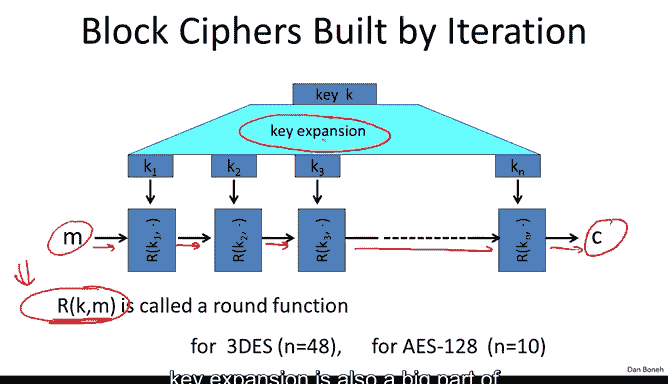
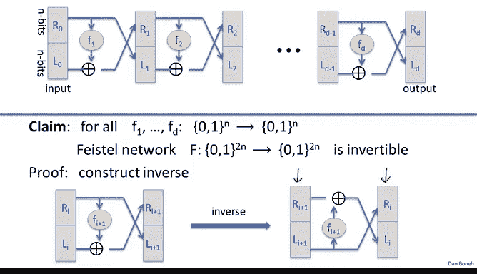
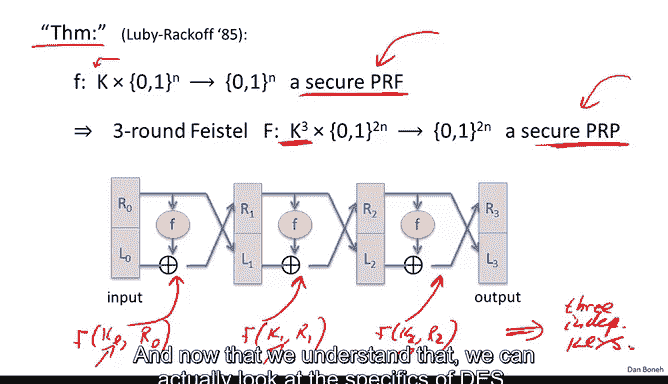
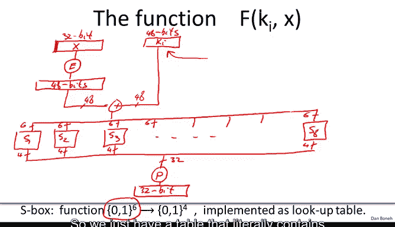
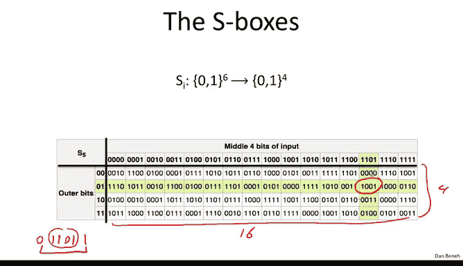
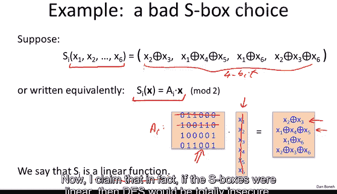
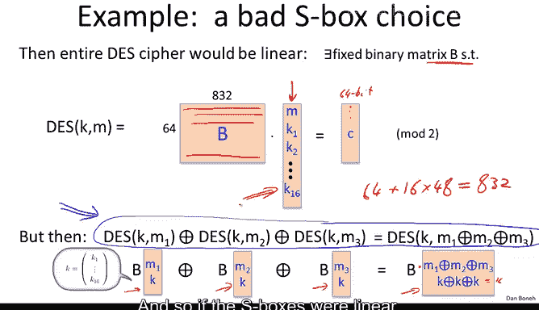

# 014：数据加密标准 🔐


在本节课中，我们将学习一个经典的块密码实例——数据加密标准。我们将了解DES的历史背景、其核心构造原理（Feistel网络），并详细解析其内部结构，特别是S盒的作用。

---



## 历史背景 📜

上一节我们介绍了块密码的基本概念，本节中我们来看看一个具体的例子——数据加密标准。

DES的历史始于20世纪70年代初。IBM意识到其客户需要加密技术，因此成立了一个密码学小组，由Horst Feistel领导。Feistel在70年代初设计了一个名为Lucifer的密码。有趣的是，Lucifer的一个后期变体拥有128位的密钥长度和128位的块长度。

1973年，美国政府意识到其采购了大量商用计算机，因此希望供应商能提供一个良好的加密算法，用于销售给政府的产品。同年，国家标准局（当时名称）发布了一份提案请求，旨在制定一个将成为联邦标准的块密码。IBM提交了Lucifer的一个变体，该变体在标准化过程中经过了一些修改。


最终在1976年，国家标准局采纳了DES作为联邦标准。值得注意的是，DES的密钥长度从Lucifer的128位大幅缩减至56位，块长度也缩减至64位。缩减密钥长度的决定，尤其是缩减至56位，成为了DES的阿喀琉斯之踵，在其生命周期内招致了许多批评。事实上，早在1997年，DES就通过穷举搜索被攻破，这意味着一台机器能够遍历所有2^56个可能的密钥来恢复一个特定的挑战密钥。

1997年的这次实验宣告了DES的终结，意味着它本身不再安全。因此，美国国家标准与技术研究院（NIST）发布了下一代块密码标准的提案请求，并于2000年标准化了一个名为Rijndael的密码，即高级加密标准（AES）。我们将在后续章节讨论AES。

DES作为一个密码算法，取得了惊人的成功。它被广泛应用于银行业，例如一个名为电子清算中心的经典网络，银行用它来相互清算支票，DES用于这些交易的完整性保护。它也用于商业领域，直到最近，它还是Web的主要加密机制（当然，现在已被AES和其他密码取代）。总体而言，DES在部署方面非常成功。DES也拥有丰富的攻击历史，我们将在下一节讨论。

---

## Feistel网络结构 🏗️

现在我们来谈谈DES的构造。DES背后的核心思想是由Horst Feistel提出的Feistel网络。这是一个非常巧妙的想法，用于从任意函数F1到Fd构建块密码。


想象我们有一组从n位映射到n位的任意函数F1到Fd。这些函数可以是任意的，不必是可逆的。我们的目标是利用这d个函数构建一个可逆的函数。我们将构建一个称为大写F的新函数，它将2n位映射到2n位。

以下是其构造描述：
输入是2n位，分为左右两部分，记为L0和R0。
对于第i轮（i从1到d）：
*   Li = R(i-1)
*   Ri = L(i-1) XOR F_i( R(i-1) )
最终输出是Rd和Ld。

用公式表示即：
```
Li = R(i-1)
Ri = L(i-1) XOR F_i( R(i-1) )， 其中 i = 1 ... d
```

一个惊人的结论是：无论你给我什么函数F1到Fd，由此构建的Feistel网络函数都是可逆的，并且是高效可逆的。我们可以通过构造其逆来证明这一点。

观察单轮Feistel网络，其输入是R(i-1), L(i-1)，输出是Ri, Li。现在，假设我们已知输出Ri, Li，想要计算输入R(i-1), L(i-1)。我们可以如下计算：
*   R(i-1) = Li
*   L(i-1) = Ri XOR F_i( R(i-1) ) = Ri XOR F_i( Li )



如果我们画出逆运算的图，会发现它与正向的Feistel轮函数非常相似，基本上是镜像关系。当我们将这些逆轮组合起来时，就得到了整个Feistel网络的逆。有趣的是，逆电路看起来与加密电路几乎相同，唯一的区别是函数以相反的顺序应用：解密时从Fd开始到F1结束，而加密时从F1开始到Fd结束。

对于硬件设计者来说，这非常有吸引力，因为如果你想节省硬件，加密硬件与解密硬件是相同的。你只需要实现一种算法，通过以相反顺序应用函数就能获得两种算法。


Feistel机制是一种从任意函数F1到Fd构建可逆函数的通用方法，事实上，它被用于许多不同的块密码中。不过有趣的是，AES并没有使用Feistel网络。AES使用了一种完全不同的结构，我们将在后面看到。

---

## Feistel网络的安全性理论 🛡️

既然我们知道了什么是Feistel网络，让我提一个关于Feistel网络理论的重要定理，它说明了为什么这是一个好主意。这个定理由Luby和Rackoff在1985年提出。

定理内容如下：假设我有一个安全的伪随机函数。它作用于n位，使用密钥K。那么，如果你在三轮Feistel网络中使用这个函数，最终得到的是一个安全的伪随机置换。换句话说，你最终得到一个可逆函数，其与真正的随机可逆函数不可区分。



我希望你记得，安全块密码的定义就是它需要是一个安全的伪随机置换。所以这个定理说的是：如果你从一个安全的伪随机函数开始，你最终会得到一个安全的块密码。

让我更详细地解释一下这里实际发生了什么。本质上，PRF被用于Feistel网络的每一轮。换句话说，这里计算的是使用一个秘密密钥K0的PRF，这里计算的是使用另一个秘密密钥K1的PRF（当然，应用于R1），这里我们还有另一个秘密密钥K2应用于R2。请注意，这个F构造使用了K^3中的密钥，即使用了三个独立的密钥，所以密钥实际上是独立的这一点非常重要。然后我们最终得到一个安全的伪随机置换。

这就是Feistel网络背后的理论。现在我们理解了这一点，就可以具体看看DES了。

---


## DES的具体构造 ⚙️

DES基本上是一个16轮的Feistel网络。所以有函数F1到F16，它们将32位映射到32位。因此，DES本身作用于64位块（2 * 32）。

DES的16个轮函数实际上都派生自同一个函数F，只是使用了不同的密钥。实际上，这些是不同的轮密钥，所以Ki是一个轮密钥，它基本上是从56位的DES主密钥K派生出来的。

现在，让我描述一下这个函数F。基本上，它接受一个32位的输入（称为X，实际上是R0, R1, R2等）和一个48位的轮密钥Ki。

以下是函数F的工作步骤：
1.  **扩展盒**：首先，32位输入通过一个扩展盒，被扩展成48位。扩展盒所做的只是复制一些比特并移动其他比特的位置。例如，输入X的第1位被复制到输出的第2位和第48位。
2.  **异或运算**：接下来，这48位与轮密钥Ki进行异或运算。
3.  **S盒替换**：然后，这48位被分成8组，每组6位。每组6位输入进入一个称为S盒的组件。S盒将6位映射到4位。因此，8个S盒的输出是8组4位，总共32位。
4.  **置换**：最后，这32位经过另一个置换，只是将比特重新排列。例如，第1位可能去到第9位，第2位去到第15位，等等。这就是函数F的最终32位输出。

通过使用不同的轮密钥，我们本质上得到了不同的轮函数，从而形成了DES的16个轮函数。

现在，唯一需要具体说明的就是这些S盒。S盒实际上只是从6位到4位的函数，它们通过查找表实现。描述一个从6位到4位的函数基本上就是写出该函数在所有2^6=64种可能输入下的输出。例如，第五个S盒就是一个包含64个值（每个值4位）的表格。要查找输入`011011`对应的输出，你可以查看前两位`01`和中间四位`1011`，在表格交叉处找到输出`1001`。





---

## S盒的设计与重要性 🔑

S盒是如何被设计者选择的呢？为了给你一些直觉，让我们从一个非常糟糕的S盒选择开始。



想象一下S盒是线性的。我的意思是，想象这6位输入只是以不同的方式相互异或，以产生4位输出。另一种写法是，我们可以将S盒写成一个矩阵向量乘积。如果S盒以这种方式实现，那么它们所做的只是将矩阵A应用于输入向量X，这就是为什么我们说在这种情况下S盒是完全线性的。

我断言，如果S盒是线性的，那么DES将完全不安全。原因是，如果S盒是线性的，那么DES所做的就只是计算各种东西的异或以及置换和打乱比特。所以它只是异或和比特置换，这意味着整个DES只是一个线性函数。

换句话说，会存在一个矩阵B。基本上，我会将64位消息加上16个轮密钥写成一个长向量。然后就是这个矩阵B，当你计算这些矩阵向量乘积时，你基本上就得到了密文的不同比特。所以如果DES是线性的，那么它作为一个安全的伪随机置换将是糟糕的。

让我举一个非常简单的例子。如果你对DES的三个输出取异或，你最终会得到DES在点M1 XOR M2 XOR M3处的值。这个关系对于一个随机函数来说是不会成立的，因此你得到了一个非常简单的测试来告诉你DES不是一个随机函数。事实上，给定足够的输入输出对，你甚至可以恢复整个秘密密钥。你只需要832个输入输出对就能恢复整个密钥。

因此，如果S盒是线性的，这将完全不安全。事实上，即使S盒接近线性，也就是说对于64个输入中的60个，S盒是线性的，这也足以攻破DES。特别是，如果你随机选择S盒，它们往往会有些接近线性函数，结果你将能够轻易恢复密钥。

因此，DES的设计者实际上指定了一些他们用于选择S盒的规则。毫不奇怪，第一条规则是这些函数远离线性函数。换句话说，不存在一个函数能与S盒的大部分输出一致。然后还有其他规则，例如，它们正好是四对一映射，所以每个输出正好有四个原像，等等。我们现在理解了为什么他们以这种方式选择S盒，事实上，这都是为了抵御对DES的某些攻击。



---

## 总结 📝


本节课中我们一起学习了数据加密标准。我们回顾了DES的历史，了解了其核心构造——Feistel网络的工作原理，它能够从任意函数构建可逆的加密函数。我们详细剖析了DES的具体实现，包括其16轮结构、轮函数F的步骤（扩展、异或、S盒替换、置换），并重点探讨了S盒作为DES中唯一非线性组件的重要性及其设计原则。DES虽然因其56位密钥长度已被攻破而淘汰，但其Feistel网络结构和设计思想对密码学发展产生了深远影响。在接下来的章节中，我们将探讨DES的安全性。