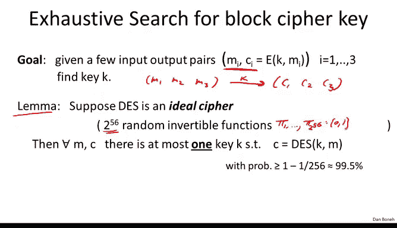
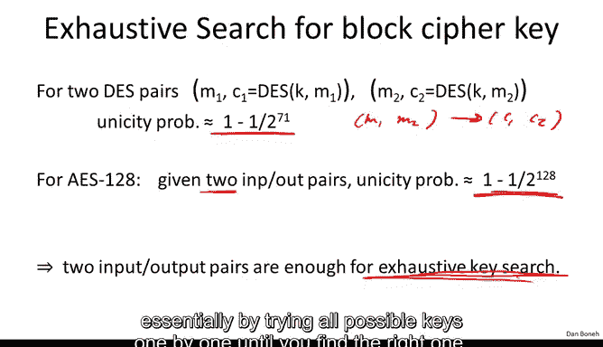
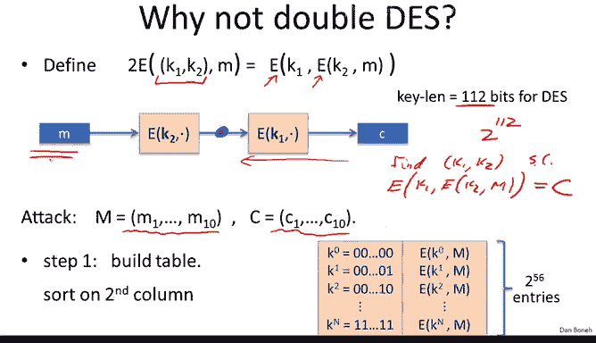
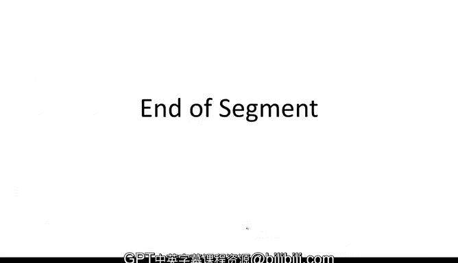

# 015：穷举搜索攻击 🔍


在本节课中，我们将要学习针对DES（数据加密标准）的穷举搜索攻击。我们将从理解攻击的基本原理开始，分析DES密钥的唯一性，然后探讨如何通过穷举搜索找到密钥。接着，我们会了解历史上著名的DES挑战赛及其结果，并讨论如何通过三重DES等方法来增强DES的安全性。最后，我们会分析双重DES的弱点以及一种名为DESX的替代方案。



---

## 密钥的唯一性分析

上一节我们介绍了DES的工作原理，本节中我们来看看针对DES的几种攻击，我们将从一种名为“穷举搜索”的攻击开始。

我们的目标是：给定几组输入输出对 `(M_i, C_i)`，找到将明文 `M_i` 映射为密文 `C_i` 的密钥 `k`。换句话说，我们的目标是找到满足 `C_i = DES(k, M_i)` 的密钥。

第一个问题是：我们如何知道这个密钥是唯一的？让我们通过一个简单的分析来证明，实际上，仅需一对明文-密文就足以完全确定一个DES密钥。

我们假设DES是一个“理想密码”。这意味着我们将DES视为由随机可逆函数组成的集合。具体来说，对于每一个56位的密钥，DES实现了一个从64位到64位的随机可逆函数。虽然DES并非真正的随机函数集合，但我们可以将其理想化。

在这种情况下，可以证明：**仅给定一对明文 `M` 和密文 `C`，存在唯一一个密钥 `k` 将 `M` 映射到 `C` 的概率约为99.5%**。

以下是证明概要：
*   我们关心的是，是否存在另一个密钥 `k' ≠ k`，同样满足 `C = DES(k', M)`。
*   根据概率的并集界限，这个概率可以上界为对所有 `2^56` 个可能密钥 `k'` 求和：`Pr[DES(k', M) = C]`。
*   对于一个固定的 `k'`，`DES(k', M)` 是一个64位的随机输出。它恰好等于特定值 `C` 的概率最多是 `1 / 2^64`。
*   因此，总概率上界为 `(2^56) * (1 / 2^64) = 1 / 2^8 = 1/256`。
*   所以，密钥不唯一的概率是 `1/256`，唯一的概率就是 `1 - 1/256 ≈ 99.5%`。

实际上，如果给定两对明文-密文对 `(M1, C1)` 和 `(M2, C2)`，存在唯一密钥的概率将极其接近100%。因此，我们可以明确地提出穷举搜索问题：给定两到三对明文-密文对，请找到那个唯一的密钥。

---



## DES挑战赛与穷举搜索实践

那么如何找到这个密钥呢？最直接的方法就是尝试所有可能的密钥，直到找到正确的那一个，这就是**穷举搜索**。

历史上著名的**DES挑战赛**生动地展示了这一点。RSA公司发布了一系列密文，其中三组密文对应已知的明文（例如“The unknown message is:”）。挑战者需要利用这三对已知的明文-密文，通过穷举搜索找到密钥，并用它来解密其余密文。

以下是DES挑战赛的时间线，它清晰地表明了56位密钥的DES已不再安全：

*   **1997年**：通过互联网分布式计算（如DESCHALL项目），在大约**3个月**内搜索了约一半的密钥空间（`2^55`次尝试），找到了密钥。
*   **1998年**：电子前沿基金会（EFF）建造了名为**Deep Crack**的专用硬件，耗资约25万美元，在**3天**内破解了DES。
*   **1999年**：结合Deep Crack和分布式计算，在**22小时**内破解了DES。
*   **后续发展**：随着硬件技术进步，使用现成的FPGA（现场可编程门阵列）仅花费1万美元，就能在大约**7天**内完成穷举搜索。

**结论非常明确：56位的密码已彻底失效。** DES无法抵御穷举搜索攻击。


---

## 增强DES：三重DES (3DES)

由于DES被广泛部署，人们希望增强其安全性。最直接的想法是增加密钥长度以抵抗穷举搜索。**三重DES** 应运而生。

三重DES是一个通用构造。给定一个分组密码 `E: K × M -> M`，三重DES构造 `3E: K^3 × M -> M` 定义如下：

```python
def 3E_encrypt((k1, k2, k3), m):
    # 加密-解密-加密 (E-D-E) 模式
    c_temp = E(k3, m)     # 第一次加密
    c_temp = D(k2, c_temp) # 解密
    c = E(k1, c_temp)     # 第二次加密
    return c
```

这里使用 **E-D-E** 模式（加密-解密-再加密）而非 E-E-E，主要是为了兼容性：当三个密钥都相同时（`k1 = k2 = k3`），中间的 `D` 和第一个 `E` 相互抵消，整个操作退化为单次DES加密。这使得支持3DES的硬件也能兼容单DES。

三重DES的**有效密钥长度**为 `3 * 56 = 168` 位，使得穷举搜索需要 `2^168` 次操作，这在计算上是不可行的。虽然存在一种“中间相遇攻击”将其安全性降至约 `2^118`，但这仍然是足够安全的。然而，三重DES的**主要缺点是速度慢**，因为它需要执行三次加密/解密操作。


---

## 为什么不使用双重DES？

既然三重DES速度慢，一个自然的想法是使用**双重DES**，它只使用两个密钥和两次加密：

```python
def 2E_encrypt((k1, k2), m):
    c_temp = E(k2, m)
    c = E(k1, c_temp)
    return c
```

它的密钥长度为 `2 * 56 = 112` 位，并且只比单DES慢一倍。然而，**双重DES存在严重的安全漏洞**，使其无法有效抵抗穷举搜索。

攻击者可以利用一种称为**中间相遇攻击**的方法。假设我们有一个明文-密文对 `(M, C)`，满足 `C = E(k1, E(k2, M))`。我们可以将这个等式重写为：
`D(k1, C) = E(k2, M)`
这里，`D` 是解密函数。



攻击步骤如下：

1.  **构建前向表**：对于所有 `2^56` 个可能的密钥 `k2`，计算 `X = E(k2, M)`。将结果 `(k2, X)` 存储在一个表中，并按照 `X` 的值排序。此步骤耗时约 `O(2^56)`。
2.  **反向搜索**：对于所有 `2^56` 个可能的密钥 `k1`，计算 `Y = D(k1, C)`。
3.  **查找碰撞**：在排序好的表中快速查找（二分查找）是否存在 `X` 等于 `Y`。如果找到，那么对应的 `(k1, k2)` 就是正确的密钥对。

这种攻击的**总时间复杂度**约为 `O(2^56 * log(2^56)) ≈ 2^63`，远小于对112位密钥进行穷举搜索的 `2^112`。虽然它需要 `O(2^56)` 的存储空间，但时间上的巨大优势使得双重DES并不比单DES安全多少。

**因此，永远不要使用双重DES。** 如果必须使用DES系算法，应选择三重DES。

---


## 另一种增强方案：DESX

除了三重DES，还有一种旨在抵抗穷举搜索且性能损失更小的构造，称为**DESX**。它并未被NIST标准化，因为它不能防御DES的其他一些深层攻击，但如果只关心穷举搜索，它是一个有趣的选择。

对于分组密码 `E: K × {0,1}^n -> {0,1}^n`，DESX构造使用三个密钥 `(k1, k2, k3)`：

```python
def DESX_encrypt((k1, k2, k3), m):
    # k1, k3 是 n 位密钥（与分组等长），k2 是 E 的原生密钥
    xored_input = m XOR k3
    encrypted = E(k2, xored_input)
    output = encrypted XOR k1
    return output
```

DESX的**总密钥长度**为 `|k1| + |k2| + |k3|`。对于DES而言，`n=64`，`|k2|=56`，所以总长为 `64 + 56 + 64 = 184` 位。

已知对DESX的最佳通用攻击时间复杂度约为 `2^(n + |k2|)`，即 `2^(64+56)=2^120`，这仍然非常安全。它的**优点**是只增加两次快速的XOR操作和一次加密操作，性能损失远小于3DES。


**重要警告**：DESX必须在**输入和输出两端都进行XOR**（白化）。如果只在其中一端进行XOR，则构造无法增强安全性，仍然容易受到针对原始密码 `E` 的穷举搜索攻击。

---


## 总结



本节课中我们一起学习了针对DES的穷举搜索攻击。我们首先分析了给定明文-密文对时密钥的唯一性。然后，通过DES挑战赛的历史，我们认识到56位密钥的DES在现有计算能力下已完全失效。为了增强安全性，我们介绍了三重DES，它通过增加密钥长度有效抵抗了穷举搜索，但付出了速度变慢的代价。我们还分析了双重DES的不安全性，其“中间相遇攻击”使其形同虚设。最后，我们简要了解了DESX构造，它在抵抗穷举搜索和性能之间提供了一个折衷方案。下一节，我们将探讨针对DES的更复杂的密码分析攻击。