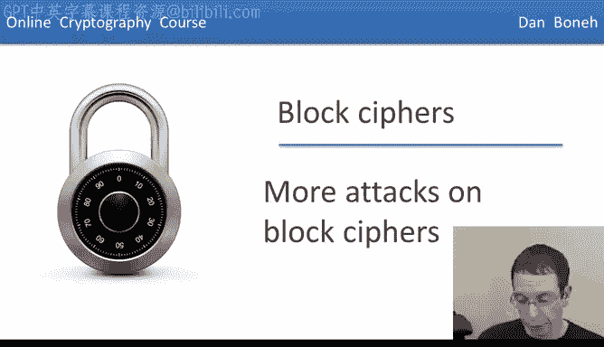
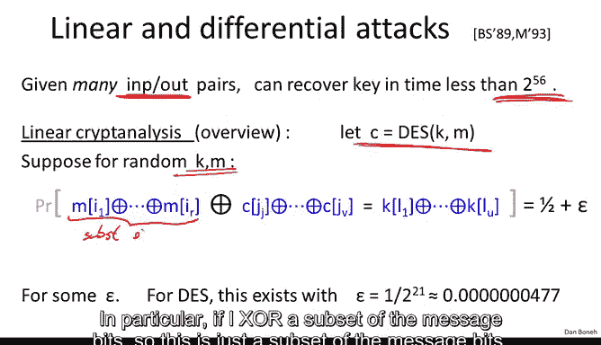
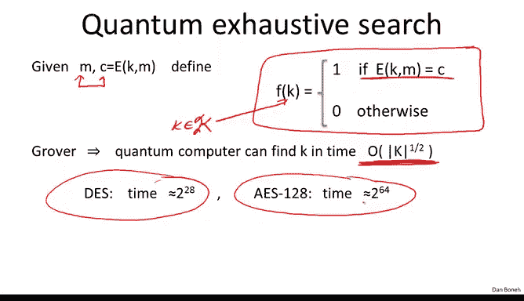

# 016：对分组密码的更多攻击 🔐



在本节课中，我们将学习针对分组密码的几种高级攻击方法。这些攻击不仅针对算法设计本身，还针对其实现方式，甚至包括未来可能出现的量子计算威胁。了解这些攻击有助于我们理解为何必须使用经过严格审查的标准算法，而非自行设计或实现。

## 实现层面的攻击 ⚙️

上一节我们介绍了分组密码的基本原理，本节中我们来看看针对其实现方式的攻击。这些攻击不直接破解算法，而是利用其物理实现中的信息泄露。

### 计时攻击 ⏱️

以下是计时攻击的基本原理：
*   攻击者精确测量加密或解密操作所花费的时间。
*   如果操作时间与密钥的某些比特存在依赖关系，攻击者通过多次测量就能推断出密钥信息。
*   这种攻击不仅限于智能卡，在多核处理器上，攻击者甚至可以通过观察缓存未命中情况来提取另一个核心上运行的加密算法的密钥。

### 功耗分析攻击 🔋


以下是功耗分析攻击的基本原理：
*   攻击者测量设备（如智能卡）在执行加密操作时的功耗曲线。
*   功耗的细微变化可能与密钥比特或中间运算结果相关。
*   即使设备采取了一些防护措施，差分功耗分析等高级攻击仍可通过分析大量运行数据来提取密钥。

### 故障攻击 ⚡

以下是故障攻击的基本原理：
*   攻击者通过物理手段（如超频、加热）使加密设备产生故障，导致其输出错误结果。
*   研究表明，如果在加密过程的最后一轮引入错误，产生的错误密文可能足以泄露整个密钥。
*   防御方法通常包括多次计算并验证结果，但这本身也增加了实现的复杂性。

这些例子表明，实现密码学原语非常微妙。因此，我们不应自行实现这些算法，而应使用像 OpenSSL 这样的标准库。



## 密码分析攻击：线性密码分析 📊

现在，我们转向更复杂的、针对算法设计本身的密码分析攻击。这里我们以针对 DES 的线性密码分析为例。

假设我们拥有大量明密文对 `(M, C)`，其中 `C = Enc(K, M)`。攻击的目标是找到比暴力搜索更快的方法来恢复密钥 `K`。

线性密码分析的核心思想是：在算法中寻找一个微小的线性偏差。具体来说，攻击者试图找到一个涉及明文、密文和密钥比特的线性关系，该关系成立的概率不是精确的 1/2，而是 `1/2 + ε`，其中 `ε` 是一个很小的偏差（称为偏差）。

对于 DES，由于其第五个 S 盒设计存在缺陷，过于接近一个线性函数，导致在整个算法中产生了这样一个关系。这个关系的偏差 `ε` 非常小，约为 `2^{-21}`。

### 如何利用线性关系

假设我们发现了如下关系（其中 `⊕` 表示异或运算）：
```
[明文比特子集] ⊕ [密文比特子集] = [密钥比特子集]
```
并且该等式成立的概率是 `1/2 + ε`。

以下是利用此关系恢复部分密钥比特的步骤：
1.  收集大约 `1/ε^2` 个随机的明密文对。
2.  对于每一对 `(M, C)`，计算等式的左边部分（即 `[明文比特子集] ⊕ [密文比特子集]`）。
3.  对所有计算结果取众数。由于存在 `ε` 的偏差，这个众数将以高概率（例如 97.7%）等于等式右边的 `[密钥比特子集]`。

对于 DES，`ε = 2^{-21}`，因此需要约 `2^{42}` 个明密文对。通过这种方法，可以恢复出约 14 个密钥比特。剩下的 42 个比特则通过暴力搜索完成。总攻击时间约为 `2^{43}`，这比完整的 `2^{56}` 暴力搜索要快得多。

这个攻击的教训是深刻的：算法中任何微小的线性缺陷都可能导致严重的攻击。这再次强调了使用经过充分分析的标准算法的重要性。

## 量子攻击：格罗弗算法 ⚛️

最后，我们探讨一种理论上对所有分组密码都构成威胁的通用攻击——量子攻击，特别是格罗弗搜索算法。

### 格罗弗算法简介

考虑一个在定义域 `X` 上的函数 `F`，它几乎对所有输入都输出 0，仅对唯一一个输入 `x*` 输出 1。我们的目标是找到这个 `x*`。
*   在经典计算机上，我们只能将 `F` 当作黑盒，逐个尝试所有输入，所需时间与 `|X|` 成正比。
*   格罗弗算法表明，在量子计算机上，可以在大约 `√|X|` 的时间内找到 `x*`。这是一个平方级的加速。

### 对分组密码的影响


这如何用于攻击分组密码呢？假设我们有一个明密文对 `(M, C)`。我们可以定义一个关于密钥 `k` 的函数：
```
F(k) = 1, 如果 Enc(k, M) == C；否则 F(k) = 0。
```
显然，只有正确的密钥 `K` 能使 `F(K)=1`。因此，寻找密钥的问题就转化成了上述搜索问题。
*   对于 DES（56 位密钥），经典暴力搜索需要 `2^56` 步，而量子攻击仅需约 `2^28` 步。
*   对于 AES-128（128 位密钥），量子攻击将时间降至约 `2^64` 步，这已被认为是不安全的。
*   因此，如果未来能够建造出强大的量子计算机，我们必须使用更长的密钥，例如 AES-256（256 位密钥），其量子攻击时间 `2^128` 在可预见的未来仍然是安全的。

## 总结 📝



本节课中我们一起学习了针对分组密码的多种攻击：
1.  **实现攻击**：如计时攻击、功耗分析和故障攻击，它们利用物理实现的副作用泄露密钥。
2.  **密码分析攻击**：以线性密码分析为例，展示了算法设计中微小的统计偏差如何被放大并用于恢复密钥。
3.  **量子攻击**：介绍了格罗弗算法，它理论上能为所有分组密码的密钥搜索提供平方加速，强调了使用长密钥（如 256 位）以应对未来威胁的重要性。

所有这些攻击都指向同一个核心结论：分组密码的设计和实现极其复杂且充满陷阱。因此，在实践中，我们绝不应该自行设计或实现加密算法，而应始终依赖并正确使用经过严格审查和广泛测试的标准（如 AES）。