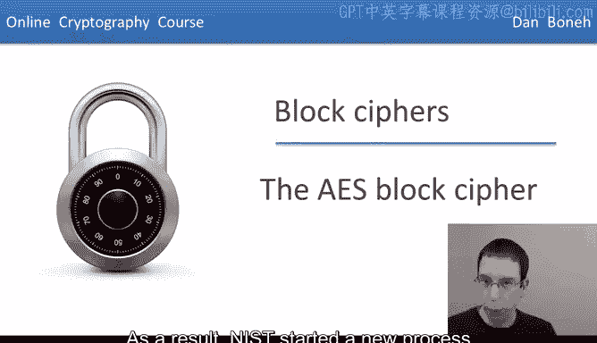
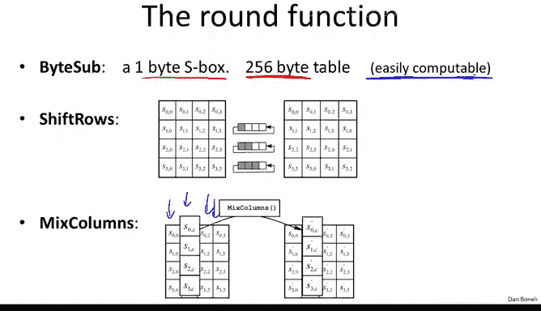
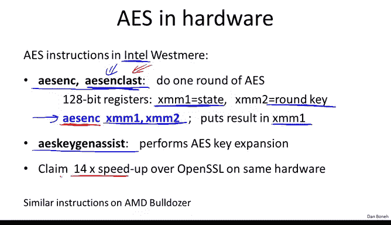

# 017：AES分组密码 🔐

在本节课中，我们将学习高级加密标准（AES）。我们将了解AES诞生的背景、其基本设计原理、具体的工作方式、不同的实现策略以及其安全性分析。

## 概述

随着时间推移，DES和三重DES因其设计不适合现代硬件且速度过慢的问题日益凸显。因此，美国国家标准与技术研究院（NIST）启动了一项新进程，旨在标准化一种名为高级加密标准（AES）的新分组密码。

## AES的诞生与基本参数

上一节我们提到了DES的局限性，本节中我们来看看它的继任者AES是如何被选定的。

NIST在1997年发起征集新分组密码提案的倡议。一年后，它收到了15份提交方案。最终在2000年，NIST采用了名为Rijndael的密码作为高级加密标准。这是一种在比利时设计的密码。

AES的分组大小为128位，并具有三种可能的密钥长度：128位、192位和256位。通常假设，密钥长度越大，该分组密码作为伪随机置换的安全性就越高。但同时，由于操作中涉及的轮数更多，加密速度也会变慢。例如，AES-128是这些密码中最快的，而AES-256则是最慢的。

## AES的设计结构：代换-置换网络

AES被构建为一种“代换-置换网络”。这与Feistel网络不同，在Feistel网络中，每轮有一半的比特保持不变；而在代换-置换网络中，所有比特在每一轮都会被改变。

以下是代换-置换网络第一轮的工作原理：
1.  **与轮密钥异或**：首先，将当前状态与第一轮密钥进行异或操作。
2.  **代换层**：然后，状态块根据代换表（S盒）被替换为其他块。
3.  **置换层**：接着，比特被重新排列和打乱。

这个过程会重复进行：与下一个轮密钥异或，经过代换阶段，再置换比特，如此循环，直到最后一轮。在最后一轮，与最终的轮密钥异或后，输出密文。

关于这个设计的一个重要点是，由于其构建方式，网络中的每一步都必须是可逆的，以确保整个加密过程可逆。因此，解密本质上就是按相反顺序应用网络中的每一步：从置换步骤开始（必须确保该步可逆），然后是代换层（也必须可逆）。这与DES非常不同，DES的代换表（将6比特映射到4比特）本身是不可逆的。当然，与轮密钥的异或操作也是可逆的。

所以，代换-置换网络的逆运算就是简单地按相反顺序应用所有步骤。

## AES的具体实现细节

现在我们已经理解了通用结构，让我们具体看看AES的细节。AES操作在128位（16字节）的分组上。在AES中，我们将这16字节写成一个4x4的矩阵，矩阵中的每个单元格包含一个字节。

加密过程如下：
1.  首先与第一轮密钥进行异或。
2.  然后对状态应用一个包含代换、置换和其他操作的特定函数（轮函数）。同样，这里应用的函数必须是可逆的，以便能够解密。
3.  接着与下一个轮密钥异或，并再次应用轮函数。
4.  这个过程重复进行10轮（对于AES-128）。值得注意的是，在最后一轮中，混合列步骤实际上被省略了。
5.  最后，与最后一轮轮密钥异或后输出密文。

在整个过程中，我们始终保持这个4x4的数组，因此输出也是4x4（16字节，128位）。

轮密钥本身是通过密钥扩展从一个16字节的AES密钥派生出来的。密钥扩展将16字节的AES密钥映射成11个轮密钥，每个也是16字节（同样表示为4x4数组），用于与当前状态进行异或。

以下是AES工作的示意图，剩下的就是具体说明这三个函数：字节代换、行移位和混合列。

## AES的轮函数详解

这三个函数相对容易解释，我将给出它们的高层描述，感兴趣的读者可以在线查阅细节。

*   **字节代换**：这本质上是一个包含256字节的S盒。它对当前状态矩阵中的每一个字节应用这个S盒。具体来说，对于4x4状态矩阵中的每个元素 `a[i][j]`，我们使用该字节的值作为索引查找S盒，并用查找到的值替换原字节。
    *   `a[i][j]` <-- `S_box[a[i][j]]`
*   **行移位**：这基本上只是一个置换操作。它对每一行进行循环移位。具体是：第一行不移位，第二行循环左移1个位置，第三行循环左移2个位置，第四行循环左移3个位置。
*   **混合列**：这实际上是对每一列应用一个线性变换。有一个特定的矩阵会乘以每一列，从而得到新的列。这个线性变换独立地应用于每一列。

需要指出的是，行移位和混合列在代码中很容易实现。字节代换本身也是可计算的，因此你可以编写少于256字节的代码来计算S盒，从而通过存储计算S盒的代码来压缩AES的描述，而不是在实现中硬编码整个S盒表。

## AES的实现策略与权衡

事实上，关于AES有一个普遍现象：如果你完全不允许预计算（包括动态计算S盒），那么你可以得到一个相当小的AES实现，可以适应存储空间非常有限的环境。当然，这将是速度最慢的实现，因为所有操作都需要动态计算。

相反，如果你有足够的空间支持大型代码，你可以预计算刚才提到的三个步骤。有多种预计算选项：可以构建一个只有4KB大小的表，也可以构建更大的表（例如24KB）。这样，你的实现中会有这些大表，但实际性能会非常好，因为你所做的只是查表和异或操作，没有其他复杂的算术运算。

因此，这三个步骤（字节代换、行移位、混合列）可以转化为少量查表和异或操作。这里存在代码大小和性能之间的权衡：在高端机器上，你可以预计算并存储这些大表以获得最佳性能；而在低端设备（如8位智能卡或手表）上，你会有一个相对较小的AES实现，但速度当然不会那么快。

## 一个特殊案例：JavaScript实现

这里有一个有点不寻常的例子：假设你想在JavaScript中实现AES，以便将库发送到浏览器，让浏览器自己执行AES加密。在这种情况下，你希望既缩小代码大小（以减少网络传输流量），又希望浏览器性能尽可能快。

我们之前做过的一个方案是：实际发送到浏览器的代码不包含任何预计算表，因此代码相当小。但是，一旦代码在浏览器中加载，浏览器会立即预计算所有表格。这样，代码从紧凑状态“膨胀”为包含所有这些预计算表，但这些表存储在内存充足的笔记本电脑上。一旦有了预计算表，你就可以使用它们进行加密，从而获得最佳性能。因此，如果你需要通过网络发送AES实现，你可以获得两全其美的效果：网络上的代码很小，但当它到达客户端时，可以自我“膨胀”并获得最佳加密性能。

## 硬件加速：AES-NI指令集

AES如今是如此流行的分组密码，以至于当在产品中构建加密功能时，基本上都应该使用AES。因此，英特尔实际上在处理器本身加入了AES支持。

自Westmere架构以来，英特尔处理器中就有了特殊的指令来帮助加速AES。这些指令主要分为两对：`AESENC` 和 `AESENCLAST`，以及 `AESKEYGENASSIST`。

*   `AESENC` 指令本质上实现了AES的一轮操作：应用三个函数（字节代换、行移位、混合列）并与轮密钥异或。
*   `AESENCLAST` 指令实现了AES的最后一轮操作（最后一轮没有混合列步骤，只有字节代换和行移位）。
*   调用这些指令时使用128位寄存器（如XMM寄存器），一个寄存器包含AES状态，另一个包含当前轮密钥。调用`AESENC`后，结果会放回状态寄存器。

因此，如果你想实现整个AES加密，你只需要调用9次`AESENC`和1次`AESENCLAST`。这10条指令基本上就是AES的完整实现。由于这些操作在处理器内部完成，而不是使用外部指令，据称它们可以获得比在同一硬件上不使用这些特殊指令的实现快14倍的速度提升。这是一个相当显著的加速。事实上，现在很多产品都在利用这些特殊指令。这并非英特尔独有，AMD在其推土机架构中也实现了非常类似的指令。

## AES的安全性分析

最后，我们来谈谈AES的安全性。这里我只想提及两种攻击。显然，AES已经被广泛研究，但对完整AES的攻击主要有以下两种：

1.  **密钥恢复攻击**：最好的攻击方法大约只比穷举搜索快4倍。这意味着，对于128位密钥，你应该将其视为相当于126位密钥的安全性，因为穷举搜索的速度大约是应有的4倍。当然，2^126次操作仍然远超我们现有的计算能力，这实际上并未损害AES的安全性。
2.  **相关密钥攻击（针对AES-256）**：AES的密钥扩展设计存在一个弱点，允许进行所谓的“相关密钥攻击”。简单来说，如果你提供大约2^100个来自四个相关密钥的输入-输出对（这些密钥彼此非常接近，例如只有少数比特不同），那么存在一种复杂度约为2^100的攻击。虽然2^100在今天仍然不切实际，但它远优于2^256的穷举搜索，这算是该密码的一个局限。然而，这通常不是一个重大问题，因为该攻击要求使用相关密钥。在实践中，你应该随机选择密钥，这样系统中就不会有相关密钥，因此该攻击不适用。但如果你确实使用了相关密钥，那么就会存在问题。

## 总结

本节课中我们一起学习了高级加密标准（AES）。我们了解了AES取代DES的背景，其作为代换-置换网络的基本设计原理，以及具体的加密步骤：字节代换、行移位和混合列。我们还探讨了AES在不同场景下的实现策略与权衡，以及现代处理器通过AES-NI指令集提供的硬件加速。最后，我们简要分析了AES的安全性，认识到虽然存在理论上的相关密钥攻击，但在正确使用随机密钥的实践中，AES仍然是一个非常安全且高效的分组密码标准。