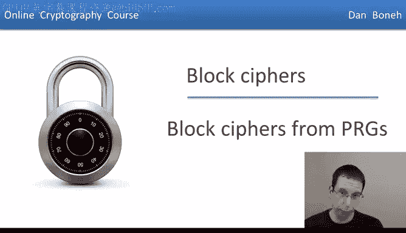
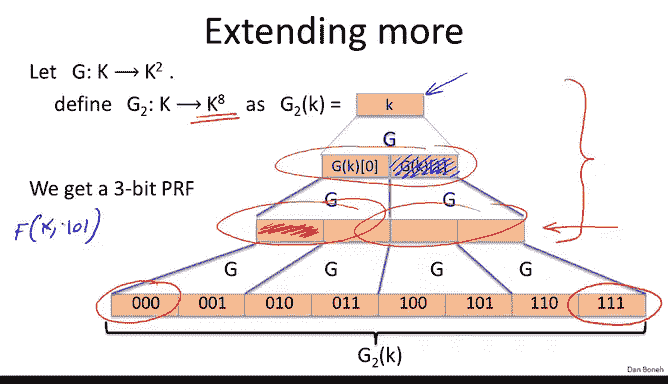
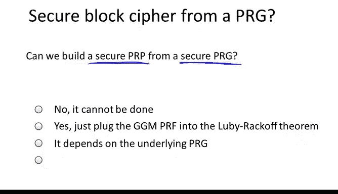
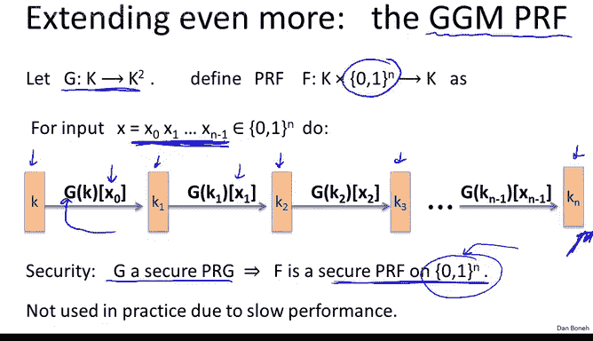
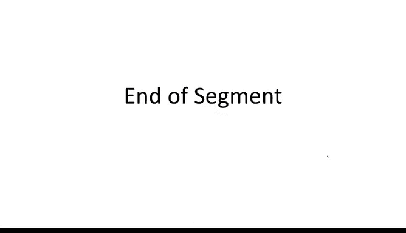

# 018：基于PRG构建分组密码



在本节中，我们将探讨一个核心问题：能否使用伪随机生成器这类更简单的原语来构建分组密码？答案是肯定的。

## 从PRG到PRF

上一节我们介绍了伪随机函数和伪随机置换的概念。本节中，我们来看看如何从一个伪随机生成器构建一个伪随机函数。

首先，我们从一个能将输入长度翻倍的PRG开始。设其种子空间为 **K**，输出是两个 **K** 中的元素。其安全性意味着输出与 **K²** 中的随机元素是不可区分的。

基于此，我们可以轻松定义一个“1比特PRF”，即输入域仅为1比特的PRF。定义如下：
- 如果输入比特 **X = 0**，则输出PRG的左半部分。
- 如果输入比特 **X = 1**，则输出PRG的右半部分。

用公式表示，即：
```
F(k, x) = G(k)[x]
```
其中 `G(k)[0]` 表示左输出，`G(k)[1]` 表示右输出。


可以证明，如果 **G** 是一个安全的PRG，那么这个1比特PRF就是一个安全的PRF。这个证明几乎是同义反复，你可以自行思考验证。

## 扩展PRF的输入域

真正的挑战在于，我们能否构建一个输入域更大的PRF，例如像AES那样支持128比特输入？

让我们逐步推进。首先，我们尝试构建一个输出四倍于输入的PRG，即从 **K** 映射到 **K⁴**。方法是对原始PRG的输出再次应用PRG。

具体构造 **G₁(k)** 如下：
1.  首先计算 `(t₀, t₁) = G(k)`。
2.  然后计算 `(t₀₀, t₀₁) = G(t₀)` 和 `(t₁₀, t₁₁) = G(t₁)`。
3.  最终输出为四元组 `(t₀₀, t₀₁, t₁₀, t₁₁)`。


现在，我们可以基于 **G₁** 构建一个2比特PRF。给定2比特输入（00, 01, 10, 11），只需输出 **G₁(k)** 对应的那个块即可。

**为什么 G₁ 是安全的？**
我们可以通过一个“图示证明”来理解。核心思想是利用PRG的安全性，逐步将伪随机输出替换为真正的随机值。由于每一步替换都不会被高效敌手察觉，最终可以证明 **G₁(k)** 的输出与 **K⁴** 中的随机四元组是不可区分的。

## 构建GGM PRF

既然我们可以将输出扩展一次，就可以重复这个过程。通过反复应用PRG，我们可以构建输出 **K⁸**、**K¹⁶** 等元素的生成器，并相应地得到3比特、4比特的PRF。

这种迭代模式引出了著名的 **GGM PRF**（由Goldreich、Goldwasser和Micali发明）。它能从一个“翻倍PRG” **G** 构建出输入域为 **{0,1}ⁿ** 的PRF，其中 **n** 可以很大（如128）。



以下是GGM PRF的求值过程，给定密钥 **k** 和输入 **x = (x₀, x₁, ..., xₙ₋₁)**：
```
k₀ = k
for i from 0 to n-1:
    (t₀, t₁) = G(kᵢ)
    kᵢ₊₁ = t_{xᵢ}  # 根据输入比特 xᵢ 选择左输出(t₀)或右输出(t₁)
输出 kₙ
```
这个过程就像沿着一个二叉树向下走，每一步根据输入比特选择左分支或右分支，最终到达叶子节点作为输出。

因此，只要底层PRG **G** 是安全的，GGM PRF就是一个在超大域上的安全PRF。这是一个理论上非常优雅的成果。

**为何GGM PRF不常用？**
主要原因是效率。例如，若使用Salsa20作为PRG **G**，为了计算一个128比特输入的PRF值，需要调用Salsa20核心函数128次。这比AES等启发式构造的PRF要慢得多。不过，我们将在后续课程中看到这种构造在其他方面的应用（如消息完整性）。

## 从PRF到分组密码（PRP）

最后一步，我们回到最初的目标：能否从一个安全的PRG构建一个分组密码（即可逆的PRP）？

答案是肯定的。我们现在已经掌握了所有必要的组件：
1.  我们可以从一个安全的PRG构建一个安全的PRF（使用GGM构造）。
2.  我们知道，通过 **Luby-Rackoff构造**（一个三轮Feistel网络），可以将一个安全的PRF转换成一个安全的PRP。




将这两者结合，我们就得到了一个从伪随机生成器到伪随机置换的、可证明安全的构造方案。



虽然这个构造在理论上非常完美，但由于其效率远低于AES等实践中的启发式算法，因此并未被广泛用于构建实际的分组密码。

## 总结



本节课中我们一起学习了如何从基础的伪随机生成器逐步构建出伪随机函数，并最终通过Feistel网络得到伪随机置换（即分组密码）。我们介绍了1比特PRF、扩展输出的PRG、GGM PRF构造及其安全性证明思路，并理解了理论构造与实用算法在效率上的权衡。这为我们理解密码学组件的层次化构建奠定了坚实基础。