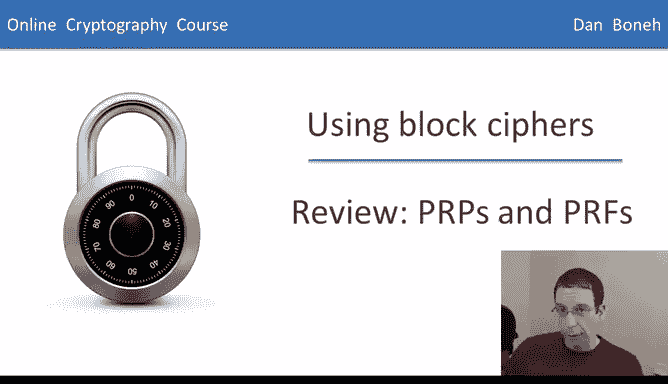
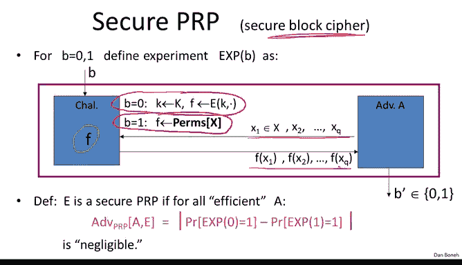
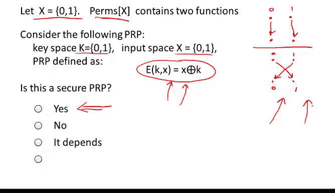
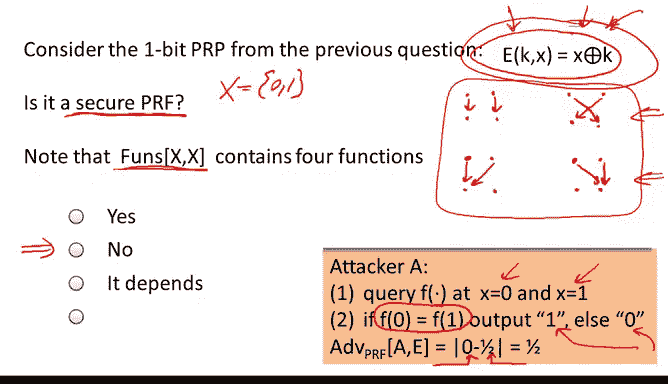
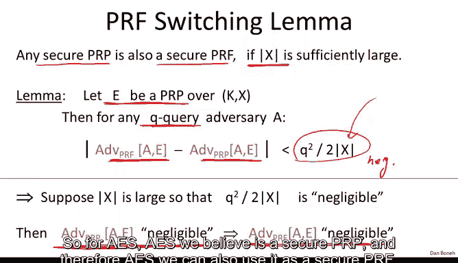
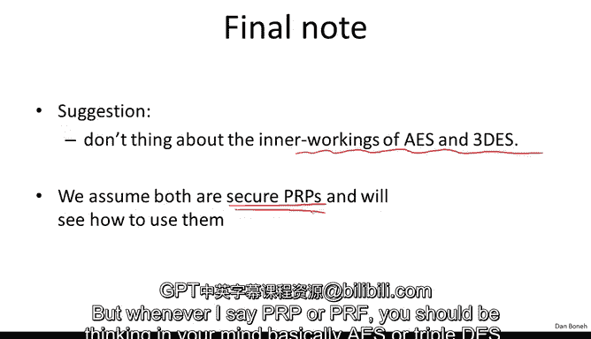

# 019：回顾PRP与PRF 🔐

在本节课中，我们将回顾伪随机置换（PRP）与伪随机函数（PRF）这两个核心概念。它们是理解分组密码如何用于安全加密的基础。我们将学习它们的定义、安全模型以及两者之间的关系。

---

上一节我们介绍了分组密码的概念。现在，在探讨如何使用它们进行安全加密之前，我们需要简要回顾一个重要的抽象概念：伪随机函数（PRF）和伪随机置换（PRP）。

分组密码将n比特的输入映射到n比特的输出，例如三重DES和AES。PRP和PRF是对分组密码概念的重要抽象。

一个伪随机函数（PRF）是一个接受两个输入的函数：一个密钥`K`和一个来自集合`X`的元素，并输出一个属于集合`Y`的元素。其基本要求是存在一个高效的算法来计算这个函数。我们稍后将讨论其安全性。

一个伪随机置换（PRP）与PRF类似，同样存在高效的计算算法`E`。但PRP有一个额外要求：它必须是一个对所有密钥都成立的一一映射（双射），并且存在一个高效的逆算法`D`。因此，PRP本质上是一个可逆的PRF。

---

现在我们来讨论如何定义安全的PRF。PRF的目标是看起来像一个从集合`X`到`Y`的随机函数。

为了更精确地描述这一点，我们定义以下符号：
*   `Funs[X, Y]`：表示所有从集合`X`映射到集合`Y`的函数的集合。这是一个极其庞大的集合。
*   `S_F`：表示由某个特定PRF（通过固定不同密钥`K`）所定义的所有具体函数的集合。这个集合的大小等于密钥空间的大小。

我们希望达到的效果是：从这个庞大集合`Funs[X, Y]`中随机选择一个函数，与从这个较小集合`S_F`中随机选择一个函数，是计算上不可区分的。

“不可区分”意味着，一个能够与某个函数进行交互的对手，无法区分他是在与`S_F`中的一个函数交互，还是在与`Funs[X, Y]`中的一个真正随机函数交互。

我们通过两个实验来形式化定义安全性：

*   **实验0**：挑战者随机选择一个PRF的密钥`K`，从而确定一个函数`f`（属于`S_F`）。
*   **实验1**：挑战者从`Funs[X, Y]`中真正随机地选择一个函数`f`。

在这两个实验中，对手都可以自适应地提交最多`Q`个查询`x1, x2, ..., xQ`，并得到对应的函数值`f(x1), f(x2), ..., f(xQ)`。最后，对手输出一个比特`b'`来猜测他处于哪个实验。

我们说一个PRF是安全的，如果对于任何高效（多项式时间）的对手，他在实验0中输出1的概率与在实验1中输出1的概率之差是可忽略的。这完美地捕捉了“对手无法区分伪随机函数与真正随机函数”这一概念。

---

安全伪随机置换（PRP，即安全的分组密码）的定义与PRF非常相似，关键区别在于比较的基准集合不同。

*   **实验0**：挑战者随机选择一个PRP的密钥`K`，从而确定一个置换`f`。
*   **实验1**：挑战者从`Perms[X]`（所有从集合`X`到自身的双射函数的集合）中真正随机地选择一个置换`f`。

对手的交互和判断方式与PRF实验相同。我们说一个PRP是安全的，如果对手无法区分他是在与一个PRP实例交互，还是与一个真正随机的置换交互。

---

让我们通过一个简单例子来理解这些概念。假设集合`X`只包含两个点：`{0, 1}`。

以下是关于PRP的思考：
*   此时，`Perms[X]`（所有双射函数）只包含两个函数：恒等函数`f(x)=x`和取反函数`f(x)=1-x`。
*   考虑一个PRP，其密钥空间`K={0,1}`，定义加密函数为`E(k, x) = x XOR k`。
*   问题是：这个PRP是一个安全的PRP吗？答案是**是**。因为该PRP实现的函数集合`{x XOR 0, x XOR 1}`正好等于`Perms[X]`。因此，随机选择密钥`k`产生的分布与从`Perms[X]`中随机选择函数的分布完全相同，对手无法区分。

我们已有一些安全PRP的例子，如三重DES和AES。关于AES，一个合理的具体安全假设是：所有运行时间不超过`2^80`步的算法，其攻击AES的优势最多为`2^-40`。

---

现在考虑同一个PRP：`E(k, x) = x XOR k`，其中`X={0,1}`。但这次的问题是：它是一个安全的PRF吗？

我们需要比较的不再是`Perms[X]`，而是`Funs[X, X]`（所有从`X`到`X`的函数）。这个集合包含四个函数：两个双射函数（恒等和取反），以及两个常数函数（`f(x)=0`和`f(x)=1`）。

这个PRP是安全的PRF吗？答案是**否**。存在一个简单的区分攻击：

以下是攻击步骤：
1.  对手查询`f(0)`和`f(1)`。
2.  如果发现`f(0) == f(1)`（即发生碰撞），那么他肯定不是在和一个PRP交互（因为PRP是双射，不可能有碰撞），所以他可以断定自己是在和`Funs[X, X]`中的一个随机函数交互。
3.  计算优势：当与PRP交互时，输出“是随机函数”的概率为0；当与真正随机函数交互时，四个函数中有两个满足`f(0)=f(1)`，所以输出“是随机函数”的概率为1/2。因此对手的优势为`|0 - 1/2| = 1/2`，这不是可忽略的，所以该PRP不是安全的PRF。

---

这个反例成立仅仅是因为定义域`X`太小。实际上，有一个重要的引理，称为**PRF转换引理**。它指出：一个安全的PRP，当其定义域`X`足够大时，它也是一个安全的PRF。

该引理表述如下：
对于一个定义在集合`X`上的PRP `E`，任何最多进行`Q`次查询的对手`A`，其区分`E`与随机函数的优势，和其区分`E`与随机置换的优势，两者之差的绝对值不超过 `Q² / (2 * |X|)`。

当`X`很大时（例如AES的块大小`|X|=2^128`），即使对手进行大量查询（例如`Q=2^32`约10亿次），`Q²/(2*|X|)`的值也是可忽略的。这意味着，对手攻击PRF的优势几乎等于他攻击PRP的优势。

因此，如果`E`是一个安全的PRP（如我们相信AES那样），那么它自动也是一个安全的PRF。所以对于AES，我们既可以将其视为一个安全的PRP，也可以将其视为一个安全的PRF来使用。

---

作为最后的总结，从今往后，我们可以暂时忘记AES和三重DES的内部工作原理，只需简单地假设它们都是安全的PRP。我们将基于这个抽象来学习如何构建加密方案。每当我提到PRP或PRF时，你可以在脑海中将其对应为AES或三重DES。

本节课中，我们一起学习了：
1.  PRF和PRP的抽象定义及其区别。
2.  如何通过交互实验形式化定义它们的安全性。
3.  通过小域的例子理解了概念和攻击。
4.  掌握了重要的PRF转换引理，它说明了在定义域足够大的情况下，安全的PRP必然是安全的PRF。
5.  确立了将AES等分组密码作为安全PRP/PRF使用的理论基础。