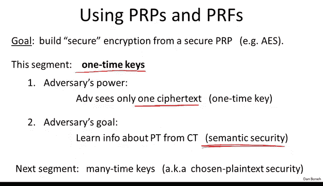
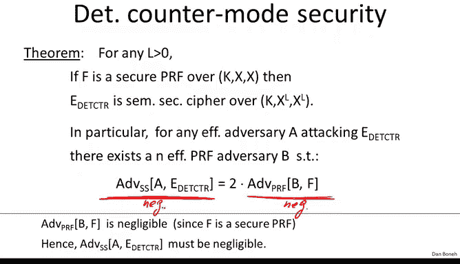
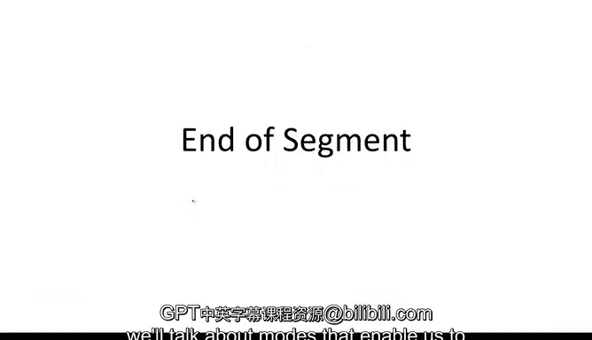

# 020：一次性密钥 🔑

在本节课中，我们将学习如何使用分组密码进行加密，特别是探讨在**一次性密钥**场景下的正确使用方法。我们将从一种常见但**不安全**的模式开始，然后介绍一种安全的加密模式。

## 概述

上一节我们介绍了分组密码的基本概念。本节中，我们来看看如何利用分组密码，在密钥仅使用一次的情况下，安全地加密长消息。我们将首先分析一个经典但存在严重缺陷的模式，然后学习一种基于伪随机函数构建的安全加密方案。

## 电子密码本模式：一个经典错误

当我们想用分组密码加密时，首先想到的方法可能是将消息分割成块，然后独立加密每个块。这种模式被称为**电子密码本**模式。

以下是其工作原理：
1.  将消息分割成与分组密码块大小相等的块。对于AES，每个块为16字节。
2.  使用相同的密钥独立加密每个块。

然而，这种模式存在严重的安全问题。如果两个明文块相同，那么加密后得到的两个密文块也必然相同。攻击者即使不知道明文内容，也能通过观察密文块是否相等，推断出明文块之间的关系，从而泄露了本不应泄露的信息。

为了更直观地说明，考虑加密一张图片。如果图片中某些区域（如深色头发）的像素值重复出现，在ECB模式下，这些区域的密文也会重复，导致原始图像的轮廓在加密后的数据中依然可见。这清楚地展示了ECB模式如何泄露明文信息。

因此，ECB模式**绝不能**用于加密长度超过一个块的消息。

## 实现语义安全的目标

在深入安全模式之前，我们先简要回顾一下我们的安全目标：**语义安全**。在一次性密钥的场景下，攻击者选择两个消息 `M0` 和 `M1`，然后获得其中一个的加密结果。我们的目标是确保攻击者无法区分他获得的是 `M0` 还是 `M1` 的加密结果。由于密钥只用于加密一条消息，攻击者只会看到一个用该密钥加密的密文。

现在，我们可以形式化地证明ECB模式不满足语义安全。假设我们加密两个块。攻击者可以构造如下两个消息：
*   `M0`: 两个块不同（例如，“hello” 和 “world”）。
*   `M1`: 两个块相同（例如，“hello” 和 “hello”）。

挑战者随机选择加密 `M0` 或 `M1`，返回两个密文块。攻击者只需检查这两个密文块是否相等：
*   如果相等，则说明明文块相同，他收到的必然是 `M1` 的加密。
*   如果不相等，则说明明文块不同，他收到的必然是 `M0` 的加密。

该攻击者的优势为1，完美地区分了两种加密，因此ECB模式不是语义安全的。

## 安全的方案：确定性计数器模式

那么，我们应该怎么做呢？一个简单而安全的方法是使用**确定性计数器模式**。这种模式本质上是用分组密码（作为一个安全的伪随机函数PRF）来构建一个流密码。

以下是其工作原理：
1.  将消息 `M` 分割成 `L` 个块：`M[1], M[2], ..., M[L]`。
2.  使用密钥 `K` 和伪随机函数 `F`（如AES），在计数器值 `0, 1, 2, ..., L-1` 上进行计算，生成一个伪随机密钥流。
3.  将每个消息块与对应的密钥流块进行异或操作，得到密文块。

用公式表示加密过程为：
`C[i] = M[i] ⊕ F(K, i)`，其中 `i = 0, 1, ..., L-1`

这实际上就是用像AES这样的PRF构建的一个流密码。

### 安全性证明简述

我们已经学过流密码使用伪随机数生成器的安全性证明，这里的证明思路类似。对于任何试图攻击确定性计数器模式的敌手A，我们可以构造一个攻击PRF的敌手B。其优势关系可以表示为：
`Advantage[A] ≤ Advantage[B] + negligible term`

由于PRF是安全的，`Advantage[B]` 可忽略，因此 `Advantage[A]` 也可忽略。这意味着敌手无法以显著优势攻破该模式。

证明的核心思想是一个三步混合论证：
1.  在真实世界中，敌手面对的是使用PRF `F(K, ·)` 的加密。
2.  我们假设将PRF替换为一个**真正的随机函数** `RF(·)`。由于PRF是安全的，敌手无法区分步骤1和步骤2。
3.  在步骤2中，密钥流 `RF(i)` 是真正随机的。此时，加密方案等同于**一次性密码本**，因此加密 `M0` 和加密 `M1` 的分布在统计上是不可区分的（实际上是相同的分布）。

通过这一系列不可区分的步骤，我们证明了确定性计数器模式在一次性密钥场景下是语义安全的。

## 总结

本节课中我们一起学习了分组密码在一次性密钥下的操作模式。
*   我们首先分析了**电子密码本**模式，指出其通过暴露明文块间的相等性而存在严重安全漏洞，**绝对不可用于加密多块消息**。
*   接着，我们介绍了**确定性计数器模式**。该模式将分组密码作为伪随机函数，通过将其应用于递增的计数器值来生成密钥流，再与明文进行异或加密。我们概述了其安全性证明，表明它能满足语义安全的要求。

下一节，我们将探讨如何扩展这些概念，使用同一个密钥安全地加密**多条**消息。