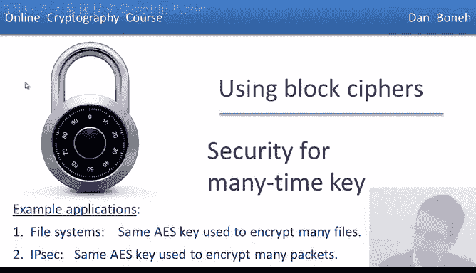
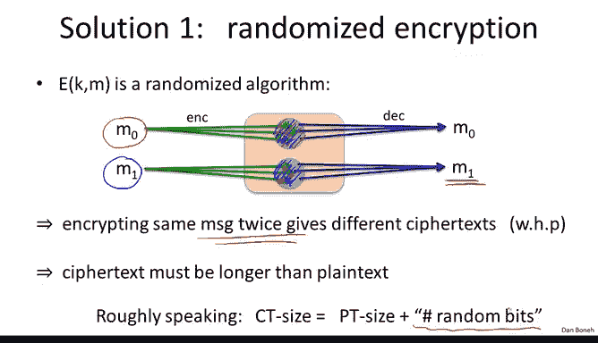
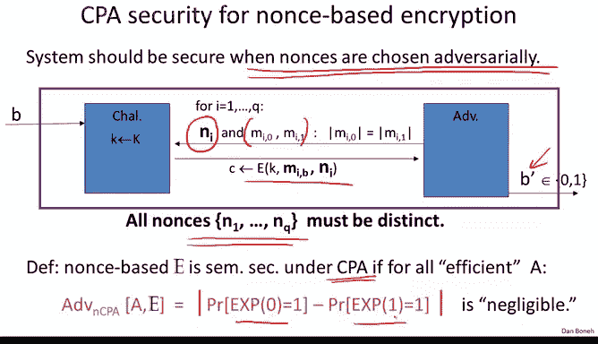

# 021：CPA安全 🔐

在本节中，我们将学习如何使用分组密码，在同一个密钥下加密多条消息。这在实践中很常见，例如，在文件系统中使用同一个密钥加密多个文件，或在网络协议中使用同一个密钥加密多个数据包。我们将探讨如何实现这一点，并首先定义当同一个密钥用于加密多条消息时，密码系统的安全性意味着什么。

## 选择明文攻击（CPA）模型

当我们多次使用同一个密钥时，攻击者会看到许多用该密钥加密的密文。因此，在定义安全性时，我们将允许攻击者发起所谓的“选择明文攻击”。这意味着攻击者可以获取他选择的任意消息的加密结果。

例如，如果攻击者与Alice交互，他可以请求Alice加密他选择的任意消息，而Alice会加密这些消息并将生成的密文交给攻击者。你可能会问，Alice为什么会这样做？这在现实中确实可能发生。实际上，这种模型是对现实情况的一种相当保守的建模。例如，攻击者可能向Alice发送一封电子邮件。当Alice收到邮件后，她将其写入自己的加密磁盘，从而使用她的密钥加密了攻击者的邮件。如果后来攻击者窃取了磁盘，他就获得了用Alice密钥加密的他发送给Alice的邮件密文。这就是一个选择明文攻击的例子。

攻击者的能力就是如此，而其目标基本上是破坏语义安全性。

## CPA安全性的精确定义

接下来，我们将更精确地定义这种安全性。与往常一样，我们将通过两个实验（实验0和实验1）来定义选择明文攻击下的语义安全性，这两个实验被建模为挑战者和攻击者之间的一个游戏。

游戏开始时，挑战者会选择一个随机密钥 `K`。然后攻击者可以开始查询挑战者。攻击者首先提交一个语义安全查询，即他提交两条等长的消息 `M0` 和 `M1`。然后，攻击者会收到其中一条消息的加密结果：在实验0中，他收到 `M0` 的加密；在实验1中，他收到 `M1` 的加密。到目前为止，这看起来像一个标准的语义安全游戏。

然而，在选择明文攻击中，攻击者可以重复此查询。他可以再次提交另一对等长的选择明文，并再次收到其中一条的加密结果。攻击者可以继续发出此类查询，我们假设他最多可以发出 `Q` 次这样的查询。每次他提交一对等长的消息，他要么得到左边消息的加密，要么得到右边消息的加密。在实验0中，他总是得到左边消息的加密；在实验1中，他总是得到右边消息的加密。

攻击者的目标是弄清楚他处于实验0还是实验1。换句话说，他是持续收到左边消息的加密，还是右边消息的加密。从某种意义上说，这是一个标准的语义安全游戏，只是攻击者可以自适应地、一个接一个地发出多次查询。

选择明文攻击体现在：如果攻击者想要某个特定消息 `M` 的加密，他可以在某次查询 `j` 中，将 `M0` 和 `M1` 都设置为完全相同的消息 `M`。由于两条消息相同，他知道他将收到他感兴趣的消息 `M` 的加密。这正是我们所说的选择明文攻击，攻击者可以提交消息 `M` 并收到该消息的加密。

因此，他的一些查询可能是这种选择明文性质的（左右消息相同），而另一些查询可能是标准的语义安全查询（两条消息不同），这实际上为他提供了关于他处于哪个实验的信息。

现在，我们应该熟悉这个定义了：我们说一个系统在选择明文攻击下是语义安全的，如果对于所有高效的攻击者，他们无法区分实验0和实验1。换句话说，攻击者输出 `b'`（我们记作实验 `b` 的输出）的概率，在实验0和实验1中是相同的。攻击者无法区分总是收到左边消息的加密与总是收到右边消息的加密。

## 确定性加密的不足

我断言，到目前为止我们看到的所有密码，例如确定性计数器模式或一次性密码本，在选择明文攻击下都是不安全的。更一般地说，假设我们有一个加密方案，对于特定消息 `M` 总是输出相同的密文。换句话说，如果我让加密方案加密消息 `M` 一次，然后再让它加密消息 `M` 一次，如果两次都输出相同的密文，那么这个系统不可能在选择明文攻击下是安全的。

确定性计数器模式和一次性密码本都具有这种特性：给定相同的消息，它们总是输出相同的密文。

让我们看看为什么这不能是选择明文安全的。攻击实际上相当简单。攻击者将输出相同的消息两次。这表明他确实想要 `M0` 的加密。这里攻击者得到了 `C0`，即 `M0` 的加密。这是他选择明文查询的结果，他实际上收到了他选择的消息 `M0` 的加密。现在他要破坏语义安全性。他做的是输出两条等长的消息 `M0` 和 `M1`，然后他会得到 `M_b` 的加密。但是请注意，我们说加密系统在加密消息 `M0` 时总是输出相同的密文。因此，如果 `b = 0`，我们知道挑战密文 `C` 就等于 `C0`。然而，如果 `b = 1`，那么挑战密文是 `M1` 的加密，它不等于 `C0`。

攻击者所做的就是检查 `C` 是否等于 `C0`。如果相等，他输出 `0`；否则输出 `1`。在这种情况下，攻击者能够完美地猜出比特 `b`，因此他确切地知道他被给予的是 `M0` 的加密还是 `M1` 的加密。结果，他在这个游戏中获胜的优势是 `1`，这意味着该系统不可能是CPA安全的（`1` 不是一个可忽略的数字）。

这表明确定性加密方案不可能是CPA安全的。但在实践中这意味着什么呢？这意味着每条消息总是被加密成相同的密文。如果你在磁盘上加密文件，并且恰好加密了两个相同的文件，它们会产生相同的密文。那么攻击者通过查看加密磁盘就会知道这两个文件实际上包含相同的内容。攻击者可能不知道内容是什么，但他会知道两个加密文件是相同内容的加密，而他不应该能够知道这一点。

类似地，如果你在网络上发送两个相同的加密数据包，攻击者将不知道这些数据包的内容，但会知道这两个数据包包含相同的信息。例如，考虑一个加密的语音对话，每次线路安静时，系统都会发送零的加密。但由于零的加密总是映射到相同的密文，观察网络的攻击者将能够准确识别对话中安静的时刻，因为他每次都会看到完全相同的密文。

这些是确定性加密不可能安全的例子。形式上，我们说确定性加密在选择明文攻击下不可能是语义安全的。

## 解决方案：随机化加密与Nonce加密

那么我们该怎么办呢？这里的教训是：如果密钥将被用于加密多条消息，那么最好做到，给定相同的明文加密两次时，加密算法必须产生不同的密文。有两种方法可以实现这一点。

第一种方法称为**随机化加密**。在这里，加密算法本身会在加密过程中选择一些随机字符串，并使用该随机字符串来加密消息 `M`。这意味着，例如，一个特定的消息 `M0` 不会只映射到一个密文，而是会映射到一整“球”密文。每次加密时，我们基本上输出这个球中的一个点。每次加密时，加密算法选择一个随机字符串，该随机字符串导致球中的一个点。当然，解密算法在获取球中的任何点时，总是会将结果映射到 `M0`。类似地，消息 `M1` 的密文也会映射到一个球。由于加密算法使用随机性，如果我们用高概率加密相同的消息两次，我们会得到不同的密文。

不幸的是，这意味着密文必须比明文长，因为用于生成密文的随机性现在以某种方式编码在密文中。因此，密文占用更多空间，粗略地说，密文大小将比明文大，大约等于加密过程中使用的随机比特数。如果明文非常大（例如千兆字节长），随机比特数可能在128位左右，也许这个额外的空间并不重要。但如果明文非常短（可能它们本身只有128位），给每个密文增加额外的128位将使总密文大小翻倍，这可能相当昂贵。

因此，随机化加密是一个很好的解决方案，但在某些情况下，它实际上会带来相当大的成本。

## 随机化加密示例

让我们看一个简单的例子。假设我们有一个伪随机函数 `F`，它接受某个空间 `R`（称为nonce空间）中的输入，并输出在消息空间 `M` 中。

现在定义以下随机化加密方案：当我们想要加密消息 `M` 时，加密算法首先在nonce空间 `R` 中生成一个随机的 `r`。然后它输出一个由两部分组成的密文：第一部分是值 `r`，第二部分是伪随机函数在点 `r` 处的评估值与消息 `M` 的异或结果：`F(r) XOR M`。

我的问题是：这个加密系统在选择明文攻击下是语义安全的吗？

正确答案是**是的**，但前提是nonce空间 `R` 足够大，使得 `r` 以极高的概率永不重复。让我们快速论证为什么这是真的。首先，因为 `F` 是一个安全的伪随机函数，我们不妨用一个真正的随机函数来替换它。换句话说，这与我们使用真正的随机函数 `f` 在点 `r` 处求值然后与 `M` 异或来加密消息 `M` 的情况是无法区分的。

但由于这个 `r` 从不重复，每个密文使用不同的 `r`，这意味着 `F(r)` 的值每次都是随机、均匀、独立的字符串。因此，每次我们加密消息时，我们基本上都是使用一个新的均匀随机的一次性密码本来加密它。由于将均匀字符串与任何字符串进行异或只会产生一个新的均匀字符串，因此生成的密文分布为两个随机均匀的字符串（我们称它们为 `r` 和 `r'`）。因此，在实验0和实验1中，攻击者看到的都是真正的均匀随机字符串 `(r, r')`。由于在两个实验中攻击者看到的是相同的分布，他无法区分这两个分布。因此，既然在使用真正的随机函数时安全性完全成立，那么在使用伪随机函数时，安全性也将成立。

这是一个很好的例子，展示了我们如何利用伪随机函数表现得像随机函数这一事实，来论证这个特定加密方案的安全性。

## 另一种方案：Nonce加密

构建选择明文安全加密方案的另一种方法是所谓的**Nonce加密**。

在Nonce加密系统中，加密算法实际上接受三个输入，而不是两个：通常接受密钥和消息，但它还接受一个称为Nonce的额外输入。类似地，解密算法也接受Nonce输入，然后产生解密后的明文。

这个Nonce值 `N` 是什么？Nonce是一个公开值，不需要对攻击者隐藏。唯一的要求是，密钥-`Nonce` 对 `(K, N)` 只用于加密一条消息。换句话说，这个 `(K, N)` 对必须随消息而变化。有两种改变它的方法：一种是为每条消息选择一个新的随机密钥；另一种是始终使用相同的密钥，但必须为每条消息选择一个新的Nonce。

我想再次强调，这个Nonce不需要是秘密的，也不需要是随机的。唯一的要求是Nonce是唯一的。实际上，在整个课程中我们将使用这个术语：对我们来说，Nonce意味着一个不重复的唯一值，它不必是随机的。

## Nonce选择示例

让我们看一些选择Nonce的例子。最简单的选择是让Nonce成为一个计数器。例如，在网络协议中，你可以想象Nonce是一个数据包计数器，每次发送方发送数据包或接收方接收数据包时递增。这意味着加密方必须在消息之间保持状态，即必须保留这个计数器并在每条消息传输后递增。

有趣的是，如果解密方拥有相同的状态，那么就没有必要在密文中包含Nonce，因为Nonce是隐含的。

让我们看一个例子：HTTPS协议运行在可靠的传输机制上，这意味着发送方发送的数据包假设按顺序被接收方接收。因此，如果发送方发送数据包5，然后发送数据包6，接收方将按该顺序接收数据包5和数据包6。这意味着如果发送方维护一个数据包计数器，接收方也可以维护一个数据包计数器，并且两个计数器基本上同步递增。在这种情况下，没有理由在数据包中包含Nonce，因为Nonce在双方之间是隐含的。

然而，在其他协议中，例如在IPSec（设计用于加密IP层的协议）中，IP层不保证按顺序交付。因此，发送方可能发送数据包5，然后发送数据包6，但这些数据包可能以相反的顺序被接收方接收。在这种情况下，仍然可以使用数据包计数器作为Nonce，但现在Nonce必须包含在数据包中，以便接收方知道使用哪个Nonce来解密接收到的数据包。

因此，基于Nonce的加密是实现CPA安全的一种非常高效的方式。特别是，如果Nonce是隐含的，它甚至不会增加密文长度。

当然，生成唯一Nonce的另一种方法是简单地随机选择Nonce，假设Nonce空间足够大，使得在密钥的生命周期内，Nonce以高概率永不重复。在这种情况下，Nonce加密就简化为随机化加密。然而，这样做的好处是发送方不需要在消息之间保持任何状态。例如，如果加密发生在多个设备上（例如，我可能同时拥有笔记本电脑和智能手机，它们可能使用相同的密钥），那么如果要求有状态的加密，我的笔记本电脑和智能手机就必须协调以确保它们从不重用相同的Nonce。而如果它们都简单地随机选择Nonce，它们就不需要协调，因为以极高的概率，它们根本不会选择相同的Nonce（再次假设Nonce空间足够大）。因此，在某些情况下，无状态加密非常重要，特别是当同一个密钥被多台机器使用时。

## Nonce加密的安全性定义

我想更精确地定义Nonce加密的安全性，特别是要强调，当Nonce由攻击者选择时，系统必须保持安全。允许攻击者选择Nonce很重要，因为攻击者可以选择他想要攻击的密文。想象一下Nonce恰好是一个计数器。当计数器达到值15时，也许在那个时候攻击者很容易破坏语义安全性。因此，攻击者会等到第15个数据包被发送，然后才要求破坏语义安全性。因此，当我们谈论基于Nonce的加密时，我们通常允许攻击者选择Nonce，并且即使在这种情况下，系统也应保持安全。

让我们在这种情况下定义CPA游戏，它实际上与之前的游戏非常相似。基本上，攻击者提交消息对 `(M_i0, M_i1)`（显然它们必须等长），并且他提供Nonce `N_i`。作为回应，攻击者被给予使用他选择的Nonce `N_i` 加密的 `M_i0` 或 `M_i1`。当然，与往常一样，攻击者的目标是分辨他被给予的是左边明文的加密还是右边明文的加密。

和以前一样，攻击者可以迭代这些查询，他可以发出任意多次查询，我们通常用 `Q` 表示攻击者发出的查询次数。现在，唯一的关键限制是：尽管攻击者可以选择Nonce，但他被限制选择不同的Nonce。我们强制他选择不同Nonce的原因是，这是实践中的要求。即使攻击者欺骗Alice为他加密多条消息，Alice也永远不会再次使用相同的Nonce。因此，攻击者永远不会看到使用相同Nonce加密的消息，所以即使在游戏中，我们也要求所有Nonce都是不同的。

然后像往常一样，我们说一个Nonce加密系统在选择明文攻击下是语义安全的，如果攻击者无法区分实验0（他被给予左边消息的加密）和实验1（他被给予右边消息的加密）。

## Nonce加密示例

让我们看一个Nonce加密系统的例子。和之前一样，我们有一个安全的伪随机函数 `F`，它接受Nonce空间 `R` 中的输入，并输出消息空间 `M` 中的字符串。

当选择新密钥时，我们将重置计数器 `r` 为 `0`。现在，当加密特定消息 `M` 时，我们将递增计数器 `r`，然后使用应用于该值 `r` 的伪随机函数来加密消息 `M`。和以前一样，密文将包含两个部分：计数器的当前值，以及消息 `M` 的一次性密码本加密结果：`(r, F(r) XOR M)`。

我的问题是：这是一个安全的Nonce加密系统吗？

和之前一样，答案是**是的**，但前提是Nonce空间足够大，以至于当我们递增计数器 `r` 时，它永远不会循环回 `0`，从而Nonce将始终是唯一的。我们以与之前相同的方式论证安全性：因为PRF是安全的，我们知道这个加密系统与使用真正的随机函数是无法区分的。换句话说，如果我们对计数器应用一个真正的随机函数，并将结果与明文 `M` 异或。现在，由于Nonce `r` 从不重复，每次我们计算 `F(r)` 时，都会得到一个真正随机、均匀且独立的字符串，因此我们实际上是在使用一次性密码本加密每条消息。结果，攻击者在两个实验中所看到的都基本上只是一对随机字符串。

因此，在实验0和实验1中，攻击者看到的分布完全相同，即所有这些选择明文查询的响应都只是均匀分布的字符串对。这在实验0和实验1中基本相同，因此攻击者无法区分这两个实验。既然他无法在使用真正随机函数的语义安全游戏中获胜，那么他在使用安全PRF的语义安全游戏中也无法获胜，因此该方案是安全的。

## 总结

现在，我们理解了当密钥用于加密多条消息时，对称系统安全意味着什么。要求是它必须在选择明文攻击下是安全的。我们说过，基本上要在选择明文攻击下安全的唯一方法是使用随机化加密，或使用Nonce永不重复的Nonce加密。

在接下来的两节中，我们将构建两个经典的加密系统，它们在密钥被多次使用时是安全的。