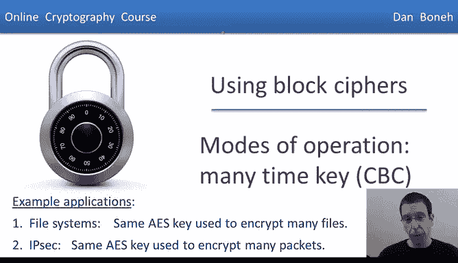
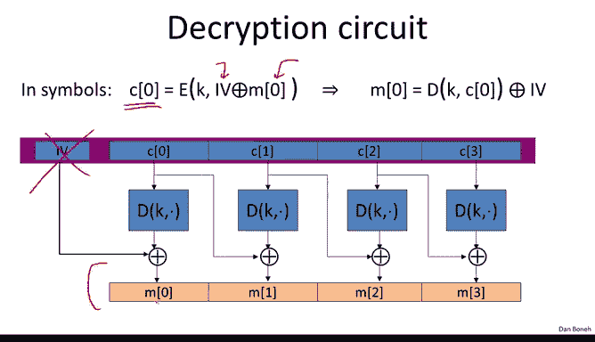
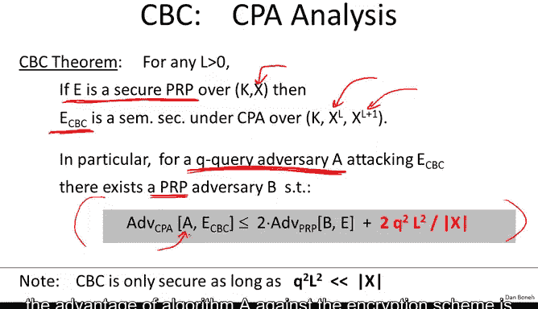
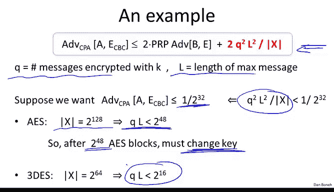
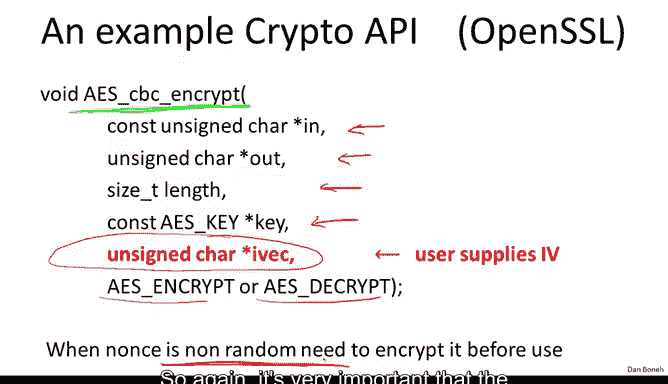

# 022：多密钥CBC 🔐



在本节课中，我们将要学习一种称为**密码分组链接**的操作模式，它能够利用分组密码构建出具备选择明文安全性的加密方案。我们将详细探讨其工作原理、安全性定理、实际应用中的注意事项以及如何处理非标准长度的消息。

## 概述

上一节我们介绍了选择明文安全的概念。本节中，我们来看看如何构建满足该安全性的加密方案。第一个这样的方案就是**密码分组链接**模式。

CBC是一种使用分组密码来获得选择明文安全性的方法。具体来说，我们将探讨一种使用**随机初始化向量**的CBC模式。

## CBC加密的工作原理

假设我们有一个分组密码 `E`。我们定义CBC加密方案 `E_CBC` 如下：


加密算法在加密消息 `M` 时，首先会选择一个随机的IV。IV的长度恰好是一个分组密码块的大小。对于AES，IV是16字节。


然后，算法执行以下步骤：我们选择的IV会与第一个明文块进行异或运算。结果使用分组密码进行加密，输出第一个密文块。接着是链接部分：我们使用第一个密文块来掩盖第二个明文块。将两者异或后，加密结果成为第二个密文块，依此类推。

这就是密码分组链接。可以看到，每个密文块都被链接并异或到下一个明文块中。最终的密文将包含最初选择的IV以及所有的密文块。



IV代表初始化向量。每当加密方案在开始时需要随机选择某些内容时，我们通常会称其为IV。

需要注意的是，密文比明文略长，因为我们必须将IV包含在密文中，这基本上捕获了加密过程中使用的随机性。

以下是加密过程的公式化描述：
```
C[0] = IV
For i = 1 to L:
    C[i] = E(K, P[i] XOR C[i-1])
```
最终密文为 `(IV, C[1], ..., C[L])`。

## CBC解密的工作原理

第一个问题是，我们如何解密CBC加密的结果？



回顾加密过程：加密第一个消息块时，我们将其与IV异或，加密结果成为第一个密文块。那么，给定第一个密文块，如何恢复原始的第一个明文块？

解密实际上与加密非常相似。解密电路几乎相同，只是异或运算在底部而不是顶部。本质上，我们在解密过程中去掉了IV，只输出原始消息。IV被解密算法丢弃。

解密过程的公式如下：
```
P[i] = D(K, C[i]) XOR C[i-1]
其中 C[0] = IV
```

## CBC模式的安全性定理

以下定理表明，使用随机IV的CBC模式加密在选择明文攻击下实际上是语义安全的。

更精确地说，如果我们从一个伪随机置换开始，即一个定义在空间 `X` 上的安全分组密码 `E`，那么我们将得到一个加密算法 `E_CBC`，它接受长度为 `L` 的消息，并输出长度为 `L+1` 的密文。

假设有一个进行 `Q` 次选择明文查询的敌手。那么我们可以陈述以下安全事实：对于每个攻击 `E_CBC` 的敌手 `A`，都存在一个攻击原始PRP（分组密码）的敌手 `B`，满足以下关系：

`Adv_CPA[A, E_CBC] <= Adv_PRP[B, E] + (Q^2 * L^2) / |X|`



这意味着，由于 `E` 是一个安全的PRP，`Adv_PRP[B, E]` 是可忽略的。我们的目标是说明敌手 `A` 的优势也是可忽略的。然而，这里我们被一个额外的误差项所阻碍。要论证CBC是安全的，我们必须确保这个误差项也是可忽略的。

## 实际安全界限分析

这表明，为了使 `E_CBC` 安全，`Q^2 * L^2` 必须远小于 `|X|` 的值。

让我们回顾一下 `Q` 和 `L` 是什么。`L` 是我们加密的消息的长度。`Q` 是敌手在CPA攻击下能看到的密文数量。在实际中，`Q` 基本上是我们使用密钥 `K` 加密消息的次数。

让我们看看这在现实世界中意味着什么。假设我们希望敌手的优势小于 `1/2^32`。这意味着误差项最好小于 `1/2^32`。

以AES为例。AES使用128位块，所以 `|X| = 2^128`。将其代入表达式，你会发现乘积 `Q * L` 最好小于 `2^48`。这意味着在使用特定密钥加密 `2^48` 个AES块后，我们必须更换密钥。本质上，CBC在密钥用于加密 `2^48` 个不同的AES块后就不再安全。

有趣的是，如果将同样的分析应用于DES，DES的块大小只有64位，你会发现密钥必须更频繁地更换，大约每 `2^16` 个DES块就需要生成一个新密钥。这是AES具有更大块大小的原因之一，这样像CBC这样的模式会更安全，并且可以在更长时间内使用密钥而无需更换。

## 关于IV可预测性的警告


需要警告你一个在使用带随机IV的CBC时非常常见的错误：一旦攻击者能够预测你将用于加密特定消息的IV，密码方案 `E_CBC` 就不再是CPA安全的。

因此，在使用带随机IV的CBC时，确保IV不可预测至关重要。让我们来看一个攻击示例。

假设攻击者给定某个消息的加密后，能够预测将用于下一条消息的IV。让我们展示这个系统实际上不是CPA安全的。

敌手首先请求加密一个单块消息，该块为全0。敌手得到的是消息的加密，即 `0 XOR IV` 的加密，当然，敌手也获得了IV。

接着，敌手根据假设可以预测将用于下一次加密的IV。然后，敌手发出他的语义安全挑战：消息 `M0` 是预测的IV与之前加密中使用的 `IV1` 的异或，而消息 `M1` 是其他任意消息。

现在，当敌手收到语义安全挑战的结果时，他会收到 `M0` 或 `M1` 的加密。如果收到的是 `M0` 的加密，那么实际被加密的明文是 `(IV XOR IV1) XOR IV`，这正好等于 `IV1`。敌手会收到 `IV1` 的块加密。请注意，他已经从之前的选择明文查询中获得了这个值。

而当他收到消息 `M1` 的加密时，他收到的只是 `M1` 的正常CBC加密。

因此，他现在有一个简单的方法来破解该方案：他会检查挑战密文的第二个块是否等于他在CPA查询中收到的值。如果相等，他就说收到了 `M0` 的加密，否则就说收到了 `M1` 的加密。这个敌手的优势是1，因此他完全破坏了CBC加密的CPA安全性。

这里的教训是：如果IV是可预测的，那么就没有CPA安全性。不幸的是，这实际上是一个非常常见的错误实践。例如，在SSL协议和TLS 1.1中，记录 `i` 的IV实际上是记录 `i-1` 的最后一个密文块。这意味着，给定记录 `i-1` 的加密，敌手确切地知道将用于记录 `i` 的IV是什么。就在去年夏天，这被转化为对SSL的一次相当具有破坏性的攻击。

## 基于Nonce的CBC加密

现在，我将向你展示CBC加密的基于Nonce的版本。在这种模式下，IV被一个非随机但唯一的Nonce所取代，例如数字1, 2, 3, 4, 5都可以用作Nonce。

这种模式的吸引力在于，如果接收者确实知道Nonce应该是什么，那么就没有理由将Nonce包含在密文中。在这种情况下，密文的长度与明文完全相同，这与带随机IV的CBC不同，后者必须扩展密文以包含IV。

因此，使用非随机但唯一的Nonce是完全可行的。然而，必须绝对清楚的是，如果这样做，在使用Nonce进入CBC链之前，还有一步必须完成。

具体来说，在这种模式下，我们将使用两个独立的密钥 `K` 和 `K1`。密钥 `K` 和之前一样，用于加密各个消息块。然而，密钥 `K1` 将用于加密非随机但唯一的Nonce，使得输出成为一个随机的IV，然后该IV被用于CBC链中。

这个用密钥 `K1` 加密Nonce的额外步骤绝对至关重要。没有它，CBC模式加密将不安全。特别是，如果你直接使用Nonce输入CBC加密，换句话说，你将Nonce用作IV，那么我们已经知道非随机的Nonce不会是CPA安全的。但事实上，即使你设 `K` 等于 `K1`，即你只是用密钥 `K` 加密Nonce，这也不会是CPA安全的，并可能导致严重的攻击。

因此，我希望你明白，如果CBC模式加密中的Nonce不是随机的，就必须进行这个额外的加密步骤。这是一个极其常见的实践错误。许多真实世界的产品和密码库实际上忘记了在使用Nonce进入CBC链之前对其进行加密，这导致了实际且严重的攻击。

此外，了解这一点非常重要，因为实际上许多密码API的设置几乎是在故意误导用户错误地使用CBC。例如，在OpenSSL中，用户被要求提供IV参数，而该函数直接在CBC加密机制中使用这个IV，没有在使用前对其进行加密。因此，如果你曾经使用非随机IV调用此函数，生成的加密系统将不是CPA安全的。

## 处理非标准长度消息

关于CBC的最后一个技术细节是，当消息长度不是分组密码块长度的倍数时该怎么办？也就是说，如果最后一个消息块短于AES的块长度（例如，小于16字节），我们该怎么办？



答案是，我们向最后一个块添加填充，使其长度达到16字节（AES块大小），这个填充当然会在解密过程中被移除。

以下是TLS中使用的典型填充方式：如果你用 `n` 个字节填充，那么你基本上将数字 `n` 重复写 `n` 次。例如，如果你用5个字节填充，你就用字符串 `0x05 0x05 0x05 0x05 0x05` 填充。

这种填充的关键在于，当解密者收到消息时，他会查看最后一个块的最后一个字节。假设该值是5，那么他只需移除消息的最后五个字节。

现在的问题是，如果消息恰好是16字节的倍数，我们该怎么办？实际上，如果不需要填充，那就会有问题，因为解密者会查看最后一个块的最后一个字节（现在是实际消息的一部分），并从中移除那么多字节的明文，这实际上会造成问题。

解决方案是，即使实际上不需要填充，我们仍然必须添加一个虚拟块。这个虚拟块基本上包含16个字节，每个字节都是数字16。解密者在解密时，查看最后一个块的最后一个字节，看到值是16，因此移除整个块，剩下的就是实际的明文。

这有点不幸，因为如果你用CBC加密短消息，并且消息恰好是32字节（16字节的倍数），那么你必须再添加一个块，使整个密文变成48字节，只是为了适应CBC填充。我应该提到，CBC有一个变体称为“密文窃取CBC”，可以避免这个问题，但这里不进行描述。

## 总结


本节课中，我们一起学习了**密码分组链接**模式。我们了解了CBC如何使用随机IV或加密后的Nonce来构建CPA安全的加密方案。我们探讨了其加密和解密过程，分析了其安全性定理及实际应用中的界限。我们强调了**IV不可预测性**的极端重要性，并指出了API使用中的常见陷阱。最后，我们讨论了如何处理非标准长度的消息。理解这些细节对于正确和安全地实现CBC至关重要。下一节，我们将看看如何使用计数器模式来加密多个消息。