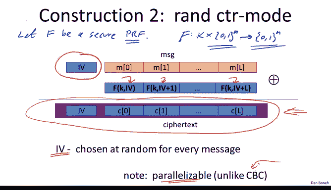
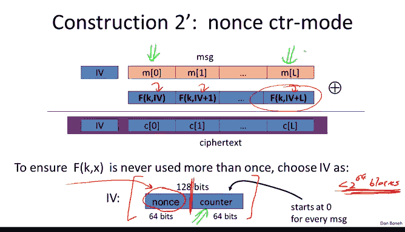

# 023：多密钥CTR

## 概述
在本节课中，我们将学习一种比CBC模式更优的、能够实现选择明文安全性的加密方法：随机化计数器模式。我们将详细探讨其工作原理、安全定理，并与CBC模式进行全面比较。

## 随机化计数器模式的工作原理
上一节我们介绍了CBC模式，本节中我们来看看随机化计数器模式。与CBC不同，随机化计数器模式使用一个安全的伪随机函数，而非必须使用分组密码。这是因为在计数器模式中，我们永远不需要对函数F进行求逆。

我们令F为一个安全的伪随机函数，它作用于n比特的分组。例如，若使用AES-128，则n=128。计数器模式的加密算法工作方式如下：首先选择一个随机的初始化向量。在AES中，这是一个128比特的随机IV。然后，我们从这个随机IV开始计数。第一个加密的是IV本身，然后是IV+1，直到IV+L。我们生成这个随机密钥流，将其与明文进行异或操作，从而得到密文。需要注意的是，IV会与密文一起被包含在输出中，因此密文实际上比原始明文略长。加密算法为每条消息选择一个新的IV，因此即使对同一消息加密两次，也会得到不同的密文结果。

计数器模式的一个显著特点是完全可并行化。与CBC的顺序处理不同，CBC在加密第5个分组前必须先加密完前4个分组。这意味着即使硬件拥有多个AES引擎，在使用CBC时也无法并行利用它们，因为CBC本质上是顺序的。而计数器模式则完全不同，如果你有三个AES引擎，加密速度基本上可以提高三倍。

## 基于Nonce的计数器模式
计数器模式还有一种对应的变体，称为基于Nonce的计数器模式，其中IV并非真正随机，而只是一个计数器之类的Nonce。实现方式是将AES使用的128比特分组分成两部分：左边的64比特用作Nonce，右边的64比特用作内部计数器。Nonce部分可以是一个从0计数到2^64的计数器。一旦指定了Nonce，低位的64比特就在计数器加密内部进行计数。Nonce放在左边，计数器放在右边。只要这个Nonce是不可预测的，就没有问题。唯一的限制是，使用一个特定的Nonce最多只能加密2^64个分组。危险在于，要避免计数器重置为零，否则会导致两个分组使用相同的一次性密钥流进行加密。

## 随机化计数器模式的安全定理
现在，让我们快速陈述随机化计数器模式的安全定理。给定一个安全的伪随机函数F，我们最终得到一个加密方案，我们称之为E_CTR。该方案在选择明文攻击下是语义安全的。它能加密长度为L个分组的消息，并产生长度为L+1个分组的密文，因为IV必须包含在密文中。错误界限如下所示，基本上与CBC加密的情况相同。我们通常认为这一项是可忽略的，因为PRF F是安全的，并希望由此推断出这一项也是可忽略的，从而证明E_CTR是安全的。然而，我们这里有一个误差项，必须确保这个误差项是可忽略的。为此，我们需要确保Q²L小于分组大小。其中，Q是在特定密钥下加密的消息数量，L是这些消息的最大长度。有趣的是，在CBC的情况下，要求是Q²L²小于X，这比计数器模式的要求更严格。换句话说，计数器模式实际上可以比CBC加密更多的分组。

让我们看一个快速示例。这是计数器模式的误差项。假设我们希望对手的优势最多为1/2^32，这基本上要求Q²L/X小于1/2^32。对于AES，代入X=2^128，我们得到Q²L应小于2^48。如果你加密的消息每个都是2^32个分组，那么在加密了2^32条消息后，就必须更换你的密钥，否则随机化计数器模式将不再具备选择明文安全性。这意味着使用单个密钥总共可以加密2^64个AES分组。而CBC对应的值是2^48个分组。因此，由于计数器模式具有更好的安全参数化，我们实际上可以使用同一个密钥，在计数器模式下比在CBC模式下加密更多的分组。

## 计数器模式与CBC模式的比较
接下来，我们对计数器模式和CBC模式进行快速比较，并论证在每一个方面，计数器模式都优于CBC模式。这也是为什么大多数现代加密方案实际上开始转向计数器模式并放弃CBC，尽管CBC仍然被广泛使用。

以下是详细的比较：

首先，CBC实际上必须使用分组密码，因为如果你查看解密电路，它实际上是反向运行分组密码的，使用了分组密码的解密能力。而计数器模式只需要一个伪随机函数，我们永远不需要使用分组密码的解密能力，只使用其正向的加密能力。因此，计数器模式实际上更通用，你可以使用像Salsa20这样的原语，它是一个PRF但不是PRP。计数器模式可以使用Salsa20，但CBC不能。从这个意义上说，计数器模式比CBC更通用。

其次，正如我们所说，计数器模式是可并行的，而CBC是一个非常顺序的过程。

第三，计数器模式更安全，其安全界限和误差项优于CBC。因此，在计数器模式下，你可以使用一个密钥加密比CBC更多的分组。

第四，在CBC中，我们讨论过虚拟填充分组的问题。如果消息长度是分组长度的整数倍，在CBC中我们必须添加一个虚拟分组。而在计数器模式中，这是不必要的。不过需要指出，CBC有一个称为“密文窃取”的变体，可以避免虚拟分组问题。但对于标准化的CBC，我们确实需要一个虚拟分组，而计数器模式则不需要。

最后，假设你正在加密一系列1字节的消息，并使用基于Nonce的加密（Nonce隐含在上下文中，不包含在密文里）。在这种情况下，每个1字节的消息都必须扩展成一个16字节的分组，然后加密，结果是一个16字节的分组。如果你有100条1字节的消息流，每条消息单独处理都会变成一个16字节的分组，最终你会得到一串16字节的密文。与明文长度相比，密文长度扩大了16倍。在计数器模式下，这当然不是问题。你只需用计数器模式生成的密钥流的第一个字节对每个1字节的消息进行异或加密。因此，每个密文将只有1字节，与对应的明文相同，完全没有扩展。由此可见，在每一个方面，计数器模式都优于CBC，这也是为什么它实际上是当今推荐使用的模式。

## 总结
本节课中我们一起学习了选择明文安全性。我们快速总结并提醒，我们将继续使用这些将分组密码抽象为PRP和PRF的方法，这实际上是思考分组密码的正确方式。我们总是将它们视为伪随机排列或伪随机函数。

此外，我们回顾了目前看到的两种安全概念，它们都只提供针对窃听的保护，而不提供针对密文篡改的保护。一种用于密钥仅加密单条消息的情况，另一种用于密钥加密多条消息的情况。正如我们所说，由于两者都不是为了防御篡改而设计的，因此都不提供数据完整性。我们将看到这是一个真正的问题。事实上，在下一节中，我们将指出这些模式实际上永远不应该单独使用。你应该只在结合了完整性机制的情况下使用这些模式，而完整性是我们下一个主题。

到目前为止，我们已经看到，如果密钥只使用一次，你可以使用流密码或确定性计数器模式。如果你要多次使用密钥，你可以使用随机化的CBC或随机化的计数器模式。一旦我们涵盖了完整性这一主题，我们将讨论如何同时提供完整性和机密性。