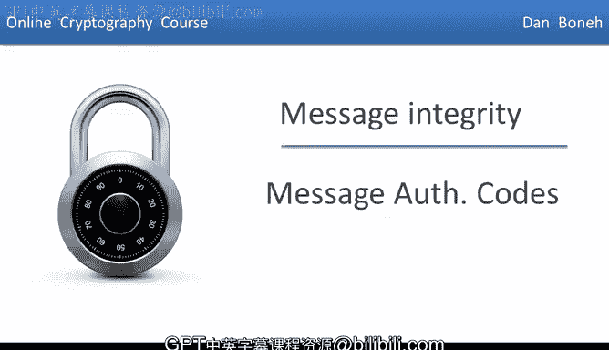
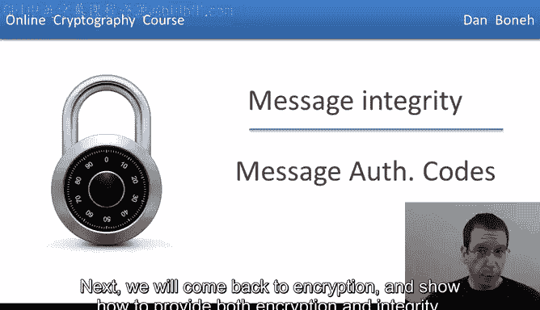
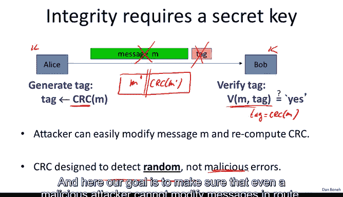
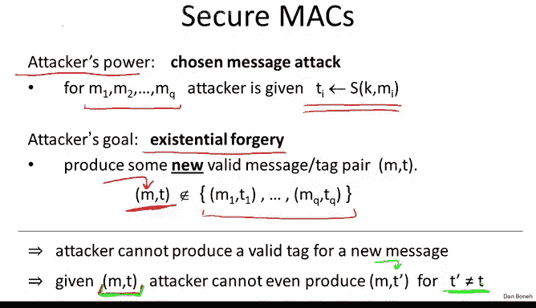
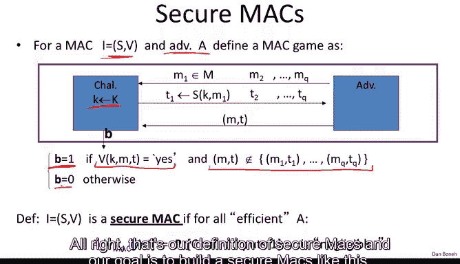
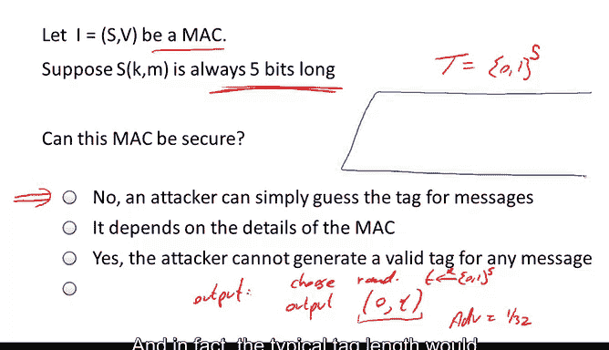
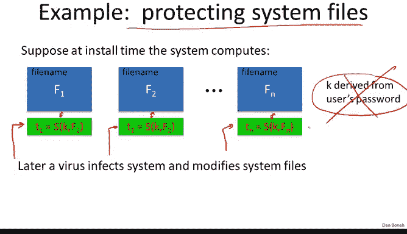

# 024：消息认证码 🔐

在本节课中，我们将停止讨论加密，转而探讨消息完整性。之后，我们会回到加密，并展示如何同时提供加密和完整性保护。

## 概述

正如之前所说，我们的目标是在不提供任何机密性的前提下，提供完整性保护。现实中确实存在许多这样的场景。例如，您磁盘上的操作系统文件（如果您使用Windows），这些文件并非机密，它们是公开且众所周知的。但确保它们不被病毒或恶意软件修改却至关重要。这就是一个需要完整性但无需机密性的例子。

另一个例子是网页上的横幅广告。广告提供商完全不关心是否有人复制并展示这些广告给其他人，因此不存在机密性问题。但他们确实关心广告是否被修改，例如，他们希望防止人们将广告篡改为其他类型的广告。这是另一个完整性至关重要而机密性无关紧要的例子。

## 消息认证码（MAC）简介

那么，我们如何提供消息完整性呢？基本机制被称为**消息认证码**。其工作方式如下：

我们有通信双方爱丽丝和鲍勃，他们共享一个密钥K，攻击者不知道这个密钥，但爱丽丝和鲍勃都知道。爱丽丝想要发送一个公开消息M给鲍勃，并确保攻击者无法在传输途中修改此消息。

爱丽丝使用一个**MAC签名算法**（记为S）来实现这一点。该算法以密钥和消息作为输入，并生成一个非常短的**标签**。标签可能只有90比特或100比特左右。即使消息长达千兆字节，标签也非常短。然后，她将标签附加到消息上，并将两者的组合发送给鲍勃。

鲍勃收到消息和标签后，运行**MAC验证算法**。该算法以密钥、消息和标签作为输入，并输出“是”或“否”，以指示消息是否有效或是否被篡改。

更精确地说，一个MAC系统由两个算法组成：一个签名算法和一个验证算法。它们定义在密钥空间、消息空间和标签空间上。签名算法输出一个标签，验证算法在给定密钥、消息和标签后输出“是”或“否”。

需要提醒的是，通常存在一致性要求：对于密钥空间中的每个密钥和消息空间中的每个消息，如果用特定密钥对消息签名，然后用同一密钥验证该标签，应该得到“是”的响应。这是标准的一致性要求，类似于我们在加密中看到的要求。

## 完整性为何需要共享密钥

需要指出的是，完整性确实需要爱丽丝和鲍勃之间共享一个密钥。事实上，人们常犯的一个错误是试图在没有共享密钥的情况下提供完整性。

这里有一个例子：考虑**循环冗余校验**。这是一种经典的校验算法，旨在检测消息中的随机错误。假设爱丽丝不使用密钥生成标签，而是使用CRC算法（该算法不需要密钥）生成一个标签，然后将此标签附加到消息上发送给鲍勃。

鲍勃将验证CRC是否正确。换句话说，鲍勃将验证标签是否等于CRC(M)。如果是，验证算法输出“是”；否则输出“否”。

这样做的问题是攻击者很容易破解。攻击者可以轻松地在途中修改消息并欺骗鲍勃，使其认为新消息是有效的。攻击者的做法是：拦截消息和标签，然后生成自己的消息M‘，并计算其CRC值，最后将M‘和CRC(M‘)的组合发送给鲍勃。鲍勃运行验证算法，验证会成功，因为右侧确实是左侧的有效CRC。结果，鲍勃会认为此消息来自爱丽丝，但实际上它已被攻击者完全修改，与爱丽丝发送的原始消息无关。

问题的关键在于CRC没有密钥。爱丽丝和攻击者之间没有区别，因此鲍勃不知道消息的来源。一旦我们引入密钥，爱丽丝就能做一些攻击者无法做到的事情，从而可能计算出攻击者无法修改的标签。

请记住，CRC旨在检测随机错误，而非恶意错误。而我们的目标是确保即使是恶意攻击者也无法在途中修改消息。

## 定义MAC系统的安全性

接下来，我们想定义MAC系统安全的含义。与往常一样，我们根据攻击者的能力和目标来定义安全性。

在MAC的情况下，攻击者的能力被称为**选择消息攻击**。换句话说，攻击者可以向爱丽丝提供任意他选择的消息M1到Mq，爱丽丝将为这些消息计算标签并交给他。

您可能会问，爱丽丝为什么会这样做？为什么爱丽丝会为攻击者给她的消息计算标签？就像在选择明文攻击中一样，在现实世界中，攻击者给爱丽丝一个消息，爱丽丝计算该消息的标签，然后攻击者获得结果标签，这种情况非常常见。例如，攻击者可能向爱丽丝发送一封电子邮件，爱丽丝可能希望将电子邮件保存到磁盘，以防止有人篡改磁盘，因此她会计算消息的标签，并将消息和标签保存到磁盘。后来，攻击者可能窃取爱丽丝的磁盘，现在他恢复了爱丽丝对他发送的消息的标签。这就是现实世界中攻击者实际获得爱丽丝对他所给消息的标签的选择消息攻击的例子。

那么，攻击者的目标是什么？他的目标是进行所谓的**存在性伪造**。换句话说，他试图产生一个新的有效消息-标签对，这个对不同于在选择消息攻击期间给他的任何一个对。如果他能做到这一点，那么我们就说系统是不安全的；如果他不能，那么我们就说系统是安全的。

需要强调的是，存在性伪造意味着攻击者无法为任何消息（即使是完全无意义的乱码）产生新的消息-标签对。您可能会想，如果攻击者计算了一个无意义消息的标签，这对攻击者有什么价值？但我们希望构建在任何使用场景下都安全的MAC。事实上，确实存在这样的情况，例如，您可能希望为一个随机密钥计算完整性标签。在这种情况下，即使攻击者能够为一个完全随机的消息计算标签，他也可能欺骗用户使用错误的密钥。因此，我们希望确保，如果MAC是安全的，攻击者就不能为任何消息（无论它是乱码还是有意义的）产生有效标签。

安全定义隐含的另一个属性是：如果攻击者获得某个消息-标签对，他应该无法为同一消息产生新的标签。换句话说，即使可能存在另一个标签T‘用于同一消息M，给定M和T的攻击者也不应能找到这个新的T‘。您可能会想，攻击者已经拥有消息M的一个标签，为什么还要关心能否为消息M产生另一个标签？他已经有一个标签了。但正如我们将看到的，确实存在一些应用，其中攻击者不能为先前签名的消息产生新标签这一点非常重要，特别是在我们结合加密和完整性时。

因此，我们将要求：给定消息的一个标签，不可能找到同一消息的另一个标签。

## 安全性的形式化定义

现在我们已经理解了要达成的目标，让我们像往常一样用一个更精确的游戏来定义它。

这里我们有两个算法S和V，以及一个对手A。游戏进行如下：挑战者像往常一样为MAC选择一个随机密钥。然后对手进行他的选择消息攻击：他向挑战者提交M1并收到该消息的标签；然后他提交M2并收到该消息的标签；依此类推，直到他向对手提交q条消息并收到所有这些消息的q个标签。

这就是选择消息攻击部分。然后对手继续尝试进行存在性伪造，即他输出一个新的消息-标签对。我们说如果他满足以下两个条件，他就赢得了游戏：首先，他输出的消息-标签对是有效的，即验证算法输出“是”；其次，这是一个新鲜的消息-标签对，即它不是我们之前给他的任何一个消息-标签对。

与往常一样，我们定义对手的优势为挑战者在此游戏中输出1的概率。我们说一个MAC系统是安全的，如果对于所有高效的对手，其优势都是可忽略的。换句话说，没有高效的对手能够以不可忽略的概率赢得这个游戏。

## 关于MAC安全性的两个问题

在我们构建安全的MAC之前，我想问两个问题。

第一个问题是：假设我们有一个MAC。碰巧攻击者能找到两个消息M0和M1，对于大约一半的密钥，它们具有相同的标签。换句话说，如果你随机选择一个密钥，有1/2的概率，消息M0的标签与消息M1的标签相同。我的问题是：这能是一个安全的MAC吗？需要强调的是，攻击者不知道M0和M1的标签是什么，他只知道这两个消息有1/2的概率具有相同的标签。

答案是否定的，这不是一个安全的MAC。原因在于选择消息攻击。本质上，攻击者可以请求消息M0的标签，然后他会从挑战者那里收到(M0, T)。实际上，T将是消息M0的有效标签。然后，他输出(M1, T)作为他的存在性伪造。请注意，(M1, T)不同于(M0, T)。这是一个有效的存在性伪造，因此攻击者以1/2的优势赢得游戏。我们得出结论，这个MAC不安全。

第二个问题是：假设我们有一个MAC，它总是输出一个5比特的标签。换句话说，这个MAC的标签空间是{0,1}^5。对于每个密钥和每个消息，签名算法只输出一个5比特的标签。问题是：这个MAC能是安全的吗？

答案当然是否定的，因为攻击者可以简单地猜测标签。他会这样做：他不会进行任何选择消息攻击，他只会如下输出一个存在性伪造：他会在{0,1}^5中随机选择一个标签T，然后输出他的存在性伪造——消息0和标签T。现在，以1/(2^5)的概率，这个标签将是消息0的有效标签，因此对手的优势是1/32，这是不可忽略的。

这基本上说明标签不能太短，它们必须有一定的长度。实际上，典型的标签长度可能是64比特、96比特或128比特。例如，TLS使用96比特长的标签。当标签是96比特时，尝试猜测消息的标签，猜对的概率是1/(2^96)，因此对手的优势仅为1/(2^96)，这是可忽略的。

## MAC的应用：保护系统文件

现在我们已经理解了MAC是什么，我想展示一个简单的应用。具体来说，让我们看看MAC如何用于保护磁盘上的系统文件。

想象一下，当您安装操作系统时，比如在您的机器上安装Windows，Windows会做的一件事是要求用户输入密码，然后从该密码派生出一个密钥K。然后，对于磁盘上的每个文件（假设文件是F1, F2, ..., Fn），操作系统会计算该文件的标签，然后将标签与文件一起存储。在这里，它将标签附加到每个文件上，然后擦除密钥K，不再在磁盘、内存或任何地方存储密钥K。

现在，假设后来机器感染了病毒，病毒试图修改一些系统文件。问题是用户能否检测到哪些文件被修改了。以下是一种方法：用户将机器重新启动到一个干净的操作系统中，比如从USB磁盘启动。一旦机器从这个干净的操作系统启动，用户将向这个正在运行的干净操作系统提供他的密码。然后，这个新的、正在运行的干净操作系统将继续检查每个系统文件的MAC。

MAC安全的事实意味着，可怜的病毒实际上无法创建一个具有有效标签的新文件（我们称之为F‘）。它无法创建(F‘, T‘)，因为如果它能，那将是这个MAC上的存在性伪造。由于MAC是存在性不可伪造的，病毒无法创建任何F‘，无论F‘是什么。因此，由于MAC的安全性，用户将检测到所有被病毒修改的文件。

这里有一个需要注意的地方：病毒可以做的一件事是交换两个文件。例如，它可以交换文件F1和文件F2的位置。当用户尝试运行文件F1时，实际上会运行文件F2，这当然会造成各种损害。防御这种情况的方法本质上是在MAC计算区域中包含文件名。实际上，我们计算的是文件名和文件内容的完整性校验。因此，如果病毒试图交换两个文件，系统会说：“位于F1位置的文件没有正确的名称”，从而检测到病毒进行了交换，即使MAC验证通过。

重要的是要记住，MAC可以帮助您防御文件篡改或一般的数据篡改，但它们无助于防御已验证数据的交换，这必须通过其他方式来完成。

## 总结

本节课我们一起学习了消息认证码的基本概念。我们了解到，MAC是一种在不提供机密性的情况下确保消息完整性的机制，它依赖于共享密钥。我们定义了MAC的安全性，要求其能够抵抗选择消息攻击下的存在性伪造。我们还探讨了MAC的一个实际应用——保护系统文件免受恶意篡改。在下一节中，我们将开始构建第一个安全的MAC实例。