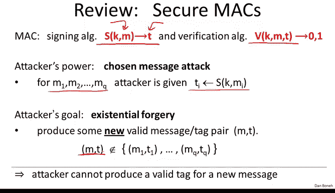
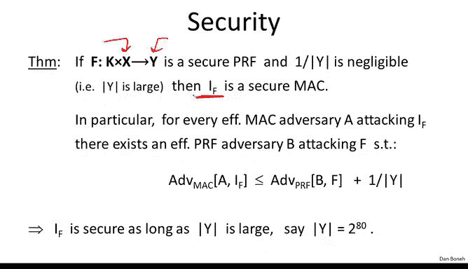
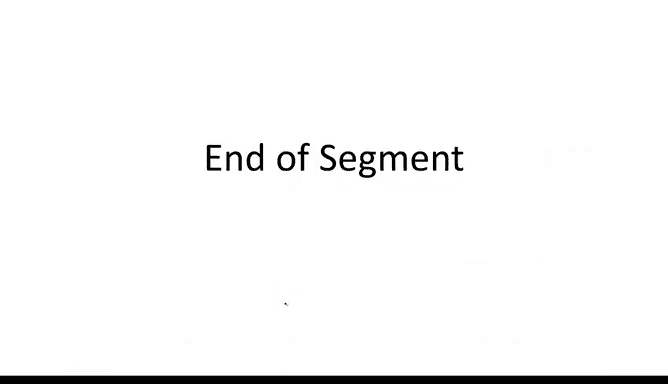

# 025：基于PRF的MAC构建 🛡️

在本节课中，我们将学习如何基于伪随机函数构建一个安全的消息认证码。我们将从定义回顾开始，逐步构建第一个安全的MAC，并探讨如何将适用于短消息的MAC扩展为适用于长消息的MAC。

## 回顾MAC的定义

上一节我们介绍了消息认证码的基本概念。MAC由一对算法构成：
*   **签名算法**：接收一个消息 `M` 和一个密钥 `K`，生成一个对应的标签 `T`。
    `T = Sign(K, M)`
*   **验证算法**：接收密钥 `K`、消息 `M` 和标签 `T`，输出0或1，表示标签是否有效。
    `Verify(K, M, T) -> {0, 1}`

一个MAC是安全的，当它在选择消息攻击下具有**存在不可伪造性**。这意味着攻击者可以提交任意消息并获得对应的标签，但即便如此，他也无法伪造出一个新的、未被查询过的有效消息-标签对。

## 从PRF构建安全MAC

既然我们了解了MAC的定义，本节中我们来看看如何构建第一个安全的MAC。一个直接的方法是使用伪随机函数。

假设我们有一个伪随机函数 `F`，它将输入空间 `X` 映射到输出空间 `Y`。我们可以基于它定义如下MAC：
*   **签名**：对消息 `M` 的标签就是函数在 `M` 点的取值。
    `Tag = F(K, M)`
*   **验证**：重新计算 `F(K, M)`，并检查结果是否与收到的标签 `T` 相等。
    `Verify: F(K, M) == T ?`

在通信中，发送方Alice计算标签并附加到消息后发送。接收方Bob收到后，重新计算并比对标签以验证完整性。

### 一个不安全的例子

让我们看一个基于PRF构建MAC的不安全例子。假设我们使用的PRF输出长度很短，例如只有10比特。虽然它本身可能是一个安全的PRF，但用它构建的MAC是不安全的。

考虑一个简单的攻击者：他任意选择一个消息 `M`，然后随机猜测其10比特的标签。由于标签空间只有 `2^10 = 1024` 种可能，他猜中的概率是 `1/1024`，这是一个不可忽略的优势。因此，这个MAC不安全。

这个例子揭示了一个关键点：**只有当PRF的输出空间足够大时，由此构建的MAC才是安全的**。

### 安全定理

以下是基于PRF构建MAC的安全定理：
如果 `F: K × X -> Y` 是一个安全的伪随机函数，那么由它派生的MAC也是安全的。具体来说，任何攻击者在选择消息攻击下成功伪造标签的优势，至多为：
`Adv_MAC ≤ Adv_PRF + 1/|Y|`
其中 `1/|Y|` 是攻击者纯粹靠猜测成功的概率。

因此，为了确保MAC安全，我们需要PRF的输出空间 `Y` 足够大，使得 `1/|Y|` 可忽略。例如，使用输出80比特的PRF，攻击者的优势最多为 `1/2^80`。

**证明思路**：
1.  首先考虑一个真正的随机函数 `R`。攻击者查询了 `q` 个不同消息的标签后，对于一个全新的消息 `M`，函数值 `R(M)` 与之前所有查询结果独立。因此，攻击者最佳策略是随机猜测，成功概率为 `1/|Y|`。
2.  由于 `F` 是伪随机函数，攻击者无法区分 `F` 和真正的随机函数 `R`。因此，即使使用 `F`，攻击者的优势也不会显著高于使用 `R` 时的优势 `1/|Y|`。

## 我们的第一个MAC实例：基于AES

现在我们知道任何安全的PRF都能产生安全的MAC。我们立即得到了第一个MAC实例：**AES**。

我们相信AES是一个安全的伪随机置换，因此它也是一个安全的PRF（在固定密钥下）。AES的输入块大小是16字节（128比特）。因此，基于AES构建的MAC可以直接用于认证**恰好16字节长**的消息。
`Tag = AES(K, M) // 其中 len(M) = 16 bytes`

## 从小MAC构建大MAC：扩展问题

然而，AES只能处理固定16字节的输入。在实际应用中，我们需要认证的数据可能是任意长度的，比如几GB的文件。这就引出了“**从小MAC构建大MAC**”的问题，或者形象地称为“**巨无霸问题**”。

我们需要一种构造方法，能够以一个处理短消息的安全PRF（如AES）为基础，构建出一个能处理任意长消息的安全MAC。

以下是两种广泛使用的构造方法，它们都从短输入PRF出发，生成支持极长消息的PRF（进而得到MAC）：
1.  **CBC-MAC**：常用于银行金融系统（如自动清算所ACH）。
2.  **HMAC**：广泛应用于网络协议（如SSL/TLS、SSH）中保证数据完整性。

这两种构造都可以用AES作为底层的密码原语来实例化。

## 关于输出截断的说明

最后，我们讨论一个关于基于PRF的MAC的实用技巧：**输出截断**。

假设我们有一个输出 `n` 比特的安全PRF（例如AES输出128比特）。一个简单的引理表明，如果我们只输出前 `t` 比特（`t < n`），结果仍然是一个安全的PRF。直观上，如果完整的 `n` 比特输出看起来是随机的，那么它的一个子集（`t` 比特）看起来也同样是随机的，攻击者甚至获得了更少的信息。

由于安全的PRF能产生安全的MAC，这意味着我们可以安全地截断MAC的标签长度。但必须注意，根据安全定理，截断后的标签长度 `t` 必须足够大，使得 `1/2^t` 可忽略（例如 `t=80` 或 `t=64`）。如果截断到只有几位，MAC将不再安全。

因此，即使我们使用AES构建出输出128比特标签的MAC，在实践中也可以安全地将其截断为更短的长度（如80比特），以减少通信开销，同时保持安全性。

## 总结

本节课中我们一起学习了基于伪随机函数构建消息认证码的核心方法：
1.  任何输出空间足够大的安全PRF，都可以直接用作一个安全的MAC。
2.  这为我们提供了第一个具体的MAC实例——基于AES的MAC，但它只能处理固定长度的短消息。
3.  为了认证长消息，我们需要扩展构造，如CBC-MAC和HMAC，它们能以短输入PRF为基础构建出长输入MAC。
4.  基于PRF的MAC其输出标签可以被安全地截断，以在安全性和效率之间取得平衡。

在下一节中，我们将深入探讨第一种扩展构造：**CBC-MAC** 的工作原理。