# 026：CBC-MAC与NMAC 🔐

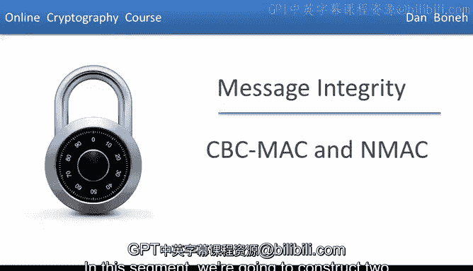

在本节课中，我们将学习如何从安全的伪随机函数（PRF）构造两种经典的消息认证码（MAC）：加密CBC-MAC（ECBC）和嵌套MAC（NMAC）。我们将详细探讨它们的构造原理、安全性，以及为什么某些步骤对于安全至关重要。

---

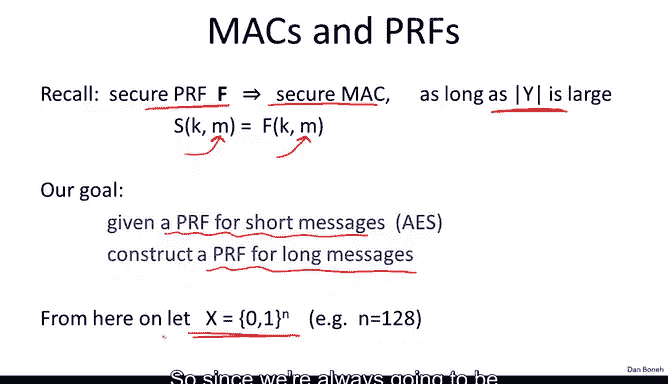

## 概述 📋

上一节我们介绍了如何使用安全的伪随机函数（PRF）来构造一个安全的MAC。具体来说，对于一个消息M，其签名可以简单地定义为函数在点M处的值。唯一的注意事项是PRF F的输出必须足够大（例如80位或128位），这样才能生成一个安全的MAC。

然而，像AES这样的PRF只能处理固定长度的短消息（例如16字节）。本节的核心问题是：给定一个用于短消息的PRF（如AES），我们能否构造一个可以处理可能长达数吉字节的长消息的PRF？

为了便于讨论，我们用 **X** 表示集合 `{0,1}^n`，其中n是底层PRF的分组大小。由于我们通常将AES视为底层PRF，因此可以认为n为128位。

---

## 加密CBC-MAC（ECBC）的构造 🧱

我们的第一个构造称为加密CBC-MAC，简称ECBC。ECBC使用一个PRF `F: X -> X`。我们的目标是构建一个PRF `F_ECBC`，它接受一对密钥和任意长度的消息（最多L个分组），并输出一个位于X中的标签。

`X^(≤L)` 表示输入消息可以包含1到L个之间的任意数量的分组。因此，ECBC可以处理长度为1个分组、2个分组、10个分组甚至100个分组的消息。

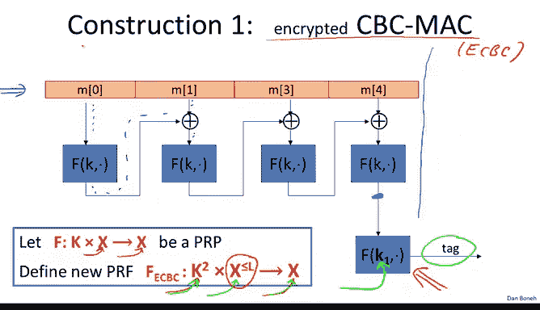

以下是ECBC的工作原理：

1.  首先，将消息M分割成多个分组，每个分组的长度与底层函数F的分组长度相同。
2.  然后，我们运行CBC链，但不输出中间值。具体过程是：用密钥K加密第一个分组，将结果与第二个分组进行异或运算，再用K加密该结果，以此类推，直到处理完所有分组。
3.  最后，我们得到一个称为CBC链输出的值。
4.  **关键步骤**：我们使用一个独立的密钥K1（与K不同且独立选择）对这个CBC链输出再进行一次加密。最终的结果就是我们的标签T。

`F_ECBC` 接受一对密钥 `(K, K1)` 作为输入，可以处理可变长度的消息，并产生一个在集合X中的输出。

你可能会问，最后这个加密步骤是做什么用的？如果不进行这最后一步加密，得到的函数称为 **原始CBC函数**。我们稍后会看到，原始CBC实际上并不是一个安全的MAC。因此，这最后一步对于确保MAC的安全性至关重要。

---

## 嵌套MAC（NMAC）的构造 🔄

另一种将小型PRF转换为大型PRF的经典构造称为NMAC。NMAC从一个PRF `F: X -> K` 开始，注意其输出位于密钥空间K中（而CBC-MAC的输出在集合X中）。

我们的目标是构建一个PRF `F_NMAC`，它同样接受一对密钥作为输入，可以处理最多L个分组长的可变长度消息，并输出一个密钥空间K中的元素。

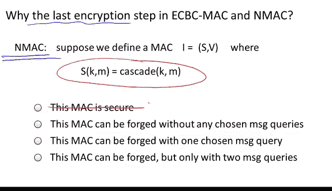

以下是NMAC的工作原理：

1.  同样，将消息M分割成多个分组。
2.  我们取密钥K，将其作为密钥输入到函数F中，第一个消息分组作为数据输入。输出结果成为下一个分组的密钥。
3.  这个新的密钥用于下一次PRF评估，数据是下一个消息分组，以此类推，直到处理完所有消息分组。
4.  最终输出是一个位于密钥空间K中的元素T。
5.  如果在此停止，我们得到的函数称为 **级联函数**。然而，仅凭级联函数并不能构成安全的MAC。
6.  为了获得安全的MAC，我们需要将这个位于K中的元素T映射到集合X中。通常，NMAC与那些分组长度X远大于密钥长度K的PRF一起使用。
7.  我们简单地将一个固定的填充 `pad` 附加到标签T后面，使其成为一个X中的元素。
8.  **关键步骤**：然后，我们使用一个独立的密钥K1对这个块进行最后一次加密。最终输出的标签是K中的一个元素，这就是NMAC的输出。

同样，没有最后加密步骤的函数称为级联函数，而包含最后加密步骤（这对安全性是必要的）的函数才是一个可以处理可变长度消息的PRF。

---

## 为什么需要最后的加密步骤？ ⚠️

在分析这些MAC构造的安全性之前，我们需要更好地理解最后加密步骤的作用。

### NMAC中的级联函数不安全

我们首先来看NMAC。如果省略最后一步加密，即只使用级联函数，那么这个MAC是完全不安全的。

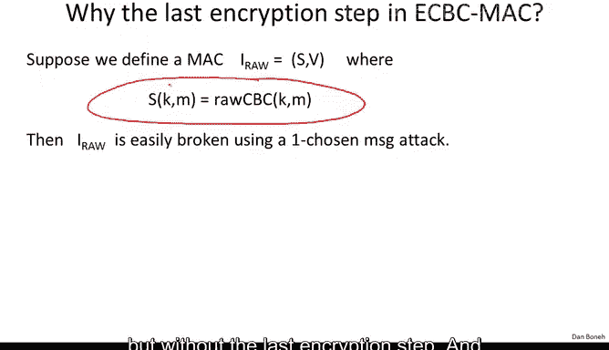

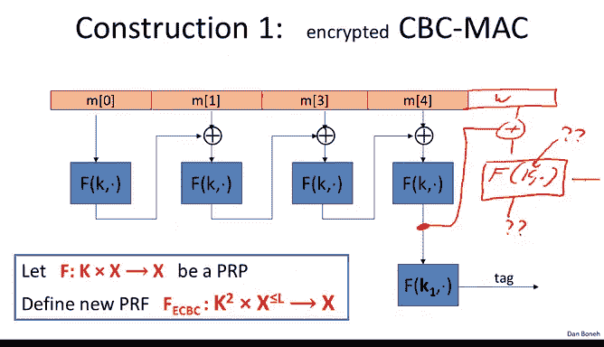

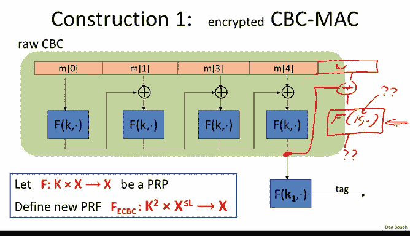

假设我们定义了一个MAC，它直接输出应用于消息M的级联函数值（没有最后加密步骤）。那么，给定一个选择消息查询的输出（即级联函数在M上的值），攻击者可以推导出该函数在消息 `M || W`（M与任意消息W连接）上的值。

这是因为攻击者可以将级联函数的输出值T作为下一个F函数的输入，并将W作为数据输入，计算出 `M || W` 的标签T‘。这样，攻击者通过请求一个消息的标签，就可以伪造出另一个更长消息的标签，从而实现了存在性伪造。

这种攻击被称为 **扩展攻击**。级联函数容易受到这种攻击，而最后一步的加密可以防止此类扩展攻击。

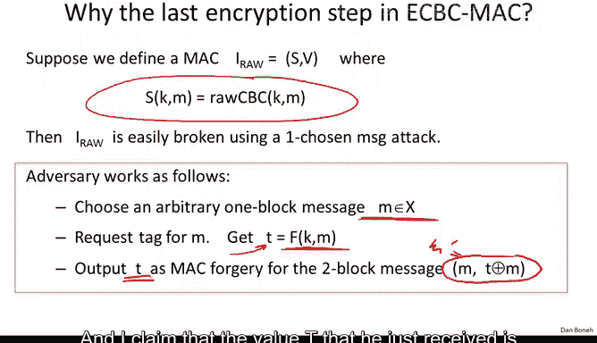

### ECBC中的原始CBC函数不安全

接下来，我们看看为什么ECBC也需要额外的加密步骤。同样，我们定义一个使用原始CBC（即没有最后加密步骤的CBC-MAC）的MAC，并展示它也是不安全的。

假设攻击者请求一个单分组消息M的标签。对于原始CBC，这仅仅是 `F_K(M)`，我们称结果为T。

现在，攻击者可以构造一个两分组消息 `M' = (M, T ⊕ M)`。我们可以验证，之前得到的T同样是这个消息 `M'` 的有效标签。

验证过程如下：
1.  应用原始CBC到 `M'`：首先加密第一个分组M，得到 `F_K(M) = T`。
2.  将结果T与第二个分组 `T ⊕ M` 进行异或：`T ⊕ (T ⊕ M) = M`。
3.  然后对M再次应用F：`F_K(M) = T`。
因此，T确实是 `M'` 的有效MAC。攻击者从未查询过两分组的 `M'`，却成功伪造了其标签，从而攻破了MAC。

这个例子表明，如果不包含最后的加密步骤，MAC将因为此类攻击而不安全。值得注意的是，许多实际产品和甚至某些标准都错误地省略了这一步，导致MAC不安全。

---

## ECBC与NMAC的安全定理 📜

现在，我们来看ECBC和NMAC的安全定理。对于任意我们想要应用MAC的消息长度，定理的表述是类似的：对于每个PRF攻击者A，都存在一个高效的攻击者B。

需要关注的是误差项。对于ECBC，分析实际上利用了F是一个伪随机置换（PRP）的事实，即使ECBC的计算过程中从未需要求逆F。对于NMAC，底层的PRF不需要是可逆的。

这些误差项基本上表明，只要一个密钥没有被用来对超过 `√|X|`（对于ECBC）或 `√|K|`（对于NMAC）条消息进行MAC计算，这些MAC就是安全的。

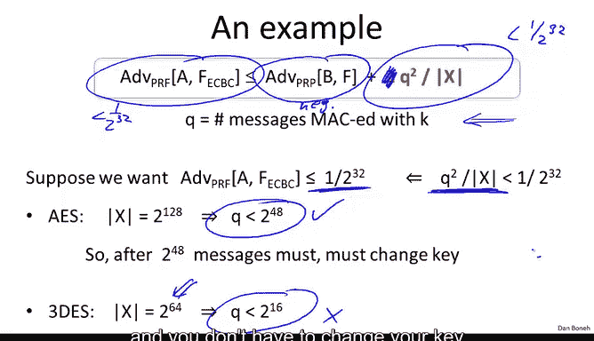

### 安全界限示例

让我们以CBC-MAC的安全定理为例。假设我们的目标是确保对于所有攻击者，其区分PRF与真随机函数的优势小于 `1/2^32`。

根据安全定理，我们需要确保 `Q^2 / |X| < 1/2^32`（这里为简化忽略了常数因子）。对于AES，`|X| = 2^128`。解不等式可得 `Q < 2^48`。这意味着在使用AES时，最多只能对 `2^48` 条消息使用同一个密钥进行MAC计算，之后必须更换密钥，否则将无法达到安全目标。

相比之下，如果使用分组长度为64位的三重DES，则 `|X| = 2^64`，计算可得 `Q < 2^16`，即每处理约65000条消息后就必须更换密钥。这说明了AES使用更大分组长度的优势之一：在这些模式下能保持安全，且无需像使用三重DES那样频繁更换密钥。

---

## 现实攻击与生日悖论 🎂

上述安全定理中的界限并非空谈，确实存在与之对应的现实攻击。在签署了大约 `√|X|`（对于ECBC）或 `√|K|`（对于NMAC）条消息后，MAC确实会变得不安全。

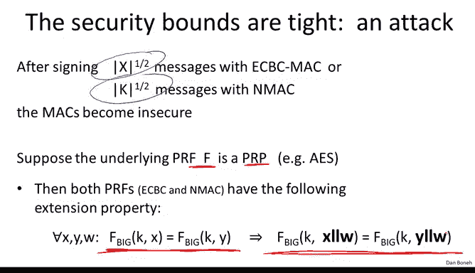

这两种构造都有一个 **扩展属性**：如果两条不同的消息X和Y产生了碰撞（即相同的MAC标签），那么对于任意附加块W，扩展后的消息 `X || W` 和 `Y || W` 也会产生碰撞。

基于此，可以构造如下攻击：
1.  攻击者发出大约 `√|Y|` 条选择消息查询（对于AES，`Y` 可以是输出空间，大小 `2^128`，所以约 `2^64` 条查询）。
2.  根据 **生日悖论**，在这 `2^64` 个随机生成的标签中，有很大概率找到两个来自不同消息M和M'的相同标签T。
3.  一旦找到碰撞，攻击者可以任意选择一个块W，并请求消息 `M || W` 的标签。
4.  由于M和M‘的标签相同，根据扩展属性，`M || W` 和 `M' || W` 的标签也必然相同。因此，攻击者获得的 `M || W` 的标签，同样也是他从未查询过的 `M' || W` 的有效标签，从而完成了存在性伪造。

这个攻击表明，在大约 `√|Y|` 次查询后，攻击者就能以相当高的概率伪造MAC。这印证了安全定理中的界限是真实存在的。

---

## 总结与对比 📊

本节课我们一起学习了两种从短PRF构造长消息MAC的方法：ECBC和NMAC。

*   **ECBC** 是一个非常常用的MAC，基于AES等分组密码构建。例如，802.11i标准就使用基于AES的ECBC来保证完整性。
*   **NMAC** 通常不直接与AES这类分组密码使用，因为它的构造要求每个分组都更换密钥，而AES的密钥扩展计算开销较大，不适合频繁更换密钥。然而，NMAC是另一个非常流行的MAC——**HMAC** 的基础，我们将在下一节中看到这一点。

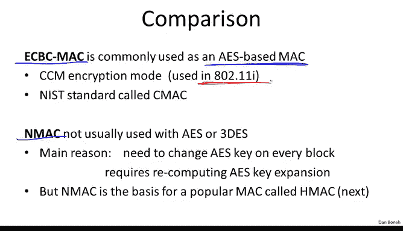

关键要点是，这两种构造都需要一个 **最后的、使用独立密钥的加密步骤** 来防止扩展攻击，从而确保安全性。同时，它们的安全使用都受到 `√|X|` 或 `√|K|` 的数量级限制，这意味着在使用像AES这样的算法时，需要注意单个密钥的MAC计算数量上限。

在下一节中，我们将继续探讨更多的MAC构造。