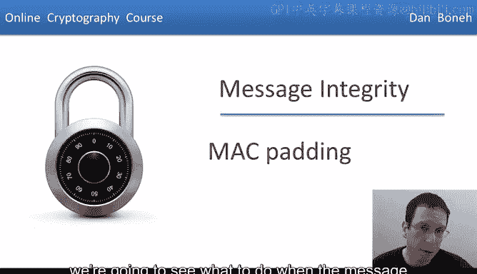
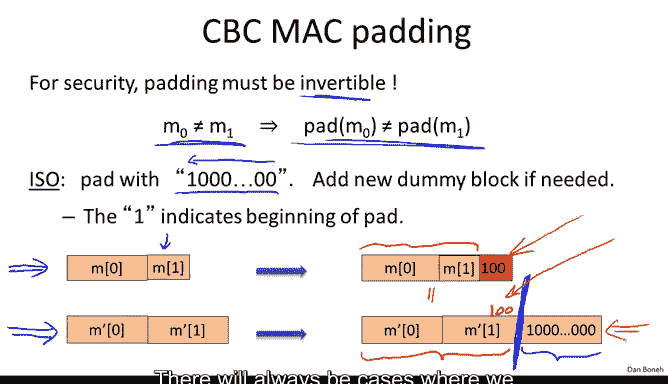

# 027：MAC填充方案

在本节课中，我们将要学习当消息长度不是分组密码块大小的整数倍时，如何安全地计算MAC。我们将探讨几种填充方案，分析其安全性，并介绍一种现代标准。

## 概述

上一节我们介绍了CBC-MAC和N-MAC，但始终假设消息长度是块大小的整数倍。本节中，我们来看看当消息长度不满足此条件时该如何处理。

## 消息填充的必要性

回忆一下，加密的CBC-MAC（简称ECBC-MAC）使用伪随机置换F来计算CBC函数。但之前我们假设消息本身可以被分解为整数个分组密码块。问题是，当消息长度不是块大小的整数倍时，我们该怎么办？

这里有一条消息，其最后一个块实际上比完整块要短。问题是如何在这种情况下计算ECBC-MAC。

## 简单的零填充方案及其缺陷

解决方案当然是填充消息。首先想到的方法是简单地用零填充消息。换句话说，我们取最后一个块，并向其添加零，直到最后一个块的长度达到一个完整块的大小。

我的问题是，由此产生的MAC是否安全？答案是否定的，MAC不安全。让我解释一下原因。

问题在于，现在可以构造出消息M和消息M||0，使得它们恰好具有相同的填充结果。因此，一旦我们将M和M||0输入ECBC，就会得到相同的标签。这意味着M和M||0具有相同的标签，因此攻击者可以发起存在性伪造攻击。他会请求消息M的标签，然后将其作为消息M||0的标签进行伪造输出。

很容易理解为什么会这样。具体来说，我们有一条消息M，填充后变为M||000（假设我们添加了三个0）。这里我们有消息M||0，它以0结尾，填充后我们基本上只需要再添加两个0。结果它们变成了相同的填充，因此将具有完全相同的标签，这允许对手发起存在性伪造攻击。

所以这不是一个好主意。事实上，附加全零是一个糟糕的主意。如果你考虑一个具体的应用场景，例如用于清算支票的自动清算所系统，我可能有一张100美元的支票及其标签。现在攻击者基本上可以在我的支票上附加一个零，使其变成1000美元的支票，而这实际上不会改变标签。因此，这种在不改变标签的情况下扩展消息的能力可能会带来灾难性的后果。

## 填充函数的核心要求

我希望这个例子能让你相信，填充函数本身必须是一个单射函数。换句话说，两条不同的消息应始终映射到两条不同的填充后消息。填充函数不应发生碰撞。另一种说法是填充函数必须是可逆的，这保证了填充函数是单射的。

## ISO标准填充方案

国际标准化组织（ISO）提出了一种标准方法。他们建议在消息末尾附加字符串“100...00”，使消息长度成为块长度的整数倍。

为了说明这种填充是可逆的，我们只需描述其逆算法。该算法从右向左扫描消息，直到遇到第一个“1”，然后移除该“1”及其右侧的所有比特。

你会看到，一旦我们以这种方式移除填充，就得到了原始消息。以下是一个例子。

这里有一条消息，其最后一个块比块长度短，然后我们附加“100”字符串。很容易看出填充是什么：只需从右边开始寻找第一个“1”，我们可以移除这个填充并恢复原始消息。

## 处理边界情况：消息长度恰好为块大小的整数倍

现在有一个非常重要的边界情况：如果原始消息长度已经是块大小的整数倍，我们该怎么办？

在这种情况下，我们必须添加一个包含填充“100...0”的额外虚拟块。我无法告诉你有多少产品和标准实际上犯了这个错误，他们没有添加虚拟块，结果导致MAC不安全，因为存在简单的存在性伪造攻击。让我告诉你为什么。

假设消息长度是块长度的整数倍，我们没有添加虚拟块，而是直接对这里的消息进行MAC计算。现在的结果是，如果你看这条消息（它是块大小的整数倍）和另一条消息（它不是块大小的整数倍但被填充到块大小），并且想象后一条消息M‘1恰好以“100”结尾。

此时你会意识到，这里的原始消息（让我这样画）在填充后会变得与第二条根本没有被填充的消息相同。因此，如果我请求这边消息的标签，我也会得到恰好以“100”结尾的第二条消息的标签。

所以，如果我们没有添加虚拟块，填充函数将再次变得不可逆，因为两条不同的消息碰巧映射到相同的填充结果。结果，MAC变得不安全。

总结一下，ISO标准是一种非常好的填充方式，但你必须记住，如果消息一开始就是块长度的整数倍，也要添加一个虚拟块。

## 避免虚拟块：CMAC方案

你们中的一些人可能想知道是否存在一种永远不需要添加虚拟块的填充方案。答案是，如果你看确定性填充函数，那么很容易论证总会有需要填充的情况。原因很简单，长度是块长度整数倍的消息数量远小于不需要是块长度整数倍的消息总数。因此，我们无法从这个更大的所有消息集合到那个较小的、长度是块长度整数倍的消息集合建立一个单射函数。总会有需要扩展原始消息的情况，在这种情况下，就对应于添加这个虚拟填充块。

然而，有一个非常巧妙的想法叫做CMAC，它表明使用随机化填充函数可以避免添加虚拟块。让我解释一下CMAC是如何工作的。

CMAC实际上使用三个密钥，有时这被称为三密钥构造。第一个密钥K用于标准的CBC-MAC算法。然后密钥K1和K2仅用于最后一个块的填充方案。事实上，在CMAC标准中，密钥K1和K2是通过某种伪随机生成器从密钥K派生出来的。

CMAC的工作方式如下：如果消息长度不是块长度的整数倍，那么我们向其附加ISO填充，但随后我们还用对手不知道的密钥K1对这个最后一个块进行异或操作。

然而，如果消息长度是块长度的整数倍，那么我们当然不附加任何东西，但我们用一个不同的密钥K2进行异或，同样，对手实际上并不知道这个密钥。

事实证明，仅仅通过这样做，现在就不可能对我们能在级联函数和原始CBC上进行的扩展攻击了，因为可怜的对手实际上不知道进入函数的最后一个块是什么，他不知道K1，因此他不知道这个特定点的值。结果，他无法进行扩展攻击。事实上，这是一个可证明的陈述，即这里的这个构造（仅仅通过异或K1或异或K2）确实是一个伪随机函数，尽管在计算原始CBC函数后没有进行最终的加密步骤。

这是一个好处：没有最终的加密步骤。第二个好处是，我们通过使用两个不同的密钥来区分消息长度是块长度的整数倍与消息长度不是整数倍但有填充附加的情况，从而解决了填充是否发生的歧义。这两个不同的密钥解决了这两种情况之间的歧义，因此这种填充实际上是足够安全的。正如我所说，实际上有一个很好的安全定理与CMAC相关，它表明CM构造确实是一个具有与CBC-MAC相同安全属性的伪随机函数。

## CMAC的应用与标准

我想提一下，CMAC是由NIST标准化的联邦标准。如果你现在想在任何地方使用CBC-MAC，你实际上会使用CMAC作为标准方式，特别是在CMAC中，底层的分组密码是AES，这为我们提供了一个从AES派生的安全CBC-MAC。

## 总结

本节课中我们一起学习了MAC的填充方案。我们首先看到简单的零填充是不安全的，因为它允许存在性伪造攻击。接着，我们学习了ISO标准填充方案，它要求填充函数是可逆的单射函数，并特别注意了消息长度恰好为块大小整数倍时需要添加虚拟块的边界情况。最后，我们介绍了更先进的CMAC方案，它通过使用额外的密钥进行随机化异或操作，巧妙地避免了添加虚拟块的需要，并提供了可证明的安全性。CMAC已成为现代应用中的标准方法。