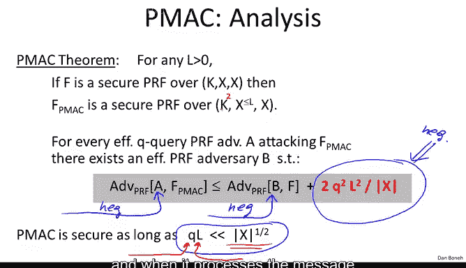
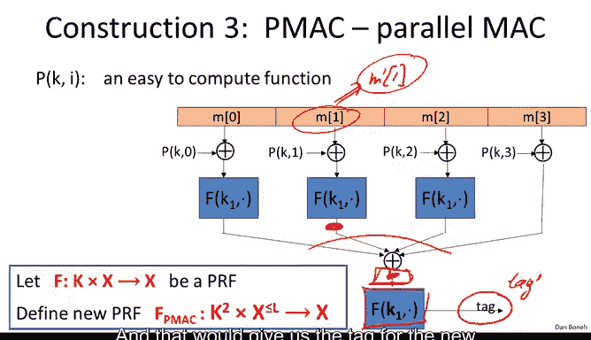
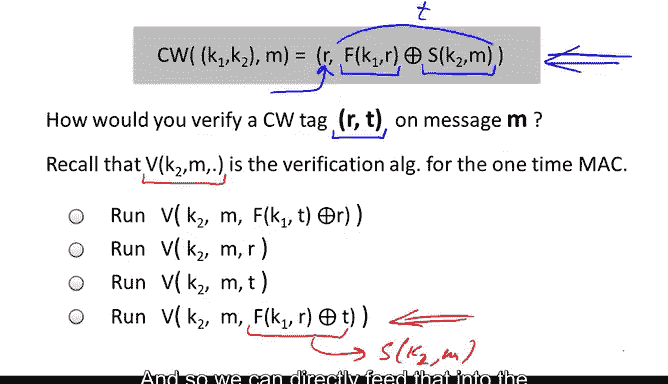

# 028：PMAC与卡特-韦格曼MAC

在本节课中，我们将要学习两种重要的消息认证码（MAC）构造方法：PMAC和卡特-韦格曼MAC。我们将了解PMAC如何实现并行化处理，以及如何将一次性安全的MAC转换为多次安全的MAC。

## PMAC：一种并行MAC

在前两节中，我们讨论了CBC-MAC和NMAC，它们能将适用于短消息的伪随机函数（PRF）转换为适用于长消息的PRF。这两种构造本质上是顺序的，即使有多个处理器，也无法加快处理速度。在本节中，我们将探讨一种并行MAC，它同样能将短PRF转换为长PRF，但能以高度并行的方式实现。具体来说，我们将研究一种名为PMAC的并行MAC构造。

PMAC使用一个底层的PRF来构造一个能处理更长消息的PRF。这个PRF可以处理长度可变、最多包含L个分块的消息。

其构造工作原理如下。我们获取消息并将其分割成多个分块。然后，我们独立地处理每个分块。

以下是PMAC的构造步骤：

1.  首先，我们对每个消息分块应用一个函数P，并将结果与第一个消息分块进行异或运算。
2.  然后，我们使用密钥K1应用我们的函数F。
3.  我们对每个消息分块重复此过程。请注意，所有这些处理都可以并行进行，所有消息分块都是独立处理的。
4.  最后，我们将所有这些结果收集到一个最终的异或运算中，然后再进行一次加密以得到最终的标签值。

出于技术原因，实际上在最后一个分块上，我们不需要应用PRF F。但正如我所说，这只是技术细节，我们暂时忽略它。

现在，我想解释一下函数P的作用和目的。

假设函数P不存在，也就是说，我们直接将每个消息分块输入到PRF中，而不进行任何其他处理。那么，我断言由此产生的MAC是完全不安全的。

原因在于，消息分块之间没有强制顺序。具体来说，如果我交换两个消息分块，由于异或运算满足交换律，最终标签的值不会改变。因此，攻击者可以请求特定消息的标签，然后他就能获得交换了两个分块的消息的标签，这构成了一种存在性伪造攻击。

函数P试图做的是在这些分块上强制施加顺序。请注意，该函数首先是一个密钥函数，因此它接收一个密钥作为输入。其次，更重要的是，它接收一个分块编号作为输入。换句话说，该函数的值对于每个分块都是不同的，而这正是防止这种分块交换攻击的原因。

函数P实际上是一个非常容易计算的函数。给定密钥和消息分块，它本质上只是一个有限域上的乘法运算，因此计算起来非常简单。它为PMAC的运行时间增加的开销非常小，但足以确保PMAC实际上是安全的。

如前所述，PMAC的密钥是这对密钥：一个用于PRF，一个用于这个掩码函数P。最后，我要说明，如果消息长度不是分块长度的整数倍，即最后一个分块短于完整的分块长度，那么PMAC实际上会使用类似于CBC-MAC的填充方式，这样就永远不需要额外的虚拟分块。

这就是PMAC的构造。和往常一样，我们可以陈述其安全定理。安全定理现在你应该很熟悉了，它本质上说：如果你给我一个攻击PMAC的敌手，我可以构造一个攻击底层PRF的敌手，再加上一个额外的误差项。由于PRF是安全的，我们知道这一项是可忽略的。因此，如果我们希望这一项是可忽略的，我们需要这个误差项也是可忽略的。这里，Q是使用特定密钥进行MAC计算的消息数量，L是所有那些消息的最大长度。只要这个乘积小于分块大小的平方根，PMAC就是安全的。对于AES，分块大小是2^128，其平方根是2^64，因此只要Q乘以L小于2^64，MAC就是安全的。每当接近这个值时，当然需要更换密钥才能继续对更多消息进行MAC计算。主要要记住的是，PMAC也为我们提供了一个PRF，并且它独立地处理消息分块。

事实证明，PMAC还有一个非常有趣的特性，即PMAC是增量的。让我解释一下这意味着什么。

假设用于构造PMAC的函数F不仅仅是一个PRF，实际上是一个置换，一个PRP，因此我们可以在需要时对其进行求逆。现在，假设我们已经为一个特别长的消息M计算了MAC。现在假设这个长消息中只有一个消息分块发生了变化。这里，M1变成了M‘1，但其余的消息分块都保持不变。对于像CBC-MAC这样的其他MAC，即使只有一个消息分块发生变化，你也必须重新计算整个消息的标签，重新计算标签基本上需要与消息长度成正比的时间。

事实证明，对于PMAC，如果我们只改变一个分块或少数几个分块，实际上我们可以非常、非常快地重新计算新消息的标签值。让我给你出个谜题，看看你是否能自己弄清楚如何做到这一点。记住函数F是一个PRP，因此是可逆的。让我们看看你是否能自己弄清楚如何计算新消息的MAC。

事实证明，这是可以做到的，你可以使用这里的第三行快速重新计算新消息的标签。为了确保我们都看到解决方案，让我们快速回到PMAC的原始图表，我可以向你展示我的意思。想象一下，这个消息分块变成了另一个分块，比如说变成了M‘1。

那么我们可以做的是，我们可以获取更改前原始消息的标签，然后我们可以对函数F求逆，以确定应用函数F之前的值。现在，由于我们现在有一组分块的异或结果，我们可以做的是，通过将来自原始消息分块的值异或到这个异或累加器中，然后再将来自新消息分块的值异或回来，从而抵消来自原始消息分块的异或贡献。然后再次应用函数F，这将为我们提供仅更改了一个分块的新消息的标签。用符号表示，我基本上在这里写了公式。你可以看到，我们解密标签，然后与来自原始消息分块的块进行异或，再与来自新消息分块的块进行异或，然后我们重新加密最终的异或累加器，以得到更改了一个分块的消息的新标签。

这是一个相当简洁的特性，它表明如果你有非常大的消息，你可以非常快速地更新标签。当然，你需要一个密钥来进行更新，但如果只有少数消息分块发生变化，你可以快速更新标签。

## 一次性MAC

好了，关于PMAC的讨论到此结束。现在我想稍微转换一下话题，谈谈一次性MAC的概念，这基本上是一次性密码本在完整性世界中的类比。

让我解释一下我的意思。想象一下，我们想要构建一个仅用于单条消息完整性的MAC。换句话说，每次我们计算特定消息的完整性时，我们也会更改密钥，使得任何特定密钥仅用于一条消息的完整性。

然后，我们可以将安全游戏定义为：攻击者将看到一条消息。因此，我们只允许他进行一次选择消息攻击。他可以提交一条消息查询，并获得对应于该消息查询的标签。现在，他的目标是伪造一个消息-标签对。你可以看到，他的目标是产生一个能通过验证且与他实际收到的消息-标签对不同的消息-标签对。正如我们将看到的，就像一次性密码本和流密码在某些应用中非常有用一样，一次性MAC在那些我们只想使用一个密钥来加密或为单条消息提供完整性的应用中也非常有用。

和往常一样，我们会说，如果基本上没有敌手能赢得这个游戏，那么一次性MAC就是安全的。

现在有趣的是，一次性MAC，就像一次性密码本一样，可以抵抗无限强大的敌手。不仅如此，因为它们被设计为仅一次性使用安全，所以它们实际上可以比基于PRF的MAC更快。

因此，我只想给你一个一次性MAC的简单例子。这是一个经典的一次性MAC构造，让我向你展示它是如何工作的。

第一步是选择一个比我们的分块大小稍大的素数。在这个例子中，我们将使用128位分块，所以让我们选择第一个大于2^128的素数，这恰好是2^128 + 51。

现在，密钥将是一对在1到我们的素数Q范围内的随机数。所以我们在1到Q的范围内选择两个随机整数。现在我们收到一条消息，我们将把消息分成多个分块，每个分块是128位，我们将每个数字视为0到2^128 - 1范围内的整数。

MAC定义如下：我们首先获取消息分块，并从中构造一个多项式。如果我们的消息中有L个分块，我们将构造一个L次多项式。请注意，这个多项式的常数项被设置为0。

然后我们非常简单地定义MAC：基本上，我们取对应于消息的多项式，在点k（这是我们秘密密钥的一半）处求值，然后加上值A（这是我们秘密密钥的另一半）。就是这样，这就是整个MAC。基本上就是构造对应于我们消息的多项式，在秘密密钥的一半处求值该多项式，并将秘密密钥的另一半加到结果中，当然最后要对结果模Q取余。

好了，就是这样，这就是整个MAC。它是一个一次性安全的MAC。我们论证这个MAC是一次性安全的方式，本质上是通过论证：如果我告诉你一个特定消息的MAC值，这完全不会告诉你另一个消息的MAC值。因此，即使你已经看到了特定消息的MAC值，你也无法伪造其他消息的MAC。

现在我应该强调，这是一个一次性MAC，但不是两次安全的。换句话说，如果你看到两个不同消息的MAC值，那实际上会完全泄露秘密密钥，你实际上可以预测你选择的第三条或第四条消息的MAC。因此，MAC就变得可伪造了，但对于一次性使用，它是一个完全安全的MAC。我还要告诉你，实际上这是一个计算速度非常快的MAC。

## 卡特-韦格曼MAC

现在我们已经构造了一次性MAC，事实证明，有一种通用技术可以将一次性MAC转换为多次MAC。我只想简要地向你展示这是如何工作的。

假设我们有一个一次性MAC，我们称其为S和V，分别代表签名和验证算法。我们假设标签本身是比特串。

此外，让我们也考虑一个PRF，一个安全的伪随机函数，它也输出比特串，但也接收比特串作为输入。

现在让我们定义一个MAC的通用构造。这些MAC被称为卡特-韦格曼MAC，其工作原理如下：基本上，我们将一次性MAC应用于消息M，然后我们将使用PRF加密结果。我们如何加密结果呢？我们选择一个随机的R，然后通过将PRF应用于R来计算一种一次性密码本，然后我们将其与实际的一次性MAC结果进行异或运算。

这个构造的巧妙之处在于，快速的一次性MAC应用于可能是千兆字节长的长消息，而较慢的PRF仅应用于这个随机数R，然后R被用来加密MAC的最终结果。你可以论证，如果作为构建块提供给我们的MAC是一次性安全的MAC，并且PRF是安全的，那么实际上我们得到一个多次安全的MAC，它恰好输出两个n位的标签。我们稍后在讨论认证加密时会看到卡特-韦格曼MAC，实际上，进行带完整性加密的NIST标准方法之一，就是使用卡特-韦格曼MAC来提供完整性。

我想提一下，这个卡特-韦格曼MAC是随机化MAC的一个很好的例子，其中这个随机数R在每次计算标签时都是重新选择的。因此，例如，如果你尝试为同一条消息计算两次标签，每次你都会选择一个不同的R，结果你会得到不同的标签。所以这是一个很好的例子，说明这个MAC实际上不是一个伪随机函数，不是一个PRF，因为一条消息实际上可能映射到许多不同的标签，所有这些标签对于那条消息都是有效的。

为了结束我们对卡特-韦格曼MAC的讨论，让我问你以下问题。这里我们有卡特-韦格曼MAC的方程。和往常一样，你看到随机数R是MAC的一部分，MAC的第二部分我将表示为T。这基本上是将一次性MAC应用于消息M，然后使用应用于随机数R的伪随机函数进行加密。我们将这个异或运算的结果表示为T。那么我的问题是：给定特定消息M的卡特-韦格曼MAC对（R， T），你将如何验证这个MAC是有效的？回想一下，这里的算法V是底层一次性MAC的验证算法。

这是正确的答案。要理解原因，只需观察到这里的异或运算将量T解密为其明文值，这基本上是原始的底层一次性MAC。因此，我们可以直接将其输入到一次性MAC的验证算法中。

## 总结与展望

我想告诉你的最后一种MAC是在互联网协议中非常流行的一种，它叫做HMAC。但在我们讨论HMAC之前，我们必须讨论哈希函数，特别是抗碰撞哈希函数，我们将在下一个模块中讨论这些。

这是我们关于MAC的第一个模块的结束。我想指出，构建我们所看到的所有MAC背后有非常漂亮的理论。我大致向你展示了主要的构造，但构建这些MAC确实涉及相当多的理论。如果你想了解更多，我列出了一些你可能想查阅的关键论文。让我快速告诉你它们是什么：第一篇是所谓的“三密钥构造”，它是CMAC的基础，这是一篇非常优雅的论文，给出了基于CBC-MAC的高效构造。第二篇论文是一篇技术性更强的论文，但基本上展示了如何证明CBC-MAC作为PRF的界限。第三篇论文讨论了PMAC及其构造，同样是一篇非常敏锐的论文。第四篇论文讨论了NMAC和HMAC的安全性（HMAC我们将在下一个模块中介绍）。我列出的最后一篇论文提出了一个有趣的问题。回想一下，在我们所有的构造中，我们总是假设AES是一个适用于16字节消息的伪随机函数，然后我们构建了一个适用于更长消息的伪随机函数，从而构建了MAC。这篇论文说，好吧，如果AES不是一个伪随机函数，但仍然满足一些较弱的安全属性，称为不可预测函数，那该怎么办？然后他们问，如果AES只是一个不可预测函数而不是伪随机函数，我们还能为长消息构建MAC吗？他们成功地仅基于AES是不可预测函数这一较弱假设给出了构造，但他们的构造远不如我们在这些节中讨论的CBC-MAC、NMAC或PMAC高效。因此，如果你对如何从像AES这样的分组密码构建MAC有不同的视角感兴趣，请看看这篇论文。实际上，在这个领域还有一些很好的开放性问题值得研究。

本节课中我们一起学习了PMAC和卡特-韦格曼MAC。我们了解了PMAC如何实现并行处理，以及如何将一次性安全的MAC转换为多次安全的MAC。这结束了我们关于完整性的第一部分内容，在下一部分中，我们将讨论抗碰撞性。