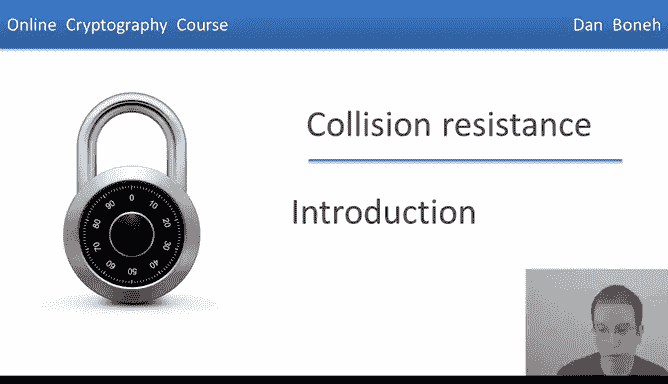
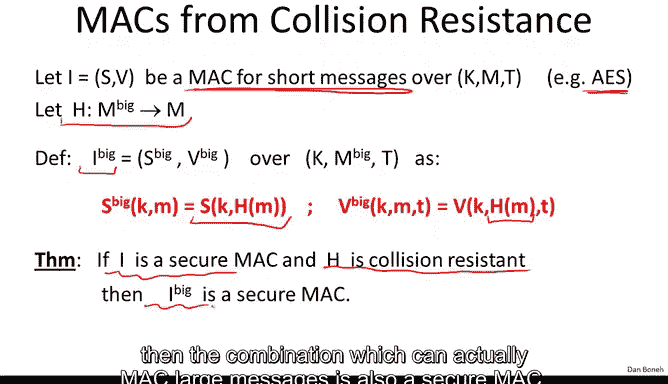
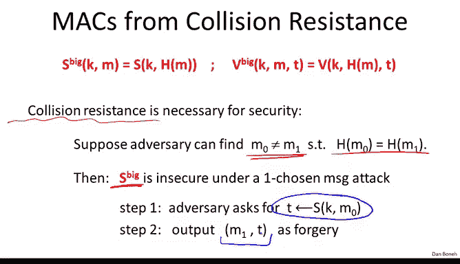
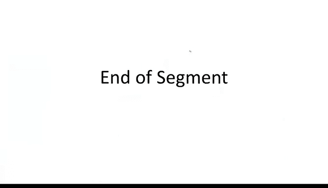

# 029：碰撞抵抗与消息完整性

在本节课中，我们将学习一个称为“碰撞抵抗”的新概念，它在提供消息完整性方面扮演着重要角色。我们的最终目标是描述一种在互联网协议中广泛使用的流行MAC算法——Hmac。Hmac本身是基于碰撞抵抗的哈希函数构建的。在开始之前，我们先快速回顾一下之前的内容。

上一节我们讨论了消息完整性，并指出一个MAC系统是安全的，当且仅当它在选择消息攻击下是存在性不可伪造的。这意味着，即使攻击者获得了任意选择消息的标签，也无法为某个新消息构造出有效的标签。

我们证明了任何安全的伪随机函数都能立即为我们提供一个安全的MAC。因此，我们转而探讨如何构建能够处理大消息输入的安全PRF。

我们研究了四种构造方法。第一种构造基于CBC模式，我们看了它的两种变体：加密CBC和CMMAC。这些方法通常与AES一起使用，例如在802.11i标准中，CBC-MAC就与AES算法结合用于消息完整性。

我们还研究了另一种称为NMac的模式，它也能将处理短输入的PRF转换为能处理极大消息输入的PRF。这两种都是顺序型MAC。

接着，我们看了一种可并行化的MAC，称为Pmac。它同样能将处理小输入的PRF转换为处理大输入的PRF，但以并行方式进行。因此，在多处理器系统上，Pmac比CBC-MAC更高效。以上三种方法都是通过为大消息构建PRF来构建MAC。

最后，我们研究了Carter-Wegman MAC，它实际上不是一个PRF，而是一个随机化MAC。因此，单个消息可以有许多不同的有效标签。Carter-Wegman MAC首先使用快速的一次性MAC将大消息哈希成一个小标签，然后使用PRF加密该标签。其优势在于，大消息的哈希是使用快速的一次性MAC完成的。

在本节中，我们将从“碰撞抵抗”这个新概念出发来构建MAC。我们要做的第一件事就是构建碰撞抵抗的哈希函数。

## 碰撞抵抗的定义

首先，我们来定义哈希函数的“碰撞抵抗”意味着什么。设想一个哈希函数H，它将消息空间M映射到标签空间T。消息空间M应远大于标签空间T。消息可能长达千兆字节，而标签可能只有160比特。

对于函数H，一个碰撞是指一对不同的消息M0和M1，当应用函数H时，它们产生了相同的输出。可以想象，有两个输入M0和M1属于巨大的消息空间，但当应用哈希函数后，它们“碰撞”到了标签空间中的同一个输出点。

我们说函数H是碰撞抵抗的，如果很难找到该函数的碰撞。这听起来可能有点违反直觉，因为根据鸽巢原理，输出空间远小于输入空间，必然存在大量消息映射到相同的输出。问题在于，是否存在一个高效的算法能明确地找到任何一个这样的碰撞。

我们称函数H是碰撞抵抗的，如果对于所有显式、高效的算法A，这些算法都无法为函数H输出一个碰撞。我们通常将算法的优势定义为算法A能够输出一个碰撞的概率。这里“显式”意味着算法必须是我们可以实际编写并在计算机上运行的，而不仅仅是理论上存在。

一个经典的碰撞抵抗哈希函数例子是SHA-256。它可以输出256比特，但能接受任意大的输入（例如千兆字节的数据），并将其映射到256比特。目前，没有人知道如何为这个特定函数找到碰撞。

## 碰撞抵抗的应用：构建大消息MAC

为了展示碰撞抵抗概念的实用性，我们来看一个快速应用：如何使用碰撞抵抗哈希函数简单地构建一个MAC。

假设我们有一个用于短消息的MAC（例如AES，可以处理16字节的消息）。同时，假设我们有一个碰撞抵抗的哈希函数H，它能将包含千兆字节的大消息空间映射到我们的小消息空间（例如16字节的输出）。

我们可以定义一个新的、能处理大消息的MAC，称之为I_big。我们简单地通过将小MAC应用于哈希函数的输出来定义它。验证时，我们重新哈希给定的消息，然后检查小MAC是否能在给定标签下验证通过。

这是一种非常简单的方式，展示了碰撞抵抗如何将一个为小输入构建的原语扩展为能为极大输入构建的原语。实际上，我们不仅会在MAC中看到这一点，稍后讨论数字签名时，我们也会做同样的事情：为小输入构建数字签名方案，然后使用碰撞抵抗来扩展输入空间。

其安全定理在某种意义上很简单：如果底层MAC是安全的，并且H是碰撞抵抗的，那么这个能处理大消息的组合也是一个安全的MAC。

作为一个快速示例，我们可以将其应用于AES。使用我们提到的SHA-256。SHA-256输出256比特（32字节）。我们需要构建一个能处理32字节消息的MAC。我们可以通过将16字节的AES嵌入到一个两块的CBC模式中来实现，这将把AES从一个处理16字节的PRF扩展为处理32字节的PRF。然后，将SHA-256的输出输入到这个基于AES的两块CBC中，我们就得到了一个非常简单的MAC，只要假设AES是一个PRF且SHA-256是碰撞抵抗的，它就是安全的。

需要指出的是，碰撞抵抗对于这个构造的安全性是必要的。如果哈希函数H不是碰撞抵抗的，即存在算法能找到两个不同消息映射到相同输出，那么组合MAC将不安全。攻击者可以使用选择消息攻击获取消息M0的标签，然后输出（M1，标签）作为伪造。因为H(M1)等于H(M0)，所以标签t对M1也是有效的。仅通过一次选择消息攻击，攻击者就能攻破这个组合MAC，原因就在于哈希函数不是碰撞抵抗的。因此，如果有人公布了SHA-256的一个碰撞（哪怕只是一对消息），这个构造就会变得不安全。

## 另一个应用：软件包完整性验证

碰撞抵抗的另一个直接用于消息完整性的应用是软件包验证。

想象我们有需要保护的文件，比如我们想在系统中安装的软件包。用户想下载软件包，并确保他下载的是正确的版本，而不是攻击者篡改过的版本。

他可以参考一个相对较小的、只读的公共空间。这个空间只需要存储软件包的小哈希值，因此所需空间不大。唯一的要求是这个空间是只读的，即攻击者无法修改其中存储的哈希值。

用户下载软件包后，可以轻松计算其哈希值，并与公共空间中的值进行比较。如果两者匹配，他就知道下载的软件包版本是正确的。为什么？因为函数H是碰撞抵抗的，攻击者无法找到一个不同的文件F1‘，使得其哈希值与F1的哈希值相同。因此，攻击者无法在不被检测到的情况下修改F1，因为他无法让F1‘的哈希值映射到公共空间中存储的值。

这个例子与MAC的例子形成对比。在MAC例子中，我们需要一个密钥来验证单个文件的标签，但不需要一个只读的公共空间资源。而使用碰撞抵抗哈希，我们得到了互补的特性：我们不需要密钥来验证（任何人都可以验证），但突然需要这个攻击者无法修改的额外资源（只读公共空间）。稍后我们会看到，通过数字签名，我们可以兼得两者：既具有公开可验证性，又不需要只读空间。但到目前为止，使用MAC或碰撞抵抗，我们只能拥有其一。

实际上，这种方案非常流行。例如，Linux发行版经常使用公共空间来公布其软件包的哈希值，任何人都可以在将软件包安装到计算机之前，确保他们下载的是正确的版本。这在现实世界中得到了相当广泛的应用。

## 总结

本节课我们一起学习了碰撞抵抗的概念及其在密码学中的重要性。我们定义了碰撞抵抗，并看到它如何使我们能够将处理小消息的密码原语（如MAC）安全地扩展到处理极大消息。我们还探讨了碰撞抵抗在软件包完整性验证中的实际应用，对比了它与基于密钥的MAC方案在公开验证和资源需求上的不同。在下一节中，我们将讨论针对碰撞抵抗的通用攻击，并开始学习如何构建碰撞抵抗的哈希函数。