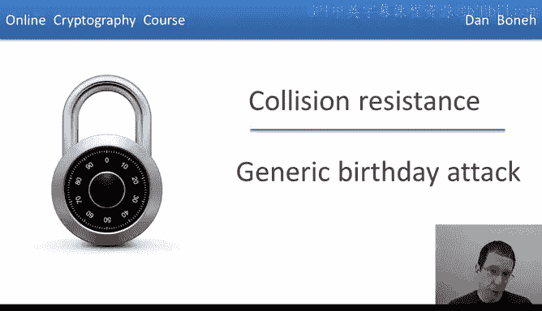
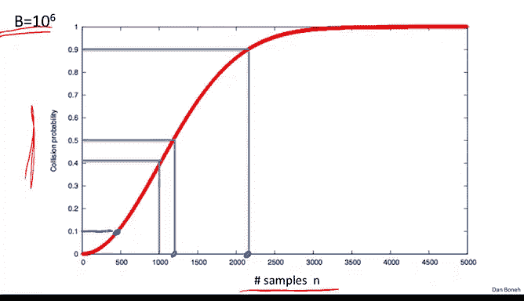
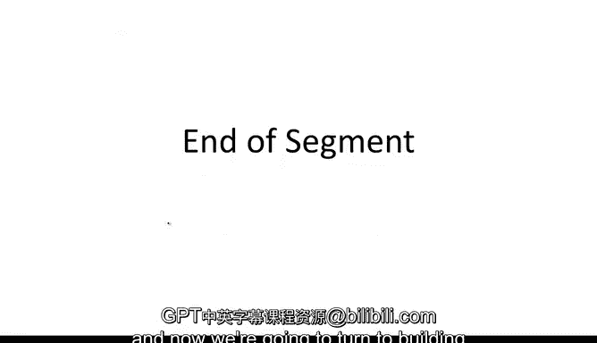

# 030：通用生日攻击 🎂

在本节课中，我们将学习一种针对抗碰撞哈希函数的通用攻击方法——生日攻击。我们将了解其工作原理、背后的数学原理（生日悖论），以及它对哈希函数输出长度安全性的影响。

上一节我们讨论了抗碰撞哈希函数的基本概念，本节中我们来看看一种能够攻击任何此类函数的通用方法。

## 生日攻击算法

生日攻击是一种通用算法，可以作用于任意的抗碰撞哈希函数。假设哈希函数 `H` 输出 `n` 比特的值，即输出空间大小约为 `2^n`。消息空间则远大于 `n` 比特，例如消息长度为 `100n` 比特。

该算法能在约 `2^(n/2)` 的时间内找到碰撞，这大约是输出空间大小的平方根。以下是算法的步骤：

以下是算法的具体步骤：
1.  随机选择 `2^(n/2)` 条消息，记为 `M1, M2, ..., M2^(n/2)`。由于消息长度远大于 `n` 比特，这些消息极大概率是互不相同的。
2.  对每条消息应用哈希函数，得到对应的标签（哈希值）`ti = H(Mi)`。每个 `ti` 都是 `n` 比特长的字符串。
3.  在这些标签 `ti` 中寻找碰撞，即找到一对 `(i, j)` 使得 `ti = tj`。
4.  一旦找到这样的碰撞，由于 `Mi` 极大概率不等于 `Mj`，但 `H(Mi) = H(Mj)`，我们就成功为函数 `H` 找到了一个碰撞。
5.  如果在当前这批 `2^(n/2)` 个标签中没有找到碰撞，则返回步骤1，重新选择一批消息并重复此过程。

接下来，我们需要分析这个算法需要迭代多少次才能成功找到碰撞。分析的关键在于理解“生日悖论”。

## 生日悖论 📊

为了分析上述攻击，我们需要了解生日悖论。假设我们有 `n` 个在区间 `[1, B]` 内的随机变量 `R1, R2, ..., Rn`。我们假设这些变量是相互独立且同分布的（例如，都是在 `[1, B]` 上均匀分布）。

生日悖论指出：如果我们设置 `n ≈ 1.2 * √B`，那么至少有两个样本相等的概率不小于 `1/2`。均匀分布是生日悖论中的“最坏情况”，对于非均匀分布，所需的样本数会更少。

以下是该定理的证明（针对均匀分布情况）：
我们计算至少存在一对 `(i, j)` 使得 `Ri = Rj` 的概率。更方便的方法是计算其对立事件——所有样本都互不相同的概率。

1.  选择 `R1`：第一个样本不会与任何样本碰撞。
2.  选择 `R2`：`R2` 不与 `R1` 碰撞的概率是 `(B-1)/B`。
3.  选择 `R3`：`R3` 不与 `R1` 或 `R2` 碰撞的概率是 `(B-2)/B`。
4.  依此类推，选择 `Rk` 时不与前 `k-1` 个样本碰撞的概率是 `(B - (k-1))/B`。

由于样本相互独立，所有样本都互不相同的概率是这些概率的乘积：
`P(无碰撞) = ∏_{i=1}^{n-1} (1 - i/B)`

利用不等式 `1 - x ≤ e^{-x}`（对于 `x > 0`），我们可以得到：
`P(无碰撞) ≤ ∏_{i=1}^{n-1} e^{-i/B} = e^{-∑_{i=1}^{n-1} i/B} = e^{-(n(n-1))/(2B)}`

因此，存在碰撞的概率至少为：
`P(碰撞) ≥ 1 - e^{-(n^2)/(2B)}`

现在，代入 `n = 1.2√B`：
`n^2/(2B) = (1.44B)/(2B) = 0.72`
所以 `P(碰撞) ≥ 1 - e^{-0.72} ≈ 1 - 0.487 ≈ 0.513 > 1/2`。证明完毕。

它被称为“悖论”是因为结果与直觉相悖。例如，应用于生日（`B=365`），只需要约 `1.2 * √365 ≈ 23` 个人，就有超过一半的概率找到两个生日相同的人。直觉上，这个数字看起来很小。其背后的直觉是，`n` 个人可以组成约 `n^2/2` 对，每对生日相同的概率是 `1/B`，当 `n ≈ √B` 时，总的对数约为 `B`，因此很可能有一对发生碰撞。

下图展示了当 `B=1,000,000` 时，碰撞概率随样本数 `n` 的变化。可以看到，在 `n` 接近 `√B` 时，碰撞概率从接近0迅速上升到接近1，呈现一种阈值现象。

## 分析攻击算法 ⚙️

现在我们可以分析之前的攻击算法了。我们选择了 `2^(n/2)` 条随机消息并计算其哈希值。这些哈希标签 `t1, t2, ..., t2^(n/2)` 是相互独立的。

根据生日悖论，当我们采样约 `1.2 * √(2^n) = 1.2 * 2^(n/2)` 个样本（即哈希值）时，找到碰撞的概率约为 `1/2`。

那么，我们需要迭代这个算法多少次才能找到碰撞呢？由于每次尝试（生成一批哈希值）有 `1/2` 的概率成功，期望的迭代次数约为2次。因此，该算法的总运行时间大致为 `2 * 2^(n/2) = O(2^(n/2))` 次哈希函数计算。

这个结论非常关键：**对于一个输出为 `n` 比特的哈希函数，总存在一个运行时间约为 `2^(n/2)` 的通用攻击算法来寻找碰撞。**

## 对哈希函数设计的影响 🛡️

这个结论直接影响哈希函数输出长度的安全标准。例如：
*   如果哈希函数输出128比特（`n=128`），则通用攻击可在约 `2^64` 时间内找到碰撞。这在当今计算能力下被认为是不够安全的。
*   因此，抗碰撞哈希函数通常需要更长的输出。

以下是几个哈希函数标准的例子及其对应的通用攻击复杂度：

| 哈希函数 | 输出长度 (n bits) | 生日攻击复杂度 (≈2^(n/2)) | 备注 |
| :--- | :--- | :--- | :--- |
| SHA-1 | 160 | 2^80 | 已不推荐在新项目中使用。存在理论攻击（~2^51）。 |
| SHA-256 | 256 | 2^128 | 目前的安全标准。 |
| SHA-512 | 512 | 2^256 | 更高的安全性，但通常更慢。 |
| Whirlpool | 512 | 2^256 | 另一个512位输出的哈希函数示例。 |

需要注意的是，SHA-1虽然尚未被实际攻破（找到碰撞），但已存在理论上更快的攻击方法。因此，在新项目中应避免使用SHA-1，转而使用SHA-256或SHA-512。

## 总结

本节课中我们一起学习了针对抗碰撞哈希函数的通用生日攻击。我们首先介绍了攻击算法的步骤，即通过随机采样约 `2^(n/2)` 条消息并比较其哈希值来寻找碰撞。然后，我们深入探讨了其理论基础——生日悖论，并完成了证明。最后，我们分析了该攻击的意义，它决定了哈希函数的安全输出长度必须足够长（例如256比特或以上），以使得 `2^(n/2)` 的计算量在现有和可预见的计算能力下不可行。这为选择安全的哈希函数提供了重要依据。