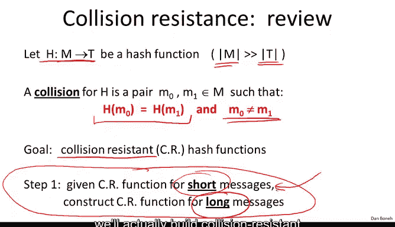
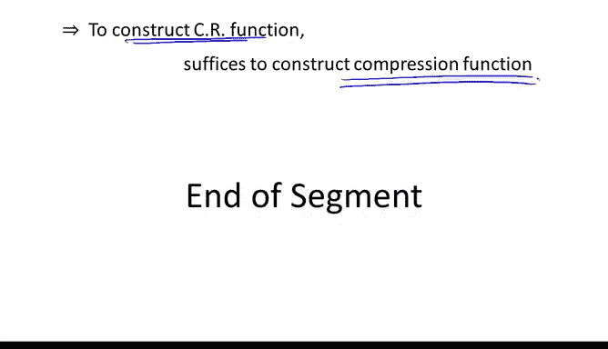

# 031：默克尔-达姆加德范式 🧩

在本节课中，我们将学习一种用于构建抗碰撞哈希函数的通用范式——默克尔-达姆加德范式。我们将了解其工作原理、关键组成部分，并通过一个证明来理解为何它能将短消息的抗碰撞性扩展到长消息上。

---

## 目标回顾

首先，让我们明确目标。哈希函数 **H** 将一个大的消息空间映射到一个小的标签空间。哈希函数的碰撞是指两个不同的消息在该哈希函数下映射到了相同的值。我们的目标是构建抗碰撞的哈希函数，即难以找到任何碰撞的函数，即使我们知道存在许多碰撞。

我们将分两步构建这些抗碰撞哈希函数。第一步（即本节内容）是展示：如果给定一个用于短消息的抗碰撞哈希函数，我们可以扩展它，构建一个用于更长消息的抗碰撞哈希函数。下一步将实际构建用于短消息的抗碰撞哈希函数。

---

## 构造方法

构造方法非常通用，事实上，所有抗碰撞哈希函数都遵循这个范式。这是一个非常优雅的范式。

我们有一个函数 **H**，我们假设它是一个用于小尺寸输入的抗碰撞哈希函数。这个 **H** 有时被称为压缩函数。

我们取一个长消息 **M**，将其分割成块。然后，我们使用一个称为 **IV**（初始向量）的固定值。这个 **IV** 是永久固定的，被嵌入在代码和标准中，是函数定义的一部分。

接下来，我们将小的压缩函数 **H** 应用于第一个消息块和这个 **IV**。产生的结果被称为链变量，它将被输入到下一个压缩函数中，该函数压缩下一个消息块和前一个链变量，并输出下一个链变量。我们以此类推，处理后续的消息块，直到最后一个消息块。

在最后一个消息块，我们有一件特殊的事情要做：必须附加一个填充块 **PB**。我稍后会解释填充块是什么。在附加填充块后，我们再次压缩最后一个链变量和最后一个消息块（包含填充块），其输出就是哈希函数的实际输出。

用符号总结：压缩函数将标签空间（哈希函数输出）和消息块（**x**）中的元素映射到下一个链变量。从这个压缩函数，我们能够为大型输入（即最多 **L** 个 **x** 块的空间）构建哈希函数。这些是可变长度的，因此不同长度的消息都可以作为输入。输出是标签空间中的一个标签。

唯一需要定义的是填充块。填充块非常重要。它基本上是一个序列 `1000...` 来表示实际消息块的结束，然后填充块最重要的部分是我们在其中编码消息长度。消息长度字段固定为 64 位。因此，在所有 SHA 哈希函数中，最大消息长度是 `2^64 - 1` 位。这个上限足以处理我们将要处理的所有消息。

如果最后一个块的长度正好是压缩函数块长度的倍数，没有空间放置填充块怎么办？答案是：如果需要，我们将添加一个额外的虚拟块，并将填充块放在那里，并正确放置 `10...0` 序列。关键在于，填充块包含消息长度，这一点非常重要。

这就是默克尔-达姆加德构造。最后一个术语是链变量：**H0** 是初始值，**H1, H2, H3...** 直到 **Ht+1**，即哈希函数的最终输出。

所有标准哈希函数都遵循这个范式，从压缩函数构建抗碰撞哈希函数。这个范式如此流行的原因在于以下定理：如果小的压缩函数是抗碰撞的，那么大的默克尔-达姆加德哈希函数也是抗碰撞的。换句话说，要构建用于大输入的抗碰撞函数，我们只需要构建抗碰撞的压缩函数。

---

## 定理证明

让我们来证明这个定理。证明很优雅，也不太困难。我们将使用逆否命题来证明：如果你能在大的哈希函数上找到一个碰撞，那么我们将推导出在小的压缩函数上存在一个碰撞。因此，如果小 **H** 是抗碰撞的，那么大 **H** 也将是抗碰撞的。

假设你给了我一个大哈希函数的一个碰撞，即两个不同的消息 **M** 和 **M'** 哈希到相同的输出。我们将使用 **M** 和 **M'** 来构建小压缩函数的一个碰撞。

首先，我们必须记住默克尔-达姆加德构造的工作原理。特别是，让我们为哈希 **M** 和哈希 **M'** 时产生的链变量命名。

对于消息 **M**，链变量为：**H0** 是启动整个过程的固定 **IV**，**H1** 是第一个消息块与 **IV** 哈希的结果，依此类推，直到 **H_{t+1}**，这是默克尔-达姆加德链的最终输出，也是最终哈希值。

类似地，对于 **M'**，定义 **H0'** 为第一个链变量，**H1'** 为压缩 **M'** 的第一个消息块后的结果，依此类推，直到 **H'_{r+1}**，即消息 **M'** 的最终哈希值。注意，消息 **M** 和 **M'** 的长度不必相同；**M** 长度为 **t**，而 **M'** 长度为 **r**。

由于发生了碰撞，我们知道这两个值相等：**H(M) = H(M')**。换句话说，最后的链变量彼此相等。

现在，让我们仔细看看 **H_{t+1}** 和 **H'_{r+1}** 是如何计算的。**H_{t+1}** 是通过将压缩函数应用于前一个链变量和 **M** 的最后一个消息块（包括填充块）来计算的。类似地，**H'_{r+1}** 是通过压缩前一个链变量和 **M'** 的最后一个消息块（包括填充块）来计算的。由于这两个值相等，我们突然得到了压缩函数的一个候选碰撞。

如果压缩函数的参数不同，那么我们就得到了小 **H** 的一个碰撞。更精确地说，如果 **H_t ≠ H'_r** 或 **M_t ≠ M'_r** 或填充块不同，那么我们就有了压缩函数 **H** 的一个碰撞，证明完成。

我们需要继续的唯一情况是上述条件不成立。这意味着最后第二个链变量相等、消息的最后一块相等且两个填充块相等。填充块相等意味着消息长度被编码在填充块中，因此 **M** 和 **M'** 的长度相同，即 **t = r**。从现在起，我可以假设 **t = r**。

现在，我们可以对倒数第二个链变量应用完全相同的论证。**H_t** 是通过哈希前一个链变量 **H_{t-1}** 和倒数第二个消息块来计算的。**H'_t** 也是类似计算的。如果 **H_{t-1} ≠ H'_{t-1}** 或 **M_{t-1} ≠ M'_{t-1}**，那么我们就有压缩函数的一个碰撞，证明完成。

我们需要继续的唯一情况是这些条件也不成立。我们可以继续迭代这个论证，从消息的末尾一直迭代到开头。两种情况必居其一：要么我们找到了压缩函数的一个碰撞；要么 **M** 和 **M'** 的所有消息块都相同。由于我们已经证明消息长度相同，这意味着 **M** 实际上等于 **M'**。但这与你一开始给我一个碰撞的事实相矛盾。因此，从消息末尾向开头迭代的过程中，我们必定会在某个点找到小 **H** 的一个碰撞。

这基本上完成了定理的证明。因此，如果小的压缩函数 **H** 是抗碰撞的，那么大的默克尔-达姆加德函数 **H** 也必须是抗碰撞的。人们喜欢这个构造的原因再次在于：它表明要构建大的哈希函数，只需为小输入构建压缩函数就足够了。我们将在下一节中完成这一步。

---

## 总结

本节课中，我们一起学习了默克尔-达姆加德范式。我们了解了它如何通过一个抗碰撞的压缩函数来构建一个能处理任意长度消息的抗碰撞哈希函数。关键点包括使用初始向量 **IV**、将消息分块处理、链变量的传递，以及至关重要的包含消息长度的填充块。最后，我们通过一个严谨的证明理解了该范式安全性的核心：对大哈希函数的任何碰撞都会导致对小压缩函数的碰撞，从而将抗碰撞性从“小”模块传递到了“大”系统。这为后续实际构建压缩函数奠定了理论基础。