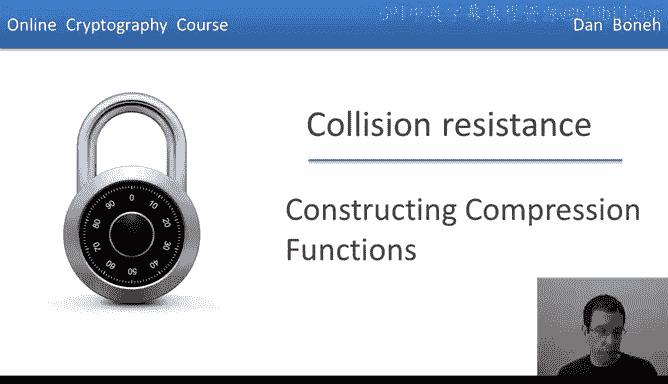
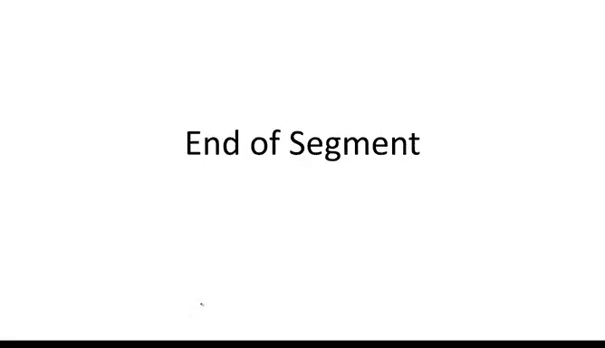

# 032：构造压缩函数 🔧



在本节中，我们将学习如何构建安全的压缩函数。具体来说，我们将探讨如何构建具有抗碰撞性的压缩函数，这是构建安全哈希函数的关键组件。

---


## 概述

上一节我们介绍了Merkle-Damgård结构，它能将一个小型压缩函数扩展为可处理任意长输入的哈希函数。我们证明了，只要底层压缩函数是抗碰撞的，那么构造出的哈希函数也是抗碰撞的。因此，本节的核心目标就是学习如何构建这种抗碰撞的压缩函数。

我们将看到两种主要方法：一种基于已有的分组密码，另一种则基于数论中的困难问题。

---

## 基于分组密码的构造

一个很自然的问题是：能否利用我们已经掌握的分组密码来构建压缩函数？答案是肯定的。

假设我们有一个分组密码 `E`，它处理 `n` 比特的数据块。输入和输出都是 `n` 比特。这里有一个经典的构造，称为 **Davies-Meyer** 结构。

其工作原理如下：给定消息块 `M` 和链变量 `H`，我们使用消息块 `M` 作为密钥来加密链变量 `H`，然后将输出与原始的链变量 `H` 进行异或操作。

用公式表示如下：
```
H(H, M) = E(M, H) XOR H
```

这看起来可能有些奇怪，因为消息块 `M` 完全由攻击者控制，而我们却将其用作分组密码的密钥。然而，我们可以证明，当 `E` 是一个理想密码时，这个构造的碰撞阻力达到了理论上的最优值。

**定理**：如果 `E` 是一个理想分组密码，那么找到 Davies-Meyer 压缩函数碰撞所需的时间约为 `2^(n/2)`。这与通用的生日攻击复杂度相同，意味着该构造的抗碰撞性已尽可能强。

Davies-Meyer 结构在实践中被广泛使用，例如 SHA 系列哈希函数就采用了它。

---

### 一个不安全的变体

并非所有基于分组密码的构造都是安全的。考虑以下变体，它去掉了最后的异或操作：
```
H(H, M) = E(M, H)
```

这个压缩函数**不是**抗碰撞的。以下是证明方法：

假设我们想为这个函数找到一个碰撞。我们可以任意选择两个不同的消息块 `M` 和 `M'`，以及一个任意的链变量 `H`。然后，我们通过解密操作来构造碰撞的另一个输入 `H'`：
```
H' = D(M', E(M, H))
```
其中 `D` 是 `E` 的解密函数。可以验证，`(H, M)` 和 `(H', M')` 在这个压缩函数下会产生相同的输出。因此，攻击者可以轻松制造碰撞。

这个例子说明，设计安全的压缩函数需要非常谨慎。

---

### 其他安全与不安全的构造

除了 Davies-Meyer，还有其他安全的构造方式，例如 **Miyaguchi-Preneel** 结构（被 Whirlpool 哈希函数使用）。同样，也存在许多不安全的变体。

以下是一个不安全构造的例子，作为练习供你思考如何找到其碰撞：
```
H(H, M) = E(M, H) XOR M
```

---

## SHA-256 的构成

现在，我们可以完整描述 SHA-256 哈希函数了：
1.  它采用 **Merkle-Damgård** 迭代结构。
2.  其压缩函数采用 **Davies-Meyer** 模式。
3.  Davies-Meyer 模式中使用的底层分组密码是一个名为 **SHACAL-2** 的密码。
    *   密钥大小为 **512 比特**（对应消息块）。
    *   分组大小为 **256 比特**（对应链变量）。

至此，你已从原理上理解了 SHA-256 的工作机制（当然，SHACAL-2 分组密码的内部细节是另一个话题）。

---

## 基于数论的“可证明”压缩函数

另一类压缩函数基于数论中的困难问题构建。我们称之为“可证明安全的”压缩函数，因为如果能找到该函数的碰撞，就意味着你能解决一个公认困难的数论问题。

构造方法如下：
1.  选择一个非常大的素数 `p`（例如 2000 比特）。
2.  在 `1` 到 `p-1` 之间随机选择两个数 `u` 和 `v`。
3.  定义压缩函数。它输入两个在 `0` 到 `p-1` 之间的数（链变量 `H` 和消息块 `M`），输出一个数：
    ```
    H(H, M) = u^H * v^M mod p
    ```

**定理**：如果能为这个压缩函数找到一个碰撞，那么你就能解决“离散对数问题”。由于大家普遍相信离散对数问题是困难的，因此这个压缩函数是（可证明）抗碰撞的。

你可能会问，为什么实践中不常用这种函数（例如用于 SHA-256）？主要原因是它的计算速度远慢于基于分组密码的构造。因此，它通常只用于某些对可证明安全性有极高要求、且对性能不敏感的特殊场景。

---

## 总结

本节课我们一起学习了构建抗碰撞压缩函数的两种主要途径：
1.  **基于分组密码的构造**，如 Davies-Meyer 结构，它高效且被广泛采用（如 SHA-256）。
2.  **基于数论难题的构造**，它具有可证明的安全性，但性能较低。



理解如何安全地构建压缩函数，是理解现代密码学哈希函数如何工作的基石。下一节，我们将利用这些知识，探讨如何构建安全的消息认证码（MAC），具体来说是 **HMAC**。