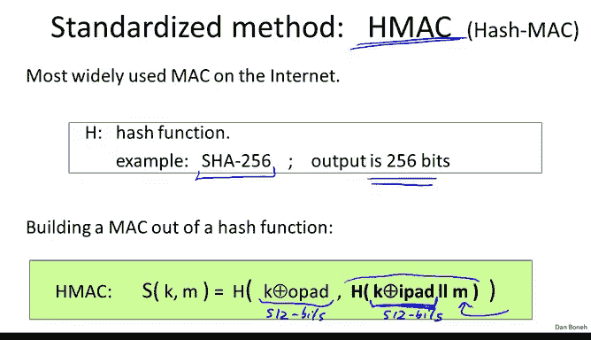
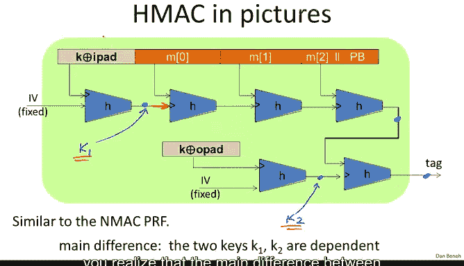
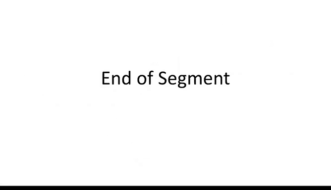

# 033：HMAC 🛡️

在本节课中，我们将学习如何利用抗碰撞哈希函数来构建一个安全的MAC（消息认证码）。我们将重点介绍一个广泛使用的标准——HMAC，并解释其工作原理与安全性。


## 概述

我们已经理解了抗碰撞哈希函数的概念及其构造方法。现在，我们将探讨如何直接利用一个大型哈希函数（如SHA-256）来构建MAC，而无需依赖伪随机函数（PRF）。本节将介绍HMAC的构造原理，并解释为何简单的“密钥拼接”方法不安全。

## 从哈希函数到MAC的初步尝试

上一节我们介绍了Merkle-Damgård构造。本节中我们来看看能否直接用它来构建MAC。

一个直观的想法是：将MAC密钥与待认证的消息拼接起来，然后对整个拼接结果进行哈希。用公式表示，即 `Tag = H(K || M)`。


然而，这种方法**完全不安全**。原因在于Merkle-Damgård构造固有的**扩展攻击**漏洞。

以下是攻击原理：
1.  攻击者获得某个消息 `M` 的认证标签 `Tag`。
2.  由于 `Tag` 实际上是哈希链在某个中间状态的值，攻击者可以在此状态后**附加任意的数据块** `W`。
3.  攻击者只需对附加的块 `W` 再应用一次压缩函数 `H`，就能计算出 `H(K || M || padding || W)` 的标签，从而实现对扩展消息 `M || padding || W` 的**存在性伪造**。


因此，`H(K || M)` 这种构造绝不应该被使用。

## HMAC：安全的构造方法

为了避免上述安全问题，业界采用了一个标准化的方法将抗碰撞哈希函数转换为MAC，即**HMAC**。例如，我们可以基于SHA-256构建HMAC，其输出为256位。实际上，HMAC被认为是一个伪随机函数。

以下是HMAC的符号化构造，它按如下步骤工作：
1.  首先，将密钥 `K` 与一个固定的**内部填充**（iPad）进行异或运算，使其成为Merkle-Damgård构造的一个输入块（例如，对于SHA-256，块大小为512位）。
2.  将上一步的结果作为前缀，与消息 `M` 拼接，然后进行哈希运算。我们已知，仅这一步并不安全。
3.  HMAC的额外步骤是：将上一步哈希得到的输出（256位），再次与密钥 `K` 异或一个固定的**外部填充**（Opad）组合成另一个块（512位）。
4.  最后，对这个组合进行哈希运算，得到消息 `M` 的最终认证标签。

用公式简要描述核心步骤：
```
HMAC(K, M) = H( (K ⊕ Opad) || H( (K ⊕ iPad) || M ) )
```



## HMAC的工作原理图示

比起符号，图示能更直观地展示HMAC的工作原理。

如下图所示，HMAC包含两次Merkle-Damgård哈希过程：
1.  **内层哈希**：密钥与iPad异或后，作为初始向量（IV）输入，与消息 `M` 一起经过哈希链处理。
2.  **外层哈希**：内层哈希的输出，与密钥和Opad异或后的结果组合，再进行一次哈希，产生最终标签。


## HMAC与NMAC的关系及安全性

现在我们来分析HMAC的安全性。我们之前已经见过非常类似的东西。

具体来说，如果我们把压缩函数 `H` 看作一个伪随机函数（PRF），其中**上方的输入**作为密钥，那么：
*   在内层，我们对固定值IV应用该PRF（密钥为 `K ⊕ iPad`），会得到一个随机值，可称为 `K1`。
*   在外层，我们再次对固定值IV应用该PRF（密钥为 `K ⊕ Opad`），会得到另一个随机值 `K2`。



此时，使用 `K1` 和 `K2` 计算HMAC的过程，看起来就非常熟悉了——它基本上就是我们在前面章节讨论过的 **NMAC** 构造。


需要注意的是，HMAC与NMAC的主要区别在于：HMAC的密钥 `K1` 和 `K2` 是由同一个主密钥 `K` 通过与固定常量（iPad和Opad）异或派生而来的，因此它们是**相关的**。

为了论证HMAC的安全性，我们需要假设压缩函数 `H` 在即使密钥相关的情况下，仍然是一个安全的PRF。在此假设下，适用于NMAC的安全性分析同样适用于HMAC。HMAC的安全界限与NMAC相同：只要被认证的消息数量远少于标签输出空间大小的平方根，就是安全的。对于HMAC-SHA256（输出256位），其安全界限约为2^128次消息认证，这在实际应用中足够安全。

## 关于HMAC的补充说明

最后，关于HMAC还有两点需要说明：
1.  **TLS标准与HMAC-SHA1**：TLS标准要求支持HMAC-SHA1-96（即基于SHA-1构建HMAC，并截断输出至96位）。你可能会问，SHA-1不是已被认为是不安全的哈希函数了吗？这是因为HMAC的安全性分析**并不要求**底层哈希函数抗碰撞，而只要求其压缩函数在作为PRF时是安全的。就我们所知，SHA-1的压缩函数目前仍满足这一性质，因此在其内部使用是可行的。
2.  **时序攻击**：HMAC的实现需要考虑**时序攻击**的防范，我们将在下一节讨论这个问题。



## 总结


本节课中我们一起学习了HMAC。我们首先看到了直接将密钥与消息拼接后哈希的不安全性（易受扩展攻击），然后详细介绍了HMAC的标准构造方法，它通过两次哈希和固定的内外填充来避免安全问题。我们还分析了HMAC与NMAC的关联，并理解了其安全性的核心假设。最后，我们了解到即使使用已不抗碰撞的SHA-1，HMAC在特定假设下仍然是安全的，并提示了实现时需注意时序攻击。