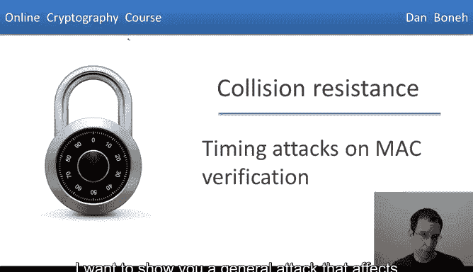
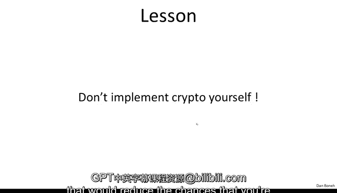

# 034：MAC验证的时序攻击 ⏱️

在本节课中，我们将要学习一种影响许多MAC算法实现的通用攻击——时序攻击。我们将通过分析一个具体的HMAC验证实现，来理解这种攻击的原理、危害以及如何防御。



## 概述

上一节我们介绍了MAC（消息认证码）的基本概念。本节中，我们来看看一个看似正确但存在严重安全漏洞的MAC验证实现。我们将分析攻击者如何利用代码执行时间的微小差异，逐字节地破解出正确的MAC值，并学习两种有效的防御方法。

## 一个存在漏洞的HMAC验证实现


以下是一个来自Python `keysar`库的HMAC验证代码的简化版本。它接收密钥、消息和待验证的标签字节作为输入。

```python
def verify(key, message, tag_bytes):
    # 重新计算消息的HMAC
    computed_mac = hmac(key, message)
    # 将计算出的16字节MAC与提供的标签字节进行比较
    return computed_mac == tag_bytes
```

这段代码看起来完全正确，许多人也是这样实现的。问题在于Python解释器内部进行字符串比较的方式。

## 时序攻击的原理

字符串比较通常是逐字节进行的。Python内部的循环会遍历所有字节，但**一旦发现第一个不匹配的字节，循环就会立即终止并返回“不相等”**。

这个“发现不匹配即退出”的特性，为攻击者实施时序攻击打开了大门。

以下是攻击者如何利用这一漏洞：

1.  **攻击场景**：攻击者有一个目标消息`M`，想获取其有效的MAC标签。他可以向一个存储了HMAC密钥的服务器发起请求，服务器会验证提交的（消息，标签）对，有效则处理消息，无效则返回“拒绝”。

2.  **攻击步骤**：
    *   攻击者提交大量（目标消息，猜测标签）的查询。
    *   他通过测量服务器的响应时间，来推断标签的正确字节。

以下是攻击的具体流程：

*   **第一步**：提交一个完全随机的标签，并记录服务器的响应时间（作为基准时间）。
*   **第二步**：开始猜测标签的第一个字节。攻击者提交的标签格式为：`[猜测字节] + [任意15个字节]`。
    *   他首先尝试第一个字节为`0`，测量响应时间。
    *   如果响应时间与第一步的基准时间相同（说明第一个字节就错了，比较立即终止），则尝试第一个字节为`1`。
    *   以此类推，直到尝试到某个值（例如`3`）时，发现服务器的响应时间**稍微变长了一点**。
    *   这意味着服务器在比较时，第一个字节匹配成功了，比较进行到了第二个字节才失败。因此，攻击者**得知第一个字节是`3`**。
*   **第三步**：固定第一个字节为`3`，开始用同样的方法猜测第二个字节。提交标签格式：`[3, 猜测字节] + [任意14个字节]`。
    *   通过测量响应时间的变化，可以推断出第二个字节的正确值（例如`53`）。
*   **后续步骤**：重复此过程，逐字节地破解出完整的16字节MAC标签。

最终，攻击者能够构造出完全正确的标签，从而欺骗服务器接受他伪造的消息。

## 防御方法一：恒定时间比较

这个例子表明，一个看似合理的实现方式可能是完全脆弱的。那么，我们该如何防御呢？

第一种防御方法是实现一个**恒定时间**的比较函数，确保无论字节在何处不匹配，比较所花费的时间都是相同的。

以下是`keysar`库更新后采用的防御代码：

```python
def verify_secure(key, message, sig_bytes):
    computed_mac = hmac(key, message)

    # 首先检查长度
    if len(sig_bytes) != len(computed_mac):
        return False

    # 恒定时间比较
    result = 0
    for x, y in zip(sig_bytes, computed_mac):
        result |= x ^ y  # 如果x和y不同，x^y为非零值，通过|运算会使result变为非零
    return result == 0
```

这个比较函数会遍历所有字节对，计算它们的异或（XOR）值，并通过或（OR）运算累积结果。只有当所有字节都相同时，最终结果`result`才为0。**循环总是执行固定的次数，不提前退出**，从而消除了时序信息泄露。

然而，这种方法存在一个潜在问题：**优化编译器**。编译器可能会“聪明地”优化这段代码，一旦发现`result`变为非零，就提前终止循环，这反而重新引入了时序漏洞。

## 防御方法二：隐藏比较对象

另一种防御思路是，不让攻击者知道他提交的字符串在和什么进行比较。

验证流程修改如下：
1.  计算正确的MAC：`correct_hmac = hmac(key, message)`
2.  **不直接比较**`correct_hmac`和`sig_bytes`。
3.  而是对两者**再进行一次哈希**：
    *   `h1 = hash(correct_hmac)`
    *   `h2 = hash(sig_bytes)`
4.  最后比较`h1`和`h2`。

如果`sig_bytes`等于`correct_hmac`，那么`h1`必然等于`h2`。但如果`sig_bytes`只是部分字节正确（例如仅第一个字节匹配），那么经过哈希后，`h1`和`h2`将很可能是两个完全不同的值，标准字符串比较会在第一个字节就快速返回不匹配。**攻击者无法知道他猜测的标签字节在与哪个哈希值进行比较**，因此无法实施之前描述的逐字节时序攻击。这种方法对编译器的优化不那么敏感。

## 总结与核心教训

本节课中我们一起学习了针对MAC验证的时序攻击。

*   我们看到了一个**逐字节比较且提前退出**的实现如何泄露关键信息。
*   我们分析了攻击者如何利用**响应时间的微小差异**，像剥洋葱一样逐字节破解出完整的MAC。
*   我们探讨了两种防御策略：
    1.  **实现恒定时间比较**，确保执行时间不依赖数据。
    2.  **对比较对象进行哈希**，隐藏真实的比较内容。

从所有这些内容中得到的主要教训是：即使是加密库的实现专家也可能犯错，写出功能正常但完全无法抵御侧信道攻击（如时序攻击）的代码，从而彻底破坏系统的安全性。



因此，核心建议是：
*   **不要发明自己的加密算法**。
*   **甚至不要自己实现加密算法**，因为你很可能无法抵御各种侧信道攻击。
*   **使用标准的、经过严格审计的加密库**，如OpenSSL或已修复漏洞的`keysar`库，这能大大降低遭受此类攻击的风险。