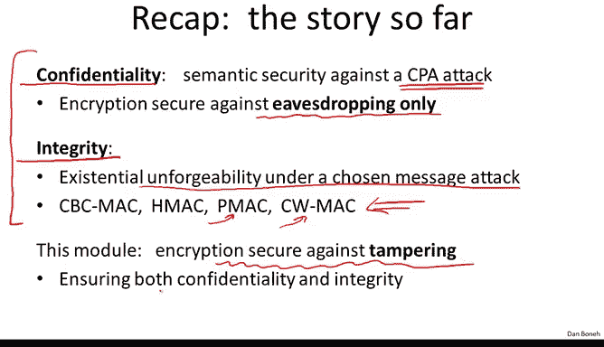
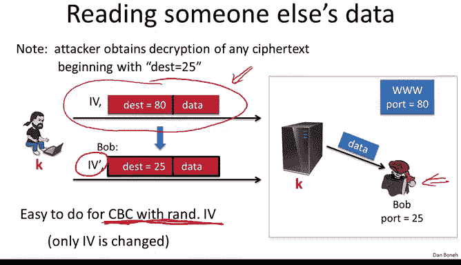
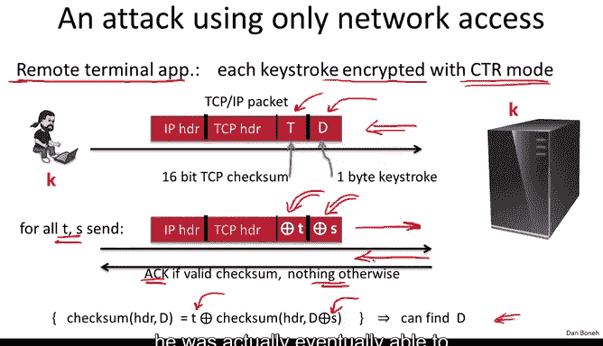

# 035：对CPA安全加密的主动攻击 🔓

在本节课中，我们将学习主动攻击者如何破坏仅具备CPA安全性的加密方案。我们将看到，如果加密数据在传输过程中可以被篡改，那么即使加密本身是CPA安全的，也无法保证机密性。这引出了我们需要将机密性与完整性结合的需求。

上一节我们介绍了消息完整性，本节我们将回到加密的话题，并展示如何构建比之前更强的安全加密方案。但首先，让我们回顾一下目前的情况。

在之前的章节中，我们讨论了机密性，特别是如何加密消息以实现针对**选择明文攻击**的语义安全。我反复强调，针对选择明文攻击的安全性仅能提供针对**窃听**的安全性。换句话说，这只能保护我们免受那些监听网络流量但不实际修改或注入数据包的对手的攻击。

在本模块中，我们的目标是设计能够抵御**主动攻击者**的加密方案。这些攻击者可以通过拦截、篡改或注入数据包来干扰流量。

我们还学习了如何提供**消息完整性**，即消息本身不保密，但我们希望确保消息在传输过程中不被修改。我们讨论了消息认证码，即MAC算法，它能提供针对**选择消息攻击**的**存在不可伪造性**。即使攻击者能够获取任意选择消息的MAC标签，他也无法为任何其他消息构造有效的MAC标签。我们研究了几种MAC构造，特别是CBC-MAC、HMAC、并行MAC构造以及一种名为Carter-Wegman MAC的快速MAC构造。

在本模块中，我们将展示如何结合这些机密性和完整性机制，以获得能够抵御更强大对手的加密方案。这些对手能够在网络中篡改流量、注入自己的数据包、拦截特定数据包等。我们的目标是确保即使面对如此强大的对手，我们也能维持**机密性**。换句话说，对手无法获知明文内容，甚至无法修改密文并导致接收者认为发送了不同的明文。

在此之前，我想先举几个例子，说明能够篡改流量的对手如何完全破坏CPA安全加密的安全性。这将表明，如果不提供完整性，机密性也可能被破坏。换句话说，如果我们想要实现针对主动攻击者的安全性，**完整性和机密性必须齐头并进**。

让我们看一个来自网络世界的例子，特别是TCP/IP协议。我将使用一个高度简化的TCP/IP版本，以便我们快速聚焦于攻击本身，而不被细节所困扰。

这里有两台机器正在通信。用户坐在一台机器前，另一台是服务器。服务器当然有一个TCP/IP协议栈来接收数据包，然后根据数据包中的目标字段将其转发到适当的位置。例如，这里有两个进程在监听这些数据包：一个Web服务器（监听端口80）和另一个用户Bob（监听端口25）。

当一个数据包到达时，TCP/IP协议栈会查看目标端口。如果是目标端口80，协议栈会将数据包转发给Web服务器。如果目标端口是25，协议栈会将数据包转发给监听端口25的Bob。

一个相当知名的安全协议IPsec会在发送方和接收方之间加密这些IP数据包。发送方和接收方共享一个密钥K。当发送方发送IP数据包时，这些数据包会使用密钥K进行加密。当数据包到达目标服务器时，TCP/IP协议栈会解密数据包，然后查看目标端口，并将解密后的数据发送到适当的位置。请注意，这里的数据是解密后的。如果目标端口是80，就会发送给Web服务器。如果目标端口是25，TCP/IP协议栈会解密数据包，查看目标端口，并将明文数据发送给监听端口25的进程。

现在我想展示，在这种设置下，如果没有完整性，我们就不可能实现任何形式的机密性。让我们看看原因。

想象攻击者拦截了一个发送给Web服务器的数据包，即一个发送给端口80的加密数据包。请记住，攻击者实际上可以接收任何发送给端口25的数据包解密后的内容，因为TCP协议栈会乐意解密端口25的数据包并将其发送给Bob。

攻击者Bob会拦截这个数据包，阻止它按原样到达服务器，并修改数据包，使目标端口变为25。这是在密文上进行的操作，我们稍后会看到具体做法。

当这个修改后的数据包到达服务器时，目标端口显示为25。服务器将解密数据包，看到目标是25，并将数据转发给Bob。

因此，Bob仅仅通过更改目标端口，就能够读取本意是发送给Web服务器的数据。

如果数据是使用带随机IV的CBC加密的（请记住，这是一个CPA安全的方案），攻击者可以轻易地更改密文，使其目标端口变为25而不是80。唯一需要改变的只是IV字段，其他所有内容都保持不变。

让我们看看具体怎么做。攻击者捕获的是一个CBC加密的数据包，他知道目标端口是80，但不知道数据内容。他的目标是构建一个新的加密数据包，使其目标端口变为25。

正如我们所说，他只需更改IV即可。解密CBC加密数据的方式是：第一个明文块等于第一个密文块解密后与IV进行异或。我们知道，在原始数据包中，这将得到D=80，因为原始数据包的目标端口是80。现在的问题是，攻击者如何更改IV，使目标端口变为D=25？

这很容易看出。如果攻击者取原始IV，将其与（一串零和80异或25的结果）在端口字节的相应位置进行异或，那么当这个新的IV‘与原始密文一起发送时，解密后，新的IV会抵消原始明文中本应得到的80，再通过与25异或，目标端口就变成了25。

这是一个很好的例子，说明通过对IV字段进行简单更改，攻击者就能够转移数据包，使得解密后的数据包流向攻击者而非实际的Web服务器，从而让攻击者能够读取本意发送给服务器的明文数据。

这个例子表明，如果没有完整性，当攻击者可以修改数据包时，CPA安全加密根本无法提供机密性。CPA安全加密仅在攻击者只窃听数据而无法实际修改密文时提供机密性。正如你所见，如果可以修改密文，一个简单的修改就会完全泄露明文。

我想展示另一个篡改攻击，它只需要访问网络流量，而不要求攻击者实际存在于解密机器上。

让我们看一个远程终端应用程序的例子，用户每次击键，一个加密的击键信息就会被发送到服务器。假设加密的击键使用计数器模式加密。这里，TCP/IP数据包中的D对应一个字节的击键信息，并使用计数器模式加密。你可能知道，每个TCP数据包实际上都包含一个校验和，这是一个16位的校验和，仅用于检测传输错误。如果服务器收到一个校验和错误的数据包，它会直接丢弃并忽略它。TCP头部（包括校验和）和击键信息都使用计数器模式加密。

攻击者想知道击键内容是什么。让我展示他能做什么。攻击者将拦截这个数据包，但不会立即修改它。他会先将原始数据包发送给服务器，但同时记录下这个数据包。稍后，他会修改这个数据包，并将修改后的版本发送给服务器。他会用值T异或加密后的校验和字段，用值S异或加密后的数据字段。他会对大量的T和S值重复此操作。

请记住计数器模式的一个特性：如果你用T异或密文，解密后的明文也会被T异或。同样，如果你用S异或加密数据，解密后的数据也会被S异或。

服务器将解密这个修改后的数据包，得到的结果数据包将具有被T异或的校验和和被S异或的数据。

如果修改后的校验和对于这个修改后的数据包是正确的，服务器将发送一个ACK确认包。如果修改后的校验和是错误的，服务器将直接丢弃数据包，不做任何回应。

因此，攻击者可以简单地观察是否有ACK包返回。通过这样做，他了解到这个特定的（T， S）异或对是否对应于一个有效的校验和。

攻击者将对大量的T和S值进行此操作。他了解到的是：如果我通过用特定值S异或来修改数据，这会使校验和改变一个特定值T。他获得了大量这样的（T， S）对信息。

事实证明，对于某些校验和算法，通过观察一系列此类方程，你实际上可以推断出D的值。我应该指出，对于TCP校验和，这可能不成立，但肯定存在一些简单的校验和算法，这绝对是成立的。

因此，通过观察大量此类方程，攻击者可以恢复出D。这是一个很好的**选择密文攻击**例子。攻击者基本上提交了他选择的密文（这些密文源自他想解密的密文），然后通过观察服务器的响应，他能够了解到一些关于结果明文的信息。通过对许多不同的T和S值重复此过程，他最终能够恢复出完整的明文。

在本节中，我们将看到更多此类攻击的例子，它们被称为**主动攻击**，攻击者实际上在途中修改流量。我希望这两个简单的例子能让你相信，如果只提供CPA安全性（即仅针对窃听的安全性），你甚至无法保证对主动攻击者的保密性。不仅你的密文缺乏完整性（接收者可能获得与发送者发送的不同的消息），而且你甚至没有机密性。我向你展示了两个例子，在没有完整性的情况下，攻击者可以简单地利用接收者作为解密部分数据的“预言机”来解密数据包。

因此，我将在本模块中反复强调的教训是：如果你的消息需要完整性但不需要机密性，只需使用MAC。但如果你的消息既需要完整性又需要机密性，你必须使用所谓的**认证加密模式**，这正是本模块的主题。

接下来，我们将定义认证加密的含义，并构建认证加密系统。但我想让你记住的一点是，我们之前讨论的CPA安全模式本身绝不应该被单独用于加密数据。因此，带随机IV的CBC是构建认证加密的一个组件，但绝不应该单独使用。

我们将在下一节中定义认证加密。