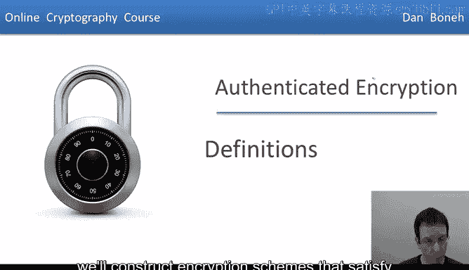
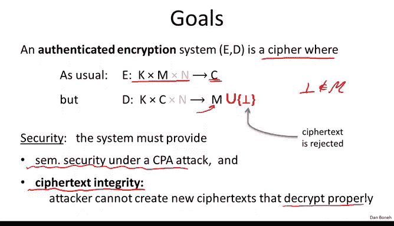
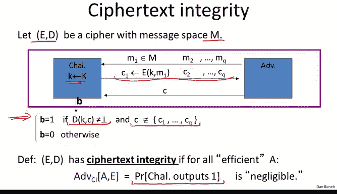
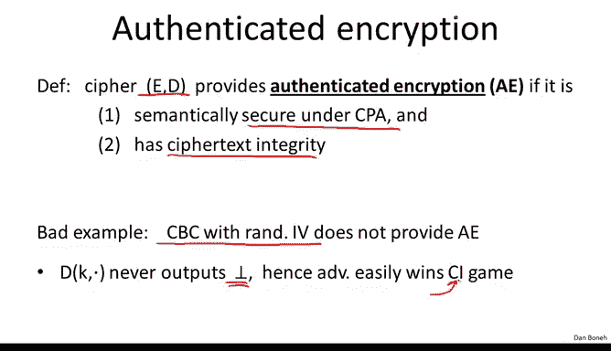

# 036：认证加密的定义

在本节课中，我们将学习一种新的加密概念——认证加密。上一节我们看到了两种可以完全破坏CPA安全加密方案安全性的主动攻击。本节中，我们将定义认证加密，它能够在面对主动攻击者时保持安全。在后续章节中，我们将构建满足这一新概念的加密方案。

## 什么是认证加密？🔐

认证加密是一种密码方案。与往常一样，加密算法 `E` 接收一个密钥 `K`、一条消息 `M` 和一个随机数，并输出一个密文 `C`。解密算法 `D` 通常输出一条消息。然而，在这里，解密算法被允许输出一个特殊的符号 `⊥`（底部符号）。当解密算法输出 `⊥` 时，意味着该密文无效，应被忽略。唯一的要求是 `⊥` 不在消息空间 `M` 中，因此它是一个指示密文应被拒绝的唯一符号。

那么，认证加密系统的安全性意味着什么呢？该系统必须满足两个属性。

## 认证加密的安全属性

以下是认证加密方案必须满足的两个核心安全属性。

1.  **语义安全（CPA安全）**：与之前一样，方案必须在选择明文攻击下是语义安全的。
2.  **密文完整性**：即使攻击者看到了许多密文，他也应该无法生成另一个能正确解密的密文。换句话说，他无法生成一个解密结果不是 `⊥` 的新密文。

更精确地说，让我们看看密文完整性游戏。

## 密文完整性游戏详解

在这个游戏中，`(E, D)` 是一个消息空间为 `M` 的密码方案。挑战者首先选择一个随机密钥 `K`。然后，攻击者可以提交他选择的消息，并接收这些消息的加密结果。

*   `C1 = E(K, M1)`，其中 `M1` 由攻击者选择。
*   攻击者可以重复此操作，提交 `M2` 并获得 `C2 = E(K, M2)`，依此类推，直到提交 `M_q` 并获得 `C_q = E(K, M_q)`。

因此，攻击者获得了 `q` 个他选择消息的对应密文。然后，他的目标是产生一个**新的**、**有效的**密文。

我们说攻击者赢得游戏，如果他创建的**新**密文 `C'` 能够正确解密（即 `D(K, C') ≠ ⊥`），并且 `C'` 不是之前挑战者给攻击者的那 `q` 个密文中的任何一个。

像往常一样，我们将攻击者在密文完整性游戏中的优势定义为游戏结束时挑战者输出1的概率。如果对于所有高效的攻击者，赢得该游戏的优势都是可忽略的，那么我们就说该密码方案具有**密文完整性**。

理解了密文完整性后，我们就可以定义认证加密了。我们说一个密码方案具有**认证加密**属性，当且仅当它在选择明文攻击下是语义安全的，并且同时具有密文完整性。

## 一个反面例子

作为一个不好的例子，需要指出的是，使用随机IV的CBC模式**不**提供认证加密。因为攻击者很容易赢得密文完整性游戏。攻击者只需提交一个随机的密文串。由于CBC的解密算法从不输出 `⊥`，它总是输出某个消息，所以攻击者可以轻松赢得游戏。任何旧的随机密文解密后都会得到非 `⊥` 的结果，因此攻击者直接赢得了密文完整性游戏。这是一个不提供认证加密的CPA安全密码方案的简单例子。

## 认证加密的两个重要推论

接下来，我们看看认证加密带来的两个重要安全推论。

1.  **真实性**：这意味着攻击者无法欺骗接收者Bob，让他相信Alice发送了一条她实际并未发送的消息。攻击者可以与Alice交互，让她加密任意选择的消息（即选择密文攻击）。然后，攻击者的目标是产生一个并非由Alice实际创建的密文。由于攻击者无法赢得密文完整性游戏，他无法做到这一点。这意味着，当Bob收到一个能通过解密算法正确解密的密文时，他知道该消息必定来自知道秘密密钥 `K` 的人。特别是，如果只有Alice知道 `K`，那么Bob就知道该密文确实来自Alice，而不是攻击者发送的篡改版本。
    *   **需要注意的一点是**：认证加密本身不防御重放攻击。攻击者可能拦截了从Alice到Bob的某个密文，然后重新发送它，而Bob看来这两个密文都是有效的。例如，Alice可能发送消息“转账100美元给Charlie”，然后Charlie可以重放该密文，导致Bob再次转账100美元给Charlie。因此，任何加密协议都需要防御重放攻击，而这并非认证加密直接防止的。我们将在后面讨论重放攻击。

2.  **抵御选择密文攻击**：认证加密能够防御一种非常强大的攻击者类型，即能够发起所谓“选择密文攻击”的攻击者。我们将在下一节详细讨论这一点。

## 总结

本节课中，我们一起学习了认证加密的定义。我们了解到，一个安全的认证加密方案必须同时满足**选择明文攻击下的语义安全**和**密文完整性**。它不仅能保证消息的机密性，还能保证消息的真实性和完整性，确保接收者收到的消息确实来自预期的发送方且未被篡改。我们还看到了一个不满足认证加密的例子（CBC模式），并了解了认证加密带来的两个重要安全推论：消息真实性和对选择密文攻击的潜在防御能力。