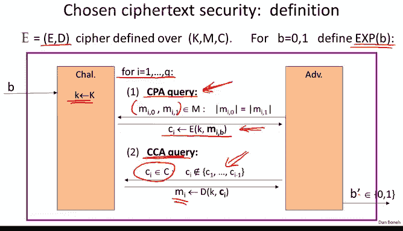
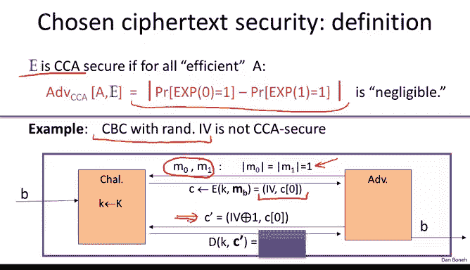
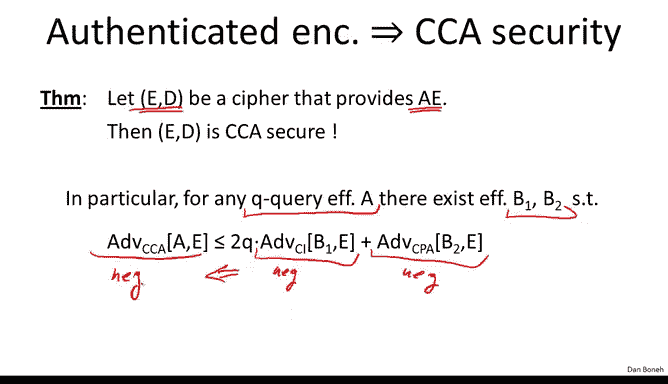
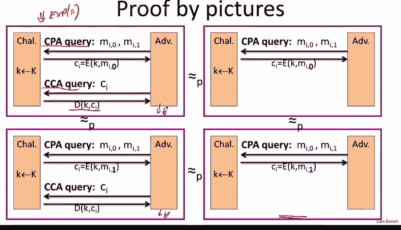
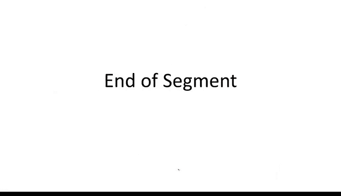

# 037：选择密文攻击 🔐

在本节课中，我们将学习一个强大的安全概念——选择密文攻击（CCA），并理解为何认证加密是抵御此类攻击的正确安全概念。我们将通过具体的攻击示例和形式化定义来阐明这一点。

## 概述

上一节我们定义了认证加密，但并未深入解释为何它是正确的安全概念。本节中，我们将展示认证加密实际上是一个非常自然的安全概念，因为它能够抵御一种非常强大的攻击，即选择密文攻击。

## 选择密文攻击的实例

以下是选择密文攻击在现实中的两个具体例子。

第一个例子中，攻击者可以向解密服务器提交任意密文。如果解密后的明文以特定字符串（如“destination=25”）开头，服务器就会将明文直接返回给攻击者。这允许攻击者获取某些特定密文的解密结果。

第二个例子涉及网络协议。攻击者可以向服务器提交加密的TCP/IP数据包。如果服务器返回一个ACK确认包，攻击者就知道解密后的明文具有有效的校验和；否则，校验和无效。这同样是选择密文攻击，攻击者通过提交密文并观察服务器的反应，来了解该密文解密后的部分信息。

## 选择密文安全的形式化定义

为了应对这类威胁，我们定义一个非常通用的安全概念，称为选择密文安全（CCA安全）。在这个模型中，我们赋予攻击者极大的能力。

攻击者可以进行两种查询：
1.  **选择明文攻击（CPA）查询**：攻击者提交两个等长的消息 `M0` 和 `M1`，挑战者返回其中一条消息的加密结果。
2.  **选择密文攻击（CCA）查询**：攻击者提交任意一个密文 `C`（不能是之前CPA查询中获得的挑战密文），挑战者返回该密文的解密结果。

攻击者的目标是判断在CPA查询中，他收到的是 `M0` 还是 `M1` 的加密结果。我们说一个加密方案是CCA安全的，如果攻击者无法区分他处于实验0（加密 `M0`）还是实验1（加密 `M1`），即使他可以进行上述两种查询。

## CBC模式为何不抗CCA攻击

让我们通过一个简单例子说明，使用随机IV的CBC模式加密并不具备CCA安全性。

假设攻击者提交两个单块消息 `M0` 和 `M1` 进行CPA查询，并收到密文 `C = (IV, c)`，其中 `c` 是核心密文块。

攻击者可以构造一个新密文 `C‘ = (IV ⊕ 1, c)`。由于 `C‘` 不等于挑战密文 `C`，攻击者可以将其作为CCA查询提交。

解密 `C‘` 时，由于IV被异或了1，解密得到的明文将是 `M0 ⊕ 1` 或 `M1 ⊕ 1`。攻击者收到这个结果后，可以立即判断出他收到的是 `M0` 还是 `M1` 的加密，从而轻松赢得CCA安全游戏。

这个攻击精确地模拟了我们之前看到的第一个主动攻击实例，攻击者通过微调密文并诱使解密方为其解密，从而窃听本不该他获得的消息。

## 认证加密蕴含CCA安全

一个关键的定理是：**认证加密意味着选择密文安全**。这正是认证加密成为一个如此自然概念的原因。

定理表述如下：如果一个加密方案提供认证加密（即同时满足CPA安全和密文完整性），那么它也是CCA安全的。

证明思路非常直观：
1.  在CCA安全游戏中，攻击者会提交CCA查询以获得某些密文的解密。
2.  由于方案具有密文完整性，攻击者无法伪造出能解密为有效明文（而非特殊错误符号 `⊥`）的新密文。
3.  因此，在CCA游戏中，挑战者可以将所有CCA查询的响应都替换为 `⊥`，而攻击者无法察觉这一变化。
4.  一旦CCA查询的响应被固定为 `⊥`，它们就不再向攻击者提供任何有用信息。
5.  此时，整个游戏就退化为了一个标准的CPA安全游戏。
6.  因为方案是CPA安全的，所以攻击者无法区分实验0和实验1。

通过这一系列推理，我们证明了认证加密方案必然是CCA安全的。

## 重要说明与限制

认证加密确保了机密性，即使攻击者能够解密一部分密文，甚至发动全面的选择密文攻击，他仍然无法破坏系统的语义安全。

然而，必须记住其工具局限性：
*   **无法防止重放攻击**：认证加密本身不防御重放攻击，需要额外的机制（如序列号、时间戳）来应对。
*   **错误信息泄露**：如果解密引擎在拒绝一个密文时，不仅输出 `⊥`，还通过错误信息、时间差等方式泄露更多关于“为何被拒绝”的信息（例如，是因为MAC校验失败还是密文格式错误），那么这可能完全破坏认证加密系统的安全性。我们将在后续章节看到此类精巧的攻击。

## 总结

本节课中，我们一起学习了选择密文攻击（CCA）这一强大的攻击模型。我们看到了它在现实中的实例，并形式化地定义了CCA安全。通过分析，我们发现CBC模式等传统加密方案无法抵御CCA攻击。最后，我们证明了**认证加密**这一组合概念天然地蕴含了CCA安全性，因为它同时保证了机密性（CPA安全）和完整性（密文不可伪造），使得攻击者即使能进行选择密文查询，也无法获得有效信息来破坏加密。在下一节中，我们将转向如何具体构建认证加密系统。