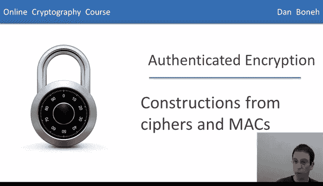
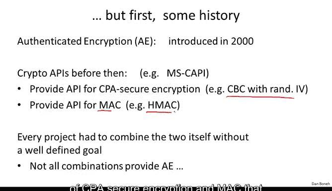
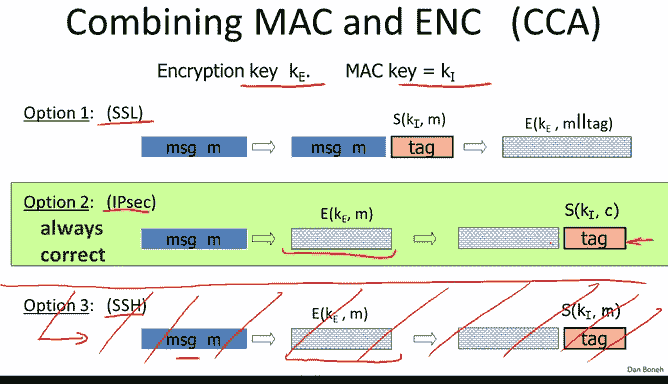
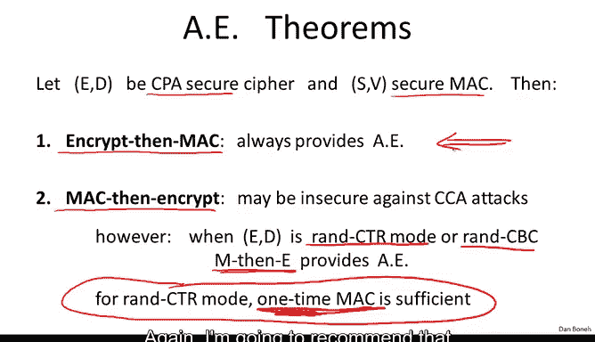
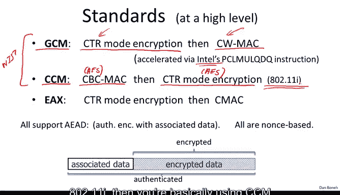
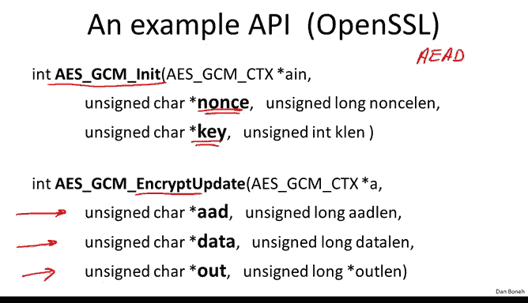
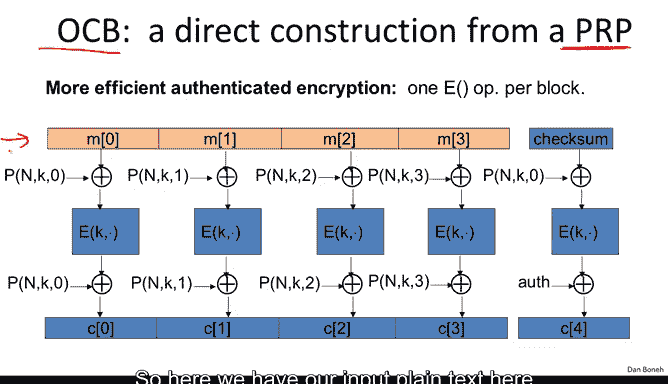
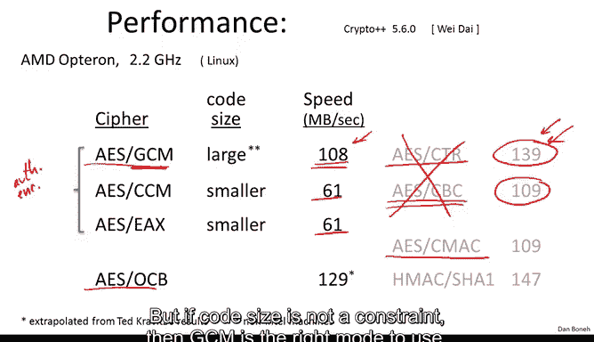

# 038：基于密码和MAC的构造

在本节课中，我们将学习如何构造认证加密系统。我们已经掌握了CPA安全加密和安全的消息认证码，一个很自然的问题是：我们能否将两者结合起来以获得认证加密？这正是本节课要探讨的内容。

认证加密的概念于2000年在两篇独立的论文中被提出。在此之前，许多密码学库提供的API是分别支持CPA安全加密和MAC的。

例如，一个函数用于实现CPA安全加密（如使用随机IV的CBC模式），另一个函数用于实现MAC。每个希望实现加密的开发者都需要自己分别调用CPA安全加密方案和MAC方案。特别是，每个开发者都必须发明自己的方式来组合加密和MAC，以提供某种形式的认证加密。但由于当时组合加密和MAC的目标尚未被明确定义（认证加密的概念还未出现），因此并不清楚哪些组合是正确的，哪些是错误的。

正如我所说，每个项目都必须发明自己的组合方式，而事实上，并非所有组合都是正确的。我可以告诉你，软件项目中最常见的错误基本上就是错误地组合了加密和完整性机制。希望在本模块结束时，你能知道如何正确地组合它们，从而避免自己犯这些错误。

接下来，让我们看看不同项目引入的一些CPA安全加密和MAC的组合方式。

这里有三个例子。首先，在所有三个例子中，都有一个独立的加密密钥和一个独立的MAC密钥。这两个密钥彼此独立，都在会话建立时生成。我们将在课程后面看到如何生成这两个密钥。

第一个例子是SSL协议。SSL组合加密和MAC以期实现认证加密的方式如下：你获取明文M，然后使用MAC密钥KI计算消息M的标签，接着将标签附加到消息后面，最后加密消息和标签的组合，得到最终的密文。这是第一种方案。

第二种方案是IPSec的做法。这里，你首先加密消息，然后在得到的密文上计算标签。注意，标签本身是在生成的密文上计算的。

第三种方案是SSH协议的做法。SSH使用CPA安全加密方案加密消息，然后附加一个消息的标签。IPSec和SSH的区别在于，IPSec的标签是在密文上计算的，而SSH的标签是在明文上计算的。

这是三种完全不同的组合加密和MAC的方式。问题是：哪一种方案是安全的？我会让你思考一下，然后我们继续一起分析。

好的，让我们从SSH方法开始。在SSH方法中，你注意到标签是在消息上计算的，然后以明文形式附加到密文后面。这实际上是一个很大的问题，因为MAC本身并非设计用来提供机密性。MAC仅设计用于完整性。事实上，一个MAC在其标签中输出消息M的几个比特是完全正常的，这仍然是一个完美的标签。然而，如果我们这样做，就会完全破坏这里的CPA安全性，因为消息的一些比特会在密文中泄露。因此，尽管SSH的具体实现是好的，协议本身并未因这种特定组合而受损，但通常不建议使用这种方法，因为MAC签名算法的输出可能会泄露消息的比特。

现在让我们看看SSL和IPSec。事实证明，推荐的方法实际上是IPSec方法。因为无论使用什么CPA安全系统和MAC密钥，这种组合总能提供认证加密。让我简要解释一下原因：一旦我们加密了消息，消息内容就被隐藏在密文中。当我们在密文上计算标签时，这个标签实际上“锁定”了密文，确保没有人能产生一个看起来有效的不同密文。因此，这种方法确保了对密文的任何修改都会被解密者检测到，因为MAC将无法验证。

事实证明，SSL方法存在一些病态的例子，当你将CPA安全加密系统与安全MAC结合时，结果容易受到选择密文攻击，因此实际上并不能提供认证加密。可能发生这种情况的原因是加密方案和MAC算法之间存在某种不良交互，从而导致存在选择密文攻击。

因此，如果你正在设计一个新项目，现在的建议是始终使用“先加密后MAC”，因为无论你组合哪种CPA安全加密和安全MAC算法，它都是安全的。现在，为了设定术语，SSL方法有时被称为“先MAC后加密”。

IPSec方法被称为“先加密后MAC”。SSH方法（尽管你不应该使用它）被称为“加密和MAC”。好的，我经常会用“加密和MAC”以及“先MAC后加密”来区分SSL和IPSec。

好的，重复一下我刚才所说的：IPSec方法“先加密后MAC”总是提供认证加密。如果你从一个CPA安全密码和一个安全MAC开始，你总会得到认证加密。正如我所说，“先MAC后加密”实际上存在一些病态情况，其结果容易受到CCA攻击，因此不提供认证加密。然而，故事比这更有趣一些，因为事实证明，如果你实际使用的是随机计数器模式或随机CBC模式，那么对于这些特定的CPA安全加密方案，“先MAC后加密”实际上确实能提供认证加密，因此是安全的。

事实上，这里还有一个更有趣的转折：如果你使用随机计数器模式，那么你的MAC算法只需要是“一次性安全”的就足够了，它不必是一个完全安全的MAC。它只需要在密钥用于加密单个消息时是安全的。当我们讨论消息完整性时，我们看到实际上存在比完全安全的MAC快得多的“一次性安全”MAC。因此，如果你使用随机计数器模式，“先MAC后加密”实际上可能产生更高效的加密机制。

然而，我要再次重申这一点。建议是使用“先加密后MAC”，我们将看到一些未使用“先加密后MAC”的系统所遭受的攻击。所以，为了确保安全，你无需对此思考太多，我再次建议你始终使用“先加密后MAC”。

一旦认证加密的概念变得更加流行，一些标准化的组合加密和MAC的方法出现了，甚至被国家标准与技术研究院标准化。我将提到其中的三个标准，其中两个由NIST标准化。

它们被称为伽罗瓦计数器模式和CBC计数器模式。让我解释一下它们的作用。伽罗瓦计数器模式基本上使用计数器模式加密（或随机计数器模式）与Carter-Wegman MAC（一种非常快的Carter-Wegman MAC）。在GCM中，Carter-Wegman MAC的工作方式基本上是对被MAC处理的消息进行哈希，然后使用PRF加密结果。GCM中的这个哈希函数已经非常快，以至于GCM的大部分运行时间由计数器模式加密主导。英特尔甚至引入了一个特殊指令PCLMULQDQ，专门设计用于使GCM中的哈希函数运行得尽可能快。

现在，CCM计数器模式是另一个新标准，它使用CBC-MAC，然后是计数器模式加密。你注意到这种机制使用了类似SSL的“先MAC后加密”，所以这实际上不是推荐的做法。但由于使用了计数器模式加密，这实际上是一个完全没问题的加密机制。我想指出关于CCM的一点是，一切都基于AES。你注意到它使用AES进行CBC-MAC，并使用AES进行计数器模式加密。因此，CCM可以用相对较少的代码实现，因为你只需要一个AES引擎，别无其他。

😊，正因为如此，CCM实际上被Wi-Fi联盟采用。事实上，如果你使用加密的Wi-Fi 802.11i，那么你基本上每天都在使用CCM来加密你的笔记本电脑和接入点之间的流量。

还有另一种模式叫做EAX，它使用计数器模式加密，然后是CMAC。再次注意，这是“先加密后MAC”，这是另一种可以使用的良好模式。我们稍后将比较所有这些模式。

现在我想提一下，首先，所有这些模式都是基于Nonce的。换句话说，它们不使用任何随机性，但它们确实将Nonce作为输入，并且Nonce对于每个密钥必须是唯一的。换句话说，正如你记得的，密钥-Nonce对永远、永远、永远不应该重复，但Nonce本身不必是随机的。例如，使用计数器作为Nonce是完全没问题的。

另一个要点是，实际上所有这些模式都是所谓的“带关联数据的认证加密”。这是认证加密的一个扩展，在网络协议中经常出现。AEAD背后的想法是，实际上提供给加密模式的消息并不打算被完全加密，只有部分消息打算被加密，但整个消息都打算被认证。一个很好的例子是网络数据包，比如IP数据包，它有一个头部和一个有效载荷。通常，头部不会被加密，例如，头部可能包含数据包的目的地。但头部最好不要被加密，否则沿途的路由器将不知道如何路由数据包。因此，通常头部以明文发送，而有效载荷当然总是被加密的。但你希望的是头部被认证。😊，不被加密，但被认证。

这正是这些AEAD模式所做的。它们将认证头部，然后加密有效载荷，但头部和有效载荷在认证中被绑定在一起，因此实际上无法分离。这并不难做到。在这三种模式（GCM、CCM和EAX）中，MAC应用于整个数据，但加密仅应用于需要加密的部分数据。

我想向你展示这些带关联数据的认证加密方案的API是什么样的。例如，这是OpenSSL中GCM的API。你调用初始化函数来初始化加密模式。你注意到你给它一个密钥和一个Nonce。Nonce再次强调，不必是随机的，但必须是唯一的。初始化后，你将调用这个加密函数，你给它将被认证但不加密的关联数据，以及将被认证和加密的数据，它返回完整的密文，这是对数据的加密，但当然不包括AED，因为AED将以明文发送。

现在我们已经理解了这种“先加密后MAC”的模式，我们可以回到MAC安全的定义，我可以向你解释一些在我们查看该定义时可能有点模糊的东西。

如果你还记得，从我们安全MAC的定义中得出的一个要求是，给定一个消息-MAC对，攻击者不能为同一消息M产生另一个标签。换句话说，即使攻击者已经拥有消息M的一个标签，他也不应该能够为同一消息M产生一个新标签。这真的不清楚为什么这很重要，谁在乎攻击者是否已经拥有消息M的标签？谁在乎他是否能产生另一个标签？嗯，事实证明，如果MAC没有这个属性，换句话说，给定一个消息-MAC对，你可以为同一消息产生另一个MAC，那么这个MAC将导致不安全的“先加密后MAC”模式。

因此，如果我们希望我们的“先加密后MAC”具有密文完整性，那么我们的MAC安全必须包含这种强安全概念，这当然是正确的，因为我们正确地定义了它。所以，让我们看看如果实际上很容易产生这种伪造，会出什么问题。

我将向你展示对由此产生的“先加密后MAC”系统的选择密文攻击。由于该系统存在选择密文攻击，这必然意味着它不提供认证加密。让我们看看。

攻击者将首先发送两条消息M0和M1。他将像往常一样收到其中一条的加密，要么是M0的加密，要么是M1的加密。由于我们使用的是“先加密后MAC”，攻击者收到一个密文，我们称之为C0，以及密文C0上的一个MAC。

现在，我们说过，给定MAC和消息，攻击者可以为同一消息产生另一个MAC。所以他接下来要做的就是为消息C0产生另一个MAC。现在他有了一个新的密文C0，T‘，这是一个完全有效的密文，T’是C0的有效MAC。

因此，攻击者现在可以提交一个关于C‘的选择密文查询，这是一个有效的选择密文查询，因为它不同于C，它是一个新的密文。可怜的挑战者现在被迫解密这个密文C‘，所以他将发回C’的解密结果。这是一个有效的密文，因此C‘的解密结果是消息M。现在攻击者刚刚得知了B的值，因为他可以测试M是等于M0还是等于M1。结果，他可以输出B并获得优势1，从而击败该方案。

所以再次强调，如果我们的MAC安全不包含这里的这个属性，那么就会存在对“先加密后MAC”的选择密文攻击，因此它将不安全。所以我们正确定义MAC安全这一事实意味着“先加密后MAC”确实提供了认证加密，并且我们讨论过的所有MAC实际上都满足这种强不可伪造性。

有趣的是，故事并没有就此结束。正如我们之前所说，在认证加密概念被引入之前，每个人都只是以各种方式组合MAC和加密，以期实现某种认证加密。在认证加密的概念被形式化和严格化之后，人们开始挠头思考：“嘿，等等，也许我们可以比组合MAC和加密方案更高效地实现认证加密。”

事实上，如果你思考一下这种MAC和加密组合的工作方式，假设我们将计数器模式与CBC-MAC结合。那么对于每个明文块，你首先必须为计数器模式使用你的分组密码，然后你还必须为CBC-MAC再次使用你的分组密码。这意味着，如果你将CPA安全加密与MAC结合，对于每个明文块，你必须评估你的分组密码两次，一次用于MAC，一次用于加密方案。

所以很自然的问题是：我们能否直接从PRP构造一个认证加密方案，使得我们每个块只需评估PRP一次？事实证明答案是肯定的，有一个美丽的构造叫做OCB，它几乎做了你想要的一切，并且比单独从加密和MAC构建的构造快得多。

我写下了OCB的示意图，我不想详细解释它，我只想从高层次上解释一下。这里我们在顶部有输入的明文。你首先注意到，OCB是完全可并行化的。所以每个块都可以独立于其他块进行加密。😊。

另一个要注意的是，正如我承诺的，每个明文块只评估一次你的分组密码，然后在最后再评估一次以构建你的认证标签。OCB除了分组密码之外的开销是最小的，你只需要评估一个非常简单的函数P。Nonce进入这个P，你注意到密钥也进入这个P，然后有一个块计数器进入这个P。所以你只需为每个块评估这个函数P两次，并在使用分组密码加密之前和之后对结果进行异或操作，就是这样。这就是你需要做的全部，然后你就得到了一个从分组密码构建的非常快速和高效的认证加密方案。

所以OCB实际上有一个与之相关的很好的安全定理，我将在本模块结束时指向一篇关于OCB的论文，在那里我会列出一些你可以查阅的进一步阅读论文。

你可能会想，如果OCB比我们迄今为止看到的所有东西都好得多，比所有这三个标准（CCM、GCM和EAX）都好，为什么OCB没有被使用？或者为什么OCB不是标准？答案有点令人遗憾，OCB没有被使用的主要原因是由于各种专利，我就说到这里。

为了总结这一节，我想向你展示一些性能数据。在右边，我列出了你不应该使用的模式的性能数据，这是针对随机计数器模式和随机CBC的，你也可以看到CBC-MAC的性能基本上与CBC加密的性能相同。

好的，现在这里是认证加密模式。这些是你应该使用的模式。你不应该单独使用前两个，你永远不应该使用前两个，因为它们只提供CPA安全性，实际上不提供针对主动攻击的安全性。你应该只使用认证加密进行加密。所以我列出了三个标准的性能数据。让我提醒你，GCM基本上使用一个非常快的哈希，然后使用计数器模式进行实际加密。你可以看到GCM相对于计数器模式的开销相对较小。

CCM和EAX都使用基于分组密码的加密和基于分组密码的MAC。因此，它们大约比计数器模式慢两倍。你可以看到OCB实际上是这些模式中最快的，主要是因为它每个消息块只使用一次分组密码。

基于这些性能数据，你可能会认为GCM正是应该始终使用的正确模式。事实证明，如果你在空间受限的硬件上，GCM并不理想，主要是因为它的实现需要比其他两种模式更大的代码量。然而，正如我所说，英特尔专门添加了指令来加速GCM模式，因此在英特尔架构上实现GCM需要很少的代码。但在其他硬件平台上，比如智能卡或其他受限环境中，实现GCM的代码量将比其他两种模式大得多。但如果代码大小不是限制，那么GCM是应该使用的正确模式。

为了总结这一节，我想再说一次，当你加密消息时，你必须使用认证加密模式。

推荐的方法是使用标准之一，即这三种模式之一来提供认证加密。不要自己实现加密方案，换句话说，不要自己实现“先加密后MAC”，只需使用这三种标准之一。现在许多密码学库为这三种模式提供标准API，这些是你应该使用的，而不是其他任何东西。

在下一节中，我们将看看当你试图自己实现认证加密时，还会出什么问题。

---

**本节课总结**

在本节课中，我们一起学习了如何构造认证加密系统。我们首先回顾了历史上开发者自行组合CPA安全加密和MAC时遇到的问题，然后分析了三种常见的组合方式（SSL/IPSec/SSH）的安全性，并得出结论：“先加密后MAC”是安全且推荐的方法。接着，我们介绍了三种标准化的认证加密模式（GCM、CCM、EAX）及其特点，包括它们支持“带关联数据的认证加密”。我们还探讨了MAC安全定义中一个关键属性对于“先加密后MAC”安全性的重要性。最后，我们简要介绍了更高效的OCB模式及其未被广泛采用的原因，并通过性能对比强调了在实际应用中应优先使用标准化的认证加密API，而非自行实现。