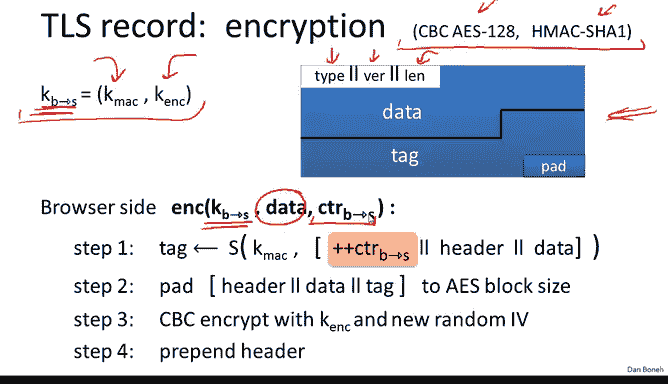
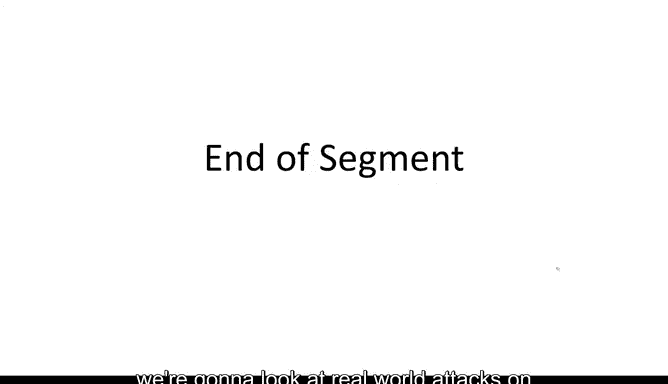

# 039：TLS 1.2


在本节课中，我们将要学习认证加密在现实世界中的应用。我们将以TLS协议为例，详细解析其工作原理，并了解一个错误实现的反面教材。

## 概述

TLS（传输层安全）协议是互联网上保障通信安全的核心。它使用认证加密来确保数据的机密性和完整性。我们将首先了解TLS记录协议如何工作，然后分析早期版本中的安全漏洞，最后通过一个反面案例（WEP协议）来理解错误设计的后果。

## TLS记录协议结构


TLS记录协议负责数据的加密传输。每个TLS记录都从一个头部开始，后面跟着加密的数据。记录的最大长度为16千字节，如果数据超过此限制，则会被分割成多个记录。

TLS使用单向密钥，这意味着从浏览器到服务器和从服务器到浏览器使用不同的密钥。这些密钥在TLS密钥交换协议中生成，我们将在课程第二部分讨论。目前，我们假设这些密钥已经建立，并且浏览器和服务器都知道它们。

## 状态加密与计数器

TLS记录协议使用状态加密，这意味着每个数据包的加密都依赖于浏览器和服务器内部维护的特定状态。这个状态的核心是两个64位计数器。

*   **浏览器到服务器计数器**：用于从浏览器发送到服务器的流量。
*   **服务器到浏览器计数器**：用于从服务器发送到浏览器的流量。



当会话首次初始化时，这两个计数器被设置为零。每当发送一个记录时，相应的计数器就会递增。接收方在收到记录后也会递增其本地的计数器副本。这些计数器的目的是防止重放攻击，因为攻击者无法简单地记录并重放一个数据包，因为到那时计数器已经改变，验证会失败。

## 记录加密流程详解

上一节我们介绍了TLS记录的结构和状态机制，本节中我们来看看一个记录是如何被具体加密和发送的。TLS使用“先MAC后加密”的模式，其中MAC算法是HMAC-SHA1，加密算法是AES-128的CBC模式。

以下是浏览器向服务器发送数据时的加密步骤，该过程使用浏览器到服务器的密钥（该密钥本身又包含一个MAC密钥和一个加密密钥）：

1.  **计算MAC**：首先，计算以下数据的MAC值：
    *   记录头部（类型、版本、长度）。
    *   有效载荷数据。
    *   当前计数器的值。
    计算完成后，计数器递增。值得注意的是，计数器的值虽然包含在MAC计算中，但**从不**在记录中发送。因为接收方（服务器）根据其本地状态知道预期的计数器值。

2.  **构建待加密数据**：将上一步计算出的MAC标签附加到有效载荷数据之后。

3.  **填充**：将头部、数据和MAC标签一起填充到AES块长度的整数倍。填充方式是，如果需要填充5个字节，则填充`0x05`五次（即`0x05 0x05 0x05 0x05 0x05`）。

4.  **CBC加密**：使用加密密钥和一个**新鲜的、随机的**初始化向量（IV）对填充后的数据进行CBC加密。这个IV随后会嵌入到密文中。

5.  **组装记录**：最后，将明文头部（类型、版本、长度）预置到加密后的数据前面，形成完整的TLS记录并发送。

用伪代码表示核心加密过程：
```python
# 伪代码：TLS记录加密（浏览器到服务器方向）
def encrypt_record(header, data, mac_key, enc_key, counter):
    # 1. 计算MAC（包含头部、数据和计数器）
    tag = HMAC-SHA1(mac_key, header || data || counter)
    counter += 1  # 递增状态

    # 2. 连接数据和MAC
    plaintext = data || tag

    # 3. 填充
    pad_len = calculate_padding_length(plaintext)
    padding = bytes([pad_len] * pad_len)
    padded_plaintext = plaintext || padding

    # 4. 生成随机IV并CBC加密
    iv = generate_random_iv()
    ciphertext = AES-128-CBC-encrypt(enc_key, iv, padded_plaintext)

    # 5. 组装最终记录（头部是明文的）
    final_record = header || iv || ciphertext
    return final_record
```

## 记录解密与验证流程

当服务器收到一个加密记录时，它会使用对应的密钥和计数器进行解密和验证。

以下是解密步骤：

1.  **解密**：使用加密密钥对密文部分进行CBC解密。
2.  **检查填充格式**：查看解密后数据的最后一个字节（假设为`pad_len`），并验证最后`pad_len`个字节是否都等于`pad_len`。如果不是，则发送“错误记录MAC”警报并终止连接。
3.  **移除填充**：如果填充格式正确，则根据`pad_len`移除最后`pad_len`个字节。
4.  **提取并验证MAC**：从移除填充后的数据中分离出MAC标签。然后，使用本地的MAC密钥、记录头部、解密出的数据以及**服务器本地认为正确的计数器值**来计算MAC，并与提取的标签进行比较。
5.  **处理结果**：
    *   如果MAC验证失败，发送“错误记录MAC”警报并终止连接。
    *   如果MAC验证成功，则移除标签和头部，剩余部分即为明文数据，交给上层应用。

这个流程巧妙地利用计数器防止了重放攻击。如果攻击者重放一个旧记录，服务器本地的计数器值已经不同，导致MAC验证失败。由于双方隐式地知道计数器值，因此无需在记录中传输，节省了带宽。

## TLS早期版本的安全漏洞

我们刚刚分析了TLS 1.1/1.2中相对安全的实现。然而，早期版本的TLS（如1.0及更早版本）存在严重错误，导致了多种攻击。

以下是两个主要漏洞：


**1. 可预测的IV（链式IV）**
在TLS 1.0中，用于CBC加密的IV是可预测的——下一个记录的IV被设置为当前记录的最后一个密文块。这意味着攻击者如果观察到当前记录，就知道下一个记录的IV，从而可以破坏其语义安全性。这种攻击被称为BEAST攻击。TLS 1.1的解决方案是改用“显式IV”，即每个记录都使用自己随机的、不可预测的IV。

**2. 填充预言攻击**
在TLS 1.0中，服务器在解密失败时会返回不同的错误信息：
*   如果是因为**填充无效**，返回“解密失败”警报。
*   如果是因为**MAC无效**，返回“错误记录MAC”警报。

攻击者可以通过观察服务器返回的警报类型，来判断其发送的篡改后的密文是填充错误还是MAC错误。这为一种称为“填充预言攻击”的强力攻击打开了大门。TLS 1.1的修复方法是，无论解密失败的原因是填充错误还是MAC错误，统一返回“错误记录MAC”警报，从而掩盖了失败的具体原因。

**核心教训**：当解密失败时，绝不应该透露失败的具体原因。只需输出一个统一的“拒绝”信号即可。解释失败原因常常会为攻击者提供可利用的信息。

## 反面案例：WEP协议的错误设计

现在我们已经看到了TLS中相对正确的实现，让我们来看一个完全错误的协议设计案例：802.11b WEP（有线等效加密）。它几乎在各个方面都出了问题。

以下是WEP的工作流程：
1.  发送方（如笔记本电脑）计算消息的CRC（循环冗余校验）校验和，并将其附加到消息后。
2.  使用流密码（RC4）加密“消息+CRC”。加密密钥是`IV || K`，其中IV每包变化，K是长期密钥。
3.  将IV和密文一起发送给接收方（如接入点）。


WEP存在多个致命问题：
*   **IV重复**：IV空间很小，必然重复，导致“两次一密”攻击。
*   **相关密钥**：密钥结构为`IV || K`，只有IV变化，导致大量密切相关的密钥被用于RC4。RC4并非为此设计，会完全失效。
*   **脆弱的完整性校验**：即使忽略上述问题，其用于提供完整性的CRC机制也完全无效。

## CRC的线性特性与攻击

WEP使用CRC校验来试图防止篡改，但CRC具有**线性**特性，这使其在密码学上完全不安全。

CRC的线性意味着：如果知道`CRC(M)`，那么对于任何扰动`P`，可以很容易地计算出`CRC(M XOR P)`，它等于`CRC(M) XOR F(P)`，其中`F`是一个公开的已知函数。

基于此，攻击可以如下进行：
1.  假设攻击者截获一个目标端口为80的数据包。
2.  他想将其改为目标端口25。
3.  他在密文中对应端口80的位置，异或上值 `Δ = 25 XOR 80`。由于流密码的特性，解密后该位置的明文也会被异或`Δ`，从而变成25。
4.  为了通过CRC校验，他利用CRC的线性特性，在密文中CRC校验和所在的位置，异或上`F(Δ)`。这样，解密后得到的CRC值就会自动变为适用于修改后消息（端口为25）的正确CRC值。

**结论**：CRC校验不能提供任何针对主动攻击的完整性保护，**永远不应该**被用作密码学上的完整性机制。正确的做法是使用加密学的MAC，如HMAC。

## 总结

本节课中我们一起学习了认证加密在现实协议中的应用。
*   我们深入剖析了**TLS记录协议**，了解了其如何使用状态计数器、先MAC后加密的模式来提供机密性、完整性和防重放攻击。
*   我们探讨了**TLS早期版本**（如1.0）由于使用链式IV和返回不同的解密错误信息而引入的严重漏洞（BEAST攻击、填充预言攻击），并理解了其修复方案。
*   最后，我们通过分析**WEP协议**这个反面教材，明白了使用流密码时IV管理的重要性、避免相关密钥的必要性，以及**CRC线性特性**如何导致完整性保护完全失效，强调了必须使用加密学MAC（如HMAC）来保证完整性。



在下一节中，我们将探讨针对错误实现的认证加密系统的真实攻击。