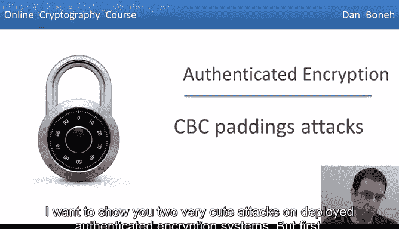
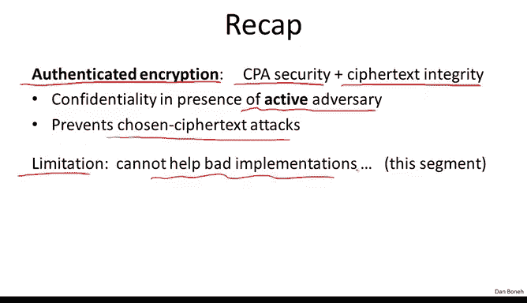
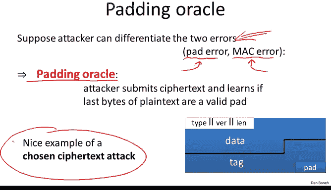
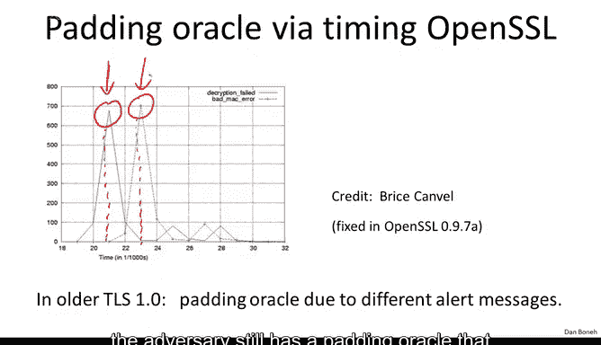
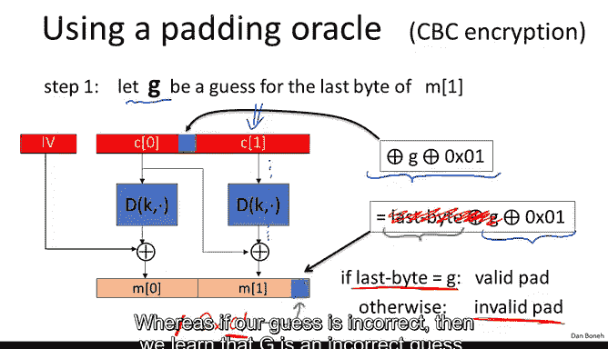

# 040：CBC填充攻击

在本节课中，我们将学习一种针对使用CBC模式加密的TLS记录协议的精巧攻击——填充预言攻击。我们将了解攻击的原理、实施方式以及防御措施。

## 概述

上一节我们介绍了认证加密的概念及其重要性。本节中，我们来看看一个具体的攻击实例，它利用了TLS协议在解密CBC加密数据时，因错误信息泄露而导致的漏洞。

## 认证加密回顾

认证加密意味着系统同时提供**选择明文攻击（CPA）安全性**和**密文完整性**。它能确保在存在主动攻击者的情况下保护机密性，并且攻击者无法在不被检测的情况下修改密文。认证加密还能防止强大的**选择密文攻击**。

然而，认证加密有一个显著的局限性：它无法帮助一个糟糕的实现。如果错误地实现了认证加密，那么你的实现将容易受到主动攻击。

## 标准构造与实践建议

我们之前也看过了标准的构造方法。以下是三种提供认证加密的标准：
*   **GCM**
*   **CCM**
*   **EAX**

当你在实践中需要使用认证加密时，应该直接使用这三种标准之一，而不是尝试自己实现。本节展示的攻击将有力地证明这一点。

一般来说，提供认证加密的正确方法是 **“先加密后MAC”**。因为无论你组合使用哪种加密和MAC算法，只要它们本身实现正确，结果都将是一个安全的认证加密方案。

## TLS记录协议与CBC解密流程

现在，让我们来看一个非常精巧的攻击，它针对的是**TLS记录协议**，特别是当它使用**CBC加密**时。

首先，简要回顾一下TLS解密的工作流程：
1.  对接收到的密文进行CBC解密。
2.  检查填充（pad）格式是否正确。例如，如果填充长度为5，格式应为`55555`。如果格式不正确，则拒绝该密文。
3.  如果填充格式正确，则检查MAC标签。
4.  如果标签无效，再次拒绝记录。
5.  如果标签有效，则认为剩余数据是可信的，并将其交给应用程序。

这里存在两种类型的错误：
*   **填充错误**
*   **MAC错误**

关键在于，**绝不能让攻击者知道发生了哪种错误**。让我简要解释原因。

## 填充预言机的形成

假设攻击者能够区分这两种错误，即他能知道发生的是填充错误还是MAC错误。

结果就形成了一个所谓的**填充预言机**。攻击者可以拦截一个密文，并尝试解密它。他可以提交这个密文给服务器。服务器将解密它并检查填充格式。

*   如果填充无效，服务器会返回一个错误（填充错误）。
*   如果填充有效（攻击者自己构造的随机密文，其MAC很可能无效），服务器会返回另一个错误（MAC错误）。

因此，攻击者通过提交密文，就能知道解密后密文的最后几个字节是否构成有效的填充格式（例如，以`1`、`22`、`333`等结尾）。这泄露了关于解密后明文的信息。

这是一个典型的**选择密文攻击**示例：攻击者提交密文，并了解到一些关于结果明文的信息。

## 时序攻击与填充预言机的维持

你可能会想，TLS的旧版本确实通过返回不同的警报消息泄露了错误类型。但在此攻击被公开后，SSL实现改为总是报告相同的错误类型。仅看警报类型，攻击者无法区分错误。

然而，填充预言机依然存在。让我解释原因。

Canvel、Kohno等人观察到，TLS解密的实现方式是：先解密记录，然后检查填充。如果填充无效，解密立即中止并生成错误。如果填充有效，则继续检查MAC，如果MAC无效，再中止并生成错误。

这导致了**时序攻击**。攻击者发现：
*   如果填充无效，警报消息会**很快**发送回来（例如，平均21毫秒）。
*   如果填充有效但MAC无效，由于需要额外时间检查MAC，警报消息的生成会**稍慢一些**（例如，平均23毫秒）。

因此，即使返回相同的警报，攻击者只需观察生成警报所需的时间：时间短意味着填充无效；时间长意味着填充有效但MAC无效。这样，攻击者仍然拥有一个能告诉他填充是否有效的填充预言机。

## 利用填充预言机解密

现在，让我们看看如何利用填充预言机。我断言，如果攻击者拥有一个密文`C`，他可以利用填充预言机完全解密这个密文。

作为一个例子，假设他想获取`M1`，即密文第二个块的解密结果。

以下是攻击者会做的事情。他有一个拦截到的密文`C`，其解密过程遵循CBC模式：一个密文块会直接与下一个密文块的解密结果进行异或操作。攻击者的目标是获取`M1`。

以下是具体步骤：
1.  首先，丢弃`C2`，使得最后一个块就是他想解密的`C1`。
2.  假设他对`M1`的最后一个字节有一个猜测值`G`（`G`是0到255之间的一个值）。
3.  攻击者将执行以下操作：他将值`G XOR 0x01`异或到前一个块`C0`的最后一个字节中。
4.  现在，考虑当这个修改后的两块密文被解密时会发生什么。`C0`会被解密成一些我们不关心的垃圾数据。但当`C1`被解密时，其最后一个字节将与修改后的`C0`的最后一个字节进行异或。
5.  因此，最终明文的最后一个字节将是原始的`M1`最后一个字节，再异或上我们插入`C0`的额外值`(G XOR 0x01)`。
6.  关键点来了：如果对`M1`最后一个字节的猜测`G`是正确的，那么`M1_last_byte XOR G`就等于0，最终我们得到的明文最后一个字节就是`0x01`（即数字1的十六进制表示）。
7.  数字`1`是一个格式正确的填充。因此，填充有效，填充预言机会返回“填充有效”。
8.  如果猜测`G`不正确，我们得到的值很可能不是`1`，从而导致无效的填充，填充预言机会返回“填充无效”。

因此，攻击者可以创建他修改后的密文（只修改了第二个块），将其发送给填充预言机，然后根据结果学习最后一个字节是否等于`G`。

## 迭代解密整个块

现在，攻击者可以简单地对`G`从0到255重复此过程。这平均需要128次选择密文查询，他就能找到正确的`G`，从而得知`M1`的最后一个字节。

得知最后一个字节后，我们可以使用完全相同的过程来获取`M1`的倒数第二个字节。这次，我们不再使用单字节填充`1`，而是使用双字节填充`0x02 0x02`。因为我们已知最后一个字节，我们可以通过异或操作确保解密后明文的最后一个字节是`0x02`。然后，我们猜测倒数第二个字节`G`，直到填充预言机告诉我们填充有效（即形成了`0202`）。这需要额外的256次查询。

我们可以继续迭代这个过程。由于块长度为16字节，经过`16 * 256 = 4096`次查询后，我们就能得知整个`M1`块。这是一个相当严重的攻击，能够解密TLS记录的块。

## 攻击的现实限制与IMAP案例

了解TLS内部工作原理的人可能会质疑这个攻击的有效性。问题是，当TLS接收到一个具有错误填充或错误MAC的记录时，它会关闭连接并重新协商新密钥。因此，攻击者只能提交一次查询，之后密钥就失效了。

然而，这个攻击非常精巧，只要协议中存在此类错误，总会在某些场景下出现。在这个案例中，场景就是**IMAP服务器**。

IMAP是一种从邮件服务器读取邮件的流行协议，通常通过在其上运行TLS协议来保护。IMAP客户端每五分钟会连接一次IMAP服务器检查新邮件。连接时，它会先发送包含用户名和密码的登录消息。

这意味着，**每五分钟**，攻击者就能获得**完全相同消息**（特别是密码）的加密版本。因此，每五分钟他可以对包含密码的块进行一次猜测。

如果密码是8个字符长，攻击者只需逐个字符地恢复它们，每五分钟进行一次猜测。Canvel等人证明，在几个小时内，就可以基本恢复用户的密码。这是对TLS实现的一个相当严重的攻击。

## 防御措施与经验教训

针对此攻击的防御措施是：**无论填充是否有效，都始终检查MAC**。这样，响应所需的时间就相同了，从而消除了时序攻击，使得攻击更难实施。

这里有两个重要的经验教训：
1.  **加密与MAC的顺序至关重要**：如果TLS使用了**“先加密后MAC”** 而不是“先MAC后加密”，那么整个问题将完全不存在。因为在“先加密后MAC”中，MAC首先被检查，只有MAC有效才会进行解密和填充检查。如果MAC无效，密文会被立即丢弃，我们甚至不会进行填充检查。因此，任何对密文的篡改或操作都会因为MAC失败而被立即丢弃。
2.  **错误信息泄露的危害**：记住我曾说过，“先MAC后CBC”实际上可以提供认证加密，但前提是**不泄露解密失败的原因**。在这个案例中，填充预言机完全破坏了认证加密属性，我展示的攻击表明，在这种错误信息泄露的情况下，该模式不再提供认证加密。

## 思考题

假设在TLS中，不使用“先MAC后CBC”，而是使用“先MAC后计数器模式（CTR）加密”，填充预言机攻击是否仍然可能？

答案是否定的。原因很简单，因为计数器模式**根本不使用任何填充**。因此，这种填充预言机攻击只影响TLS中使用CBC加密的模式。TLS也支持计数器模式加密，而这些模式完全不受此类填充攻击的影响。

## 总结

本节课中，我们一起学习了针对CBC模式加密的TLS记录协议的填充预言机攻击。我们了解了攻击如何通过区分填充错误和MAC错误（或利用时序差异）形成预言机，并利用该预言机迭代解密整个密文块。我们还看到了该攻击在IMAP over TLS场景下的实际危害。最后，我们总结了防御措施（统一错误处理时间）和两个关键教训：正确使用“先加密后MAC”的重要性，以及避免泄露解密失败具体原因的必要性。在下一节中，我们将看到另一个针对认证加密系统的非常巧妙的攻击。