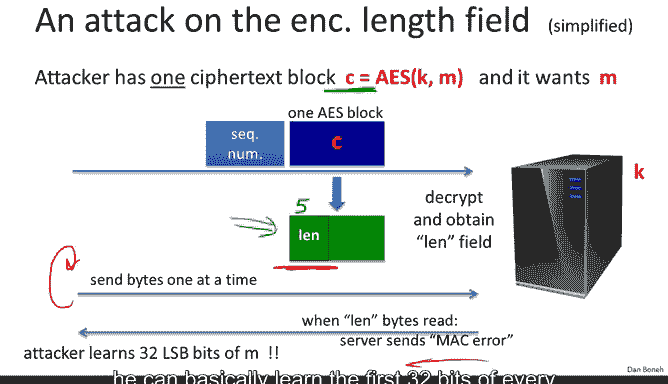

# 041：攻击非原子解密

在本节课中，我们将要学习一种针对认证加密系统的巧妙攻击。上一节我们介绍了填充预言攻击，本节中我们来看看另一种攻击，它利用了SSH二进制数据包协议中解密过程的非原子性。

## 概述

SSH协议使用一种称为“加密后MAC”的模式。具体来说，每个SSH数据包包含一个序列号、数据包长度、CBC填充长度、有效载荷和填充。整个红色区块（如下图所示）使用CBC模式加密，然后对整个明文数据包计算MAC，并将MAC以明文形式随数据包一起发送。

## 解密过程与漏洞

以下是SSH服务器解密数据包的过程：

1.  服务器首先解密加密的数据包长度字段（即第一个密文块的前几个字节）。
2.  然后，服务器根据解密出的长度字段值，从网络中读取相应数量的字节。
3.  服务器使用CBC解密剩余的密文块，恢复整个SSH数据包。
4.  最后，服务器检查明文数据包的MAC，如果无效则报告错误。

**问题在于**：数据包长度字段在解密后，**在MAC验证之前**就被直接用于确定要读取的数据包长度。这引入了一个严重的漏洞。

## 攻击原理

假设攻击者截获了一个特定的密文块 `C`，这是消息块 `M` 的直接AES加密结果。攻击者的目标是恢复 `M`。

攻击步骤如下：

1.  攻击者构造一个数据包发送给服务器。该数据包以正常的序列号开始，然后将截获的密文块 `C` 作为第一个密文块注入。
2.  服务器收到后，解密第一个AES块的前几个字节，并将其解释为数据包的长度字段值 `L`。
3.  接着，服务器期望从网络读取 `L` 个字节，然后才会检查MAC是否有效。
4.  攻击者开始一个字节一个字节地向服务器发送数据。
5.  服务器每读取一个字节，就计数一次。
6.  当服务器读取的字节数达到 `L` 时，它会认为数据包已完整，于是开始验证MAC。
7.  由于攻击者发送的都是垃圾字节，MAC验证必然失败，服务器会返回一个MAC错误信息。
8.  **关键点**：攻击者一直在计数自己发送了多少字节。当他收到MAC错误时，他就知道服务器在触发错误前恰好读取了 `L` 个字节。
9.  因此，攻击者可以推断出：密文块 `C` 解密后，其最高32位（即被解释为长度字段的部分）的值就是 `L`。

通过这种方式，攻击者无需破解加密算法，就**泄露了密文块 `C` 解密后前32位的信息**。由于可以对任何密文块重复此攻击，攻击者可以逐步获取长消息中每个密文块的前32位。

## 错误根源与教训

这个攻击揭示了两个主要的设计错误：

1.  **非原子解密**：解密操作不是原子的。解密算法没有将整个数据包作为输入，然后输出整个明文或直接拒绝。相反，它部分解密（获取长度字段），然后等待读取更多数据，最后才完成解密过程。这种非原子操作非常危险。
2.  **未经验证即使用**：长度字段在通过MAC验证之前就被使用。任何解密出的字段在通过认证之前都不应该被使用。

## 如何修复？

如果让你重新设计SSH，你会做哪些最小改动来抵御这种攻击？以下是几个选项：

*   **将长度字段以明文发送**（如TLS所做的那样）。这样，攻击者就无法提交选择的密文进行攻击，因为长度字段从未被解密。
*   **单独对长度字段计算MAC**。这样服务器可以先读取并验证长度字段的MAC，确认其有效性后，再根据该长度读取后续字节，最后验证整个数据包的MAC。
*   **使用“先加密后MAC”模式**。但请注意，仅更换模式（如改用“加密后MAC”的变体）本身无法解决此问题，因为核心问题（长度字段在验证前被使用）依然存在。

最根本的教训是：**不要自己设计或实现认证加密系统**，应使用GCM等标准模式。如果必须自己实现，请确保使用“先加密后MAC”模式，并避免重复上述错误。

## 总结

本节课中我们一起学习了针对SSH协议中非原子解密过程的攻击。该攻击巧妙地利用了协议在验证MAC之前就使用解密出的长度字段这一缺陷，从而泄露了密文块的部分信息。这再次强调了使用经过严格验证的标准加密方案的重要性，以及在设计协议时确保解密操作的原子性和数据验证的及时性。