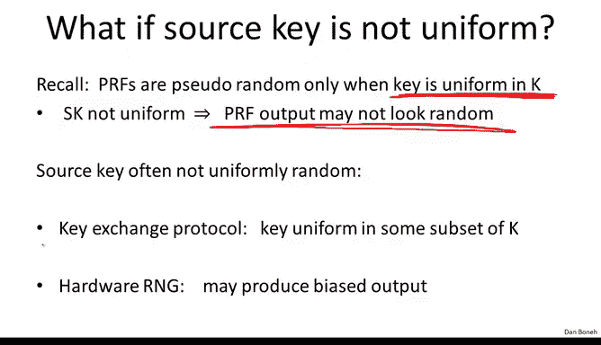
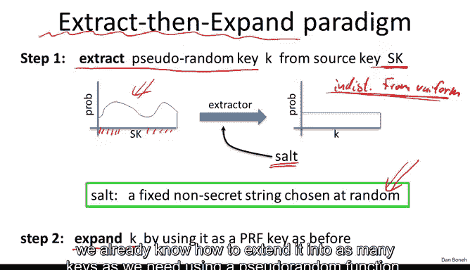

# 042：密钥派生

在本节课中，我们将学习如何从一个主密钥派生出多个会话密钥，以及如何从低熵的密码中安全地派生密钥。这是对称加密应用中的关键步骤。

## 概述

我们已经讨论了对称加密的核心概念。在进入下一个主题之前，我们还需要了解几个重要的细节。首先，我们将探讨如何从一个源密钥派生出多个密钥，这在实践中非常常见。其次，我们将学习如何从低熵的密码中派生密钥。

## 密钥派生函数

上一节我们介绍了对称加密的多种模式。本节中，我们来看看如何从一个源密钥生成多个会话密钥。

在实际应用中，我们通常需要多个密钥来保护一个会话。例如，在TLS协议中，我们需要为每个通信方向生成独立的密钥，每个方向又可能需要加密密钥、MAC密钥和初始化向量等多个密钥。问题在于，我们通常只通过硬件随机数生成器或密钥交换协议获得一个源密钥。密钥派生函数就是用来解决这个问题的。

KDF的作用是接收一个源密钥，并输出多个看似随机的密钥，用于保护会话。

### 源密钥均匀分布的情况

首先，假设我们有一个安全的伪随机函数，其密钥空间为K。同时，假设我们的源密钥SK在K中是均匀分布的。在这种情况下，源密钥本身就是PRF的一个均匀随机密钥，我们可以直接用它来生成会话密钥。

以下是构建KDF的方法：
*   KDF的输入包括：源密钥、一个上下文字符串和一个长度参数。
*   KDF的工作方式是：使用源密钥作为PRF的密钥，依次对 `context || 0`， `context || 1`， `context || 2` ... 进行求值，直到生成了足够长度的输出比特流。
*   最后，根据需要从这个输出流中截取比特来生成所有会话密钥。

上下文字符串是一个唯一标识应用程序的字符串。它的目的是将不同应用程序的密钥派生过程分隔开。例如，即使SSH、Web服务器和IPSec三个服务从硬件随机数生成器获得了相同的源密钥，由于它们使用了不同的上下文字符串，最终派生出的会话密钥也将是独立且不同的。

### 源密钥非均匀分布的情况

然而，源密钥可能并非均匀分布。例如，密钥交换协议通常生成的是高熵密钥，但可能只均匀分布在密钥空间的某个子集中。硬件随机数生成器的输出也可能存在偏差。

如果源密钥不是PRF的均匀密钥，我们就不能再假设PRF的输出是随机的。直接使用上述KDF可能导致生成的会话密钥被攻击者预测。

为了解决这个问题，我们采用“先提取，后扩展”的范式来构建KDF。

第一步是使用一个“提取器”从源密钥中提取出一个伪随机密钥。提取器通常需要一个公开的、随机生成的“盐值”作为输入。盐值的作用是抵御可能破坏提取器的恶意分布。即使攻击者知道盐值，只要源密钥具有足够的熵，提取器就能输出一个在计算上不可区分的均匀随机密钥。

第二步，一旦我们获得了伪随机密钥，就可以使用之前介绍的方法，通过一个安全的伪随机函数将其扩展成我们所需数量的会话密钥。

### 标准实现：HKDF

标准化的KDF实现称为HKDF，它基于HMAC构建。HMAC在这里同时充当了提取器和扩展器所需的PRF。

在提取步骤中，我们使用公开的盐值作为HMAC的密钥，源密钥作为HMAC的数据。这样可以得到一个伪随机的中间密钥。

在扩展步骤中，我们使用这个中间密钥作为HMAC的密钥，通过迭代计算来生成所需长度的会话密钥。

**总结**：一旦获得源密钥，切勿直接将其用作会话密钥。正确的做法是将其输入一个KDF（如HKDF）来生成所有需要的会话密钥和随机数。

## 基于密码的密钥派生

上一节我们讨论了从高熵源密钥派生密钥。本节中，我们来看看如何从低熵的密码中派生密钥。

基于密码的KDF用于从密码生成加密密钥或MAC密钥。问题在于，密码的熵通常很低（估计约20比特），不足以直接生成安全的会话密钥。如果使用普通的KDF（如HKDF），派生出的密钥将容易受到字典攻击。

PBKDF通过两种手段来防御字典攻击：
1.  使用一个公开的、固定的盐值。
2.  使用一个计算缓慢的哈希函数。

标准方法是PKCS#5，特别是PBKDF1。其工作原理如下：

以下是PBKDF1的基本流程：
1.  将密码和盐值连接起来。
2.  对这个连接后的字符串进行一次哈希运算。
3.  将上一步的输出作为输入，再次进行哈希运算。
4.  重复步骤3很多次（例如1000次或100万次）。
5.  将最终输出作为派生出的密钥。

迭代哈希很多次在现代CPU上对用户体验影响很小（可能只需零点几秒），但对于尝试所有可能密码的攻击者来说，每次尝试都需要进行同样多次的缓慢哈希计算，这将极大地拖慢字典攻击的速度，从而增加攻击成本。

**注意**：你不必自己实现PBKDF，所有密码学库都提供了相关函数（如`derive_key_from_password`）。你只需调用这些函数即可。但必须明白，从密码派生出的密钥熵值依然不高，只是让猜测变得尽可能困难。

## 总结

本节课中我们一起学习了密钥派生的两个核心场景。首先，我们了解了如何使用密钥派生函数从一个高熵的源密钥安全地派生出多个会话密钥，并介绍了标准的HKDF构造。其次，我们探讨了如何从低熵的密码中派生密钥，通过使用盐值和缓慢的哈希函数来抵御字典攻击。记住，永远不要直接使用源密钥或密码作为会话密钥，正确的做法是总是通过一个合适的KDF来处理它们。