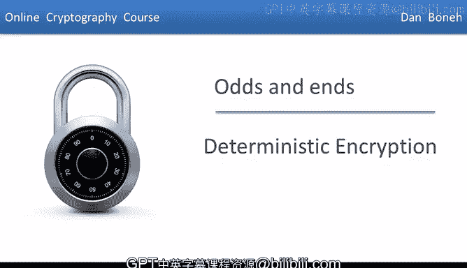
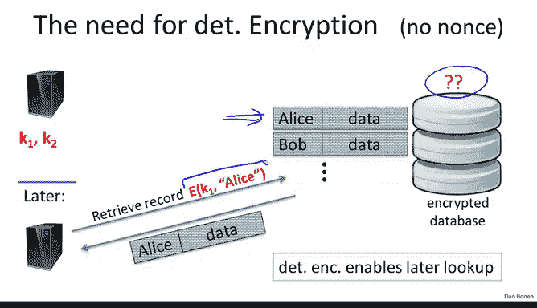
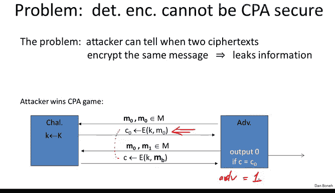
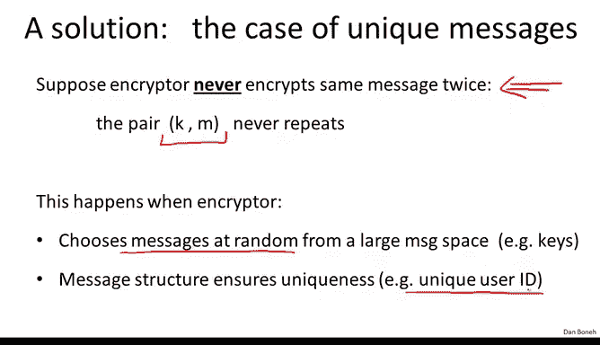

# 043：确定性加密 🔐

在本节课中，我们将要学习**确定性加密**的概念。这是一种在实践中经常出现的加密方式，其特点是对于给定的消息和密钥，总是生成完全相同的密文。我们将探讨它的应用场景、安全性问题以及为什么它无法满足选择明文攻击（CPA）安全。

---

## 确定性加密的定义

上一节我们介绍了课程概述，本节中我们来看看确定性加密的具体定义。

**确定性加密**是指一种加密系统，对于给定的消息和密钥，总是映射到完全相同的密文。这意味着，如果我们用同一个密钥对同一消息加密三次，每次都会得到完全相同的密文。这里没有随机性，它是一个一致的加密方案。

用公式表示，对于一个确定性加密方案 `E`，其加密过程可以描述为：
`C = E(K, M)`
其中，对于固定的密钥 `K` 和消息 `M`，输出 `C` 总是相同的。

---

## 确定性加密的应用场景：加密数据库查询

确定性加密在实践中一个常见的应用场景是**加密数据库查询**。让我们来看看它是如何工作的。

设想有一个服务器，它需要将信息存储在一个加密数据库中。服务器存储的是记录，每条记录包含一个索引和一些数据。

以下是服务器处理记录的过程：
1.  服务器首先加密这条记录。
2.  索引部分使用密钥 `K1` 加密，数据部分使用密钥 `K2` 加密。
3.  加密后的记录被发送到数据库存储。

最终，数据库会存储许多加密记录，其中索引使用密钥 `K1` 加密，数据使用密钥 `K2` 加密。

当服务器稍后需要从数据库中检索一条记录时，如果加密是确定性的，那么操作会非常方便：
1.  服务器只需向数据库发送它感兴趣的索引的加密值（例如，加密后的“Alice”）。
2.  由于加密是确定性的，这个加密后的索引与当初写入记录时生成的加密索引完全相同。
3.  数据库可以找到包含这个加密索引的记录，并将其发送回服务器。

这种机制的好处在于，数据库完全不知道数据库中存储了什么数据，甚至不知道服务器正在检索哪些记录，因为它看到的只是对加密索引的请求。

---

## 确定性加密的安全性问题

上一节我们看到了确定性加密的便利性，本节中我们来看看它带来的核心安全问题。

这应该会引起许多人的警觉，因为我们之前说过，**确定性加密根本不可能达到选择明文攻击（CPA）安全**。问题在于，攻击者可以观察不同的密文。如果他看到两次相同的密文，他就知道底层加密的消息也一定是相同的。

换句话说，通过观察密文，他可以了解到关于相应明文的一些信息，因为每次他看到两次相同的密文时，他就知道底层的消息是相等的。

在实践中，这会导致严重的攻击，特别是当消息空间很小时。例如，如果我们通过网络传输单个字节（比如一次传输一个击键），那么攻击者可以简单地建立一个所有可能密文的字典。如果只有单个字节，那么最多只有256种可能的密文。然后，通过学习这些密文的解密结果，他实际上可以通过在这个字典中查找来弄清楚所有未来的密文。

因此，在许多消息空间较小的情况下，确定性加密根本就是不安全的。

具体到加密数据库的例子，攻击者会看到：如果有两条记录在索引位置恰好有相同的密文，那么他现在就知道这两条记录对应于相同的索引。同样，尽管他不知道索引是什么，但他了解到了关于相应明文的一些信息。

---

## 形式化证明：确定性加密无法实现CPA安全

我想简要地提醒你，我们形式化地认为确定性加密不能是CPA安全的，这是通过描述一个在CPA游戏（选择明文攻击游戏）中获胜的对手来证明的。

让我快速回顾一下这个游戏是如何进行的：
1.  游戏开始时，对手发送两条消息 `M0` 和 `M0`。记住，在这个游戏中，对手总是会得到左消息的加密或右消息的加密。在这种情况下，由于他在左右两边使用了相同的消息，他只会得到消息 `M0` 的加密。
2.  在下一步，他将发送消息 `M0, M1`。现在，他将得到 `M0` 的加密或 `M1` 的加密，他的目标是判断他得到的是哪一个。
3.  但由于加密是确定性的，这对他来说非常容易。他只需要测试 `C` 是否等于 `C0`。如果 `C` 等于 `C0`，那么他知道他得到了 `M0` 的加密；如果 `C` 不等于 `C0`，他知道他得到了 `M1` 的加密。
4.  因此，如果 `C` 等于 `C0`，他输出0；如果 `C` 不等于 `C0`，他输出1。他在这个特定游戏中的优势将是1，这是尽可能高的优势，意味着攻击者完全击败了选择明文安全性。

这只是形式化地说明，攻击者基本上了解到了比允许更多的关于明文的信息。

---

## 解决方案：限制消息类型

那么问题是我们该怎么办？事实证明，解决方案基本上是**限制在单个密钥下可以加密的消息类型**。

这个想法是：假设加密者**永远、永远、永远不会**在单个密钥下加密相同的消息。换句话说，消息-密钥对总是不同的，永远不会重复。因此，对于每一次加密，要么消息改变，要么密钥改变，或者两者都改变，但不能在同一个密钥下对同一消息加密两次。

为什么这种情况会发生呢？事实证明，有一些非常自然的情况会发生这种情况：
1.  **消息本身是随机的**：例如，加密者正在加密密钥，而这些密钥是128位的密钥。那么，它们实际上极不可能重复。在这种情况下，当我们用一个主密钥加密密钥时，所有被加密的消息很可能总是不同的，因为这些密钥极不可能重复。
    
2.  **消息空间本身具有某种结构**：例如，如果我们只加密唯一的用户ID。想象一下在数据库例子中，索引对应于一个唯一的用户ID，并且如果数据库中每个用户恰好有一条记录，那就意味着每条加密记录基本上都包含一个加密索引，并且该索引对于数据库中的所有记录都是不同的。

这是消息可能永远不会重复的两个原因，这也是实践中相当常见且合理的情况。

---

## 确定性选择明文攻击（Det-CPA）安全

现在，如果消息永远不会重复，也许我们实际上可以定义安全性，并给出满足我们定义的构造。

这引出了**确定性选择明文攻击（Det-CPA）** 的概念。让我解释一下它的含义。

和往常一样，我们有一个密码，定义为一个加密算法。我们有一个密钥空间、一个消息空间和一个密文空间。我们将像往常一样使用两个实验（实验0和实验1）来定义安全性。

这个游戏看起来与标准的选择明文攻击游戏非常相似，几乎是相同的游戏。攻击者发出查询，这些查询由消息对 `M0` 和 `M1` 组成（它们必须长度相同）。对于每个查询，攻击者要么得到 `M0` 的加密，要么得到 `M1` 的加密。攻击者可以反复这样做 `Q` 次。在游戏结束时，他应该说出他得到的是左消息的加密还是右消息的加密。

这是标准的选择明文攻击游戏。现在有一个额外的注意事项：如果比特 `B` 等于0（攻击者总是看到左消息的加密），那么左消息必须全部不同。换句话说，他永远不会看到同一消息被加密两次，因为这些左消息总是不同的。同样，我们要求所有右消息也互不相同。

这个要求，即所有左消息互不相同，所有右消息也互不相同，基本上抓住了这个用例：加密者永远不会使用一个特定的密钥多次加密相同的消息。因此，攻击者根本无法要求使用同一个密钥多次加密相同的消息。

需要指出的是，如果你回到我们之前对确定性加密的原始攻击，你会发现那实际上不是一个有效的确定性CPA游戏攻击，因为在那里攻击者确实要求对同一消息 `M0` 加密了两次。因此，在确定性CPA游戏中，这种攻击将是非法的攻击。通过排除这种攻击，我们实际上使得给出满足确定性CPA安全的构造成为可能。

和往常一样，我们说，如果对手无法区分实验0（他得到左消息的加密）和实验1（他得到右消息的加密），那么该方案在确定性CPA攻击下是语义安全的。我们要求对手在实验0中输出1的概率与在实验1中输出1的概率接近。如果对于所有高效的对手来说都是如此，那么我们就说该方案在确定性CPA攻击下是语义安全的。

---

## 不安全的构造示例：固定IV的CBC模式

我想做的第一件事是向你展示，**使用固定初始化向量（IV）的密码分组链接（CBC）模式实际上并不是确定性CPA安全的**。这是实践中一个常见的错误。有许多产品本应使用确定性CPA安全的密码，但它们却只使用带固定IV的CBC，并假设这是一种安全机制，而事实上并非如此。我想向你展示原因。

假设我们有一个在n位块上操作的伪随机置换（PRP），我们将使用这个PRP的CBC模式。如果消息有五个块，那么这个PRP将被调用五次来加密每个块。

以下是攻击如何进行：
1.  攻击者首先请求加密消息 `0^n || 1^n`（即第一个块全0，第二个块全1）。左消息等于右消息，这意味着他只是想要这个 `0^n || 1^n` 消息的加密。
2.  让我们看看密文是什么样子。为了完整起见，我将把固定IV作为密文的第一个元素写出。如果你考虑CBC的工作原理，密文的第二个元素基本上是 `IV XOR` 消息第一个块的加密。在我们的例子中，消息的第一个块是全0。所以实际上加密的只是固定IV。因此，密文的第二个块将只是这个固定IV的加密。
3.  接下来，攻击者将输出两个单块消息。左消息将是全0块，右消息将是全1块。注意这是一个有效的查询，因为左消息互不相同，右消息也互不相同。这些都是有效的确定性CPA查询。
4.  现在攻击者会得到什么响应？如果他得到左消息的加密，那么单块消息 `0^n` 的加密就只是固定IV的加密，正如我们之前看到的。然而，如果他得到右消息的加密，那将是 `1^n XOR` 固定IV的加密。
5.  你可以看到攻击将如何进行。注意，如果这两个块碰巧相同，那么我们就知道他收到了左消息的加密（即 `B=0`）。如果它们不同，那么他知道 `B=1`。因此，如果 `C[1]`（这个块）等于 `C1[1]`（那个块），他将输出0，否则输出1。

这基本上表明，使用固定IV的CBC是完全不安全的。第一个块可以很容易地被攻击。实际上，如果消息很短，你可以再次建立字典，并完全破坏那些希望使用固定IV的CBC来实现确定性CPA安全的系统。

所以不要这样做。我们实际上将在下一节中看到安全的确定性CPA构造。我再说一遍：如果你需要以一致的方式加密数据库索引，**不要使用带固定IV的CBC**来做，请使用我将在下一节中展示的方案。

---

## 另一个不安全的构造：固定IV的计数器（CTR）模式

让我问你一个关于固定IV的计数器（CTR）模式的同样问题：这会是一个确定性CPA安全的系统吗？在这里我提醒你，固定IV的CTR模式基本上是我们连接固定IV、固定IV+1、固定IV+L，我们加密所有这些计数器，连接结果，然后与消息进行异或操作得到密文。

你认为这会是确定性CPA安全的吗？
😊

我希望每个人都说“不”，因为这基本上是一种一次一密加密，如果我们用这个“一次一密”来加密不同的消息，基本上我们得到的是一个“两次一密”。

更精确地看，我在这里写下了确定性CPA游戏：
1.  攻击者首先请求消息 `M` 的加密，他会得到 `M XOR` 固定IV的加密。
2.  然后他会请求两个不同的消息 `M0` 和 `M1`（它们都与 `M` 不同），所以 `M`、`M0` 和 `M1` 三者都是不同的消息。
3.  然后他会得到 `M` 的加密，现在他可以简单地发起标准的“两次一密”攻击。如果 `C XOR C'` 等于 `M XOR M0`，他就知道 `C'` 是 `M0` 的加密；否则，他知道它是 `M1` 的加密。

同样，他将完全赢得这个游戏，优势通常为1。所以，固定IV的CTR模式作为确定性CPA密码也是完全不安全的。

所以，不要使用这些方案中的任何一个。相反，让我们使用我们将在下一节中描述的方案。

---

## 总结

在本节课中，我们一起学习了：
1.  **确定性加密**的定义：对于固定密钥和消息，总是产生相同密文的加密方案。
2.  它的一个主要**应用场景**：加密数据库索引查询，允许服务器在不暴露索引内容的情况下检索记录。
3.  确定性加密的**核心安全问题**：它无法实现标准的选择明文攻击（CPA）安全，因为攻击者可以通过观察重复的密文推断出明文信息。
4.  为了解决这个问题，引入了**确定性CPA（Det-CPA）安全**的概念，它限制攻击者不能查询同一密钥下相同消息的加密。
5.  我们分析了两个**不安全的常见构造**：使用固定初始化向量（IV）的CBC模式和CTR模式，它们都不满足Det-CPA安全，因此不能用于需要确定性加密的场景（如加密数据库索引）。

关键要点是：当需要确定性加密时（例如为了可查询性），必须使用专门设计为Det-CPA安全的加密方案，而不是简单地重用标准CPA安全模式（如CBC或CTR）并固定其随机参数。