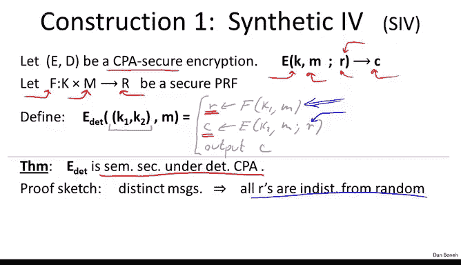
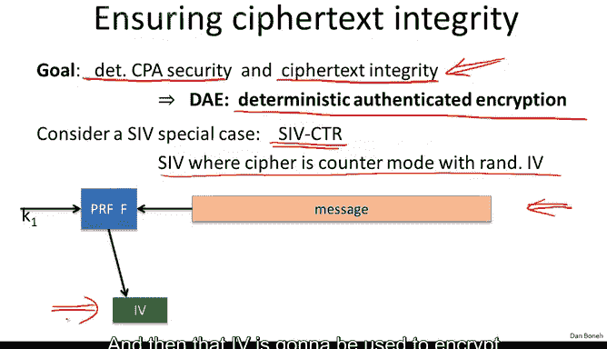
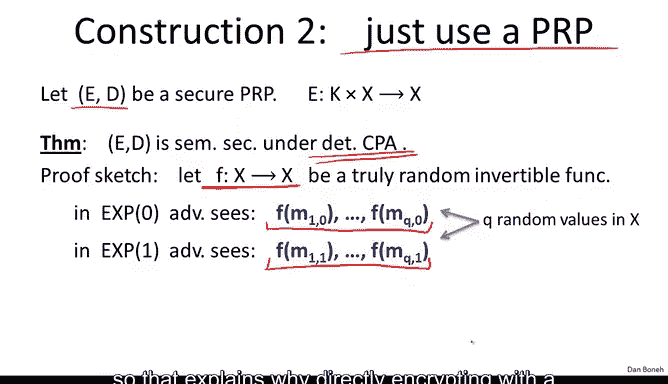
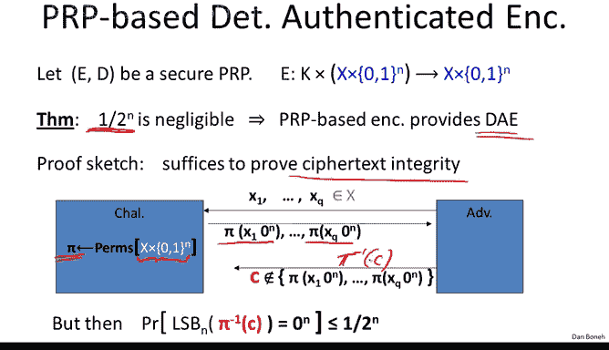
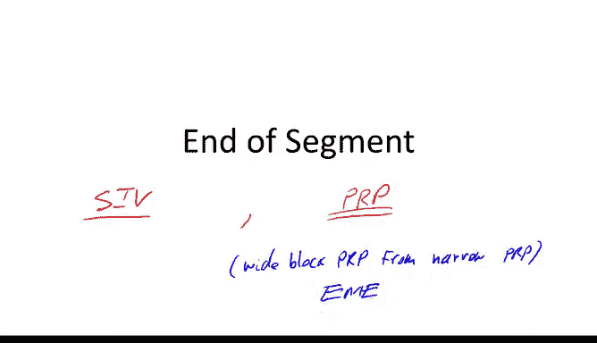

# 044：SIV与宽PRP 🔐

在本节课中，我们将学习两种提供确定性选择明文攻击（CPA）安全的加密方案构造方法。确定性加密在加密数据库索引等场景中非常有用，因为它能保证相同的明文总是产生相同的密文，从而支持基于加密索引的快速查询。我们将重点介绍SIV（合成初始化向量）模式和直接使用伪随机置换（PRP）的方法，并探讨如何为它们添加密文完整性。

---

## 确定性加密的需求与挑战

上一节我们介绍了确定性加密的概念。本节中，我们来看看如何构造能够抵抗确定性选择明文攻击的方案。

首先，确定性加密是必需的，例如在加密数据库索引时。之后，我们希望使用加密后的索引来查找记录。由于加密是确定性的，我们保证在进行查找时，加密后的索引与记录写入数据库时发送的加密索引完全相同。因此，这种确定性加密允许我们基于加密索引进行简单快速的查找。

问题在于，我们说过确定性加密不可能对一般的选择明文攻击安全，因为如果攻击者看到两个相同的密文，他就会知道底层加密的消息是相同的。因此，我们定义了“确定性选择明文安全”这一概念，这意味着只要加密者在使用给定密钥时，对同一消息的加密不超过一次，安全性就能得到保障。具体来说，每个密钥-消息对只用于一次加密，要么密钥改变，要么消息改变。

如前所述，我们正式定义了这个确定性CPA安全游戏。本小节的目标是实际给出确定性CPA安全的构造方案。

---

## 构造一：SIV（合成初始化向量）模式

我们首先要看的第一个构造叫做SIV（合成初始化向量）。其工作原理如下。

想象我们有一个通用的CPA安全加密系统。这里，`K`是密钥，`M`是消息，`R`表示加密算法使用的随机性。请记住，一个不使用“无意义”的CPA安全系统必须是随机的，因此我们明确写出变量`R`来表示加密算法执行加密时使用的随机字符串。例如，如果我们使用随机计数器模式，`R`就是随机计数器模式使用的随机IV（初始化向量）。当然，`C`是生成的密文。

此外，我们还需要一个伪随机函数`F`。它的作用是接收消息空间中的任意消息，并输出可用作CPA安全加密方案随机性的字符串`R`。这里的`r`实际上是集合`R`中的一个成员。我们假设`F`是一个将消息映射到随机字符串的伪随机函数。

SIV的工作方式如下。它使用两个密钥`K1`和`K2`来加密消息`M`。它首先将伪随机函数`F`应用于消息`M`，为CPA安全加密方案`E`导出随机性`r`。然后，它使用刚刚导出的随机性`r`来加密消息`M`，这将给我们一个密文`C`。最后，它输出这个密文`C`。

**公式表示：**
`C = E(K2, M; r)`，其中 `r = F(K1, M)`

基本上，SIV模式首先从被加密的消息中导出随机性，然后使用这个导出的随机性实际加密消息以获得密文。

需要指出的是，例如，如果加密方案`E`恰好是随机计数器模式，那么随机性`R`就只是随机IV，它实际上会与密文一起输出。这意味着密文比明文略长，但这里的重点不是生成短密文，而是确保加密方案是确定性的。因此，如果我们多次加密相同的消息，每次都应该获得相同的密文。确实，每次我们都会获得相同的随机`R`，因此每次都会获得相同的密文`C`。

很容易证明，这种加密方案在确定性选择明文攻击下确实是语义安全的。原因在于，我们将伪随机函数`F`应用于不同的消息。如果我们对不同的消息应用`F`，那么`F`生成的随机字符串看起来就像是真正的随机字符串——每个消息对应一个不同的随机字符串。因此，CPA安全加密方案`E`总是使用真正的随机字符串来应用，而这正是它具备CPA安全性的情况。

因为这些`R`只是随机的、与随机字符串无法区分的值，所以最终的系统实际上将是CPA安全的。这只是其工作原理的直观解释，实际上可以相当直接地将其形式化为一个完整的证明。

现在我应该强调，这实际上非常适合长度超过一个AES块的消息。事实上，对于短消息，我们将看到一个稍微不同的、更适合这些短消息的加密方案。

SIV真正酷的地方在于，我们实际上免费获得了密文完整性。事实上，如果我们想添加完整性，我们不需要使用特殊的MAC（消息认证码）；在某种意义上，SIV已经内置了一个完整性机制。让我解释一下我的意思。

首先，我们的目标是构建所谓的“确定性认证加密”（DE），它基本上意味着确定性CPA安全性和密文完整性。请记住，密文完整性意味着攻击者可以请求加密他选择的消息，然后他不应该能够产生另一个解密为有效消息的密文。

我想声称，事实上SIV自动提供了密文完整性，而无需嵌入MAC或其他任何东西。让我们看看为什么，特别是让我们看看当底层加密方案是随机计数器模式时SIV的一个特例。我们称之为SIV-CTR，以表示我们使用随机计数器模式的SIV。

让我再次提醒你SIV在这种情况下是如何工作的。我们取我们的消息，然后对其应用一个PRF，从而导出一个IV。然后，该IV将用于使用随机计数器模式加密消息。具体来说，我们将使用这个PRF `F_CTR` 用于随机计数器模式，我们基本上在IV、IV+1直到IV+L处评估这个`F_CTR`，然后将其与消息进行异或，从而得到最终的密文。这就是使用随机计数器模式的SIV。

现在让我们看看解密将如何工作。在解密过程中，我们将增加一个检查，这将提供密文完整性。

让我们看看解密将如何工作。这里我们有输入的密文，它包含IV和密文`C`。我们要做的第一件事是使用给定的IV解密密文，这将给我们一个候选明文`M'`。

现在，我们将从SIV的定义中重新应用PRF `F`到这个消息`M'`上。如果消息是有效的，我们应该得到与对手作为密文一部分提供的相同的IV。如果我们得到不同的IV，那么我们知道这个消息不是有效消息，我们直接拒绝该密文。

这真的很巧妙，它是一种非常简单的内置检查，以确保密文有效。我们只需检查解密后，如果我们重新推导IV，我们实际上会得到正确的IV；如果没有，我们就拒绝消息。我声称解密过程中的这个简单检查足以实际提供密文完整性，从而实现确定性认证加密。

我将在一个简单的定理中陈述这一点，基本上是说，如果`F`是一个安全的PRF，并且从`F_CTR`导出的计数器模式是CPA安全的，那么结果实际上就是一个确定性认证加密系统。

这个证明并不太难，用两句话让我向你展示为什么这是真的的粗略直觉。我们只需要论证密文完整性。我们之前已经论证过该系统具有确定性CPA安全性，我们只需要论证密文完整性。为了论证该系统具有密文完整性，让我们再次思考密文完整性游戏是如何工作的：对手请求加密一堆他选择的消息，他得到结果密文，然后他的目标是产生一个新的有效密文。

如果那个有效密文在解密时解密为某个全新的消息，那么当我们把这个新消息插入PRF `F`时，我们只会得到某个随机IV，并且极不可能与对手在他输出的密文中提供的IV匹配。因此，这表明当对手输出他的伪造密文时，该伪造密文中的消息基本上应该等于他的选择消息查询中的某个消息。否则，我们得到的IV将极不可能等于伪造密文中的IV。

但是，如果消息等于对手向我们查询的某个消息，那么我们得到的密文也将等于我们提供给对手的某个密文。那么他的伪造仅仅是我们给他的一个密文，因此这不是一个有效的伪造。他必须给我们一个新的密文才能赢得密文完整性游戏，但他给了我们一个旧的密文。这就是粗略的直觉。

我希望我快速地讲了一遍，希望它有点道理。如果没有，也不是世界末日，我将在模块末尾引用描述SIV的论文，如果你想更详细地了解，可以阅读并查看那篇论文。但无论如何，这是一个非常巧妙的想法，我想向你展示，即我们使用PRF为确定性计数器模式导出随机性这一事实，也在我们实际进行解密时为我们提供了一个完整性检查。

好的，所以当你需要时，这个SIV是进行确定性加密的一个好模式，特别是如果消息很长的话。如果消息很短，比如说小于16字节，实际上有更好的方法来做这件事，这就是我现在想向你展示的方法。

---

## 构造二：直接使用伪随机置换（PRP）

第二个构造实际上很简单。我们要做的就是直接使用一个PRP（伪随机置换）。具体做法如下。

假设`(E, D)`是一个安全的PRP。`E`用于加密，`D`用于解密。

我声称，如果我们直接使用`E`，那已经给了我们确定性CPA安全性。让我很快地告诉你为什么。

假设`F`是一个从集合`X`到`X`的真正随机可逆函数。请记住，我们的PRP与一个真正随机的可逆函数是无法区分的。让我们假装我们实际上有一个真正随机的可逆函数。

在实验0中，攻击者将看到他提交的一堆消息（左边的消息），他将看到的基本上是`F`在他提供的左边消息上的求值结果。在确定性CPA游戏中，所有这些消息都是不同的，所以他将得到的只是`X`中的`Q`个不同的随机值。是的，就是`X`中的`Q`个不同的随机值。

现在让我们想想实验1。在实验1中，他可以看到右边消息`M_1^1`到`M_Q^1`的加密结果。同样，所有这些消息都是不同的，所以他看到的只是`X`中的`Q`个随机不同的值。

因此，实验0和实验1中的这两个分布是相同的。基本上，在两种情况下，他看到的都只是`X`中的`Q`个不同的随机值。因此，他无法区分实验0和实验1。既然他无法对真正的随机函数做到这一点，他也无法对PRP做到这一点。

好的，这就解释了为什么直接用PRP加密已经给了我们一个CPA安全的系统，使用起来非常、非常简单。

这就是说，如果我们只想加密短消息，比如小于16字节，那么我们需要做的就是直接用AES加密它们，结果实际上将是确定性CPA安全的。所以，如果你的索引小于16字节，直接使用AES是很好的做法。

但是请注意，这不会提供完整性，我们马上就会看到如何添加完整性。但给你的问题是，如果我们有超过16字节的消息，我们该怎么办？一个选择是使用SIV，但如果我们也想使用这个构造呢？这实际上是一个有趣的问题：我们能否构造消息空间大于16字节的PRP？

如果你记得过去，我们从小消息空间的PRF构造了大消息空间的PRF。这里，我们将从小消息空间的PRP构造大消息空间的PRP。让我们看看如何做到。

---

## 宽块PRP：EME模式

假设`(E, D)`是一个在`n`位块上操作的安全PRP。

有一个称为EME的标准模式，它实际上将构造一个在`N`位块上操作的PRP，其中`N`远大于`n`。这将允许我们对远大于16字节的消息进行确定性加密，实际上，它可以和我们希望的一样长。

让我们看看EME是如何工作的，起初它可能有点令人生畏，但它不是一个困难的构造。让我们看看它是如何工作的。EME使用两个密钥`K`和`L`。实际上，在真实的EME中，`L`是从`K`派生出来的，但为了我们的目的，我们假设`K`和`L`是两个不同的密钥。

我们做的第一件事是取我们的消息`X`，将其分成块，然后用某个填充函数对每个块进行异或。我们使用密钥`L`通过函数`P`（我在这里不解释）导出一个填充，我们为每个块导出一个不同的填充，并将该填充异或到块中。

接下来，我们使用密钥`K`将PRP `E`应用于每个块，我们将这些输出称为`PPP0`、`PPP1`和`PPP2`。

接下来，我们将所有这些`PPP`异或在一起，并称结果为`MP`。然后我们用密钥`K`加密这个`MP`，并称这个加密的输出为`MC`。

然后，我们异或`MP`和`MC`，这给了我们另一个密钥`M`，我们用它来派生另一个填充。然后我们将这个填充的输出与所有的`PPP`进行异或，得到这些`CC`。

现在我们将所有这些`CC`异或在一起，得到一个值`CC0`，然后我们再用所有的`E`加密一次。我们用所有这些`P`再做一次填充，这实际上最终给出了EME的输出。

就像我说的，这可能看起来有点令人生畏，但实际上有一个定理表明，如果`E`的底层块大小是一个安全的PRP，那么实际上，这个构造EME在这个更大的块（`N`位）上是一个安全的PRP。这个构造的好处是你注意到它非常并行，实际上这就是为什么它有点复杂——每个块都是并行加密的。所以，如果你有一个多核处理器，你可以使用你所有的核心同时加密所有的块，然后会有一个顺序步骤来计算所有输出的校验和，然后再进行一轮并行加密，最后你得到输出。

顺便说一下，这些生成填充的函数`P`是非常、非常简单的函数，它们需要常数时间，所以在性能方面我们将忽略它们。

底线是这里的性能，你注意到每个输入块需要两次`E`的应用。事实证明，如果SIV使用非常快的PRF来导出随机性并正确实现，那么实际上SIV可能比这种特定的操作模式快两倍。

因此，我认为基于PRP的构造对于短消息非常好，而SIV则适用于如果你想以确定性方式加密较长的消息。

---

## 为PRP机制添加完整性

但是，如果我们想为这个基于PRP的机制添加完整性呢？那么，我们能否使用直接使用PRP加密消息的PRP机制来实现确定性认证加密？

事实证明答案是肯定的，并且这实际上又是一个你应该知道的非常简单的加密方案。基本上，我们要做的是取我们的消息，然后在其后附加一串零，然后应用PRP，就这样，这将给我们一个密文。

现在，非常非常简单，只需附加零并使用PRP加密。当我们解密时，我们将查看结果明文的这些最低有效位，如果它们不等于0，我们将直接拒绝密文；如果它们等于0，我们将输出消息有效。

就是这样，这就是整个系统，非常非常简单，在加密期间简单地附加零，然后在解密时检查零是否存在。我声称，这个非常简单的机制实际上提供了确定性认证加密，当然前提是你附加了足够的零。具体来说，如果你附加了`n`个零，我们需要`1/2^n`是可忽略的，如果是这样，那么实际上这种基于直接PRP的加密确实提供了确定性认证加密。

让我看看为什么。我们已经论证了该系统是CPA安全的，所以我们只需要论证它提供了密文完整性。这也很容易看到。

让我们看看密文完整性游戏。对手将选择一个真正随机的置换，即输入空间上的一个真正随机的可逆函数（在这种情况下，输入空间是消息空间加上`n`个零位）。现在对手能做什么？他可以提交`Q`条消息，然后他收到这些`Q`条消息的加密，即他收到PRP在他选择的点上的值（连接了`n`个零）。这基本上就是查询CPA挑战者的意思。

对于一个随机置换，他只能看到这个置换在他选择的`Q`个点上的值，但只是连接了`n`个零。现在他在密文完整性游戏中的目标是什么？他的目标是产生一些新的密文，不同于他给出的密文，并且能够正确解密。

正确解密意味着什么？这意味着当我们对密文`C`应用`π`的逆时，`C`的`n`个最低有效位最好都是零。问题是这发生的可能性有多大？

让我们想想。基本上，我们有一个真正随机的置换，对手看到了这个置换在`Q`个点上的值。他产生一个新点，当求逆时，其`n`个最低有效位恰好为零的可能性有多大？

我们在这里所做的本质上是评估置换`π`的逆在点`C`处的值。由于`π`的逆是一个随机置换，其`n`个最低有效位等于零的可能性有多大？

不难看出，答案最多是概率`1/2^n`。因为基本上，置换将在`X × {0,1}^n`内输出一个随机元素，而该元素将以`n`个零结尾的概率基本上是`1/2^n`。

因此，对手以可忽略的概率赢得游戏，因为这个值是可忽略的。

---

## 总结

本小节到此结束。我希望你看到了这两种非常巧妙的确定性认证加密方案。

第一种我们称之为SIV，我说你会使用随机计数器模式，并且你只是从一个应用于消息的PRF中为随机计数器模式导出随机性。这里非常巧妙的想法是，在解密过程中，你可以简单地从解密的消息中重新计算IV，并验证该IV是否与密文中提供给你的IV相同。这个简单的检查实际上足以保证认证加密，或者更准确地说，确定性认证加密。因此，如果索引很大，这种模式就是你加密数据库中索引的方式。

如果索引碰巧很短，比如它是一个8字节的用户ID，那么你可以直接使用一个PRP。你的做法是向那8个字节附加零，然后这些零将在解密时用作完整性检查。同样，如果你能够附加足够的零，那么实际上这也提供了确定性认证加密。

顺便提一下，我向你展示了有一种方法可以从窄PRP构建宽块PRP，这种特定的操作模式称为EME。我们实际上将在下一小节中引用EME。

