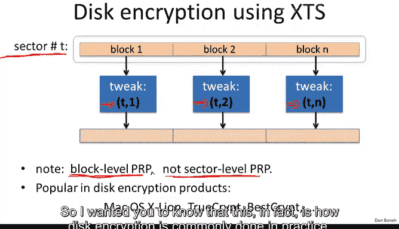
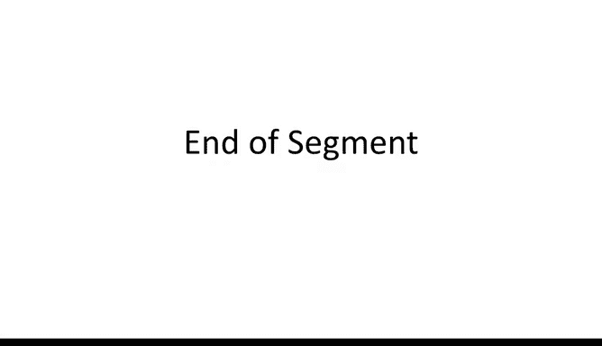

# 045：可调加密 🔐

在本节中，我们将学习另一种加密形式，称为可调加密。我们将通过磁盘加密这一应用场景来引入可调加密的概念，并会看到这是确定性加密的另一个应用实例。

## 磁盘加密问题 💾

磁盘加密的目标是加密磁盘上的扇区。假设每个扇区大小为4KB。问题在于没有额外的空间用于扩展。换句话说，如果扇区大小是4KB，密文大小也必须恰好是4KB，因为没有地方写入额外的比特。如果密文比明文大，就无法存储。

因此，我们的基本目标是构建一种不扩展的加密方案，使得密文大小与明文大小完全相同。

从技术上讲，加密不能扩展意味着消息空间等于密文空间。消息空间是4KB的消息，密文空间也是4KB的消息。

在这种情况下，显然我们必须使用确定性加密，因为如果加密是随机的，就没有地方存储随机性。同样，我们也没有空间用于完整性保护，因为我们无法扩展密文并添加任何完整性比特。因此，我们最多只能实现确定性CPA安全。这就是我们的目标。

现在，有一个非常简单的引理可以证明：如果你给我一个确定性CPA安全的密码，其消息空间等于密文空间（即没有扩展），那么这个密码实际上是一个伪随机置换（PRP）。所以，我们在这里真正要说明的是，如果我们完全不希望扩展，我们唯一的加密选择就是上一节中提到的第二种构造方式，即我们必须使用PRP进行加密。

## 使用PRP加密的挑战

让我们看看如何使用PRP进行加密。我们获取磁盘并将其分成扇区。现在，如果我们使用同一个密钥下的PRP加密每个扇区，就会遇到确定性加密的标准问题：如果扇区1和扇区3恰好有相同的明文，那么加密后的扇区1将等于加密后的扇区3，攻击者就会知道对应的明文是相同的。

这实际上是一个现实问题。例如，如果你的某些扇区是空的（全部设置为零），那么加密后的扇区将是相同的。结果，攻击者就能确切知道你的磁盘上哪些扇区是空的，哪些不是。这确实很有问题。问题是，我们能做得更好吗？

答案是肯定的。首先想到的想法是：为什么不为每个扇区使用不同的密钥呢？你可以看到，扇区1用密钥K1加密，扇区2用密钥K2加密，依此类推。这样，即使扇区1的内容等于扇区3，扇区1和扇区3的密文也会不同，因为它们是在不同密钥下加密的。这实际上避免了我们之前讨论的信息泄露。

不过，我想指出，这种模式仍然存在一点信息泄露。例如，如果用户碰巧更改了扇区1中的一个比特，那么该扇区将被加密成一个不同的密文。由于这是一个伪随机置换，即使明文改变一个比特，整个扇区也会被映射到一个全新的随机输出。然而，如果用户撤销更改并恢复到原始扇区，那么加密后的扇区也会恢复到其原始状态，攻击者就能知道发生了更改并随后被撤销。所以仍然存在一点信息泄露，但这种类型的信息泄露是我们无法在不牺牲性能的情况下避免的，因此我们将忽略它，并认为它是可以接受的。

接下来的问题是，现在你意识到我们的磁盘实际上变得非常大，有很多扇区。这意味着我们需要生成大量的密钥。当然，我们不必存储所有这些密钥，我们可以简单地使用伪随机函数来生成这些密钥。

具体工作方式是：我们有一个主密钥，称之为K。然后，扇区编号（我用t表示）将使用主密钥进行加密，加密的结果就是特定的扇区密钥，我将其表示为K_T。这之所以安全，再次是因为PRF与随机函数无法区分。这意味着，如果我们对扇区编号1、2、3、4直到L应用一个随机函数，它们基本上会被映射到密钥空间中的完全随机元素。结果，我们使用一个新的、独立的随机密钥加密每个扇区。

这是一个不错的构造。然而，对于每个扇区，我们都必须应用这个PRF。所以很自然的问题是：我们能做得更好吗？事实证明我们可以，这就引入了可调分组密码的概念。我们真正想要的是拥有一个主密钥，并希望这个主密钥能派生出许多许多个PRP。我们说一种方法是简单地使用PRP编号加密密钥K，但正如我们将看到的，有一种更有效的方法。

这个PRP编号实际上被称为“调整值”，这就引入了可调分组密码的概念。

## 可调分组密码 🔧

在可调分组密码中，加密和解密算法通常以密钥作为输入，它们还以一个调整值作为输入（这个大写T被称为调整空间），当然，它们也以数据作为输入，输出数据在集合X中。

其特性是：对于调整空间中的每一个调整值和一个随机密钥，如果我们固定密钥和调整值，那么我们在集合X上得到一个可逆函数（一一映射）。因为密钥是随机的，所以该函数实际上与随机函数无法区分。换句话说，对于调整值的每一个设置，我们基本上都得到一个从X到X的独立PRP。

正如我所说，其应用是：现在我们将使用扇区编号作为调整值，结果，每个扇区都将获得自己独立的PRP。

让我非常快速地更精确地定义什么是安全的可调分组密码。正如我们所说，有一个调整空间、一个密钥调整空间和输入空间X。像往常一样，我们在这里定义两个实验。

在实验1中，我们将选择一组真正的随机置换。不仅仅是一个置换，我们将选择与调整值数量一样多的置换。你注意到，这就是为什么我们将此提升到调整空间的大小。如果调整空间的大小是5，这意味着我们在集合X上选择5个随机置换。

在另一种情况下，我们只是选择一个随机密钥，并将我们的置换集定义为由调整空间中的调整值定义的置换。现在，攻击者基本上可以提交一个调整值和一个x，然后看到由调整值T1定义的置换在点x1处的值。他可以一次又一次地看到这个值，看到由调整值T2定义的置换在点x2处的值，依此类推。然后他的目标是判断他是在与真正的随机置换交互，还是与伪随机置换交互。如果他做不到，我们就说这个可调分组密码是安全的。😊

与常规分组密码的区别在于：在常规分组密码中，你只能与一个置换交互，然后你的目标是判断你是在与伪随机置换交互还是与真正的随机置换交互。在这里，你可以与T个随机置换交互，你的目标同样是判断这T个随机置换是真正的随机置换还是伪随机置换。

😊，像往常一样，如果你无法区分，即攻击者在两个实验中的行为相同，我们就说这个PRP是一个安全的可调PRP。

## 示例与构造

很好。让我们看一些例子。我们已经看过了平凡的例子。在平凡的例子中，我们假设密钥空间等于输入空间。所以这个PRP实际上作用于x乘以x到x。😊，可以想象一下AES，其中密钥空间是128位，数据空间是128位，输出当然是128位。

然后，我们定义可调分组密码的方式（同样，输入是密钥、调整值和数据）基本上是：我们使用主密钥加密调整值，然后使用得到的随机密钥加密数据。

现在你意识到，如果我们想用这个可调分组密码加密n个块，这将需要2n次分组密码评估：n次评估用于加密给定的调整值，另外n次评估用于加密实际给定的数据。

所以我想向你展示一个很好的例子，表明我们实际上可以做得更好。这被称为XTS构造。它最初基于一种称为XEX的模式，工作原理如下：

假设你给了我一个常规的分组密码，它作用于n位块（不是可调分组密码，只是常规分组密码）。我们将定义一个可调分组密码。同样，这个可调分组密码将接受两个密钥作为输入。为了方便起见，调整空间（我们马上会看到）我们假设由两个值T和I组成。T将是某个调整值（我们稍后会看到），I将是某个索引。然后x将是一个n位字符串，我们将对其应用可调分组密码。

XTS的工作方式如下：
1.  我们要做的第一件事是使用密钥K2加密调整值的左半部分，即T，我们将结果称为N。
2.  现在我们要做的是，将消息M与应用于我们刚刚得到的值N和索引I的填充函数P进行异或。这个填充函数非常快，在运行时间上我们几乎可以忽略它。
3.  接下来，我们使用密钥K1进行加密。
4.  然后我们再次使用相同的填充进行异或。我们将再次使用应用于I的N的填充P进行异或，结果将是密文，我们将其表示为C。

好的，正如我所说，函数P是一个非常简单的函数，它只是有限域中的乘法，我在这里不详细解释，它非常快。所以运行时间实际上主要由分组密码E的运行时间决定。就是这样，这就是XTS。

这个构造的好处是：现在如果我们想加密n+1个块，我们所做的就是计算一次N值，然后对于索引1、2、3、4……，我们基本上每个块只需要评估一次PRP E。所以我们需要使用调整值(t,1)、(t,2)、(t,3)、(t,4)等加密n个块，我们只需要n+1次分组密码E的评估。所以它比平凡构造快两倍。

## XTS构造的安全性思考

我想花一点时间审视一下这个XTS构造。我的问题是：在异或之前加密调整值真的有必要吗？也就是说，下面的构造是一个安全的可调PRP吗？你可以看到在这个构造中，调整值直接用作异或填充函数的输入。我的问题是，如果我们这样做，它会是一个安全的可调PRP吗？让我再次提醒你，这是密钥，这是调整值，这是数据。

我希望大家都说这是正确答案。基本上，如果我们设置数据为PT1，那么当我们与相应的调整值（也是PT1）进行异或时，我们在这里会得到0。所以实际被加密的将是0。无论结果是什么，假设是某个值C0。那么实际的输出将是C0异或P1。

当我们对PT2做同样的事情时，我们将得到C0异或PT2。当我们将这两个东西异或在一起时，我们只得到PT1异或PT2。

这个事实成立意味着攻击者可以简单地在这个调整值和这个数据处查询挑战者，然后计算两个响应的异或，并与适当填充值的异或进行比较。如果成立，我们正在与伪随机函数交互；否则，我们正在与真正的随机函数交互。这将允许攻击者以优势1击败这个构造。

## XTS在磁盘加密中的应用

总结一下XTS用于磁盘加密的方式：我们查看扇区编号T，并将其分解为16字节的块。然后，块1使用调整值(T,1)加密，块2使用调整值(T,2)加密，依此类推。因此，每个块都获得自己的PRP，结果整个扇区使用一组PRP进行加密。

请注意，这是块级别的PRP，而不是扇区级别的PRP。实际上，并不是每个扇区都用自己的PRP加密，而是每个块用自己的PRP加密。扇区和块之间的区别有些人为，这种XTS模式实际上在块级别（160字节级别）提供了确定性CPA加密，这就是目标。

这种模式在磁盘加密产品中相当流行。我在这里只写了几个支持XTS的例子，我想让你知道，这实际上是实践中磁盘加密的常见做法。

## 总结

总结一下，可调加密是一个有用的概念，适用于当你需要从单个密钥派生出许多独立PRP的情况。需要记住的一件重要事情是，平凡的构造并不是最有效的。像XTS这样的构造实际上更高效，你可以重复使用一个调整值的加密来获得许多不同调整值的加密，因此这些是更好的使用方式。

平凡的构造和XTS构造都被称为窄块构造，即它们为16字节块提供可调分组密码。但正如我们所说，我们在上一节中看了EME构造，它为更大的块提供了PRP。实际上，EME是一种可调的操作模式。所以如果你需要用于更大块的PRP或可调PRP，那么你可以直接使用EME。但请注意，在EME中，每个输入块你必须应用两次分组密码，因此它的速度是XTS的一半，并不常用。

这就是我想说的关于可调加密的内容。在下一节中，我们将讨论格式保留加密。

